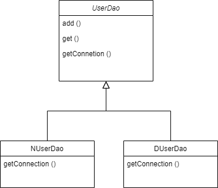
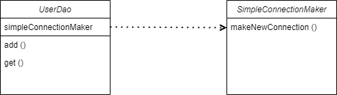
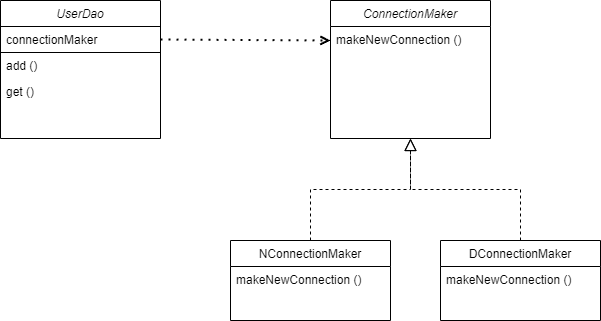
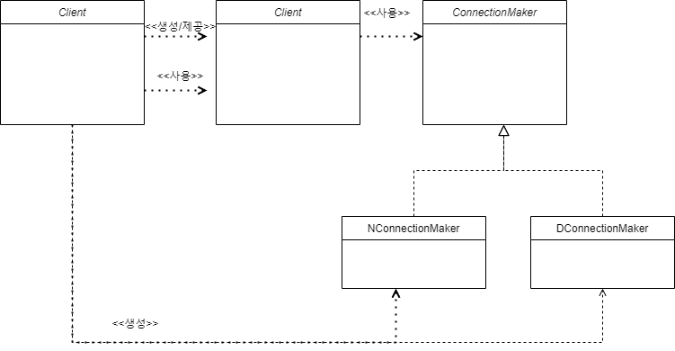
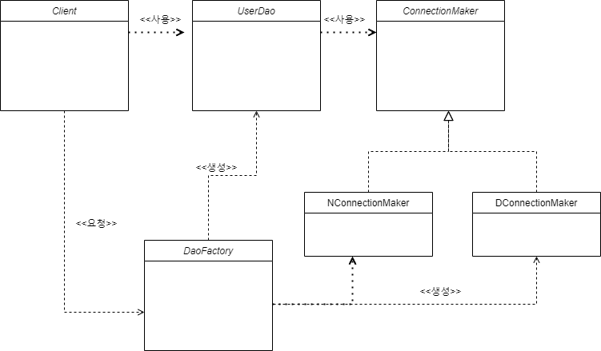
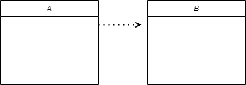
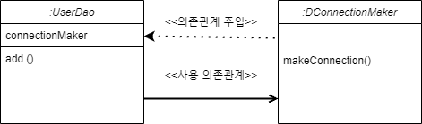

# 1장 오브젝트와 의존관계

### DAO (Data Access Object)

- DB를 사용해 데이터를 조회, 조작하는 기능을 전담하는 오브젝트

### DTO (Data Transfer Object)

- 계층 간 데이터 교환을 위해 사용하는 객체

## 관심사의 분리

- 관심이 같은 것 끼리는 하나의 객체, 친한 객체로 모이게 하고 
관심이 다른 것은 가능한 따로 떨어져서 영향을 주지 않도록 분리

❓변화의 폭을 최소한으로 줄여주기 위해서는 관심사를 분리하는 것이다.

→ 변화(요구사항 변경)에 쉽고 빠르게 대처할 수 있음

DAO 클래스 하나에 

- DB 커넥션을 가져오는 코드
- SQL 바인딩 및 실행 코드
- 리소스 반환코드

존재할 시 문제점

- 다른 DAO에서 중복으로 사용되는 코드 발생
- 그로 인한 커넥션을 가져오는 코드 수정 시 모든 DAO를 수정(→ 변화에 대처하기 어려움)

### 리팩토링

- 기존의 코드를 외부의 동작방식에는 변화 없이 내부 구조를 변경해서 재구성하는 작업

**⚠️ 시작하기 전 테스트 코드와 함께 단계를 작게 나누어 작업할 것**

## 상속을 통한 확장

### 템플릿 메소드 패턴 (Templet Method Pattern)

- 슈퍼 클래스에 기본적인 로직의 흐름을 추상 메소드, 오버라이딩 가능한 메소드 등으로 만든 후 서브 클래스에서 필요에 맞게 구현
- 상속을 통해 슈퍼클래스의 기능을 확장할 때 사용하는 가장 대표적인 방법
- 변하지 않는 기능 → 슈퍼 클래스
- 자주 변경, 확장되는 기능 → 서브 클래스

**⚠️ 다중 상속 불가, 상위 클래스와의 결합도 문제가 여전히 존재** 



### 팩토리 메소드 패턴 (Factory Method Pattern)

- 객체를 생성하기 위한 인터페이스를 생성하고, 어떤 클래스의 인스턴스를 생성할지는 서브 클래스가 결정

## 클래스의 분리

- DB 생성기능을 별도의 클래스로 분리하게 된다면 결합도를 더욱 낮출 수 있다
- 하지만 SimpleConnectionMaker라는 특정 클래스에 종속되어 있기 때문에 UserDao 코드의 수정 없이 DB 커넥션 생성 기능을 변경할 방법이 없다.

**⚠️ 기존의 DB 커넥션 기능을 확장해서 사용했던 것이 다시 불가능 → 인터페이스 적용으로 해결 가능**



## 인터페이스의 도입

- 클래스를 분리하면서 두 개의 클래스가 서로 긴밀하게 연결되어 있지 않도록 중간에 추상적인 느슨한 연결고리를 만들어주기
- 사진과 같이 추상화를 하게 된다면 UserDato는 자신이 사용할 클래스가 어떤 것인지 몰라도 됨
- 원하는 기능을 사용하기만 하면 된다.

❓ 추상화 : 공통적인 성격을 뽑아내 이를 따로 분리해내는 작업 (**Interface** in Java)



## 관계 설정 책임의 분리

- 여전히 UserDao가 구체적인 클래스까지 알아야 한다는 문제가 발생
- UserDao가 어떤 ConnectionMaker 구현 클래스 오브젝트를 사용할지를 결정하기 때문이다
- 클라이언트 (사용하는 오브젝트) 에게 해당 관심을 분리



## 원칙과 패턴

### 단일 책임 원칙 (Single Responsibility **Principle**)

- **하나의 클래스는 하나의 책임만 가져야 한다.**
- **클래스를 변경하는 이유는 단 하나의 이유여야 한다.**

### 개방 폐쇄 원칙 (Open Close **Principle**)

- **확장에는 열려 있고, 변경에는 닫혀 있다.**
- **기능을 추가하거나 변경하면서 그것을 사용하는 코드는 수정하지 않는다.**
- 핵심은 변화하는 부분을 **추상화**하는 것

### 리스코프 치환 원칙 (Liskov Substitution Principle)

- **상위 타입의 객체를 하위 타입의 객체로 치환해도 상위 타입을 사용하는 프로그램은 정상적으로 동작해야 한다**

### 인터페이스 분리 원칙 (Interface Segregation Principle)

- **클라이언트는 자신이 사용하는 메소드에만 의존해야 한다**
- **인터페이스는 그 인터페이스를 사용하는 클라이언트를 기준으로 분리해야 한다**

### 의존 역전 원칙 (Dependency Inversion Principle)

- **상위 모듈은 하위 모듈의 구현에 의존해서는 안된다**
- **하위의 모듈이 상위 모듈에 정의한 추상 타입에 의존해야 한다.**

## 높은 응집도와 낮은 결합도

**결합도**

- 하나의 오브젝트가 변경이 일어날 때에 관계를 맺고 있는 다른 오브젝트에게 변화를 요구하는 정도
- 결합도가 높을 경우에는 원하지 않는 사이드 이펙트가 발생하기 떄문에 유지 보수가 쉽지 않음

**응집도**

- 한 모듈 내에서의 요소들이 하나의 기능을 수행하기 위해 구성된 정도
- 응집도가 낮다면 모듈 일부분에만 변경이 일어나도, 전체에서 어떤 부분이 바뀌어야 하는지 파악하고 사이드 이펙트도 확인해야 하는 이중의 부담이 생김
- 즉, 관심사를 분리해 응집도를 높이는 것이 유지 보수에 좋음

**❗결합도는 ↓ 응집도는 ↑ (관심사의 분리)**

## 제어의 역전 (IoC)

- 스프링의 모든 기능의 기초가 되는 기반 기술
- 설계가 깔끔해지고

### 팩토리

- 객체의 생성 방법을 결정하고 만들어진 오브젝트를 돌려주는 오브젝트
- 클라이언트에서 팩토리를 분리한 모습



- DB 연결 방식이 자유로이 확장 가능
- 애플리케이션에서 컴포넌트 역할을 하는 오브젝트와 애플리케이션의 구조를 결정하는 오브젝트를 분리했다는 장점

### IoC (Inversion of Control)

- 프로그램의 제어 흐름 구조가 뒤바뀌는 것
    - 오브젝트가 자신이 사용할 오브젝트를 스스로 선택, 생성하지 않는다
    - 자신이 어떻게 만들어지고 어디서 사용되는지 알 수 없다. ( ex 템플릿 메소드 패턴)
- ConnetionMaker의 구현 클래스를 결정하고 생성하는 제어권이 DaoFactory 에게 있음

### 라이브러리

- 애플리케이션 흐름을 직접제어

### 프레임워크

- 애플리케이션 코드가 프레임 워크에 의해 사용

### 빈

- 스프링이 제어권을 가지고 직접 만들고 관계를 부여하는 오브젝트
- 스프링 컨테이너가 생성과 관계설정, 사용등을 제어해주는 제어의 역전이 적용된 오브젝트

### 빈 팩토리 (= 애플리케이션 컨텍스트)

- 빈의 생성과 관계설정 같은 제어를 담당하는 IoC 오브젝트

### 어노테이션

- 특별한 의미, 기능을 수행하도록 하는 기술

```java
@Configuration //-> 애플리케이션 컨텍스트 또는 빈 팩토리가 사용할 설정정보라는 표시
public class DaoFactory {

    @Bean      //-> 오브젝트 생성을 담당하는 IoC용 메소드라는 표시
    public UserDao userDao() {
        return new UserDao(connectionMaker());
    }
    
    @Bean
    public ConnectionMaker connectionMaker() {
        return new DConnectionMaker();
    }
}
```

## 싱글톤 레지스트리와 오브젝트 스코프

### 오브젝트의 동일성과 동등성

- 한 개의 오브젝트가 두개의 오브젝트 레퍼런스 변수를 가지고 있을 때 동일하다
- 두 개의 오브젝트가 오브젝트 동등성 기준에 따라 동등하다고 판단될 때 동등하다

### 스프링이 싱글톤으로 빈을 만드는 이유

- 요청이 올 때 마다 각 로직을 담당하는 오브젝트를 새로 만들게된다면 부하가 생김
    - 요청 한번에 5개의 오브젝트가 만들어지고 초당 500 개의 요청이 들어오면 2500개의 오브젝트가 생김

### 싱글톤 패턴

- 어떤 클래스를 애플리케이션 내에서 제한된 인스턴스 개수, 이름처럼 주로 하나만 존재하도록 강제하는 패턴
- **⚠️ 단점**
    - private 생성자를 갖고 있기 때문에 상속할 수 없다
    - 테스트하기 힘들다
        - 만들어지는 방식이 제한적이기 때문에 Mock 오브젝트 등으로 대체하기 힘들다
    - 서버 환경에서는 싱글톤이 하나만 만들어지는 것을 보장하지 못한다
        - 서버에서 클래스 로더를 어떻게 구성하고 있느냐에 따라서 싱글톤 클래스임에도 하나 이상의 오브젝트가 만들어질 수 있다
    - 싱글톤의 사용은 전역 상태를 만들 수 있기 때문에 바람직하지 못한다
        - 싱글톤은 어디서든지 사용될 수 있기 때문에 전역 상태로 사용되기 쉽다. 자유롭게 접근, 수정, 공유할 수 있는 전역 상태를 갖는것은 객체지향 프로그램에서는 권장하지 않는다

### 싱글톤 레지스트리

- 스프링에서 직접 싱글톤 형태의 오브젝트를 만들고 관리하는 기능
- 싱글톤 방식으로 사용될 애플리케이션 클래스라도 public 생성자를 가질 수 있다

## 의존관계 주입(Dependency Injection)

- 오브젝트 레퍼런스를 외부로부터 주입받고 이를 통해 여타 오브젝트와 다이나믹하게 의존 관계가 만들어지는 것
    - 클래스 모델이나 코드에는 런타인 시점의 의존관계가 드러나지 않는다
    - 런타임 시점의 의존관계는 컨테이너나 팩토리 같은 제3의 존재가 결정한다
    - 의존관계는 사용할 오브젝트에 대한 레퍼런스를 외부에서 주입해줌으로써 만들어진다

### 의존 관계

- A가 B에게 의존한다는 방향성이 있는 관계
- 의존이란 B가 변하면 A에 영향을 미친다는 뜻



- 런타임 시의 의존 관계 주입과 사용 의존관계



### 의존 관계 검색과 주입

- 의존 관계 검색 방식은 검색하는 오브젝트는 자신이 스프링의 빈일 필요가 없다
- 의존 관계 주입에서는 DI가 적용되려면 컨테이너가 괸리하는 빈이 돼야 한다

### 의존 관계 주입의 응용

- 기능 구현의 교환
    - 개발 환경과 운영환경에서의 DI 설정정보에 해당하는 부분만 다르게 만들어 둔다면 다른 런타임 오브젝트에 의존 관계를 갖게해 줄 수 있다
- 부가기능 추가
    - DB와 관련된 부가기능을 추가할 때 의존할 대상에서 구현 가능
    

### 메소드를 이용한 의존관계 주입

- 생성자를 이용한 주입
    - 생성자에 파라미터를 만들어두고 DI 컨테이너가 의존할 오브젝트 레퍼런스를 넘겨줌
- 수정자 메소드를 이용한 주입
    - 외부에서 오브젝트 내부의 attribute 값을 변경하려는 용도로 주로 사용
- 일반 메소드를 이용한 주입
    - 여러 개의 파라미터를 갖는 일반 메소드를 DI용으로 사용 가능
    

## XML을 이용한 설정

- 다만, 많이 사용되는 스프링 부트의 경우에는 Auto-Configuration, Spring Container 대체, 빈 설정 등으로 간편하게 사용되고 있다

### XML

- W3C에서 개발된, 다른 특수한 목적을 갖는 마크업 언어를 만드는데 사용하도록 권장하는 다목적 마크업 언어

|  | 자바 코드 설정정보 | XML 설정정보 |
| --- | --- | --- |
| 빈 설정파일 | @Configuration | < beans > |
| 빈의 이름 | @Bean methodName | < bean id=”methodName” > |
| 빈의 클래스 | return new BeanClass(); | class = “a.b.c…. BeanClass”> |

## Summary

- 책임이 다른 코드를 분리 (**관심사의 분리, 리팩토링**)
- 자주 변할 수 있는 클래스는 인터페이스로 구현 후 다른 클래스에서 인터페이스를 통해서만 접근 (**전략 패턴**)
- 자신의 책임 자체가 변경되는 경우 외에는 불필요한 변화가 발생하지 않도록 막고, 자신이 사용하는 외부 오브젝트의 기능은 자유롭게 확장하거나 변경할 수 있게 만들었다 (**개방 폐쇄 원칙**)
- 한쪽의 기능 변화가 다른 쪽의 변경을 요구하지 않아도 되게 했고 (낮은 결합도), 자신의 책임과 관심사에만 순수하게 집중(**높은 응집도**)하는 깔끔한 코드를 만들 수 있다
- 오브젝트가 생성되고 여타 오브젝트와의 관계를 맺는 작업의 제어권을 별도의 오브젝트 팩토리에게 넘김 (**제어의 역전/IoC**)
- 싱글톤 패턴 구현 방식의 단점을 이해하고 싱글톤을 사용하면서 단점을 극복할 수 있도록 설계된 컨테이너를 활용하는 방법에 대해 알아봤다(**싱글톤 레지스트리**)
- 설계 시점과 런타임 시에 실제 사용될 구체적인 의존 오브젝트를 제 3자의 도움으로 주입받아 다이나믹한 의존관계를 갖게 해주는 IoC의 특별한 케이스를 알아봤다 (**의존관계 주입/DI**)
- 의존 오브젝트를 주입할 때 생성자를 이용하는 방법과 수정자 메소드를 이용하는 방법을 알아봤다 (**생성자 주입과 수정자 주입**)