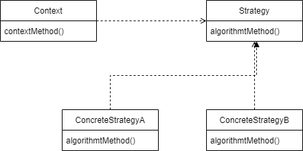

## 예외 처리 기능을 갖춘 DAO

- 제한된 리소스를 공유해 사용하는 곳에는 예외 발생 시 리소스를 반환하게하는 예외처리가 반드시 필요

> 수정기능의  예외처리 코드
> 

```java
public void deleteAll() throws SQLException {
		Connection c = null;
		PreparedStatement ps = null;
		
		try{ //예외 발생 가능한 코드들을 try 블록으로 묶어줌
		    c = dataSource.getConnection();
				ps = c.prepareStatement("delete from users");
		} catch (SQLException e){ // 예외가 발생했을 때의 작업
				throw e;		
		} finally {  // 예외 발생, 미발생 모두 실행
				if (ps!=null){
					try {
						ps.close();	
					} catch(SQLException e){
					}
				}			
		}
		if (c!=null){
			try {
					c.close();
			} catch (SQLException e){
		}
		}

}
```

> 조회기능의 예외처리 코드
> 

```java
public int getCount() throws SQLException {
    Connection conn = null;
    PreparedStatement ps = null;
    ResultSet rs = null;

    try {
        conn = dataSource.getConnection();

        ps = conn.prepareStatement("select count(*) from users");

        rs = ps.executeQuery();
        rs.next();
        return rs.getInt(1);
    } catch (SQLException e) {
        if (rs != null) {
            try {
                rs.close();
            } catch (SQLException e1) {
            }
        }
        if (rs != null) {
            try {
                ps.close();
            } catch (SQLException e1) {
            }
        }
        if (rs != null) {
            try {
                conn.close();
            } catch (SQLException e1) {
            }
        }
    }
}
```

- 조회의 경우 Connection, PreparedStatement 외에도 ResultSet이 추가되기 때문에 조금더 복잡해진다
- ResultSet도 반환해야 하는 리소스이기 때문에 예외 상황에서 ResultSet의 Close() 메소드가 반드시 호출되도록 만들면 됨

## JDBC try/catch/finally 코드의 문제점

- 위의 코드는 복잡한 `try/catch/finally` 블록이 2중으로 중첩되며 모든 메소드마다 반복됨
- 테스트를 통해 예외상황마다 리소스를 반납하는지 체크하기도 쉽지 않기 때문에 중복되는 코드와 로직을 리팩토링 해야함

## 분리와 재사용을 위한 디자인 패턴 적용

- 가장 먼저 할 일은 변하는 성격이 다른 것을 찾아내 메소드로 추출하는 것이다
- 변하는 부분을 메소드로 추출해 변하지 않는 부분에서 호출

## 템플릿 메소드 패턴의 적용

- 상속을 통해 기능을 확장해서 사용하는 부분
- 변하지 않는 부분은 슈퍼클래스에 두고 변하는 부분은 추상메소드로 정의해둬서 서브클래스에 오버라이드

> makeStatement()를 구현한 UserDao 서브클래스
> 

```java
public class UserDaoDeleteAll extends UserDataDao {

    protected PreparedStatement makeStatement(Connection c) throws SQLException {
        PreparedStatement ps = c.prepareStatement("delete from users");
        return ps;
    }
}
```

- DAO 로직마다 상속을 통해 새로운 클래스를 만들어야 한다는 단점 존재
- 확장구조가 이미 클래스를 설계하는 시점에서 고정되어 버린다는 단점 존재

## 전략 패턴의 적용

- 오브젝트를 둘로 분리하고 클래스 레벨에서는 인터페이스를 통해서만 의존 하도록 만드는 패턴

> 전략 패턴의 구조
> 



- 좌측에 Context의 contextMehod()에서 일정한 구조를 가지고 동작하다가 특정 확장 기능은 Strategy 인터페이스를 통해 외부의 독립된 전략 클래스에 위임
- 변하지 않는 부분이 contextMethod()

> StatementStrategy 인터페이스
> 

```java
public interface StatementStrategy {
    PreparedStatement makePreparedStatement(Connection c) throws SQLException;
}
```

> StatementStrategy 전략 클래스
> 

```java
public class DeleteAllStatement implements StatementsStrategy {
    public PreparedStatement makePreparedStatement(Connection c) throws SQLException {
        PreparedStatement ps = c.prepareStatement("delete from users");
        return ps;
    }
}
```

> 전략 패턴을 따라 DeleteAllStatement가 적용된 deleteAll() 메소드
> 

```java
public void deleteAll() throws SQLException {
    try {
        c = dataSource.getConnection();

        StatementStrategy strategy = new DeleteAllStatement();
        ps = strategy.makePreparedStatement(c);

				ps.excuteUpdate();
    } catch (SQLException e) {
        ...
    }
}
```

- 하지만, context안에서 이미 구체적인 전략클래스인 DeleteAllStatement를 사용하도록 고정되어 있다면 뭔가 이상하다.
- context가 인터페이스뿐 아니라 특정 구현 클래스인 DeleteAllStatement를 직접 알고 있다는 건, 전략 패턴에도 OCP에도 잘 들어맞는다고 볼 수 없기 때문이다.

## DI 적용을 위한 클라이언트/컨텍스트 분리

- 위의 문제를 해결 하기 위해서는 context가 어떤 전략을 사용하게 할 것인가는 Context를 사용하는 앞단의 Client가 결정하는 게 일반적이다. `client(오브젝트생성) → context`

> 메소드로 분리한 try/catch/finally 컨텍스트 코드
> 

```java
public void jdbcContextWithStatementStrategy(StatementStrategy stmt) throws SQLException { 
    Connection c = null;
    PreparedStatement ps = null;

    try {
        c = dataSource.getConnection();

        ps = stmt.makePreparedStatement(c);

        ps.executeUpdate();
    } catch (SQLException e) {
        throw e;
    } finally {
        if (ps != null) {try {ps.close();} catch {SQLException e}{}}
				if (c != null) {try {c.close();} catch {SQLException e}{}}
    }
}
```

> 클라이언트의 책임을 담당할 deleteAll() 메소드
> 

```java
public void deleteAll() throws SQLException {
    StatementStrategy st = new DeleteAllStatement();
    jdbcContextWithStatementStrategy(st);
}
```

### 마이크로 DI

- 일반적으로 DI는 의존관계에 있는 두 개의 오브젝트와 관계를 다이나믹하게 설정해주는 오브젝트 팩토리 (DI 컨테이너), 그리고 이를 사용하는 클라이언트라는 4개의 오브젝트 사이에서 일어난다.
- 때로는 클라이언트가 오브젝트 팩토리의 책임을 함께 지고 있거나, 클라이언트와 전략이 결합, 클라이언트와 두 개의 오브젝트가 하나의 클래스 안에 담길 수도 있다.
- 이런 경우 DI가 매우 작은 단위의 코드와 메소드 사이에서 일어나기도 한다. 이렇게 DI의 장점을 단순화해서 IoC의 컨테이너의 도움 없이 코드내에서 적용한 경우를 `마이크로 DI or 수동DI`

## JDBC 전략 패턴의 최적화

- DAO 마다 새로운 StatementStrategy 구현 클래스를 만들어야함 → 클래스 파일의 개수가 많아짐
- DAO 메소드에서 StatementStrategy에 전달할 부가적인 정보가 있는 경우, 생성자와 인스턴스 변수를 만들어야 함

## 로컬 클래스

- 클래스 파일이 많아지는 문제는 StatementStrategy 전략 클래스를 매번 독립된 파일로 만들지 말고 UserDao 클래스 안에 내부 클래스로 정의하는 것

> add() 메소드 내의 로컬 클래스로 이전한 AddStatement
> 

```java
public void add(User user) throws SQLException {
    class AddStatement implements StatementStrategy {
        User user;

        public AddStatement(User user) {
            this.user = Soo;
        }

        public PreparedStatement makePreparedStatement(Connection c) throws SQLException {
            PreparedStatement ps = c.prepareStatement("insert into users(id, name, password) values(?, ?, ?)");

            ps.setString(1, user.getId());
            ps.setString(2, user.getName());
            ps.setString(3, user.getPassword());

            return ps;
        }
    }

    StatementStrategy st = new AddStatement(user);
    jdbcContextWithStatementStrategy(st);
}
```

- 클래스 파일의 개수를 줄일 수 있고 add() 메소드 안에서 PreparedStatement 생성 로직을 함께 볼 수 있어 코드를 이해하기도 좋음
- 로컬 클래스는 내부 클래스이기 때문에 자신이 선언된 곳의 정보에 접근할 수 있음
- 내부 클래스에서 외부의 변수를 사용할 때는 외부 변수는 반드시 `final` 로 선언해줘야함

### 중첩 클래스의 종류

- 다른 클래스 내부에 정의되는 클래스를 `중첩 클래스(nested class)`라고 한다.
    - 독립적으로 오브젝트로 만들어질 수 있는 `스태틱 클래스(static class)`
    - 자신이 정의된 클래스의 오브젝트 안에서만 만들어질 수 있는 `내부 클래스(inner class)`
        - 멤버 필드 처럼 오브젝트 레벨에서 정의되는 `멤버 내부 클래스(member inner class)`
        - 메소드 레벨에 정의되는 `로컬 클래스(local class)`
        - 이름을 갖지 않는 `익명 내부 클래스(anonymous inner class)` , 익명 내부 클래스의 범위는 선언된 위치에 따라 다름
        

> add() 메소드의 로컬 변수를 직접 사용하도록 수정한 AddStatement
> 

```java
public void add(final User user) throws SQLException {
    class AddStatement implements StatementStrategy {
        public PreparedStatement makePreparedStatement(Connection c) throws SQLException {
            PreparedStatement ps = c.prepareStatement("insert into users(id, name, password) values(?, ?, ?)");

						// 내부 클래스의 코드에서 외부의 메소드 로컬 변수에 직접 접근 가능
            ps.setString(1, user.getId());
            ps.setString(2, user.getName());
            ps.setString(3, user.getPassword());

            return ps;
        }
    }

    StatementStrategy st = new AddStatement(); // 생성자 파라미터로 user를 전달하지 않아도 됨
    jdbcContextWithStatementStrategy(st);
}
```

## 익명 내부 클래스

- AddStatement 클래스는 add() 메소드만 사용하기 때문에 클래스 이름도 제거할 수 있다.
- new 인터페이스이름() { 클래스 본문};

> AddStatement를 익명 내부 클래스로 전환
> 

```java
StatementStrategy st = new StatementStrategy() {
    public PreparedStatement makePreparedStatement(Connection c) throws SQLException {
        PreparedStatement ps = c.prepareStatement("insert into users(id, name, password) values(?, ?, ?)");

        ps.setString(1, user.getId());
        ps.setString(2, user.getName());
        ps.setString(3, user.getPassword);

        return ps;
    }
}
```

- 만들어진 익명 내부 클래스의 오브젝트는 한 번만 사용되니 변수에 담아두지 않고 바로 생성하는 편이 좋음

> 메소드 파라미터로 이전한 익명 내부 클래스
> 

```java
public void add(final User user) throws SQLException {
    jdbcContextWithStatementStrategy(
        new StatementStrategy() {
            public PreparedStatement makePreparedStatement(Connection c) throws SQLException {
                PreparedStatement ps = c.prepareStatement("insert into users(id, name, password) values(?, ?, ?)");

                ps.setString(1, user.getId());
                ps.setString(2, user.getName());
                ps.setString(3, user.getPassword);

                return ps;
            }
        }
    );
}
```

## JdbcContext 분리

- jdbcContextWithStatementStrategy()는 JDBC의 일반적인 작업 흐름을 담고 있어 다른 DAO에서도 사용 가능함
- UserDao 클래스 밖으로 독립 시켜 모든 DAO가 사용할 수 있음

## 클래스 분리

> JDBC 작업 흐름을 분리해서 만든 JdbcContext 클래스
> 

```java
public classs JdbcContext {
    private DataSource dataSource;

    public void setDataSource(DataSource dataSource) {
        this.dataSource = dataSource;
    }

    public void workWithStatementStrategy(StatementStrategy stmt) throws SQLException {
        Connection c = null;
        PreparedStatement ps = null;

        try {
            c = this.dataSource.getConnection();

            ps = stmt.makePreparedStatement(c);

            ps.executeUpdate();
        } catch (SQLException e) {
            throw e;
        } finally {
            if (ps != null) {
                try {
                    ps.close();
                } catch (SQLException e) {
                }
            }
            if (c != null) {
                try {
                    c.close();
                } catch (SQLException e) {
                }
            }
        }
    }
}
```

> JdbcContext를 DI 받아서 사용하도록 만든 UserDao
> 

```java
public class UserDao {
    

    private JdbcContext jdbcContext;

    public void setJdbcContext(JdbcContext jdbcContext) {
        this.jdbcContext = jdbcContext;
    }

    public void add(final User user) throws SQLException {
        this.jdbcContext.workWithStatementStrategy(
            new StatementStrategy() { ... }
        );
    }

    public void deleteAll() throws SQLException {
        this.jdbcContext.workWithStatementStrategy(
            new StatementStrategy() { ... }
        );
    }
}
```

## 빈 의존관계 변경

- UserDao는 JdbcContext에 의존
- jdbcContext는 인터페이스인 DataSource와 달리 구체 클래스
- DI는 기본적으로 인터페이스를 사이에 두고 의존 클래스를 바꿔서 사용하는게 목적
- UserDao와 JdbcContext는 인터페이스를 사이에 두지 않고 DI를 적용하는 특별한 구조
- 기존에는 userDao 빈이 dataSource 빈을 직접 의존했지만 이제는 jdbcContext 빈이 그 사이에 끼게 된다.

```xml
<bean id="jdbcContext" class="springbook.user.dao.UserDao">
    <property name="dataSource" ref="dataSource" />
</bean>
```

## 스프링 빈으로 DI

- 인터페이스를 사용하지 않은 DI는 온전한 DI라고 볼 수는 없지만 스프링의 DI는 넓게 보자면 객체의 생성과 관계 설정에 대한 제어권한을 오브젝트에서 제거하고 외부로 위임 했다는 IoC의 개념을 포괄
- JdbcContext를 UserDao와 DI 구조로 만들어야 하는 이유
    - JdbcContext가 스프링 컨테이너의 싱글톤 레지스트리에서 관리되는 싱글톤 빈
    - JdbcContext가 DI를 통해 다른 빈에 의존하고 있기 때문

## 코드를 이용하는 수동 DI

- JdbcContext를 스프링 빈으로 등록해서 UserDao에 DI 하는 대신 사용할 수 있는 방법으로 UserDao 내부에서 직접 DI를 적용하는 방법 존재
    - 싱글톤으로 만들 수 없음
    - JdbcContext의 생성과 초기화를 책임져야함

> JdbcContext 생성과 DI 작업을 수행하는 setDataSource() 메소드
> 

```java
public class UserDao {
    ...
    private JdbcContext jdbcContext;
		
		// 수정자 메소드이면서, JdbcContext에 대한 생성, DI 작업 동시에 수행
    public void setDataSource(DataSource dataSource) {
        this.jdbcContext = new JdbcContext(); 

        this.jdbcContext.setDataSource(dataSource); 

        this.dataSource = dataSource;
    }
}
```

## 템플릿과 콜백

- 전략 패턴의 기본 구조에 익명 내부 클래스를 활용한 방식을 템플릿(컨텍스트)/콜백(익명내부클래스) 패턴이라고 함
- 템플릿/콜백 방식은 전략 패턴과 DI의 장점을 익명 내부 클래스 사용 전략과 결합한 독특한 활용법

### 템플릿

- 어떤 목정을 위해 미리 만들어둔 모양이 있는 틀
- 고정된 틀의 로직을 가진 템플릿 메소드를 슈퍼클래스에 두고, 바뀌는 부분을 서브클래스의 메소드에 두는 구조로 이루어짐

### 콜백

- 실행되는 것을 목적으로 다른 오브젝트의 메소드에 전달되는 오브젝트 (`functional object` 라고도 함)
- 자바에선 메소드 자체를 파라미터로 전달할 방법은 없기 때문에 메소드가 담긴 오브젝트를 전달해야함

### 템플릿/콜백의 특징

- 단일 메소드 인터페이스를 사용
    - 전략 패턴의 경우 여러 개의 메소드를 가진 일반적인 인터페이스 사용
- 콜백 인터페이스의 메소드에는 보통 파라미터가 있음

### 템플릿/콜백의 작업 흐름

- 클라이언트는 템플릿 안에서 실행될 로직을 담은 콜백 오브젝트를 만들고, 콜백이 참조할 정보를 제공한다. 만들어진 콜백은 클라이언트가 템플릿의 메소드를 호출할때 파라미터로 전달
- 템플릿은 정해진 작업 흐름을 따라 작업을 진행하다가 내부에서 생성한 참조정보를 가지고 콜백 오브젝트의 메소드를 호출, 콜백은 클라이언트 메소드에 있는 정보와 템플릿이 제공한 참조정보를 이용해 작업을 수행하고 결과를 다시 템플릿에 돌려줌
- 템플릿은 콜백이 돌려준 정보를 사용해서 작업을 마저 수행. 경우에 따라 최종 결과를 클라이언트에 다시 돌려줌

## 제네릭스를 이용한 콜백 인터페이스

- 제네릭을 이용하면 다양한 오브젝트 타입을 지원하는 인터페이스나 메소드를 정의할 수 있다

```java
public <T> T lineReadTemplate(String filepath, LineCallback<T> callback, T initVal) throws IOException {
		BufferedReader br = null;
		try {
				br = new BufferedReader(new FileReader(filepath));
				T res = initVal;
				String line = null;
				while((line = br.readLine()) != null) {
					res = callback.doSomethignWithLine(line, res);
				}
			return res;
		}
		catch(IOException e) {...}
		finally {...}
}
```

## 스프링의 JdbcTemplate

- 스프링은 JDBC를 이용하는 DAO에서 사용할 수 있도록 준비된 다양한 템플릿과 콜백을 제공, 자주 사용되는 패턴을 가진 콜백은 다시 템플릿에 결합시켜 간단한 메소드 호출만으로 사용 가능
- JDBC 코드용 기본 템플릿은 jdbcTemplate

> JdbcTemplate의 초기화를 위한 코드
> 

```java
public class UserDao {
    ...
    private JdbcTemplate jdbcTemplate;

    public void setDataSource(DataSource dataSource) {
        this.jdbcTemplate = new JdbcTemplate(dataSource);

        this.dataSource = dataSource;
    }
}
```

> JdbcTemplate을 적용한 deleteAll() 메소드
> 

```java
public void deleteAll() {
    this.jdbcTemplate.update(
        new PreparedStatementCreator() {
            public PreparedStatement createPreparedStatement(Connection con) throws SQLException {
                return con.prepareStatement("delete from users");
            }
        }
    );
}
```

> 내장 콜백을 사용하는 update()로 변경한 deleteAll()메소드
> 

```java
public void deleteAll() {
    this.jdbcTemplate.update("delete from users");
}
```

## Summary

- JDBC와 같은 예외가 발생할 가능성이 있으며 공유 리소스의 반환이 필요한 코드는 반드시 `예외처리` 가 필요하다
- 일정한 작업 흐름이 반복되면서 일부 기능만 바뀌는 코드가 존재한다면 전략 패턴을 적용
바뀌지 않는 부분은 컨텍스트, 바뀌는 부분은 전략으로 만들고 인터페이스를 통해 유연하게 전략을 변경할 수 있도록 구성
- 같은 애플리케이션안에서 여러가지 종류의 전략을 구성하고 사용해야 한다면 컨텍스트를 이용하는 클라이언트 메소드에서 직접 전략을 정의하여 제공
- 클라이언트 메소드 안에 익명 내부 클래스를 사용해서 전략 오브젝트를 구현하면 코드도 간결해지고 메소드의 정보를 직접 사용할 수 있어서 편리
- 컨텍스트가 하나의상의 클라이언트 오브젝트에서 사용된다면 클래스를 분리해 공유
- 단일 전략 메소드를 갖는 전략 패턴이면서 익명 내부 클래스를 사용해서 매번 전략을 새로 만들어 사용하고, 컨텍스트 호출과 동시에 전략 DI를 수행하는 방식을 템플릿/콜백 패턴이라고함
- 콜백의 코드에도 일정한 패턴이 반복된다면 콜백을 템플릿에 넣어 재활용하는 것이 편리
- 템플릿과 콜백의 타입이 다양하게 바뀔 수 있다면 제네릭스 사용
- 템플릿은 한번에 하나 이상의 콜백을 사용할 수도 있고, 하나의 콜백을 여러 번 호출할 수도 있다
- 템플릿/콜백을 설계할 때는 템플릿과 콜백 사이에 주고 받는 정보에 관심을 둬야함