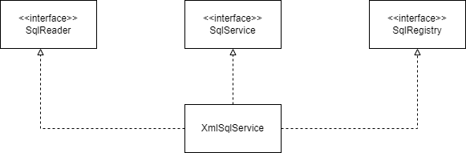

# 7.스프링핵심기술의 응용

# SQL과 DAO의 분리

- 데이터를 가져오고 조작하는 작업의 인터페이스 역할을 하는 것이 **DAO**
    - 데이터 액세스 로직은 바뀌지 않아도 테이블, 필드, SQL은 빈번히 바뀌기 때문에 분리하는 것이 좋다

## XML설정을 이용한 분리

### 개별 SQL 프로퍼티 방식

- SQL을 프로퍼티로 만들고 이를 XMl에서 지정
- 매번 새로운 SQL이 필요할 때마다 프로퍼티를 추가하고 DI를 위한 변수와 수정자 메소드를 만들어줘야한다는 단점이 있음

> add()메소드를 위한 SQL 필드
> 

```java
public class UserDaoJdbc implements UserDao{
		private String sqlAdd;

		public void setSqlAdd(String sqlAdd) {
				this.sqlAdd = sqlAdd;

		}

}
```

> 주입받은 SQL 사용
> 

```java
public void add(User user){
		this.jdbcTemplate.update(
		this.sqlAdd,
		user.getId(), user.getName(), user.getPassword(), user.getEmail(),
		user.getLevel().iniValue(), user.getLogin(), user.getRecommend());

}
```

> 설정파일에 넣은 SQL 문장
> 

```java
<bean id="userDao" class="springbook.user.dao.UserDaoJdbc">
		<property name="dataSource" ref="dataSource" />
		<property name="sqlAdd" value="insert into users(id, name, password,
				email, level, login, recommend) values(?,?,?,?,?,?,?,?)" />
		...
```

### SQL 맵 프로퍼티 방식

- SQL을 하나의 컬렉션으로 담아두는 방법
- 맵을 이용하면 키 값을 이용해 SQL문장을 가져올 수 있음
- 프로퍼티는 하나만 만들어도 되고 SQL 추가 시 설정파일의 맵 정보만 변경하면 됨

> 맵 타입의 SQL 정보 프로퍼티
> 

```java
public class UserDaoJdbc implements UserDao {
		....
		private Map<String. String> sqlMap;

		public void setSqlMap(Map<String, String> sqlMap){
				this.sqlMap = sqlMap;
		}
}
```

> sqlMap을 사용하도록 수정한 add()
> 

```java
public void add(User user){
		this.jdbcTemplate.update(
				this.sqlMap.get("add"),
				user.getId(), user.getName(), user.getPassword(), user.getEmail(),
				user.getLevel().intValue(), user.getLogin(), user.getRecommend());

}
```

> 맵을 이용한 SQL 설정
> 

```java
<bean id="userDao" class="springbook.user.dao.UserDaoJdbc">
		<property name="dataSource" ref="dataSource">
		<propetry name="sqlMap">
				<map>
		        <entry key="add" value="insert into users(id, name, password, email, level, login, recommend) 
						values(?,?,?,?,?,?,?)" />
						...
        </map>
...
```

## SQL 제공서비스

- 스프링의 설정파일 안에 SQL을 두고 이를 DI해서 DAO가 사용하게 하면 손쉽게 SQL을 코드에서 분리할 수 있지만 몇 가지 문제점이 존재
    - SQL과 DI 설정정보가 섞여 있으면 보기에도 지저분하고 관리하기 좋지 않음. SQL을 분리해둬야 독립적으로 SQL문의 리뷰나 SQL 튜닝작업을 수행하기 편함
    - 스프링의 설정파일로부터 생성된 오브젝트와 정보는 애플리케이션을 다시 시작하기전에는 변경이 매우 어려움
- 이런 문제점을 해결하고 요구사항을 모두 충족하려면 DAO가 사용할 SQL을 제공해주는 기능을 제공하는 SQL 제공 서비스가 필요함

### SQL 서비스 인터페이스

- SQL에 대한 키 값을 전달하면 그에 해당하는 SQL을 돌려주는 역할

```java
public interface SqlService {
    String getSql(String key) throws SqlRetrievalFailureException;
}
```

> SqlService 프로퍼티 추가
> 

```java
public class UserDaoJdbc implements UserDao {
		... 
		private SqlService sqlService;
		
		public void setSqlService(SqlService sqlService) {
		    this.sqlService = sqlService;
		}
```

> sqlService를 사용하도록 수정한 메소드
> 

```java
public void add(User user) {
    this.jdbcTemplate.update(this.sqlService.getSql("userAdd"),
                        user.getId(), user.getName(), user.getPassword(), user.getEmail(),
                        user.getLevel().intValue(), user.getLogin(), user.getRecommend());
}

....
```

## 인터페이스의 분리와 자기참조 빈

### XML 파일 매핑

- 스프링의 XML 설정파일에서 bean 태그 안에 SQL정보를 넣어놓고 활용하느 것은 좋은 방법이 아님
    - SQL을 저장해두는 전용 포맷을 가진 독립적은 파일을 이용하는 편이 바람직, 가장 편리한 포맷은 XML
- SQL문을 담고 있는 XML 경로가 고정, 예외처리가 힘들다는 단점 존재

### JAXB

- XML에 담긴 정보를 파일에서 읽어오는 방법중 하나
- XML 문서정보를 거의 동일한 구조의 오브젝트로 직접 매핑

### 언마샬링

- XML 파일을 읽어 오브젝트로 변환해주는 것

> 생성자 초기화를 이용한 XmlSqlService
> 

```java
public class XmlSqlService implements SqlService {
    private Map<String, String> sqlMap = new HashMap<String, String>();

    public XmlSqlService(){
        String contextPath = Sqlmap.class.getPackage().getName();
        try {
            JAXBContext context = JAXBContext.newInstance(contextPath);
            Unmarshaller unmarshaller = context.createUnmarshaller();
            InputStream is = getClass().getResourceAsStream("sqlmap.xml");
            Sqlmap sqlmap = (Sqlmap) unmarshaller.unmarshal(is);

            for (SqlType sql : sqlmap.getSql()) {
                sqlMap.put(sql.getKey(), sql.getValue());
            }
        } catch (JAXBException ex) {
            throw new RuntimeException(ex);
        }
    }

    public String getSql(String key) throws SqlRetrievalFailureException {
        String sql = sqlMap.get(key);
        if (sql == null) {
            throw new SqlRetrievalFailureException(key + "를 이용해서 SQL을 찾을 수 없습니다");
        } else {
            return sql;
        }
    }
}
```

## 빈 초기화 적용

- 생성자에서 예외가 발생할 수도 있는 복잡한 초기화 작업을 다루는 것은 좋지 않음
    - 생성자에서 발생하는 예외는 다루기 힘들고, 상속하기 불편하며, 보안에도 문제
- 외부에서 DI로 설정할 수 있게 만들어야함

> 생성자 대신 사용할 초기화 메서드
> 

```java
public void loadSql() {
		String contextPath = Sqlmap.class.getPackage().getName();
    try { 
				...
        InputStream is = UserDao.class.getResourceAsStream(this.sqlmapFile);
        ...
		}
}
```

## 인터페이스 분리

- XML 대신 다른 포맷의 파일에서 SQL을 읽어오게 하거나, 가져온 SQL 정보를 다른 방식으로 저장하게 하려면 XmlSqlService가 변경되어야함
    - 두 가지 이유로 변경되기 때문에 단일 책임 원칙 위반
- SqlRegistry전략을 제공해주면서 이를 이용해 SQL 정보를 저장하라고 요청하는 방식으로 구현

```java
public interface SqlRegistry {
    void registerSql(String key, String sql);
    String findSql(String key) throws SqlNotFoundException;
}

public interface SqlReader {
    void read(SqlRegistry sqlRegistry);
}
```

## 자기참조 빈으로 시작하기

### 다중 인터페이스 구현과 간접 참조

- SqlService의 구현 클래스는 이제 SqlReader와 SqlRegistry 두 개의 프로퍼티를 DI 받을 수 있는 구조로 만들어야함
- 책임에 따라 분리되지 않은 XmlSqlService를 책임에 맞는 인터페이스로 구현



### 인터페이스를 이용한 분리

- SqlReader와 SqlResitry 두 개의 인터페이스 타입 오브젝트에 의존한느 구조로 만들어 Di를 통해 오브젝트 주입

> SqlService의 DI코드
> 

```java
public class XmlSqlService implements SqlService {
    private SqlReader sqlReader;
    private SqlRegistry sqlRegistry;

    public void setSqlReader(SqlReader sqlReader) {
        this.sqlReader = sqlReader;
    }

    public void setSqlRegistry(SqlRegistry sqlRegistry) {
        this.sqlRegistry = sqlRegistry;
    }
}
```

> SqlRegisry의 구현 부분
> 

```java
public class XmlSqlService implements SqlService, SqlRegistry {
		private Map<String, String> sqlMap = new HashMap<String, String>();

		
    public String findSql(String key) throws SqlNotFoundException{
        String sql = sqlMap.get(key);
        if (sql == null) {
            throw new SqlNotFoundException(key + "에 대한 SQL을 찾을 수 없습니다");
        } else return sql;
       
    public void registerSql(String key, String sql) {
        sqlMap.put(key, sql);
    }
		...
}
```

### 자기참조 빈 설정

- 세 가지 인터페이스를 구현하는 방법을 통해 분리해냄
- 빈 설정을 통해 실제 DI가 일어나도록 해야함
- 클래스는 하나, 빈도 하나만 등록하지만 세 개의 빈이 등록된 것처럼 SqlService 빈이 SqlRegistry와 SqlReader를 주입받도록 만들어야함

> 자신을 참조하는 sqlService빈 설정
> 

```java
<bean id="sqlService" class="springbook.user.sqlservice.XmlSqlService">
	  <property name="sqlReader" ref="sqlService"/>
	  <property name="sqlRegistry" ref="sqlService"/>
	  <property name="sqlmapFile" value="sqlmap.xml"/>
</bean>
```

## 디폴트 의존관계

### 확장 가능한 기반 클래스

- 자기참조가 가능한 빈으로 만들었던 XmlSqlService 코드에서 의존 인터페이스와 구현 코드를 제거
- 

> SqlReader와 SqlRegistry를 사용하는 SqlService 구현 클래스
> 

```java
public class BaseSqlService implements SqlService {
		
    protected SqlReader sqlReader;
    protected SqlRegistry sqlRegistry;
    public void setSqlReader(SqlReader sqlReader) {
        this.sqlReader = sqlReader;
    }
    public void setSqlRegistry(SqlRegistry sqlRegistry) {
        this.sqlRegistry = sqlRegistry;
    }

    @PostConstruct
    public void loadSql() {
        sqlReader.read(this.sqlRegistry);
    }

    public String getSql(String key) throws SqlRetrievalFailureException {
        try {
            return this.sqlRegistry.findSql(key);
        } catch (SqlNotFoundException e) {
            throw new SqlRetrievalFailureException(e);
        }
    }
}
```

> HashMap을 이용하는 SqlRegistry클래스
> 

```java
public class HashMapSqlRegistry implements SqlRegistry {

    private final Map<String, String> sqlMap = new HashMap<String, String>();

    public String findSql(String key) throws SqlNotFoundException {
        String sql = sqlMap.get(key);
        if (sql == null) {
            throw new SqlNotFoundException (key + "를 이용해서 SQL을 찾을 수 없습니다");
        }
        return sql;
    }
		...
}
```

> JAXB를 사용하는 SqlReader 클래스
> 

```java
public class JaxbXmlSqlReader implements SqlReader {
    private String sqlMapFile;

    public void setSqlMapFile(String sqlMapFile) {
        this.sqlMapFile = sqlMapFile;
    }

		public void read(SqlRegistry sqlRegsitry){
				... // XmlSqlService에서 사용했던 JAXB API를 이용해 SQL을 읽어오는 행위
		}
}
```

### 디폴트 의존관계를 갖는 빈 만들기

- BaseSqlService는 sqlReader와 sqlRegistry 프로퍼티의 DI를 통해 의존관계를 자유롭게 변경해가면서 기능을 확장할 수 있음
- 유연성을 보장하려면 이런 구조가 꼭 필요하지만, 적어도 3개의 빈을 등록해줘야한다는점이 귀찮게 느껴질 수 있음
- 확장을 고려해 기능을 분리, 인터페이스와 전략 패턴을 도입하고 DI를 적용하면 구현과 의존관계에 설정에 대한 부담은 감수해야함
    - 특정 의존 오브젝트가 대부분의 환경에서 거의 디폴트라고 해도 좋을 만큼 기본적으로 사용될 가능성이 있다면, 디폴트 의존관계를 갖는 빈을 만드는 것을 고려
    
    `디폴트 의존관계` 
    
    - DI 받지 않는 경우 기본적으로 자동 적용되는 의존관계
    

> 생성자를 통한 디폴트 의존관계 설정
> 

```java
public class DefaultSqlService extends BaseSqlService {

    public DefaultSqlService() {
        setSqlReader(new JaxbXmlSqlReader());
        setSqlRegistry(new HashMapSqlRegistry());
    }
}
```

- DefaultSqlService 내부에서 생성하는 JaxbXmlSqlReader의 sqlmapFile 프로퍼티가 비어 있어 테스트가 실패함
- JaXbXmlSqlReader를 독립적인 빈으로 설정했을 때와 달리 디폴트 의존 오브젝트로 직접 넣어줄 때는 프로퍼티를 외부에서 직접 지정할 수 없음
    - sqlmapFile을 DefaultSqlService의 프로퍼티로 정의하는 방법
    - sqlmapFile도 디폴트로 넣어주는 값을 주기

> 디폴트 값을 갖는 JaxbXmlSqlReader
> 

```java
public class JaxbXmlSqlReader implements SqlReader {
    private static final String DEFAULT_SQLMAP_FILE = "sqlmap.xml";
    private String sqlmapFile = DEFAULT_SQLMAP_FILE;
		
		public void setSqlmapFile(String sqlmapFile) {this.sqlmapFile = sqlmapFile;}
}
```

# 서비스 추상화 적용

JaxbXmlSqlReader는 두 가지 발전시킬 부분이 있음

- 자바에는 JAXB 외에도 다양한 XML과 자바 오브젝트를 매핑하는 기술이 있다. 필요에 따라 다른 기술로 손쉽게 바꿔서 사용할 수 있게 해야함
- XML 파일을 좀 더 다양한 소스에서 가져올 수 있게 만들어야함

### OXM 서비스 추상화

- 자주 사용되는 XML 자바 오브젝트 매핑 기술
1. Castor XML : 설정파일이 필요 없는 인트로스펙션 모드를 지원하기도 하는 매우 간결하고 가벼운 바인딩 프레임 워크
2. JiBX : 뛰어난 퍼포먼스를 자랑하는 XML 바인딩 기술
3. XmlBeans : 아파치 XML 프로젝트, XML 정보셋을 효과적으로 제공
4. Xstream : 관례를 이용해 설정이 없는 바인딩을 지원하는 XML 바인딩 기술

### OXM 서비스 인터페이스

- 스프링이 제공하는 OXM 추상화 서비스 인터페이스는 자바오브젝트를 XML로 변환하는 마샬과 반대로 변환하는 언마샬이 있다
- SqlReader는 이 중에서 언마샬을 이용

> Unmarshaller 인터페이스
> 

```java
public interface Unmarshaller {
	boolean supports(Class<?> clazz);
    
    Object unmarshal(Source source) throws IOException, XmlMappingException;
}
```

### OXM 서비스 추상화 적용

- SqlRegistry는 DI 받을 수 있게 만들지만 SqlReader는 스프링의 OXM 언마샬러를 이용하도록 OxmSqlService 내에 고정시켜 SQL을 읽는 방법을 OXM으로 제한해 사용성을 극대화하는 SqlService를 만들어보자

> OxmSqlService 클래스
> 

```java
public class OxmSqlService implements SqlService {
    private final OxmSqlReader sqlReader= new OxmSqlReader();
    private SqlRegistry sqlRegistry = new HashMapSqlRegistry();
    
		public void setSqlRegistry(SqlRegistry sqlRegistry) {
        this.sqlRegistry = sqlRegistry;
    }

    public void setUnmarshaller(Unmarshaller unmarshaller) {...}

    public void setSqlmapFile(String sqlmapFile) {...}

    @PostConstruct
    public void loadSql() {
        sqlReader.read(sqlRegistry);
    }

    public String getSql(String key) throws SqlRetrievalFailureException {
        return sqlRegistry.findSql(key);
    }

    private class OxmSqlReader implements SqlReader {
        private Unmarshaller unmarshaller;
        private static final String DEFAULT_MAP_FILE = "sqlmap.xml";
        private String sqlmapFile = DEFAULT_MAP_FILE;

        public void setUnmarshaller(Unmarshaller unmarshaller) {
            this.unmarshaller = unmarshaller;
        }

        public void setSqlmapFile(String sqlmapFile) {
            this.sqlmapFile = sqlmapFile;
        }

        public void read(SqlRegistry sqlRegistry) {
           try {
               Source source = new StreamSource(getClass().getResourceAsStream(this.sqlmapFile));
               Sqlmap sqlmap = (Sqlmap) unmarshaller.unmarshal(source);
               for (SqlType sql : sqlmap.getSql()) {
                   sqlRegistry.registerSql(sql.getKey(), sql.getValue());
               }
           } catch (IOException e) {
               throw new IllegalArgumentException(this.sqlmapFile + "을 가져올 수 없습니다.", e);
           }
        }
    }
}
```

### 위임을 이용한 BaseSqlService의 재사용

- loadSql()과 getSql()이라는 SqlService의 핵심 메소드 구현 코드가 BaseSqlService와 동일함
    - 프로퍼티 설정을 통한 초기화 작업을 제외하면 두 가지 작업의 코드는 BaseSqlService와 OxmSqlService 양쪽에 중복
- 위임 구조를 이용해 코드의 중복을 제거할 수 있음
    - loadSql()과 getSql()의 구현 로직은 BaseSqlService에 두고 OxmSqlService는 일종의 설정과 기본 구성을 변경해주기 위한 어댑터 같은 개념으로 BaseSqlService의 앞에 두는 설계가 가능

```java
public class OxmSqlService implements SqlService {

    private final BaseSqlService sqlService = new BaseSqlService();
		...

    @PostConstruct
    public void loadSql() {
        this.sqlService.setSqlReader(this.sqlReader);
        this.sqlService.setSqlRegistry(this.sqlRegistry);

        this.sqlService.loadSql(); //SQL 등록 초기화 작업 위임
    }

   
    public String getSql(String key) throws SqlRetrievalFailureException {
        return this.baseSqlService.getSql(key); //SQL을 찾아오는 작업 위임
    }
}
```

## 리소스 추상화

- SQL 매핑 정보가 담긴 XML 파일 이름을 프로퍼티로 외부에서 지정할 수 있지만 UserDao 클래스와 같은 클래스패스에 존재하는 파일로 제한됨

### 리소스

- 스프링은 자바에 존재하는 일관성 없는 리소스 접근 API를 추상화해서 Resource라는 추상화 인터페이스를 정의했음

### 리소스 로더

- 스프링에는 URL 클래스와 유사하게 접두어를 이용해 Resource 오브젝트를 선언하는 방법이 있음. 문자열 안에 리소스의 종류와 리소스의 위치를 함께 표현하게 해주는 것
    - 가장 대표적인 예가 스프링의 애플리케이션 컨텍스트이다
    - 외부에서 읽어오는 모든 정보는 리소스 로더를 사용하게 되어 있음

## 인터페이스 상속을 통한 안전한 기능 확장

- 기능의 변경 또는 추가에 대응하는 방법은 상황이나 조건에 따라 달라짐

### DI와 기능의 확장

- DI는 특별한 기술이라기보다 일종의 디자인 패턴, 프로그래밍 모델이라는 관점에서 이해하는 것이 더 자연스럽다. 따라서 DI의 가치를 제대로 얻으려면 먼저 DI에 적합한 오브젝트 설계가 필요

### DI 인터페이스와 프로그래밍

- DI를 적용할 때는 가능한 한 인터페이스를 사용하게 해야함
    - 다형성을 얻기 위함
        - 인터페이스 분리 원칙을 통해 클라이언트와 의존 오브젝트 사이의 관계를 명확히 할 수 있음
        - 오브젝트 그 자체로 충분히 응집도가 높은 작은 단위로 설계됐더라도, 목적과 관심이 각기 다른 클라이언트가 있다면 인터페이스를 통해 적젛라게 분리해줄 필요가 있음

### 인터페이스 상속

- 인터페이스 분리 원칙이 주는 장점은 모든 클라이언트가 자신의 관심에 따른 접근 방식을 불필요한 간섭없이 유지할 수 있다는 점 → 기존 클라이언트에 영향을 주지 않은 채로 오브젝트의 기능을 확장, 수정할 수 있음, 기존 인터페이스를 상속해서 기능을 확장하는 경우도 마찬가지

## DI를 이용해 다양한 구현 방법 적용하기

- 운영중인 시스템에서 실시간으로 변경하는 작업을 만들 때 가장 먼저 고려해야할 점은 **동시성**
    - 동시접속자가 많은 대형 시스템의 DAO라면 수시로 접근하는 SQL 레스트리 정보를 잘못 수정하다가 깨진 SQL이 발생할 수 있음

### ConcurrentHashMap을 이용한 수정 가능 SQL 레지스트리

- HashMap으로는 멀티스레드 환경에서 동시에 요청하는 경우 예상하지 못한 결과가 발생할 수 있음
- 동기화된 해시 데이터 조작에 최적화되도록 만들어진 ConcurrentHashMap을 사용하는 방법이 권장

```java
private Map<String, String> sqlMap = new ConcurrentHashMap<String, String>();
```

### 내장형 데이터베이스를 이용한 SQL 레지스트리 만들기

- ConcurrentHashMap은 멀티스레드 환경에서 최소한의 동시성을 보장해주고 성능도 나쁘지 않지만, 저장되는 데이터의 양이 많아지고 잦은 조회화 변경이 일어나는 환경에는 한계가 있음
- 내장형 DB는 애플리케이션에 내장돼서 애플리케이션과 함께 시작되고 종료되는 DB
    - 데이터는 메모리에 저장돼 IO로 인해 발생하는 부하가 적어 성능이 좋음

> HSQL 내장형 DB 설정 예
> 

```java
<jdbc:embedded-database id="embeddedDatabase" type="HSQL">
    <jdbc:script location="classpath:schema.sql"/>
</jdbc:embedded-database>
```

- 이렇게 되면 embeddedDatabase 아이디를 가진 빈이 등록되며, 빈의 타입은 EmbeddedDataBase

### 트랜잭션 적용

- HashMap과 같은 컬렉션은 트랜잭션 개념을 적용하기가 힘듦
    - 여러개의 엘리멘트를 트랜잭션과 같은 원자성이 보장된 상태에서 변경하려면 매우 복잡
- 내장형 DB는 DB자체가 트랜잭션 기반의 작업에 맞게 설계
- 트랜잭션의 격리 수준은 내장형 DB의 디폴트 값을 따라감

# 스프링의 3.1의 DI

## 자바 언어의 변화와 스프링

1. 애노테이션의 메타정보활용
    - 애노테이션 자체가 클래스의 타입에 영향을 주지도 못하고, 일반 코드에서 활용되지도 못하기 때문에 일반적인 객체지향 프로그래밍 스타일의 코드나 패턴에 적용할수 없다
    - 그럼에도 애노테이션은 핵심로직을 담은 자바 코드와 이를 지원하는 IoC 방식의 프레임 워크, 프레임워크가 참조하는 메타정보라는 세 가지로 구성하는 방식에 잘 어울리기 때문
2. 정책과 관례를 이용한 프로그래밍
    - 애노테이션 같은 메타정보를 활용하는 프로그래밍 방식은 코드를 이용해 명시적으로 동작 내용을 기술하는 대신 코드 없이도 미리 약속한 규칙, 관례를 따라서 프로그램이 동작하도록 만드는 프로그래밍 스타일을 적극적으로 포용하게 만듦
        - 반면에 프로그래밍언어나 API 사용법 외에 미리 정의된 정책과 관례를 기억해야하고 메타정보를 보고 프로그램이 어떻게 동작할 지 이해해야하는 부담도 존재

### 프로퍼티 소스

- 외부 서비스 연결에 필요한 정보는 빌드 작업이 필요없는 XML이나 프로퍼티 파일 같은 텍스트 파일에 저장해 불러쓸 수 있다

### @PropertySource

```java

@PropertySource("/경로")
public class AppContext{

		@Value(${db.username}) string userName;
}
```

- SPEL을 사용하지 않는다면 @ConfigurationProperties 사용하면 코드가 더 깔끔해 질 수 있음
    - @Value 어노테이션을 사용하지 않아도 여러 표기법에 대해 오토 바인딩을 해줌
    

# 정리

- SQL 처럼 변경될 수 있는 텍스트로 된 정보는 외부 리소스에 담아두고 가져오게 만들면 편리
- 성격이 다른 코드가 한데 섞여 있는 클래스라면 먼저 인터페이스를 정의해서 코드를 각 인터페이스별로 분리하는게 좋음
- 다른 인터페이스에 속한 기능은 인터페이스를 통해 접근하게 만들고, 간단히 자기참조 빈으로 의존관계를 만들어 검증
- 자주 사용되는 의존 오브젝트는 디폴트로 정의해두면 편리
- 특정 의존 오브젝트를 고정시켜 기능을 특화하려면 멤버 클래스로 만드는 것이 편리
- 기존에 만들어진 기능과 중복되는 부분은 위임을 통해 중복을 제거
- DI에는 인터페이스를 사용한다.
- 클라이언트에 따라서 인터페이스를 분리할 때, 새로운 인터페이스를 만드는 방법과 인터페이스를 상속하는 방법 두 가지를 사용할 수 있다.