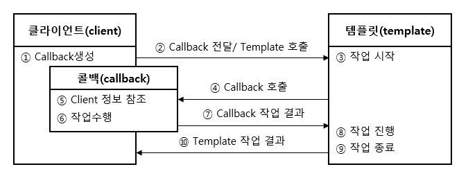

# 3.0 서론
템플릿이란 바뀌는 성질이 다른 코드 중에서 변경이 거의 일어나지 않으며 일정한 패턴으로 유지되는 특성을 가진 부분을 자유롭게 변경되는 성질을 가진 부분으로 독립시켜서 효과적으로 활용할 수 있도록 하는 방법이다.

## 3.1 다시 보는 초난감 DAO 
### 예외처리 기능을 갖춘 DAO
JDBC 코드에는 반드시 예외처리가 존재해야 한다. 중간에 어떤 이유로든 예외가 발생했을 경우에 사용한 리소스를 반드시 반환해야 하기 떄문이다.


```java
public void deleteAll() throws SQLException {
    Connection c = dataSource.getConnection();

    PreparedStatement ps = c.prepareStatement("delete from users");
    ps.executeUpdate();

    ps.close();
    c.close();
}
```
> 코드 3-1 

코드 3-1에서 중간에 만약 예외가 발생한다면 `close()` 메서드가 실행되지 않아 리소스가 반환되지 않을 수 있다. 일반적으로 서버에서는 제한된 개수의 DB 커넥션을 만들어서 재사용 가능한 풀로 관리하는데, `close()`로 반환을 해야만 재사용할 수 있다. 그런데 이런식으로 계속 쌓이게 된다면 리소스가 모자른다는 오류가 발생할 수 있다.

그렇기 때문에 JDBC 코드에는 코드 3-2와 같이 `try/catch/finally` 구문을 사용하는 것을 권장하고 있다. 

```java
public void deleteAll() throws SQLException {
    Connection c = null;
    PreparedStatement ps = null;

    try {
        Connection c = dataSource.getConnection();
        PreparedStatement ps = c.prepareStatement("delete from users");
        ps.executeUpdate();
    } catch (SqlException e) {
        throw e;
    } finally {
        if (ps != null) {
            try {
                ps.close();
            } catch (SQLException e) {

            }
        }
        if (c != null) {
            try {
                c.close();
            } catch (SQLException e) {

            }
        }
    }
}
```
> 코드 3-2

## 3.2 변하는 것과 변하지 않는 것
### try/catch/finally 코드의 문제점
코드3-2는 안정적으로 수행이 되는 완성도 있는 코드이지만, `try/catch/finally`가 중첩으로 되어 있는데다, 모든 메서드에 반복되는 상황이 발생할 수 밖에 없다. 물론 copy/paste 신공으로 수많은 메서드를 만들 수 있지만 하나의 메서드에 `close()`를 빼먹는 간단한 실수에도 서버 어플리케이션이 리소스 부족으로 죽어버리는 상황이 발생 할수도 있다. 그렇다면 이러한 코드를 효과적으로 수정할 수 있는 방법이 없을까?

많은 곳에서 중복되는 코드와 로직에 따라 자꾸 확장되고 자주 변하는 코드를 분리하는 작업을 하면 된다.

### 분리와 재사용을 위한 디자인 패턴 적용
코드3-2의 메서드를 개선하는 작업을 시작해보자, 먼저 변하지 않는 부분과 변하는 부분을 분리해보자.

```java
public void deleteAll() throws SQLException {
    //======================== 변하지 않는 부분 ===========================//
    Connection c = null;
    PreparedStatement ps = null;

    try {
        Connection c = dataSource.getConnection();
    //=================================================================//

    //========================  변하는 부분 ==============================//
        PreparedStatement ps = c.prepareStatement("delete from users"); 
    //=================================================================//

    //======================== 변하지 않는 부분 ===========================//
        ps.executeUpdate();
    } catch (SqlException e) {
        throw e;
    } finally {
        if (ps != null) {
            try {
                ps.close();
            } catch (SQLException e) {

            }
        }
        if (c != null) {
            try {
                c.close();
            } catch (SQLException e) {

            }
        }
    //=================================================================//
    }
}
```
> 코드 3-3

코드 3-3과 같이 변하는 부분과 변하지 않는 부분을 분리할 수 있다. 그렇다면 여기서 변하는 부분을 분리하는 것이 어떨까? 그렇게 할 수 있다면 변하지 않는 부분을 재사용하는 방법이 있지 않을까?

**1. 메서드 추출**

가장 먼저 생각해볼 수 있는 방법은 메서드 추출이다. 코드 3-3은 변하지 않는 부분이 변하는 부분을 감싸는 형태이기 때문에 변하지 않는 부분을 추출하는 것은 어렵고, 변하는 부분을 추출해야 한다. 

```java
public void deleteAll() throws SQLException {
    Connection c = null;
    PreparedStatement ps = null;

    try {
        Connection c = dataSource.getConnection();
        PreparedStatement ps = makeStatement(c);
        ps.executeUpdate();
    } catch (SqlException e) {
        throw e;
    } finally {
        if (ps != null) {
            try {
                ps.close();
            } catch (SQLException e) {

            }
        }
        if (c != null) {
            try {
                c.close();
            } catch (SQLException e) {

            }
        }
    }
}

private PreparedStatement makeStatement(Connection c) throws SQLException {
    PreparedStatement ps;
    ps = c.prepareStatement("delete from users");
    return ps;
}
```
> 코드 3-4

코드 3-4는 메서드로 변하는 부분을 독립시킨 코드다. 메서드 추출을 한 경우에 그 메서드는 재사용할 수 있어야 하는데, 재사용이 불가능하다. 사실 반대로 변하지 않는 부분을 분리시켜야 재사용이 가능하다. 그렇기 때문에 별 이득이 없어 보인다.

**2. 템플릿 메서드 패턴의 적용**

템플릿 메서드 패턴은 상속을 통해 기능을 확장하는 식인데, 변하지 않는 부분은 슈퍼클래스에 두고 변하는 부분은 추상 메서드로 정의해둬서 서브클래스에서 오버라이드해서 새롭게 정의해 쓰도록 하는 것이다.

```java
public abstract class UserDao {
    abstract protected PreparedStatement makeStatement(Connection c) throws SQLException;
}

public class UserDaoDeleteAll extends UserDao {
    protected PreparedStatement makeStatement(Connection c) throws SQLException {
        PreparedStatement ps;
        ps = c.prepareStatement("delete from users");
        return ps;
    }
}
```
> 코드 3-5 

변하지 않는 부분은 `UserDao`에 그대로 두고, 변하는 부분은 `UserDao`에 추상메서드로 둠으로써 기능을 확장하고 싶을때마다 상속을 통해 자유롭게 확장할 수 있고 그 변화가 변하지 않는 부분에 영향을 주지 않도록 했다. 하지만 가장 큰 문제는 UserDao의 JDBC 메서드가 n개일 경우 n개의 서브 클래스를 만들어서 사용해야 한다. 

또 확장구조가 이미 클래스를 설계하는 시점에 고정되어 버리고, 서브클래스들이 이미 클래스 레벨에서 컴파일 시점에 그 관계가 결정되어 있다. 따라서 유연성이 떨어져 버린다.

**3. 전략패턴의 적용** 

OCP를 잘 지키고, 오브젝트를 아예 둘로 분리하고 클래스 레벨에서는 인터페이스를 통해서만 의존하도록 만드는 템플릿 메서드 패턴보다 유연한 전략패턴이 있다.
전략패턴은 아래 이미지와 같이 `Context`에서 일정한 구조를 가지고 동작하다가 확장 기능은 `Strategy` 인터페이스를 통해 외부의 독립된 전략 클래스를 위임하는 것이다.


즉, `deleteAll()` 메서드에서 변하지 않는 부분은 Context에서 동작하게 되고, 변하는 부분은 Strategy에 위임하게 되는 것이다.


```java
public interface StatementStrategy {
    PreparedStatement makePreparedStatement(Connection c) throws SQLException;
}

public class DeleteAllStatement implements StatementStrategy {
    ...   
}
```
```java
public void deleteAll() throws SQLException {
    try {
        c = dataSource.getConnection();

        StatementStrategy strategy = new DeleteAllStatement(); // OCP 위반
        ps = strategy.makePreparedStatement();

        ps.executeUpdate();
    } catch (SQLException e) {
        ...
}
```
> 코드 3-6 

`DeleteAllStatement()`가 아예 코드에 박혀있다는 것은 OCP에 들어 맞지 않는다고 볼 수 있다. 따라서 추가적인 작업이 필요하다. 

**DI 적용을 위한 클라이언트/컨텍스트 분리**

전략패턴은 `Context`가 어떤 전략을 사용하게 할 것인가는 `Client`가 결정하는 게 일반적이다. 따라서 `Client`와 `Context`를 분리해야 한다.

```java
// 컨텍스트
public void jdbcContextWithStatementStrategy(StatementStrategy stmt) throws SQLException {
    Connection c = null;
    PreparedStatement ps = null;

    try {
        c = dataSource.getConnection();

        StatementStrategy strategy = new DeleteAllStatement();
        ps = strategy.makePreparedStatement();

        ps.executeUpdate();
    } catch (SQLException e) {
        ...
}
```

```java
// 클라이언트
public void deleteAll() thrwos SQLException {
    StatementStrategy st = new DeleteAllStatement();
    jdbcContextWithStatementStrategy(st); // 전략 오브젝트 전달
}
```
> 코드 3-7 

클라이언트로부터 StatementStrategy 타입의 전략 오브젝트를 파라미터로 제공받고 컨텍스트 내에서 작업을 수행한다. 컨텍스트를 별도의 메서드로 분리했으니 `deleteAll()` 메서드가 클라이언트가 딘다. 전략 오브젝트를 생성하고 전달한다.

비록 클래스/클래스로 분리하지 않았지만 의좐관계와 책임으로 볼 때 이상적인 클라이언트/컨텍스트 관계를 갖고 있다.

## 3.3 JDBC 전략 패턴의 최적화
### 전략 클래스의 추가 정보 
`add()` 메서드에도 적용해보자. 

```java
public class AddStatement implements StatementStrategy {
    public PrepareStatement makePreparStatement(Connection c) throws SQLException {
        PreparedStatement ps = c.prepareStatement("insert into users(id, name, passowrd) ...");
        ps.setString(1, user.getId());
        ps.setString(2, user.getName());
        ps.setString(3, getPassword());

        return ps;
    }
}
```
> 코드 3-8

`add()`에서는 `deleteAll()`과 다르게 `User`가 필요하다. 따라서 클라이언트가 `AddStatement`의 전략을 수행하려면 부가적인 `User`를 제공해줘야 한다. 따라서 클라이언트로부터 `User`를 받을 수 있도록 생성자를 통해 제공받게 해보자.

```java
public class AddStatement implements StatementStrategy {
    User user;

    public AddStatement(User user) {
        this.user = user;
    }

    public PrepareStatement makePreparStatement(Connection c) throws SQLException {
        PreparedStatement ps = c.prepareStatement("insert into users(id, name, passowrd) ...");
        ps.setString(1, user.getId());
        ps.setString(2, user.getName());
        ps.setString(3, getPassword());

        return ps;
    }
}
```

```java
public void add(User user) throws SQLException {
    StatementStrategy st = new AddStatement(user); // user를 전달
    jdbcContextWithStatementStrategy(st);
}
```
> 코드 3-9

### 전략과 클라이언트의 동거 
코드 3-9는 아직 문제점이 존재한다. DAO 메서드마다 `StatementStrategy` 구현 클래스를 만들어야 한다는 것이다. 그리고 DAO 메서드에서 `StatementStrategy`에 전달할 `User`와 같은 부가적인 정보가 있는 경우, 이를 위해 오브젝트를 전달받는 생성자와 이를 저장해둘 인스턴스 변수를 번거롭게 만들어야 한다는 것이다. 

**1. 로컬 클래스**
```java
public void add(final User user) throws SQLException { // 내부 클래스에서 외부 변수를 활용하기 위해서는 반드시 final 변수여야 한다.
    class AddStatement implements StatementStrategy {
        User user;

        public AddStatement(User user) {
            this.user = user;
        }

        public PrepareStatement makePreparStatement(Connection c) throws SQLException {
            PreparedStatement ps = c.prepareStatement("insert into users(id, name, passowrd) ...");
            ps.setString(1, user.getId());
            ps.setString(2, user.getName());
            ps.setString(3, getPassword());

            return ps;
        }
    }

    StratementStrategy st = new AddStatement(user);
    jdbcContextWithStatementStrategy(st);
}
```
> 코드 3-10

클래스 파일을 하나로 줄일 수 있게 됐다.

**2. 익명 내부 클래스**

익명 내부 클래스를 활용해서 좀 더 간단하게 만들어 보자.
```java
public void add(final User user) throws SQLException { 
    jdbcContextWithStatementStrategy(new StatementStrategy {
        public PrepareStatement makePreparStatement(Connection c) throws SQLException {
            PreparedStatement ps = c.prepareStatement("insert into users(id, name, passowrd) ...");
            ps.setString(1, user.getId());
            ps.setString(2, user.getName());
            ps.setString(3, getPassword());

            return ps;
        }
    });
}
```
> 코드 3-11

## 3.4 컨텍스트와 DI
### JdbcContext의 분리
JDBC의 일반적인 작업 흐름을 담고 있는 `jdbcContextWithStatementStrategy()`는 다른 DAO에서도 사용 가능하다. 그러니 `jdbcContextWithStatementStrategy()`를 `UserDao` 클래스 밖으로 독립시켜보자.

**1. 클래스 분리**

`UserDao`에 있던 컨텍스트 메서드를 `JdbcContext`에 `workWithStatementStrategy()`라는 이름으로 옮겨 놓자. 또 `JdbcContext`는 `DataSource`에 의존하기 때문에 `DataSource` 타입 빈을 DI 받을 수 있어야 한다.
```java
public class JdbcContext {
    private DataSource dataSource;

    public void setDataSource(DataSource dataSource) {
        this.dataSource = dataSource;
    }

    public void workWithStatementStrategy(StatementStrategy stmt) throws SQLException {
        Connection c = null;
        PreparedStatement ps = null;

        try {
            c = dataSource.getConnection();

            StatementStrategy strategy = new DeleteAllStatement();
            ps = strategy.makePreparedStatement();

            ps.executeUpdate();
        } catch (SQLException e) {
            ...
        } finally {
            ...
        }
}

public class UserDao {
    ...

    private JdbcContext jdbcContext;

    public void setJdbcContext(JdbcContext jdbcContext) {
        this.jdbcContext = jdbcContext;
    }

    public void add(final User user) throws SQLException {
        this.jdbcContext.workWithStatementStrategy(
            new StratementStrategy() {...}
        )
    }
}
```
> 코드 3-12

### JdbcContext의 특별한 DI
보통 클래스 레벨에서는 의존관계가 만들어지지 않도록 인터페이스를 사용했다. 인터페이스를 사용했기 때문에 코드에서 직접 클래스를 사용하지 않아도 됐고, 그 덕분에 설정을 변경하는 것만으로도 얼마든지 다양한 의존 오브젝트를 변경해서 사용할 수 있게 됐다. 그런데 `UserDao`는 인터페이스를 거치지 않고 코드에서 바로 `JdbcContext` 클래스를 사용하고 있다. 이는 클래스 레벨에서 의존관계가 결정되며, DI를 적용하는 경우 의존 오브젝트의 구현 클래스를 변경할 수 없다.

**스프링 빈으로 DI**

이렇게 인터페이스를 사용하지 않고 DI를 적용하는 것은 문제가 있지 않을까? 인터페이스를 활용해야 하지 않을까? 하지만 꼭 그럴 필요는 없다. 사실 의존관계 주입이라는 개념을 충실히 따르자면 런타임 시에 의존할 오브젝트를 동적으로 주입해주는 것이 맞다. 그러나 스프링의 DI는 넓게 보자면 객체의 생성과 관계설정에 대한 제어권한을 오브젝트에서 제거하고 외부로 위임했다는 IoC라는 개념을 포괄한다. 그런 의미에서 `JdbcContext`를 스프링을 이용해 주입했다는 것 자체만으로 DI의 기본을 따르고 있다고 볼 수 있다.

그렇다면 왜? 굳이 DI 구조로 만들어야 할까?

1. `JdbcContext`가 스프링 컨테이너의 싱글톤 레지스트리에서 관리되는 싱글톤 빈이 된다.
2. `JdbcContext`가 DI를 통해 다른 빈에 의존하고 있기 때문이다. (DataSource를 주입 받기 위해서는 스프링 빈이 되어야 한다.)
3. 테스트를 위한 구현이기 때문에 다른 구현으로 대체해서 사용할 일이 없다.

그러나, 이러한 클래스 의존관계 구조는 가장 마지막 단계에서 고려해야할 사항이다. 인터페이스로 만들어도 문제가 발생할 일은 없기 때문이다.

**코드를 이용하는 수동 DI**

`UserDao` 내부에서 직접 DI를 적용하는 방법이 있다.

1. 싱글톤으로 만드려는 것을 포기해야 한다. 
- 조금만 타협을 해서 DAO마다 하나의 JdbcContext 오브젝트를 갖고 있도록 한다.
2. UserDao가 `JdbcContext`를 제어한다.
3. 스프링 빈이 아닌데 ₩DataSource₩ 주입을 어떻게 받지?
- UserDao가 `DataSource`를 DI 받아, `JdbcContext`에게 DI 한다.

```java
public class UserDao {
    private JdbcContext jdbcContext;
    private DataSource dataSource;

    public void setDataSource(DataSource dataSource) {
        this.jdbcContext = new JdbcContext();
        this.jdbcContext.setDataSource(dataSource);
        this.dataSource = dataSource;
    }
}
```
> 코드 3-13

이런 방식의 장점은 굳이 인터페이스를 두지 않아도 될 만큼 긴밀한 관계를 갖는 DAO 클래스와 `JdbcContext`를 어색하게 따로 빈으로 분리하지 않고 내부에서 직접 만들어 사용하면서도 다른 오브젝트에 대한 DI를 적용할 수 있다는 점이다.

## 3.5 템플릿과 콜백
전략 패턴의 기본 구조에 익명 내부 클래스를 활용한 방식을 스프링에서는 `템플릿/콜백 패턴`이라고 한다. 전략 패턴의 컨텍스트를 템플릿이라고 부르고, 익명 내부 클래스로 만들어지는 오브젝트를 콜백이라고 부른다.

### 템플릿/콜백의 동작원리
**1.템플릿/콜백의 특징**

여러 개의 메서드를 가진 일반 인터페이스를 사용할 수 있는 전략 패턴의 전략과 달리 템플릿/콜백 패턴의 콜백은 보통 단일 메서드 인터페이스를 사용한다. 하나의 템플릿에서 여러 가지 종류의 전략을 사용해야 한다면 하나 이상의 콜백 오브젝트를 사용할 수 있다.
콜백은 일반적으로 하나의 메서드를 가진 인터페이스를 구현한 익명 내부 클래스로 만들어진다고 보면 된다. 


- 클라이언트의 역할 : 템플릿 안에서 실행될 로직을 담은 콜백 오브젝트를 만들고, 콜백이 참조할 정보를 제공한다. 만들어진 콜백은 템플릿의 메서드를 호출할 때 파라미터로 전달된다.
- 템플릿의 역할 : 정해진 흐름에 따라 작업을 진행하다가 내부에서 생성한 참조정보를 가지고 콜백 오브젝트의 메서드를 호출한다. 콜백은 클라이언트 메서드에 있는 정보와 템플릿이 제공한 참조정보를 이용해서 작업을 수행하고 그 결과를 다시 템플릿에 돌려준다.
- 템플릿은 콜백이 돌려준 정보를 사용해서 작업을 마저 수행한다. 경우에 따라 최종 결과를 클라이언트에 다시 돌려주기도 한다.

조금 복잡해 보이지만 DI 방식의 전략 패턴 구조라고 생각하고 보면 간단하다. 클랑이너트가 템플릿 메서드를 호출하면서 콜백 오브젝트를 전달하는 것은 메서드 레벨에서 일어나는 DI다. 템플릿이 사용할 콜백 인터페이스를 구현한 오브젝트를 메서드를 통해 주입해주는 DI 작업이 클라이언트가 템플릿의 기능을 호출하는 것과 동시에 일어난다.

템플릿/콜백 패턴은 매번 메서드 단위로 사용할 오브젝트를 새롭게 전달받는다는 것이 특징이다. 콜백 오브젝트가 내부 클래스로서 자신을 생성한 클라이언트 메서드 내의 정보를 직접 참조한다는 것도 템플릿/콜백의 고유한 특징이다. 클라이언트와 콜백이 강하게 결합된다는 면에서도 일반적인 DI와 조금 다르다.

템플릿/콜백 방식은 전략 패턴과 DI의 장점을 익명 내부 클래스 사용 전략과 결합한 독특한 활용법이라고 이해할 수 있다.

**2. JdbcContext에 적용된 템플릿/콜백**


### 편리한 콜백의 재활용
템플릿/콜백 패턴은 매번 익명 내부 클래스를 사용하기 때문에 상대적으로 코드를 작성하고 읽기가 조금 불편하다.

**1. 콜백의 분리와 재활용**

분리를 통해 재사용이 가능한 코드를 찾아낼 수 있다면 익명 내부 클래스를 사용한 코드도 간결하게 만들 수 있을 것이다.
```java
public void deleteAll() throws SQLException {
    this.jdbcContext.workWithStatementStrategy(
        new StatementStrategy() {
            public PreparedStatement makePreparedStatement(Connection c) throws SQLException {
                return c.prepareStatement("delete from users");
            }
        } // 변하는 SQL 문장
    )
}
```
> 코드 3-14

`deleteAll()` 메서드에서 변할 부분은 사실 쿼리 문자열이다. 그렇다면 SQL 문장만 파라미터로 받고 메소드 내용 전체를 분리해 메서드로 만들어보자. 

```java
public void deleteAll() throws SQLException {
    executeSql("delete from users");
}

public void executeSql(final String query) throws SQLException {
    this.jdbcContext.workWithStatementStrategy(
        new StatementStrategy() {
            public PreparedStatement makePreparedStatement(Connection c) throws SQLException {
                return c.prepareStatement(query);
            }
        } 
    )
}
```
> 코드 3-15

이제 모든 고정된 SQL을 실행하는 DAO 메서드는 `deleteAll()` 메서드처럼 `executeSql()`을 호출하는 한줄이면 끝이다.

**2. 콜백과 템플릿의 결합**

`executeSql()`은 `UserDao`만 사용하기는 아깝다. 코드 3-15처럼 재사용할 수 있는 콜백은 템플릿 클래스 안으로 옮겨도 된다. `JdbcContext` 클래스로 옮겨보자.

```java
public class JdbcContext {
    ...
    public void executeSql(final String query) throws SQLException {
        workWithStatementStrategy(
            new StatementStrategy() {
                public PreparedStatement makePreparedStatement(Connection c) throws SQLException {
                    return c.prepareStatement(query);
                }
            }
        )
    }
}

public void deleteAll() throws SQLException {
    this.jdbcContext.executeSql("delete from users");
}
```
> 코드 3-16

이제 모든 DAO 메서드에서 `executeSql()`을 사용할 수 있게 됐다. 결국 `JdbcContext` 안에 클라이언트와 템플릿, 콜백이 모두 함께 공존하면서 동작하는 구조가 됐다. 일반적으로 성격이 다른 코드들은 분리하는게 좋지만, 이 경우는 반대다. 하나의 목적을 위해 서로 긴말하게 연관되어 동작하는 응집력이 강한 코드들이기 때문에 하나에 모여있는게 유리하다.

### 템플릿/콜백의 응용
1. 중복된 코드는 먼저 메서드로 분리하는 간단한 시도를 해본다.
2. 일부 작업을 필요에 따라 바꾸어 사용해야 한다면 인터페이스를 사이에 두고 분리해서 전략 패턴을 적용하고 DI로 의존관계를 관리하도록 만든다.
3. 바뀌는 부분이 한 어플리케이션 안에서 동시에 여러 종류가 만들어질 수 있다면 템플릿/콜백 패턴을 적용하는 것을 고려해볼 수 있다.

```java
public class CalcSumTest {
    @Test
    public void sumOfNumbers() throws IOException {
        Calculator calculator = new Calculator();
        int sum = calculator.calcSum(getClass().getResource("numbers.txt").getPath());
        assertThat(sum, is(10));
    }
}

public class Calculator {
    public Integer calcSum(String filePath) throws IOException {
        try {
            BufferedReader br = new BufferedReader(new FileREader(filepath));
            Integer sum = 0;
            String line = null;
            while(line = br.readLine()) != null) {
                sum += Integer.valueOf(line);
            }

            br.close();
            return sum;
        } catch (IOException e) {
            System.out.println(e.getMessage());
            throw e;
        } finally {
            if (br != null) {
                try { br.close(); }
                catch(IOException e) { System.out.println(e.getMessage()); }
            }
        }
    }
}
```
> 코드 3-17

**1. 중복의 제거와 템플릿/콜백 설계** 

코드 3-17의 Calculator 클래스에 파일에 있는 모든 숫자의 곱을 계산하는 기능을 추가해야 한다는 요구가 발생했다. 또 앞으로 Calcultor 클래스에 이름에 걸맞게 앞으로 많은 파일에 담긴 숫자 데이터를 여러 가지 방식으로 처리하는 기능이 계속 추가될 것이라는 소식도 들려왔다고 생각해보자.

여기에 템플릿/콜백 패턴을 적용해보자. 먼저 템플릿에 담을 바녹되는 작업 흐름은 어떤 것인지 살펴보자. 템플릿이 콜백에게 전달해줄 내부의 정보는 무엇이고, 콜백이 템플릿에게 돌려줄 내용은 무엇인지도 생각해보자. 템플릿/콜백을 적용할 때는 템플릿과 콜백의 경계를 정하고 각각 전달하는 내용이 무엇인지 파악하는 게 가장 중요하다.

가장 쉽게 생각해볼 수 있는 구조는 템플릿이 파일을 열고 각 라인을 읽어올 수 있는 `BufferedReader`를 만들어서 콜백에게 전달해주고, 콜백이 각 라인을 읽어서 알아서 처리한 후에 최종 결과만 템플릿에게 돌려주는 것이다.

```java
public interface BufferedReaderCallback {
    Integer doSomethingWithReader(BufferedReader br) throws IOException;
}
```
> 코드 3-18

코드 3-18의 `doSomethingWithReader()` 메서드는 BufferedReader를 전달 받아, 각 라인을 읽어서 알아서 처리한 후에 최종 결과만 템플릿에게 돌려주는 메서드이다. 

```java
public Integer fileReadTemplate(String filePath, BufferedReaderCallback callback) {
    BufferedReader br = null;

    try {
        br = new BufferedReader(new FileREader(filepath));
        int ret = callback.doSomethingWithReader(br);
        return ret;
    } catch (IOException e) {
        System.out.println(e.getMessage());
        throw e;
    } finally {
        if (br != null) {
            try { br.close(); }
            catch(IOException e) { System.out.println(e.getMessage()); }
        }
    }
}
```
> 코드 3-19

코드 3-19는 템플릿 부분을 메서드로 분리한 것이다. 템플릿에서는 `BufferedReaderCallback` 인터페이스 타입의 콜백 오브젝트를 받아서 적절한 시점에 실행해주면 된다. 콜백이 돌려준 결과는 최종적으로 모든 처리를 마친 후에 다시 클라이언트에게 돌려주면 된다.

```java
public class Calculator {
    public Integer calcSum(String filePath) throws IOException {
        BufferedReaderCallback sumCallback = 
            new BufferedReaderCallback() {
                public Integer doSomethingWithReader(BufferedReader br) throws IOException {
                    Integer sum = 0;
                    String line = null;
                    while((line = br.readLine()) != null) {
                        sum += Integer.valueOf(line);
                    }
                    return sum;
                }
            };
        return fileReadTemplate(filePath, sumCallback);
    }
}
```
> 코드 3-20

코드 3-20은 `fileReadTemplate()`을 사용하도록 `calcSum()`메서드를 수정한 것이다. 템플릿으로 분리한 부분을 제외한 나머지 코드를 `BufferedReaderCallback` 인터페이스로 만든 익명 내부 클래스에 담는다. 이와 동일하게 곱셈 기능을 구현해보자. 

```java
public class Calculator {
    public Integer calcMultiply(String filePath) throws IOException {
        BufferedReaderCallback multiplyCallback = 
            new BufferedReaderCallback() {
                public Integer doSomethingWithReader(BufferedReader br) throws IOException {
                    Integer multiply = 1;
                    String line = null;
                    while((line = br.readLine()) != null) {
                        multiply *= Integer.valueOf(line);
                    }
                    return multiply;
                }
            };
        return fileReadTemplate(filePath, multiplyCallback);
    }
}
```
> 코드 3-21

**2. 템플릿/콜백의 재설계**

사실 `Calculator`의 곱셈과 덧셈은 굉장히 유사하다. 사실상 달라지는 부분은 실제로 계산하는 한 줄에 불과하다. 템플릿과 콜백을 찾아낼 때는 변하는 코드의 경계를 찾고 그 경계를 사이에 두고 주고받는 일정한 정보가 있는지 확인하면 된다고 했다. 변경되는 부분에 전달되는 정보는 처음에 선언한 변수값인 multiply 또는 sum이다. 이 라인을 처리하고 다시 외부로 전달되는 것은 multiply 또는 sum과 각 라인의 숫자 값을 가지고 계산한 결과다. 이를 콜백 인터페이스로 정의한 결과는 아래와 같다.

```java
public interface LineCallback {
    Integer doSomethingWithLine(String line, Integer value);
}
```
>코드 3-22

코드 3-22의 `LineCallback`은 파일의 각 라인과 현재까지 계산한 값을 넘겨주도록 되어 있다. 그리고 새로운 계산 결과를 리턴 값을 통해 다시 전달받는다. 

```java
public Integer lineReadTemplate(String filePath, LineCallback callback, int initVal) throws IOException {
    BufferedReader br = null;
    try {
        br = new BufferedReader(new FileReader(filepath));
        Integer res = initVal;
        while((line = br.readLine()) != null) {
            res = callback.doSomethingWithLine(line, res);
        }
        return res;
    }
    ...
}
```
>코드 3-23

콜백을 호출해서 중간 결과를 받는다.

```java
public class Calculator {
    public Integer calcSum(String filePath) throws IOException {
        LineCallback sumCallback = 
            new LineCallback() {
                public Integer doSomethingWithLine(String line, Integer value) {
                    return value + Integer.valueOf(line);
                }
            };
        return lineReadTemplate(filePath, sumCallback, 0);
    }

    public Integer calcMultiply(String filePath) throws IOException {
        BufferedReaderCallback multiplyCallback = 
            new LineCallback() {
                public Integer doSomethingWithLine(BufferedReader br) throws IOException {
                    return value * Integer.valueOf(line);
                }
            };
        return lineReadTemplate(filePath, multiplyCallback, 1);
    }
}
```
>코드 3-24

여타 로우레벨의 파일 처리 코드가 템플릿으로 분리되고 순수한 계산 로직만 남아 있기 떄문에 코드의 관심이 무엇인지 명확하게 보인다. `Calculator` 클래스와 메서드는 데이터를 가져와 계산한다는 핵심 기능에 충실한 코드만 갖고 있게 됐다.

**3. 제네릭스를 이용한 콜백 인터페이스**

제네릭을 잘 활용하면 좀 더 강력한 템플릿/콜백 구조를 만들 수 있다. 만약 파일을 라인 단위로 처리해서 만드는 결과의 타입을 다양하게 만들고 싶다면 제네릭스를 활용하면 된다.

```java
public interface LineCallback<T> {
    T doSomethingWithLine(String line, T value);
}
```
>코드 3-25
