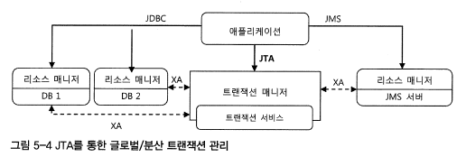
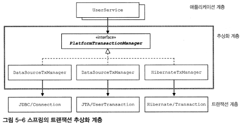
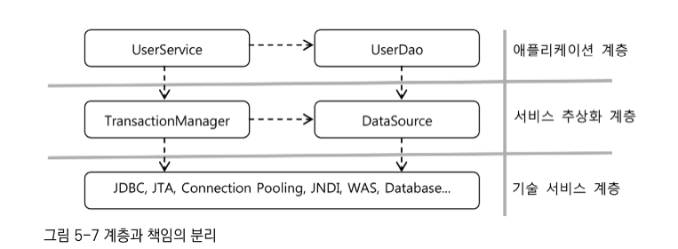

# 5.0 서론
지금까지 만든 DAO에 트랜잭션을 적용해보면서 스프링이 어떻게 성격이 비슷한 여러 종류의 기술을 추상화하고 이를 일관된 방법으로 사용할 수 있도록 지원하는지 살펴보자.

## 5.1 사용자 레벨 관리 기능 추가
DAO에 비즈니스 로직을 추가해보자. UserDao를 인터넷 서비스의 관리 모듈에 적용해본다고 생각해보면 단지 정보를 검색하거나 추가하는 것 외에도 정기적으로 사용자의 활동내역을 참고하여 레벨을 조정해주는 기능이 필요하다.

**레벨에 대한 비즈니스 로직은 다음과 같다.** 
```text
1. 사용자의 레벨은 BASIC, SILVER, GOLD
2. 처음엔 BASIC이며, 활동에 따라 한 단계씩 업그레이드 된다.
3. 가입 후 50회 이상 로그인하면 SILVER 레벨이 된다.
4. SILVER 레벨이면서 30번 이상 추천을 받으면 GOLD 레벨이 된다. 
5. 사용자 레벨의 변경 작업은 일정한 주기를 가지고 일괄 진행되며 변경 작업 전에는 조건을 충족하더라도 레벨이 변경되지 않는다.
```

### 필드 추가
**1. Level enum**

먼저 User 클래스에서 사용자의 레벨을 저장할 필드를 추가하자. DB의 User 테이블에는 어떤 타입으로 넣을 것인지, 또 이에 매핑되는 자바의 User 클래스에는 어떤 타입으로 넣을지 생각해보자. 

- DB 타입을 Varchar로 선언하고 문자열 그대로 넣기
   - 문자열을 통째로 넣는것은 그리 좋은 방법이 아니다.
- 코드화하여 DB에 넣기
   - 범위가 작은 데이터로 관리하면 DB 용량도 많이 차지하지 않고 가벼워서 좋다. 

코드화하여 DB에 넣는 것이 좋은 방법이다. 그렇다면 User 클래스에도 코드 자체를 넣는게 좋을까? 사실 이 코드는 클래스 입장에서 보면 의미가 파악되지 않는 데이터이기 떄문에 데이터가 틀어지는 상황이 발생할수도 있다. 따라서 코드 값을 직접 관리하는 것보다는 Enum 클래스를 만들어 관리하여 데이터가 틀어지는 상황을 방지할 수 있다.

```java
enum class Level {
    BASIC(1), SILVER(2), GOLD(3); 

    private final int value;

    Level(int value) {
        this.value = value;
    }

    public static Level valueOf(int value) {
        switch(value) {
            case 1: return BASIC;
            case 2: return SILVER;
            case 3: return GOLD;
            default: throw new AssertionError("Unknown value");
        }
    }
}
```
> 코드 5-1

이렇게 Enum 클래스로 관리하게 되면 데이터가 틀어지는 상황없이 안전하게 사용할 수 있다.

**2. User 필드 추가**

Level 타입의 변수를 User 클래스에 추가하자.

```java
public class User {
    ...
    Level level;
    int login;
    int recommend; 

    public Level getLevel() {
        return level;
    }

    public void setLevel(Level level) {
        this.level = level;
    }
}
```
> 코드 5-2

**3. UserDaoTest 테스트 수정**

UserDaoJdbc와 테스트에도 필드를 추가해야 한다. 새로운 기능을 만듬련 테스트를 먼저 만드는 것이 안전하다.

```java
public class UserDaoTest {
    ...

    @Before
    public void setUp() {
        this.user1 = new User("guymee", "박성철", "springno1", Level.BASIC, 1, 0); // 뒤에 3개가 추가된 필드
        ...
    }
}
```
> 코드 5-3 

다음은 UserDaoTest에서 두 개의 User 오브젝트 필드 값이 모두 같은지 비교하는 checkSameUser() 메서드를 수정한다. 

```java
private void checkSameUser(User user1, User user2) {
    assertThat(user1.getId(), is(user2.getId()));
    assertThat(user1.getName(), is(user2.getName()));
    assertThat(user1.getPassword(), is(user2.getPassword()));
    assertThat(user1.getLevel(), is(user2.getLevel()));
    assertThat(user1.getLogin(), is(user2.getLogin()));
    assertThat(user1.getRecommend(), is(user2.getRecommend()));
}
```
> 코드 5-4


기존의 addAndGet() 테스트에서는 checkSameUser() 메서드를 사용하지 않고 assertThat()을 사용했지만 이제 필드가 늘어났기 때문에 checkSameUser()로 수정해보자.

```java
@Test
public void addAndGet() {
    User userget1 = dao.get(user1.getId());
    checkSameUser(userget1, user1);

    ...
}
```
> 코드 5-5

**4. UserDaoJdbc 수정**

User 오브젝트 매핑용 콜백인 userMapper에 추가된 필드를 넣는다.
```java
public class UserDaoJdbc implements UserDao {
    ...
    private RowMapper<User> userMapper = 
        new RowMapper<User>() {
            public User mapRow(ResultSet rs, int rowNum) throws SQLException {
                User user = new User();
                user.setId(rs.getString("id"));
                user.setName(rs.getString("name"));
                user.setPassowrd(rs.getString("password"));
                user.setLevel(Level.valueOf(rs.getString("level"));
                user.setLogin(rs.getString("login"));
                user.setRecommend(rs.getString("recommend"));
                return user;
            }
        }

    public void add(User user) {
        this.jdbcTemplate.update(
            "insert into users(id, name, password, level, login, recommend) " +
            "values(?,?,?,?,?,?)", user.getId(), user.getName(),
            user.getPassword(), user.getLevel().intValue(),
            user.getLogin(), user.getRecommend());
        )
    }
}
```
> 코드 5-6

Level Enum은 DB에 저장할 수 있는 타입이 아니기 때문에 정수형으로 변환해줘야 한다. 따라서 intValue() 메서드를 사용한다. 반대로 조회를 했을 경우 정수형으로 가져오기 때문에 User 클래스에 set하게 되면 오류가 발생한다. 따라서 UserMapper에 Level enum의 valueOf() 메서드를 사용했다.

### 사용자 수정 기능 추가
**1. 수정 기능 테스트 추가**

```java
@Test
public void update() {
    dao.deleteAll();

    dao.add(user1);

    user1.setName("오인규");
    user1.setPassword("springno6");
    user1.setLevel(Level.GOLD);
    user1.setLogin(1000);
    user1.setRecommend(999);
    dao.update(user1);

    User user1update = dao.get(user1.getId());
    checkSameUser(user1, user1update);
}
```
> 코드 5-7

**2. UserDao와 UserDaoJdbc 수정**

위의 테스트를 성공시키기 위해서 update() 메서드를 UserDao 인터페이스에 추가한다. 
```java
public interface UserDao {
    ...
    public void update(User user); 
}
```
> 코드 5-8 

인터페이스에 추가했으니 구현체인 UserDaoJdbc에 update() 메서드를 구현하자.

```java
public void update(User user) {
    this.jdbcTemplate.update(
        "update users set name = ?, password = ?, level = ?, login = ?, " +
        "recommend = ? where id = ?", user.getName(),
        user.getPassword(), user.getLevel().intValue(),
        user.getLogin(), user.getRecommend(), user.getId());
    )
}
```
> 코드 5-9

**3. 수정 테스트 보완**
코드 5-7의 테스트는 단순히 정보가 바뀌었다는 것만 확인하고 수정되지 않아야 할 로우에 대한 테스트는 존재하지 않는다. update 메서드의 리턴 값으로 변경된 로우의 개수를 받는 방법과 직접 확인하는 방법이 있는데 후자의 방법을 한번 적용해보자.

```java
@Test
public void update() {
    dao.deleteAll();

    dao.add(user1);
    dao.add(user2);

    user1.setName("오인규");
    user1.setPassword("springno6");
    user1.setLevel(Level.GOLD);
    user1.setLogin(1000);
    user1.setRecommend(999);
    dao.update(user1);

    User user1update = dao.get(user1.getId());
    checkSameUser(user1, user1update);
    User user2same = dao.get(user2.getId());
    checkSameUser(user2, user2same);
}
```
>코드 5-10

만약 코드 5-9처럼 where 절을 빼먹으면 코드 5-10은 실패할 수 밖에 없을 것이다.

### UserService.upgradeLevels()
사용자 관리 로직은 어디다가 두는 것이 좋을까? 사용자 관리 비즈니스 로직을 담을 클래스를 하나 추가하자. 이름은 UserService로 하자. 
UserDao가 바뀐다고 UserService가 영향을 받아서는 안된다. 따라서 DAO의 인터페이스를 사용하고 DI를 적용해야 한다.

**1. UserService 클래스와 빈 등록**
```java
public class UserService {
    UserDao userDao;

    public void setUserDao(UserDao userDao) {
        this.userDao = userDao; 
    }
}
```
>코드 5-11

수정자 주입을 할 수 있도록 수정자 메서드를 추가한다. 그리고 userDao 빈을 DI 받을 수 있도록 프로퍼티를 추가해준다.

**2. upgradeLevels 메서드**

사용자 레벨 관리 기능 비즈니스 로직을 구현해보자.

```java
public void upgradeLevels() {
    List<User> users = userDao.getAll();
    for(User user : users) {
        Boolean changed = null; //레벨의 변화가 있는지 체크 
        if (user.getLevel() == Level.BASIC && user.getLogin() >= 50) {
            user.setLevel(Level.SILVER);
            changed = true;
        }
        else if (user.getLevel() == Level.SILVER && user.getRecommend() >= 30) {
            user.setLevel(Level.GOLD);
            changed = true;
        }
        else if (user.getLevel() == Level.GOLD) { changed = false; }
        else { changed = false; }

        if(changed) { userDao.update(user); }
    }
}
```
>코드 5-12

**3. upgradeLevel() 테스트**

적어도 가능한 모든 조건을 하나씩은 확인해봐야 한다. 사용자 레벨은 3가지가 있고, 변경이 일어나지 않는 GOLD를 제외하면 변경되거나 변경되지 않는 경우가 있을 수 있으므로 최소한 다섯가지 경우를 살펴봐야 한다. 이제 테스트해야 할 픽스쳐가 많아졌으니 리스트에 담아보자. 

```java
class UserServiceTest {
    ...
    List<User> users;

    @Before
    public void setUp() {
        users = Arrays.asList(
            new User("bumjin", "박범진", "p1", Level.BASIC, 49, 0);
            new User("joytouch", "강명성", "p2", Level.BASIC, 50, 0);
            new User("erwins", "신승한", "p3", Level.SILVER, 60, 29);
            new User("madnite1", "이상호", "p4", Level.SILVER, 60, 30);
            new User("green", "오민규", "p5", Level.GOLD, 100, 100);
        )
    }
}
```
> 코드 5-13

로직을 보면 로그인 횟수와 추천 횟수가 각각 기준 값 50,30 이상이 되면 SILVER, GOLD로 업그레이드 된다. 이럴 땐 테스트에 사용할 데이터를 경계가 되는 값의 전후로 선택하는 것이 좋다.

```java
@Test
public void upgradeLevels() {
    userDao.deleteAll();
    for(User user : users) userDao.add(user);

    userService.upgradeLevels();

    checkLevel(users.get(0), Level.BASIC);
    checkLevel(users.get(1), Level.SILVER);
    checkLevel(users.get(2), Level.SILVER);
    checkLevel(users.get(3), Level.GOLD);
    checkLevel(users.get(4), Level.GOLD);
}

private void checkLevel(User user, Level expectedLevel) {
    User userUpdate = userDao.get(user.getId());
    assertThat(userUpdate.getLevel(), is(expectedLevel));
}
```
> 코드 5-14

준비한 다섯가지의 픽스쳐들을 저장한 뒤에 upgradeLevels 메서드를 호출해서 레벨 정보를 변경해준다. 그 후에 사용자 정보를 하나씩 가져와서 레벨 변경 여부를 체크한다. 코드 5-14가 정상적으로 수행된다면 사용자 레벨 변경 기능은 완벽하게 만들어진 것이다.

### UserService.add()
사용자 레벨 관리 기능은 구현했지만 아직 하나가 남았다. 사용자가 새로 추가되는 경우 Default로 BASIC 레벨이여야 한다는 것이다. 그렇다면 이 로직은 어디에 담는 것이 좋을까?

1. UserDaoJdbc의 add() 메서드에는 옳지 않다. UserDaoJdbc는 주어진 User 오브젝트를 DB에 정보를 넣고 읽는 방법에만 관심을 가져야 한다.
2. User 클래스에서 아예 BASIC으로 초기화하는 것도 옳지 않다. 처음 가입할 떄를 제외하면 무의미한 정보가 될 것이다.
3. **비즈니스 로직을 담고있는 UserService에 담는 것이 낫다. UserDao의 add() 메서드는 사용자 정보를 담는 역할만 하고, UserService에도 add() 메서드를 추가하여 등록할 때의 비즈니스 로직을 담당하게끔 하면 된다.**

테스트 코드를 먼저 작성해보자.

```java
@Test
public void add() {
    userDao.deleteAll();

    User userWithLevel = users.get(4); // GOLD 레벨
    User userWithoutLevel = users.get(0);
    userWithoutLevel.setLevel(null);

    userService.add(userWithLevel);
    userService.add(userWithoutLevel);

    User userWithLevelRead = userDao.get(userWithLevel.getId());
    User userWithoutLevelRead = userDao.get(userWithoutLevel.getId());

    assertThat(userWithLevelRead.getLevel(), is(userWithLevel.getLevel()));
    assertThat(userWithoutLevelRead.getLevel(), is(Level.BASIC));
}
```
> 코드 5-15

null로 넘어가는 데이터는 default로 BASIC으로 설정 되어야 하고, 그 외의 데이터는 넘어간 레벨대로 설정되어야 한다. 이 테스트가 성공하도록 코드를 만들어보자.

```java
public void add(User user) {
    if (user.getLevel() == null) user.setLevel(Level.BASIC);
    userDao.add(user);
}
```
> 코드 5-16

코드에 비해 테스트가 복잡한데, 깔끔하게 만드는 방법은 뒤에서 알아보자.

### 코드 개선
코드를 개선해보자, 작성된 코드를 개선할 때는 다음과 같은 질문을 해볼 필요가 있다.
1. 코드에 중복된 부분은 없는가? 
2. 코드가 무엇을 하는 것인지 이해하기 불편하지 않은가?
3. 코드가 자신이 있어야 할 자리에 있는가?
4. 앞으로 변경이 일어난다면 어떤 것이 있을 수 있고, 그 변화에 쉽게 대응할 수 있게 작성되어 있는가?

**1. upgradeLevels() 메서드 코드의 문제점**

위의 질문을 하며 upradeLevels()의 메서드를 살펴보면 몇 가지 문제점이 보인다. 일단 for loop 내의 if/elseif/else 문이 굉장히 복잡하다. 복잡해보이는 이유는 성격이 다른 여러가지 로직이 한데 섞여 있기 떄문이다.

코드 5-12의 조건문의 코드를 살펴보자.
1. `users.getLevel() == Level.BASIC`은 현재 레벨이 무엇인지 파악하는 로직이다.
2.  `user.getLogin() >= 50`은 업그레이드 조건을 담은 로직이다 
3.  `user.setLevel(Level.SILVER)`는 다음 단계의 레벨이 무엇이며, 업그레이드를 위한 작업은 어떤 것인지가 함께 담겨있다.
4.  `changed=true`는 그 자체로는 의미가 없고, 멀리 떨어져 있는 `if (changed) { userDao.update(user) }`를 위해 사용하는 부분이다.

1,2,3,4번은 모두 관련은 있어보이지만 성격이 조금씩 다른 것들이 섞여 있거나 분리돼서 나타나는 구조이다. 만약 레벨이 추가되면 메서드는 점점 더 길어지고 굉장히 복잡한 구조가 될 것이다. 성격이 다른 두 가지 경우가 모두 한 곳에서 처리되는 것은 이상하다. 제대로 만들려면 조건을 두 단계에 걸쳐서 비교해야 한다. 첫 단계에서는 레벨을 확인하고 각 레벨별로 다시 조건을 판단하는 조건식을 넣어야 한다.

**2. upgradeLevels() 리팩토링**

기존 코드는 추상적인 로직의 흐름과 구체적인 내용이 섞여 있다. 레벨을 업그레이드하는 작업의 기본 흐름만 만들어보자.


```java
public void upgradeLevels() {
    List<User> users = userDao.getAll();
    for(User user : users) {
        if (canUpgradeLevel(user)) {
            upgradeLevel(user);
        }
    }
}
```
> 코드 5-17

코드 5-17은 구체적인 내용은 모르지만 코드의 흐름은 한눈에 이해하기가 쉽다. 이제 구체적인 내용을 만들기만 하면 된다.

```java
private boolean canUpgradeLevel(User user) {
    Level currentLevel = user.getLevel();
    switch(currentLevel) {
        case BASIC: return (user.getLogin() >= 50);
        case SILVER: return (user.getRecommend() >= 30);
        case GOLD: return false;
        default: throw new IllegalArgumentException();
    }

}
```
> 코드 5-18

코드 5-18은 업그레이드가 가능한지만 체크해주는 메서드이다.

```java
private void upgradeLevel(User user) {
    if (user.getLevel() == Level.BASIC) user.setLevel(Level.SILVER);
    else if (user.getLevel() == Level.SILVER) user.setLevel(Level.GOLD);
    userDao.update(user);
}
```
> 코드 5-19

코드 5-19처럼 업그레이드 작업을 분리해주면 나중에 알림을 보낸다거나와 같은 추가작업이 추가되어도 어느 곳을 수정해야 할지가 명확해진다는 장점이 있다.
그런데 아직은 마음에 안든다. 다음 단계가 무엇인가 하는 로직과 그때 사용자 오브젝트의 level 필드를 변경해준다는 로직이 함께 있는데다 너무 노골적으로 들어나있다. 그리고 레벨이 늘어나면 If문도 계속 계속 늘어날 것이다. 이것도 분리해보자 .

```java
enum class Level {
    BASIC(1, SILVER), SILVER(2, GOLD), GOLD(3, null); 

    private final int value;
    private final Level next;

    Level(int value, Level next) {
        this.value = value;
        this.next = next;
    }

    public int intvalue() {
        return value;
    }

    public Level nextLevel() {
        return this.next;
    }

    public static Level valueOf(int value) {
        switch(value) {
            case 1: return BASIC;
            case 2: return SILVER;
            case 3: return GOLD;
            default: throw new AssertionError("Unknown value");
        }
    }
}
```
> 코드 5-20

Level enum에 다음 단계 레벨 정보를 담을 수 있도록 필드를 추가하자. 이렇게 만들어두면 다음 업그레이드 레벨 순서는 Level enum 안에서 관리할 수 있다. 다음 단계의 레빌이 무엇인지 굳이 if문을 사용하지 않아도 된다. 사실 비즈니스 로직을 잘 작성한다면 nextLevel로 null을 받을 일은 없지만, 잘못 작성하는 경우가 발생할 수도 있기 때문에 null을 반환하여 잘못 작성되었다는 것을 확인할 수 있게 구현하는 것이 좋다.


이번엔 사용자 정보를 바꾸는 부분을 UserService 메서드에서 User로 옮겨보자. User가 스스로 다루는게 적절하다.

```java
public class User {

    ...

    public void upgradeLevel() {
        Level nextLevel = this.level.nextLevel();
        if (nextLevel == null) {
            throw new IllegralStateException();
        }
        els e{
            this.level = nextLevel;
        }
    }
}
```
> 코드 5-21

Level enum은 다음 레벨이 없는 경우 null을 반환하는데 이러한 경우는 레벨업이 불가능한 경우이기 때문에 Exception을 던져야 한다. 물론 그 앞에서 메서드에서 체크를 해주긴 하지만 User를 다양한 곳에서 사용할 수 있기 때문에 예외 처리를 또 해주는 것이 좋다. 만약 업그레이드시에 추가적인 정보를 저장해야 한다면 코드 5-21 부분만 고치면 된다.

```java
private void upgradeLevel(User user) {
    user.upgradeLevel();
    userDao.update(user);
}
```
> 코드 5-22

굉장히 간단해졌다. 지금까지 개선한 코드를 살펴보면 각 오브젝트와 메서드가 각각 자기 몫의 책임을 맡아 일을 하는 구조로 만들어졌다. 또 필요가 생기면 작업을 수행해달라고 요청하는 구조이다. 각자 자신의 책임을 맡고있으니 간단하고 이해하기도 쉽다. 또 변경점을 쉽게 알 수 있고, 잘못된 요청이나 작업을 시도했을 때 예외처리를 하기도 수월하다. 결국 각각을 독립적으로 테스트하도록 만들면 테스트도 간단해질 수 밖에 없을 것이다.

오브젝트들의 데이터를 직접 수정하거나, 데이터를 요청하는 것이 아니라 오브젝트에게 어떤 행동을 해달라고 요청하는 것이 객체지향의 기본 원리이다.

**3. UserServiceTest 개선**

기존 테스트에서는 checkLevel() 메서드를 호출할 때 일일이 다음 단계의 레벨이 무엇인지 넣어줬다. 이것도 사실 중복이다. Level이 갖고 있어야 할 다음 레벨이 무엇인가 하는 정보를 테스트에 직접 넣어놓을 필요가 없다. 만약 레벨이 추가되거나 변경된다면 이것들을 수정하는 작업은 굉장히 번거로울 것이다.

```java
@Test
public void upgradeLevels() {
    userDao.deleteAll();
    for(User user : users) userDao.add(user);

    userService.upgradeLevels();

    checkLevelUpgraded(user.get(0), false);
    ...


    private void checkLevelUpgraded(User user, boolean upgraded) {
        User userUpdate = userDao.get(user.getId());
        if (upgraded) {
            assertThat(userUpdate.getLevel(), is(user.getLevel().nextLevel()));
        }
        else {
            assertThat(userUpdate.getLevel(), is(user.getLevel()));
        }
    }
}
```
> 코드 5-23

기존의 테스트 코드(코드 5-14)는 checkLevel을 호출하면서 다음 레벨을 전달하는데, 이게 업그레이드된 경우를 테스트하려고 하는건지 쉽게 파악이 안된다. 그에 반해 코드 5-23의 개선된 checkLevel은 좀 더 의도를 파악하기 쉽게 true/false를 전달하고, 또 업그레이드 됐을때 어떤 레벨인지는 nextLevel()을 호출해보면 된다.

좀 더 욕심을 내보자면, 업그레이드 정책이 바뀐 경우를 대비해서 UserService에서 업그레이드 정책을 분리하는 방법도 고려해볼 수 있다.

```java
public interface UserLevelUpgradePolicy {
    boolean canUpgradeLevel(User user);
    void upgradeLevel(User user);
}
```
> 코드 5-24 

코드 5-24처럼 인터페이스를 만들어두고 UserService는 DI로 제공 받은 정책 구현 클래스를 이 인터페이스를 통해 사용할 수 있다.

<br/>

## 5.2 트랜잭션 서비스 추상화
추가적인 요구사항이 생겼다. 사용자 레벨 조정 작업 중 중간에 문제가 발생하면 완료된 작업들도 모두 취소시키도록 결정했다.

### 모 아니면 도
과연 지금의 코드는 중간에 오류가 발생한다면 어떻게 될까? 한번 일부러 오류를 발생시켜서 시뮬레이션을 해보자.

**1. 테스트용 UserService 대역**

어떻게 작업 중간에 예외를 강제로 만들 수 있을까? 사실 가장 쉬운 방법은 예외를 강제로 발생시키도록 애플리케이션 코드를 수정하는 것이다. 하지만 테스트를 위해 코드를 건드는 것은 좋은 생각이 아니다. 그래서 이런 경우엔 UserService 대역을 만드는 것이 좋다. 복사해서 클래스를 새로 만드는 것보다는 UserService를 상속 받아 일부 메서드를 오버라이딩 하는 방법이 나을 것이다. 테스트에서만 사용할 것이기 때문에 테스트 클래스 내에 스태틱 클래스로 만드는 것이 간편하다. 이번만큼은 예외로 테스트를 위해 애플리케이션 코드의 private 메서드들을 protected로 수정해주자. 

```java
static class TestUserService extends UserService {
    private String id;

    private TestUserService(String id) {
        this.id = id;
    }

    protected void upgradeLevel(User user) {
        if (user.getId().equals(this.id)) throw new TestUserServiceException();
        super.upgradeLevel(user);
    }
}
```
> 코드 5-25

코드 5-25의 upgradeLevel은 지정된 id의 User 오브젝트가 발견되면 예외를 던져서 작업을 강제로 중단시킨다.

**2. 강제 예외 발생을 통한 테스트**

다시 원래 상태로 돌아갔는지 확인하기 위한 테스트 코드를 작성해보자.

```java
@Test
public void upgradeAllOrNothing() {
    UserService testUserService = new TestUserService(users.get(3).getId());
    testUserService.setUserDao(this.userDao);

    userDao.deleteAll();
    for(User user : users) userDao.add(user);

    try {
        testUserService.upgradeLevels();
        fail(); // 성공한다면 fail 처리
    } catch (TestUserServiceException e) {

    }

    checkLevelUpgraded(user.get(1), false); // 레벨이 처음 상태로 다시 변경됐는지 확인
}
```
> 코드 5-26

위의 코드를 실행하면 두번째 사용자의 레벨이 BASIC에서 SILVER로 바뀐 것이 유지되어있다는 것을 확인할 수 있다. 테스트가 실패한 것이다.

**3. 테스트 실패의 원인**

실패한 원인은 트랜잭션 문제다. 모든 사용자의 레벨을 업그레이드하는 upgradeLevels() 메서드가 하나의 트랜잭션 안에서 동작하지 않았기 때문이다. 아예 성공하거나, 아예 다 실패해야 한다. 마치 더 이상 쪼갤 수 없는 원자와 같이 하나처럼 행동해야 한다. 이것이 바로 트랜잭션이다.

### 트랜잭션 경계설정
DB는 그 자체로 완벽한 트랜잭션을 제공한다. 하나의 SQL 명령을 처리하는 경우는 보장한다. 하지만 여러개의 SQL 명령을 하나의 명령처럼 취급해야하는 경우도 있다. 하나의 SQL 명령이 실패한다면 나머지 SQL 명령도 모두 실패해야 한다. 이러한 취소 작업을 트랜잭션 롤백이라고 한다. 반대로 모든 SQL 명령이 다 성공적으로 마무리 됐다고 DB에게 알려줘서 작업을 확장시켜야 한다. 이것은 트랜잭션 커밋이라고 한다.

**1. JDBC 트랜잭션의 트랜잭션 경계설정**

애플리케이션 내에서ㅏ 트랜잭션이 시작되고 끝나는 위치를 트랜잭션의 경계라고 부른다.

```java
Connection c = dataSource.getConnection();

c.setAutoCommit(false); // 트랜잭션 시작
try {
    PreparedStatement st1 = c.prepareStatement("update users ...");
    st1.executeUpdate();

    PreparedStatement st2 = c.prepareStatement("update users ...");
    st2.executeUpdate();

    c.commit(); // 트랜잭션 커밋
} catch (Exception e) {
    c.rollback(); // 트랜잭션 롤백
}

c.close();
```
> 코드 5-27

코드 5-27은 JDBC를 이용해 트랜잭션을 적용하는 가장 간단한 방법이다. JDBC에서 트랜잭션을 시작하려면 자동 커밋 옵션을 false로 만들어주면 된다. 트랜잭션의 시작을 선언하고 commit(), rollback()을 통해 트랜잭션을 종료하는 작업을 트랜잭션의 경계설정이라고 한다. 이렇게 하나의 DB 커넥션 안에서 만들어지는 트랜잭션을 로컬 트랜잭션이라고도 한다.

**2. UserService와 UserDao의 트랜잭션 문제**

기존 코드의 문제점은 템플릿 메서드가 한번 실행될때마다 트랜잭션이 생성되고 결국 독립적인 트랜잭션으로 실행될 수 밖에 없는 것이다. 데이터 엑세스 코드를 DAO로 만들어서 분리해놓았을 경우에는 DAO 메서드를 호출할 때마다 하나의 새로운 트랜잭션이 만들어지는 구조가 될 수 밖에 없다. 결국 DAO를 사용하면 이를 하나로 묶어줄 수 있는 것이 불가능해진다. 어떤 일련의 작업이 하나의 트랜잭션으로 묶이려면 그 작업이 진행되는 동안 DB 커넥션도 하나만 사용돼야 한다. 트랜잭션은 Connection 오브젝트 안에서 만들어지기 떄문이다. 하지만 현재는 UserService에서 DB 커넥션을 다룰 수 있는 방법이 없다.

**3. 비즈니스 로직 내의 트랜잭션 경계설정**

결국 이를 해결하려면 트랜잭션의 시작과 종료를 결정하는 부분을 UserService로 가져와야 한다. UserDao가 가진 SQL이나 JDBC API를 이용한 데이터 엑세스 코드는 최대한 그대로 남겨둔 채로, UserService에는 트랜잭션 시작과 종료를 담당하는 최소한의 코드만 가져오게 만들면 어느정도 책임이 다른 코드를 분리해둔 채로 트랜잭션 문제를 해결할 수 있다.

```java
public void upgradeLevels() throws Exception {
    // 1. DB Connection 생성
    // 2. 트랜잭션 시작 

    try {
        // 3. DAO 메서드 호출
        // 4. 트랜잭션 커밋
    } catch(Exception e) {
        // 5. 트랜잭션 롤백
        throw e;
    } finally {
        // 6. DB Connection 종료
    }
}
```
> 코드 5-28

upgradeLevels는 코드5-28처럼 바뀌어야 한다. 5-28의 구조는 트랜잭션을 사용하는 전형적인 JDBC 코드의 구조이다. 그런데 여기서 생성된 Connection 오브젝트를 가지고 데이터 엑세스 작업을 진행하는 코드는 UserDao의 update() 메서드에 있어야 한다. 순수한 데이터 엑세스 로직은 UserDao에 있어야 하기 때문이다. 또 반드시 생성된 Connection 오브젝트는 UserDao 메서드로 전달되어야 한다. 그래야 트랜잭션이 유지되기 때문이다.

또한 실제로 UserDao의 메서드를 호출하는 것은 upgradeLevel() 이기 때문에 여기에도 Connection이 전달되어야 한다.

**4. UserService 트랜잭션 경계설정의 문제점**
1. JdbcTemplate을 활용할 수 없다. 
2. 메서드에 Connection 파라미터가 추가되어야 한다.
3. Connection 파라미터가 UserDao 인터페이스 메서드에 추가되면 UserDao는 더 이상 데이터 엑세스 기술에 독립적일 수가 없다. 만약 JPA로 수정되려면 Connection 대신 EntityManager가 전달되어야 하기 때문이다.
4. 마지막으로 Connection 파라미터가 추가됨으로써 테스트 코드도 큰 영향을 받게 되었다. 

### 트랜잭션 동기화
**1.Connection 파라미터 제거**
먼저 Connection 파라미터 문제를 해결해보자. 이를 위해 스프링이 제안하는 방법은 독립적인 트랜잭션 동기화 방식이다. 트랜잭션 동기화란 Connection 오브젝트를 특별한 저장소에 보관해두고, 이후에 호출되는 DAO의 메서드에서는 저장된 Connection을 가져가다 사용하게 하는 것이다. 정확히는 DAO가 사용하는 JdbcTemplate이 트랜잭션 동기화 방식을 이용하도록 하는 것이다.

트랜잭션 동기화 저장소는 작업 스레드마다 독립적으로 Connection 오브젝트를 저장하고 관리하기 때문에 다중 사용자를 처리하는 멀티스레드 환경에서도 충돌이 날 염려가 없다.

**2. 트랜잭션 동기화 적용**
스프링은 JdbcTemplate과 더불어 이런 트랜잭션 동기화 기능을 지원하는 간단한 유틸리티 메서드를 제공하고 있다.

```java
private DataSource dataSource;

public void setDataSource(DataSource dataSource) {
    this.dataSource = dataSource;
}

public void upgradeLevels() throws Exception {
    TransactionSynchronizationManager.initSynchronization(); 
    Connection c = DataSourceUtils.getConnection(dataSource); // 
    c.setAutoCommit(false);

    try {
        List<User> users = userDao.getALl();
        for (User user : users) {
            if (canUpgradeLevel(user)) {
                upgradeLevel(user);
            }
        }
        c.commit();
    } catch (Excetpion e) {
        c.rollback();
        throw e;
    } finally {
        DataSourceUtils.releaseConnection(c, dataSource);
        TransactionSynchronizationManager.unbindResource(this.dataSource);
        TransactionSynchronizationManager.clearSynchronization(); // 동기화 작업 종료 및 정리
    }
}
```
> 코드 5-29

코드 5-29는 트랜잭션 동기화 기능을 적용한 예시이다. DataSourceUtils를 이용해 Connection을 생성하는 이유는 Connection을 생성해줄 뿐만 아니라, 트랜잭션 동기화에 사용하도록 저장소에 바인딩해주기 때문이다. 그리고 TransactionSynchronizationManager 클래스를 통해 트랜잭션 동기화 작업을 관리할 수 있다. 트랜잭션 동기화가 되어 있는 채로 JdbcTemplate을 사용하면 JdbcTemplate의 작업에서 동기화시킨 DB 커넥션을 사용하게 된다.

**3. JdbcTemplate과 트랜잭션 동기화**
JdbcTemplate은 영리하게 동작하도록 설계되어 있다. 만약 미리 생성돼서 트랜잭션 동기화 저장소에 등록된 커넥션이나 트랜잭션이 없는 경우에는 직접 DB 커넥션을 만들고 트랜잭션을 시작해서 JDBC 작업을 수행한다. 반면에 이미 되어있다면 그 커넥션을 가져와서 사용한다. 따라서 트랜잭션 적용 여부에 맞춰 userDao 코드를 수정할 필요가 없다.

### 트랜잭션 서비스 추상화
**1. 기술과 환경에 종속되는 트랜잭션 경계설정 코드**

새로운 문제가 발생했다. 고객사는 여러 DB를 사용하는데, 한 트랜잭션 내에서 여러 DB에 데이터를 넣어야 한다고 한다. 로컬 트랜잭션은 하나의 Connection에 종속되므로 불가능하다. 따라서 별도의 트랜잭션 관리자를 통해 트랜잭션을 관리하는 글로벌 트랜잭션 방식을 사용해야 한다. 자바는 JDBC 외에 이런 글로벌 트랜잭션을 지원하는 트랜잭션 매니저를 지원하기 위한 API인 JTA를 제공하고 있다.



트랜잭션을 JDBC나 JMS API를 사용해서 직접 제어하지 않고, JTA를 통해 트랜잭션 매니저가 관리하도록 위임한다. 트랜잭션 매니저는 DB와 메시징 서버를 제어하고 관리하는 각각의 리소스 매니저와 XA 프로토콜을 통해 연결된다. 이를 통해 트랜잭션 매니저가 실제 DB와 메시징 서버의 트랜잭션을 종합적으로 제어할 수 있게 된다. 이렇게 JTA를 사용하면 여러 개의 DB나 메시징 서버에 대한 작업을 하나의 트랜잭션으로 통합하는 분산 트랜잭션 또는 글로벌 트랜잭션이 가능해진다.

```java
InitialContext ctx = new InitialContext();
UserTransaction tx = (UserTransaction)ctx.lookup(UESR_TX_JNDI_NAME);

tx.begin();
Connection c = dataSource.getConection();
try {
    tx.commit();
} catch (Exception e) {
    tx.rollback();
    throw e;
} finally {
    c.close();
}
```
> 코드 5-30

JTA를 이용하면서 UserService의 코드가 바뀌었다. UserService는 로직이 안바뀌어도 기술환경에 따라 코드가 바뀌는 코드가 되어버렸다. 또 하이버네이트 같은 경우는 트랜잭션 관리 코드가 JDBC나 JTA의 코드와는 또 다르다. 결국 트랜잭션 API에 의존한다는 문제점이 존재한다.

**2. 트랜잭션 API의 의존관계 문제와 해결책**

원래 UserService는 UserDao 인터페이스에만 의존하는 구조였다. 그래서 DAO 클래스의 구현 기술이 JDBC에서 하이버네이트나 여타 기술로 바뀌더라도 UserService 코드는 영향을 받지 않았다. 문제는 트랜잭션 떄문에 모두 허사가 되어버렸다. 다행히도 트랜잭션 경계설정 코드는 일정한 패턴을 갖는 유사한 구조다. 이러한 공통점이있다면 추상화를 생각해볼 수 있다.

**3. 스프링의 트랜잭션 서비스 추상화**

스프링은 트랜잭션 기술의 공통점을 담은 트랜잭션 추상화 기술을 제공하고 있다.



```java
public void upgradeLevels() {
    PlatformTransactionManager transactionManager = new DataSourceTransactionManager(dataSource);

    TransactionStatus status = trasnactionManager.getTransaction(new DefaultTrasnactionDefinition());

    try {
        List<User> users = userDao.getALl();
        for (User user : users) {
            if (canUpgradeLevel(user)) {
                upgradeLevel(user);
            }
        }
        transactionManager.commit(status);
    } catch (Excetpion e) {
        transactionManager.rollback(status);
        throw e;
    } 
}
```
> 코드 5-31

스프링이 제공하는 트랜잭션 경계설정을 위한 추상 인터페이스는 PlatformTransactionManager다. JDBC의 로컬 트랜잭션을 이용한다면 DataSourceTransactionManager 구현체를 사용하면 된다. getTransaction()을 호출하면 트랜잭션을 가져오게 된다. Connection은 트랜잭션 매니저가 생성해준다. 파라미터로 넘기는 DefaultTrasnactionDefinition 오브젝트는 트랜잭션에 대한 속성을 담고 있다.

이렇게 시작된 트랜잭션은 TrasnactionStatus 타입의 변수에 저장된다. TrasnactionStatus는 트랜잭션에 대한 조작이 필요할 때 PlatformTransactionManager의 메서드에게 파라미터로 념겨주면 된다. 이 스프링의 트랜잭션 추상화 기술은 앞에서 적용해봤던 트랜잭션 동기화를 사용한다. DataSourceTransactionManager는 JdbcTemplate에서 사용될 수 있는 방식으로 트랜잭션을 관리해준다.

**4. 트랜잭션 기술 설정의 분리**
DI로 TransactionManager를 주입받게 수정한다면 어떤 DB 접근 기술을 사용하더라도 손쉽게 트랜잭션 추상화를 구현할 수 있다. 어느 클래스든 스프링 빈을 등록하기 전 싱글톤으로 만들어져 여러 스레드에서 동시에 사용해도 괜찮은가? 에 대한 질문을 던져야 한다. 다행히도 스프링이 제공하는 PlatformTransactionManager의 구현 클래스들은 싱글톤으로 사용해도 된다.

이제 UserService는 DI를 통해 TrasnactionManager를 주입 받게되고 그렇기 때문에 트랜잭션 기술에 완전히 독립적인 코드가 됐다. 만약 다른 접근 기술을 사용한다면 UserService 변경 없이 다른 TrasnactionManager를 주입해주기만 하면 된다.

<br/>

## 5.3 서비스 추상화와 단일 책임 원칙
**1. 수직, 수평 계층구조와 의존관계**

UserDao와 UserService는 각각 담당하는 코드의 기능적인 관심에 따라 분리되고, 서로 불필요한 영향을 주지 않으면서 독자적으로 확장이 가능하도록 만든 것이다. 같은 애플리케이션 로직을 담은 코드지만 내용에 따라 분리했으니 같은 계층에서의 수평적인 분리라고 할 수 있다. 

트랜잭션의 추상화는 이와는 다르다. 애플리케이션의 비즈니스 로직과 그 하위에서 동작하는 로우레벨의 트랜잭션 기술이라는 아예 다른 계층의 특성을 갖는 코드를 분리한 것이다.



위의 그림은 지금까지 만들어진 사용자 모듈의 의존관계를 나타낸다.
1. UserDao와 UserService는 인터페이스와 DI를 통해 연결됨으로써 결합도가 낮아졌다.
2. 또 UserDao는 DB 연결 생성 방법에 대해 독립적이다. DataSource 인터페이스와 DI를 통해 추상화된 방식으로 로우레벨의 DB 연결 기술을 사용하기 때문이다.
3. UserService와 트랜잭션 기술도 스프링이 제공하는 PlatformTransactionManager 인터페이스를 통한 추상화 계층을 사이에 두고 사용하게 했기 떄문에, 구체적인 트랜잭션 기술에 독립적인 코드가 됐다. 

이 모든 것에는 스프링의 DI가 중요한 역할을 하고 있다. DI의 가치는 이렇게 관심, 책임, 성격이 다른 코드를 깔끔하게 분리하는 데 있다.

**2. 단일 책임 언칙**
