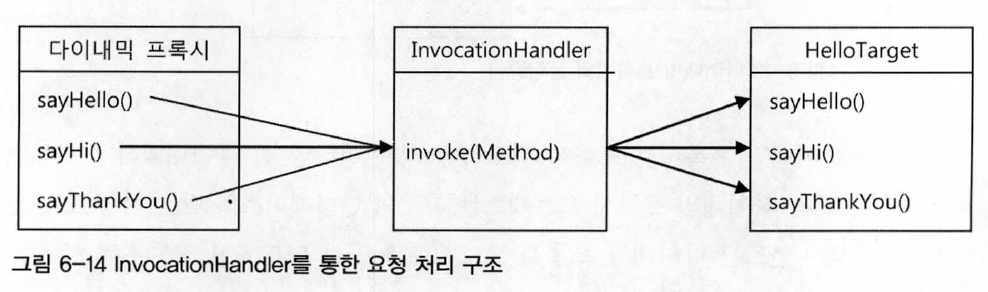

# 6.0 서론
스프링에 적용된 가장 인기 있는 AOP의 적용 대상은 바로 선언적 트랜잭션 기능이다. 서비스 추상화를 통해 많은 근본적인 문제를 해결했던 트랜잭션 경계설정 기능을 이용해 더욱 세련되고 깔끔한 방식으로 바꿔보자. 그리고 그 과정에서 스프링이 AOP를 도입해야 했던 이유도 알아보자.

## 6.1 트랜잭션 코드의 분리 
UserService에 여전히 찜찜한 구석이 있다. 트랜잭션 경계 설정을 위해 넣은 코드 때문이다. 스프링이 제공하는 깔끔한 트랜잭션 인터페이스를 썼음에도 비즈니스 로직이 주인이어야 할 메서드 안에 트랜잭션 코드가 더 많은 자리를 차지하고 있다. 하지만 트랜잭션의 경계는 비즈니스 로직의 전후에 설정돼야 하는 것이 분명하니 UserService의 메소드에 두는 것을 거부할 명분이 없다.

### 메소드 분리
```java
public void upgradeLevels() throws Exception {
    TransactionStatus status = this.transactionManager.getTransaction(new DefaultTransactionDefinition()); // 트랜잭션 경계설정

    try {
        List<User> users = userDao.getAll();
        for (User user : users) {
            if (canUpgradeLevel(user)) {
                upgradeLevel(user);
            }
        } // 비즈니스 로직

        this.trasnactionManager.commit(status);
    } catch (Exception e) {
        this.trasnactionManager.rollback(status);
        throw e;
    } // 트랜잭션 경계설정
}
```
> 코드 6-1

이 코드의 특징은 트랜잭션 경계설정의 코드와 비즈니스 로직 코드 간에 서로 주고받는 정보가 없다는 점이다. 비즈니스 로직 코드에서 직접 DB를 사용하지 않기 때문에 트랜잭션 준비 과정에서 만들어진 DB 커넥션 정보 등을 직접 참조할 필요가 없기 때문이다. 이 메서드에서 시작된 트랜잭션 정보는 트랜잭션 동기화 방법을 통해 DAO가 알아서 활용한다. 따라서 이 두가지 코드는 성격이 다를 뿐 아니라 서로 주고받는 것도 없는 독립적인 코드다.

그럼 한번 분리해보자. 

```java
public void upgradeLevels() throws Exception {
    TransactionStatus status = this.transactionManager.getTransaction(new DefaultTransactionDefinition()); // 트랜잭션 경계설정

    try {
        upgradeLevelsInternal();
        this.trasnactionManager.commit(status);
    } catch (Exception e) {
        this.trasnactionManager.rollback(status);
        throw e;
    } // 트랜잭션 경계설정
}

private void upgradeLevelsInternal() {
    List<User> users = userDao.getAll();
    for (User user : users) {
        if (canUpgradeLevel(user)) {
            upgradeLevel(user);
        }
    } \
}
```
> 코드 6-2

### DI를 이용한 클래스의 분리
비즈니스 로직을 분리했지만, 여전히 UserService에 트랜잭션을 담당하는 기술적인 코드가 위치하고 있다. 사실 서로 주고 받는 정보도 없기 때문에 다른 클래스로 뽑아내면 된다.

**DI 적용을 이용한 트랜잭션 분리**

UserServiceTest는 UserService를 사용하고 있다, 그런데 UserService는 현재 클래스로 되어있어서 다른 코드에서 사용한다면 UserService를 직접 참조하게 된다. 그러면 UserService에서 트랜잭션 코드를 빼낸다면 UserService를 사용하는 클래스들은 모두 트랜잭션 기능이 빠진 UserService를 사용하게 될 것이다. 구체적인 구현 클래스를 사용함으로써 생기는 단점이다.
따라서 인터페이스를 통해 간접적으로 접근하도록 DI를 적용해야 한다. 이러는 이유는 보통 구현 클래스를 바꿔 사용하기 위해서이다. 즉, 테스트할 때는 트랜잭션 기능이 들어가있는 UserServiceTest, 평소엔 트랜잭션 기능이 빠져있는 UserService를 번걸아가면서 사용하는 것이다.

하지만 꼭 그래야 한다는 제약은 없다. 한 번에 두개의 UserService 인터페이스 구현 클래스를 동시에 이용한다면 어떨까? 지금 우리가 해결하려는 문제는 비즈니스 로직만 두고, 트랜잭션 코드를 외부로 빼내려는 것이다. 하지만 크라이언트가 UserService의 기능을 이용하려면 트랜잭션이 적용돼야 한다. 그래서 아래와 같은 구조를 생각할 수 있다.


UserService를 구현한 또 다른 구현 클래스를 만드는데, 얘는 UserServiceImpl을 대신하려고 만든게 아니라 트랜잭션 경계설정이라는 책임을 맡고 있을 뿐이다. 그리고 비즈니스 로직은 갖고 있지 않기 때문에 비즈니스 로직은 UserServiceImpl에게 위임한다. 그 위임을 위한 호출 작업 앞뒤로 적절한 트랜잭션 경계를 설정해주면 된다.

**UserService 인터페이스 도입**

```java
public interface UserService {
    void add(User user);
    void upgradeLevels();
}
```
> 코드 6-3


```java
public class UserServiceImpl implements UserService {
    UserDao userDao;
    MailSender mailSender;

    public void upgradeLevelsInternal() {
        List<User> users = userDao.getAll();
        for (User user : users) {
            if (canUpgradeLevel(user)) {
                upgradeLevel(user);
            }
        }
    }
}
```
> 코드 6-4

이렇게만 보면 코드 6-4의 UserServiceImpl은 비즈니스 로직에만 충실한 깔끔한 코드이다. 

**분리된 트랜잭션 기능**

이제 트랜잭션 처리를 담은 UserServiceTx를 만들어보자. UserServiceTx는 같은 인터페이스를 구현한 다른 오브젝트에게 고스란히 작업을 위임하게 만들면 된다.


```java
public class UserServiceTx implements UserService {
    UserService userService; 

    public void setUserService(UserService userService) {
        this.userService = userService;
    }

    public void add(User user) {
        userService.add(user);
    } // 위임

    public void upgradeLevels() {
        userService.upgradeLevels();
    } // 위임
}
```
> 코드 6-5

UserServiceTx는 사용자 관리라는 비즈니스 로직을 전혀 갖지 않고 고스란히 다른 UserService 구현 오브젝트에 기능을 위임한다. 이를 위해 UserService 오브젝트를 DI 받을 수 있도록 만든다.

여기에 트랜잭션 경계설정이라는 부가적인 작업을 부여해보자.

```java
public class UserServiceTx implements UserService {
    UserService userService; 
    PlatformTransactionManager transactionManager;

    public void setTransactionManager(PlatformTransactionManager transactionManager) {
        this.transactionManager = transactionManager;
    }

    public void setUserService(UserService userService) {
        this.userService = userService;
    }

    public void add(User user) {
        userService.add(user);
    } // 위임

    public void upgradeLevels() {
        TransactionStatus status = this.transactionManager.getTransaction(new DefaultTransactionDefinition());
        try {
            userService.upgradeLevels();
            thi.transactionManager.commit(status);
        } catch (RuntimeException e) {
            this.transactionManager.rollback(status);
            throw e;
        }
    } // 위임
}
```
>코드 6-6

upgradeLevels()는 UserService에서 트랜잭션 처리 메서드와 비즈니스 로직 메서드를 분리했을 때 트랜잭션을 담당한 메서드와 거의 한 메서드가 됐다. 

**트랜잭션 적용을 위한 DI 설정**

먼저 트랜잭션을 담당하는 오브젝트가 사용돼서 트랜잭션에 관련된 작업을 수행해주고, 실제 사용자 관리 로직을 담은 오브젝트가 이후에 호출돼서 비즈니스 로직에 관련된 작업을 수행하도록 만든다.

따라서 의존관계는 다음과 같이 구성돼야 한다. 


의존관계 설정을 해줬다면 클라이언트는 UserServiceTx 빈을 호출해서 사용하도록 만들어야 한다.

**트랜잭션 분리에 따른 테스트 수정**

테스트 코드도 수정해야 한다. 기존의 UserService 클래스가 인터페이스와 두 개의 클래스로 분리된 만큼 테스트에서도 적합한 타입과 빈을 사용하도록 변경해야 한다. UserService는 인터페이스가 되었으므로 테스트 코드는 이제 구체적인 클래스 정보를 알지 못한 채로 컨테이너가 제공해주는 대표적인 UserService 구현 오브젝트를 사용하게 된다. 

그런데 UserServiceTest는 하나의 빈을 더 가져와야 한다. 바로 UserServiceImpl이다. 일반적인 UserService 기능의 테스트에서는 UserService 인터페이스를 통해 결과를 확인하는 것으로 충분하다. 그런데 앞 장에서 만든 MailSender 목 오브젝트를 이용한 테스트에서는 테스트에서 직접 MailSender를 DI해줘야 할 필요가 있었다. 따라서 UserServiceImpl 클래스 오브젝트를 가져와야 할 필요가 있다. 

물론 단순히 UserService의 기능을 테스트할 때는 구체적인 클래스 정보를 굳이 테스트에 노출하지 않는 편이 낫겠지만 이렇게 목 오브젝트를 이용해 수동 DI를 해야하는 경우는 어떤 클래스의 오브젝트인지 정확히 알아야한다.

```java
@Test
public void upgradeAllOrNothing() throws Exception {
    TestUserService testUserService = new TestUserService(user.get(3).getId());
    testUserService.setUserDao(userDao);
    testUserService.setMailSender(mailSender);

    UserServiceTx txUserService = new UserServiceTx();
    txUserService.setTransactionManager(transactionManager);
    txUserService.setUserService(testUserService); // testUserService가 예외 발생용 클래스, 굳이 트랜잭션 테스트를 위해 UserServiceTx를 수정할 필요가 없다.

    userDao.deleteAll();
    for(User user : users) userDao.add(user);

    try {
        txUserService.upgradeLevels(); // 예외 발생용 testUserService가 실행된다.
        fail("TestUserServiceException expected");
    }
    ...
}
```
> 코드 6-7

**트랜잭션 경계설정 코드 분리의 장점**

1. UserServiceImpl에 비즈니스로직을 구현할 때는 트랜잭션과 같은 기술적인 내용에는 신경 쓰지 않아도 된다.
2. 비즈니스 로직에 대한 테스트를 손쉽게 만들어낼 수 있다.

## 6.2 고립된 단위 테스트
가장 편하고 좋은 테스트 방법은 가능한 한 작은 단위로 쪼개서 테스트하는 것이다. 그러면 실패 원인을 찾기 쉽기 때문이다. 또한 테스트 단위가 작아야 테스트의 의도나 내용이 분명해지고 만들기도 쉬워진다. 

### 복잡한 의존관계 속의 테스트
UserService의 경우를 생각해보자. UserService가 분리하기 전의 테스트 동작 모습은 아래와 같다.


UserServiceTest가 테스트하고자 하는 대상인 UserService는 사용자 정보를 관리하는 비즈니스 로직의 구현 코드다. 따라서 UserService의 코드가 바르게 작성 되어있으면 성공하고, 아니면 실패하면 된다. 따라서 테스트 단위는 UserService 클래스여야 한다.

하지만 UserService는 UserDao, TransactionMananger, MailSender라는 세 가지 의존관계를 갖고 있다. 따라서 세 가지 오브젝트들이 테스트 동안 같이 실행된다. 더 큰 문제는 그 세가지 의존 오브젝트들도 DB 드라이버, DB 서버와의 네트워크 통신, DB 테이블에 모두 의존하고 있다. 따라서 UserService를 테스트하는 것철머 보이지만 사실은 그 뒤에 존재하는 다양한 오브젝트, 환경, 서비스, 서버, 네트워크까지 함께 테스트를 하는 셈이다.

따라서 이러한 경우는 테스트하기가 쉽지 않다. UserService는 멀쩡하지만 UserDao를 누가 수정하면서 테스트가 실패할수도 있고, 환경에 따라 실패할수도 있다. 

DB가 함께 동작해야 하는 테스틑 작성하기 힘든 경우도 많다.  굉장히 복잡한 테스트 데이터를 준비하고 고작 간단한 계산 로직을 테스트 한다면, 배보다 배꼽이 더 큰 작업이 될 수 있다.

### 테스트 대상 오브젝트 고립시키기
따라서 우리는 테스트의 대상을 고립시켜야 한다. 고립시키는 방법은 MailSender에 적용했던 대로 테스트를 위한 대역을 사용하는 것이다. 

**테스트를 위한 UserServiceImpl 고립**

이미 트랜잭션 코드를 고립시켰기 때문에 PlatformTransactionManager는 신경 쓸 필요가 없다. 고립된 테스트가 가능하도록 UserService를 재구성해보면 아래와 같은 구조가 된다.


UserDao는 단지 테스트 대상의 코드가 정상적으로 수행되도록 도와주는 스텁이 아니라, 부가적인 검증 기능까지 가진 목 오브젝트로 만들었다. 그 이유는 고립된 환경에서 동작하는 UpgradeLevels()의 테스트 결과를 검증할 방법이 필요하기 때문이다. UserServiceImpl의 upgradeLevels()는 리턴 값이 없는 void 형이기 때문에 return 값으로 검증은 아예 불가능하다.

upgradeLevels()는 DB 데이터를 확인할 수 밖에 없기 때문에 기존 테스트 코드에서는 UserService의 메서드를 실행시킨 후에 UserDao를 이용해 DB에 들어간 결과를 가져와 검증하는 방법을 사용했다.

그러나 고립된 UserServiceImpl은 DB에 저장하지 않기 떄문에 검증이 어렵다. 그래서 이럴땐 테스트 대상인 UserServiceImpl과 UserDao에게 어떤 요청을 했는지 확인하는 작업이 필요하다. UserDao의 update() 메서드를 호출하는 것을 확인할 수 있다면 결국 DB에 반영되었다고 결론을 내릴 수 있기 떄문이다.

**고립된 단위 테스트 활용**

```java
@Test
public void upgradeLevels() throws Exception {
    userDao.deleteAll();
    for(User user : users) userDao.add(user);

    MockMailSender mockMailSender = new MockMailSender(); 
    userServiceImpl.setMailSender(mockMailSender); // 메일 발송 여부 확인을 위해 목 오브젝트 DI

    userService.upgradeLevels(); // 테스트 대상 실행

    checkLevelUpgraded(users.get(0), false);
    checkLevelUpgraded(users.get(1), false);
    checkLevelUpgraded(users.get(2), false);
    checkLevelUpgraded(users.get(3), false);
    checkLevelUpgraded(users.get(4), false); // DB 반영 확인

    List<String> request = mockMailSender.getRequest();
    assertThat(request.size(), is(2));
    assertThat(request.get(0), is(users.get(1).getEmail()));
    assertThat(request.get(1), is(users.get(3).getEmail())); // 목 오브젝트를 통해 메일 발송 여부 확인
}

private void checkLevelUpgraded(User user, boolean upgraded) {
    User userUpdate = userDao.get(user.getId());
    ...
}
```
>코드 6-8

코드 6-8의 테스트는 총 다섯 단계의 작업으로 구성된다.

1. UserDao를 통해 테스트용 정보를 DB에 넣는다.
2. 메일 발송 여부를 확인하기 위해 목 오브젝트를 DI 해준다. 
3. 실제 테스트 대상인 UserService를 실행한다.
4. DB 반영 여부를 확인한다.
5. 목 오브젝트를 통해 메일 발송 여부를 확인한다.

**UserDao 목 오브젝트**

UserDao와 DB까지 의존하고 있는 1번, 4번의 테스트 방식도 목 오브젝트를 적용해보자.

```java
public void upgradeLevels() {
    List<User> users = userDao.getAll(); 
    for (User user : users) {
        if (canUpgradeLevel(user)) {
            upgradeLevel(user);
        }
    }
}

protected void upgradeLevel(User user) {
    user.upgradeLevel();
    userDao.update(user);
    sendUpgradeEmail(user);
}
```
> 코드 6-9 

코드 6-9의 UserServiceImpl의 비즈니스 로직들을 살펴보면 UserDao를 사용하는 부분은 두 가지다. userDao.getAll()은 사용자 목록을 받아온다. 이 메서드 기능을 지원하기 위해서는 UserDao는 DB에서 읽어온 것처럼 미리 준비된 사용자 목록을 제공해야 한다.

userDao.update(user)의 호출은 리턴 값이 없기 때문에 따로 준비해놓을 필요가 없다. 하지만 update() 메서드 사용은 upgradeLevels()의 핵심 로직인 '전체 사용자 중에서 업그레이드 대상자는 레벨을 변경해준다.'에서 '변경'에 해당하는 부분을 검증할 수 있는 중요한 기능이기도 하다. 그래서 update()에 대해서는 목오브젝트로서 동작하는 UserDao 타입의 테스트 대역이 필요하다.

```java
static class MockUserDao implements UserDao {
    private List<User> users;
    private List<User> updated = new ArrayList();

    private MockUserDao(List<User> users) {
        this.users = users;
    }

    public List<User> getUpdated() [
        return this.updated;
    ]

    public List<User> getAll() {
        return this.users;
    }

    public void update(User user) {
        updated.add(user); // 수정이 호출되면 리스트에 수정된 목록들을 추가
    }

    public void add(User user) { throw new UnsupportedOperationException(); }
    ...
}
```
> 코드 6-10

코드 6-10은 UserDao 타입의 목 오브젝트인 MockUserDao 코드이다. 두 개의 User 타입 리스트가 정의되어있는데, 하나는 생성자를 통해 전달받은 사용자 목록을 저장해뒀다가, getAll() 메서드가 호출되면 DB에서 가져온 것처럼 돌려주는 용도다. MockUserDao는 메모리에 저장해뒀다가 돌려주기만 하면 된다. 다른 하나는 update() 메서드를 실행하면서 넘겨준 업그레이드 대상 User 오브젝트를 저장해뒀다가 검증을 위해 돌려주기 위한 것이다. upgradeLevels() 메서드가 실행되는 동안 업그레이드 대상으로 선정된 사용자가 어떤 것인지 확인하는 데 쓰인다.

```java
public void upgradeLevels() throws Exception {
    UserServiceImpl userServiceImpl = new UserServiceImpl(); // 고립된 테스트에서는 직접 생성

    MockUserDao mockUserDao = new MockUserDao(this.users);
    userServiceImpl.setUserDao(mockUserDao); // 목 오브젝트 직접 DI

    MockMailSender mockMailSender = new MockMailSender(); 
    userServiceImpl.setMailSender(mockMailSender);

    userServiceImpl.upgradeLevels();

    List<User> updated = mockUserDao.getUpdated(); // MockUserDao로부터 업데이트 결과 조회
    assertThat(updated.size(), is(2));
    checkUserAndLevel(updated.get(0), "joytouch", Level.SILVER);
    checkUserAndLevel(updated.get(1), "mandnite1", Level.GOLD); // 업데이트 횟수와 정보 확인
    
    List<String> request = mockMailSender.getRequest();
    assertThat(request.size(), is(2));
    assertThat(request.get(0), is(users.get(1).getEmail()));
    assertThat(request.get(1), is(users.get(3).getEmail())); 
}

private void checkUserAndLevel(User expected, String expectedId, Level expectedLevel) {
    assertThat(updated.getId(), is(expectedId));
    assertThat(updated.getLevel(), is(expectedLevel));
}
```
> 코드 6-11

코드 6-11은 MockUserDao를 활용하도록 테스트를 수정한 코드이다. 이제 의존성이 아예 없는 고립된 테스트로 만들어야 하기 때문에, 스프링 컨테이너에서 빈을 가져올 필요가 없다. 직접 만들어서 MockUserDao를 주입해주면 된다.
upgradeLevels()를 호출하면 MockUserDao의 update()가 호출되며, 수정된 User들이 리스트에 추가된다. 
그러면 MockUserDao의 리스트에서 수정된 User들을 가져와 정상적으로 변경되었는지 확인만 하면 된다.

**테스트 수행 성능의 향상**
UserServiceImpl과 테스트를 도와주는 두 개의 목 오브젝트 외에는 사용자 관리 로직을 검증하는 데 직접적으로 필요하지 않은 의존 오브젝트와 서비스를 모두 제거했기 때문에 성능에 큰 차이가 난다.

고립딘 테스트를 하면 테스트가 다른 의존 대상에 영향을 받을 경우를 대비해 복잡하게 준비할 필요가 없을 뿐만 아니라, 테스트 수행 성능도 크게 향상된다.

### 단위 테스트와 통합 테스트
단위 테스트의 단위는 정하기 나름이다. 사용자 관리 기능 전체를 하나의 단위로 볼 수 있고, 하나의 클래스나 하나의 메서드 단위로 볼 수도 있다. 중요한 것은 하나의 단위에 초점을 맞춘 테스트라는 점이다. 단위테스트는 '테스트 대상 클래스를 목 오브젝트 등의 테스트 대역을 이용해 의존 오브젝트나 외부의 리소스를 사용하지 않도록 고립시켜서 테스트하는 것'을 단위 테스트라고 한다. 반면에 두 개 이상의 성격이나 계층이 다른 오브젝트가 연동하도록 만들어 테스트하거나 외부의 DB나 파일, 서비스 등의 리소스가 참여하는 테스트는 통합 테스트라고 부른다.

단위 테스트와 통합 테스트 중 어떤 것을 사용할지는 어떻게 결정 할까?
1. 항상 단위테스트를 먼저 고려한다.
2. 단위테스트는 작성도 간단하고, 테스트 속도도 빠르다. 또 테스트 대상 외의 코드나 환경에 영향을 받지 않아 효과적인 테스트 작성에 유리하다. 
3. 외부 리소스를 꼭 사용해야하는 경우는 통합 테스트로 만든다. 
4. 단위 테스트로 만들기 어려운 경우도 있는데, 대표적인게 DAO이다.
5. DAO 같은 애들을 통합 테스트를 통해 확실히 해두면, 목 오브젝트로 대체하면 된다.
6. 단위 테스트를 확실히 거쳤다면, 통합 테스트의 부담이 줄어든다.
7. 단위 테스트를 만들기에 너무 복잡하다면, 통합 테스트를 고려한다. 이때 통합 테스트에 참여하는 코드 중에서 가능한 많은 부분을 미리 단위 테스트로 검증해두는 게 유리하다.
8. 스트링 테스트 컨텍스트 프레임워크를 이용하는 테스트는 통합 테스트다.

### 목 프레임워크
목 오브젝트를 편리하게 작성하도록 도와주는 다양한 프레임워크가 있다.

**Mockito 프레임워크**

Mockito 프레임워크는 사용하기도 편하고 직관적이라 최근 인기가 가장 많다. Mockito와 같은 프레임워크의 특징은 꼭 클래스를 일일이 준비해둘 필요가 없다. 간단한 메서드 호출만으로 다이내믹하게 특정 인터페이스를 구현한 테스트용 목 오브젝트를 만들 수 있다.

```java
UserDao mockUserDao = mock(UserDao.class);
```

이렇게 만들어진 목 오브젝트는 아무런 기능이 없다. 여기에 getAll() 메서드가 불려올 때 사용자 목록을 리턴하도록 스텁 기능을 추가해보자. 

```java
when(mockUserDao.getAll()).thenReturn(this.users);
```

이렇게 정의한 후에는 mockUserDao의 getAll()이 호출되면 users가 리턴될 것이다. 다음은 update() 호출이 있었는지를 검증하는 부분이다. Mockito를 통해 만들어진 목 오브젝트는 메서드의 호출과 관련된 모든 내용을 자동으로 저장해두고, 이를 간단한 메서드로 검증할 수 있게 해준다.

테스트를 진행하는 동안 update() 메서드가 두 번 호출됐는지 확인하고 싶다면, 다음과 같이 하면 된다.

```java
verify(mockUserDao, times(2)).update(any(User.class));
```

User 타입의 오브젝트를 파라미터로 받으며, update() 메서드가 두 번 호출됐는지 확인하라는 의미이다.

Mockito 목 오브젝트는 다음의 네 단계를 거쳐서 사용하면 된다. 
1. 인터페이스를 통해 목 오브젝트 생성
2. 목 오브젝트가 리턴할 값이 있으면 지정, 메서드가 호출되면 예외를 던지게도 할 수 있음
3. 테스트 대상 오브젝트에 DI
4. 테스트 대상 오브젝트를 사용한 후에, 목 오브젝트의 특정 메서드가 호출됐는지, 어떤 값을 가지고 몇번 호출했는지 검증

Mockito를 적용한 테스트 코드는 아래와 같다.

```java
@Test
public void mockUpgradeLevels() throws Exception {
    UserServiceImpl userServiceImpl = new UserServiceImpl();

    UserDao mockUserDao = mock(UserDao.class);
    when(mockUserDao.getAll()).thenReturn(this.users);
    userServiceImpl.setUserDao(mockUserDao);

    MailSender mockMailSender = mock(MailSender.class);
    userServiceImpl.setMailSender(mockMailSender);

    userServiceImpl.upgradeLevels();

    verify(mockUserDao, times(2)).update(any(User.class));
    verify(mockUserDao).update(users.get(1));
    assertThat(users.get(1).getLevel(), is(Level.SILVER));
    verify(mockUserDao).update(users.get(3));
    assertThat(users.get(3).getLevel(), is(Level.GOLD));

    ArgumentCaptor<SimpleMailMessage> mailMessageArg = ArgumentCaptor.forClass(SimpleMailMessage.class);
    verify(mockMailSender, times(2)).send(mailMessageArg.capture());
    List<SimpleMailMessage> mailMessages = mailMessageArg.getAllValues();
    assertThat(mailMessages.get(0).getTo()[0], is(users.get(1).getEmail());
    assertThat(mailMessages.get(1).getTo()[0], is(users.get(1).getEmail());
}
```
> 코드 6-12

userServiceImpl의 메서드가 실행되는 동안 DI 해준 목 오브젝트의 메서드가 호출되면 자동으로 호출 기록이 남겨진다. getAll()처럼 미리 설정해둔 데이터를 리턴해주기도 한다.

검증부분을 보면, times()는 메서드 호출 횟수를 검증해준다. any()를 사용하면 파라미터의 내용은 무시하고 호출 횟수만 확인할 수 있다. 호출 횟수 검사가 끝나면 목 오브젝트가 호출됐을 떄의 파라미터를 하나씩 검사한다. 이 테스트에서 확인하고 싶은 사항은 update() 메서드가 두번 호출됐고, 그떄의 파라미터는 getAll()에서 넘겨준 User 목록의 두 번째와 네 번째여야 한다는 것이다. verify(mockUserDao).update(users.get(1))은 users.get(1)을 파라미터로 update()가 호출된 적이 있는지를 확인해준다. 그리고 getAll()을 통해 전달했던 users 목록의 내용을 가지고 레벨이 변경됐는지를 직접 확인해야 한다.

MailSender의 경우는 ArgumentCaptor라는 것을 사용해서 실제 MailSender 목 오브젝트에 전달된 파라미터를 가져와 내용을 검증하는 방법을 사용했다. 파라미터를 직접 비교하기보다는 파라미터의 내부 정보를 확인해야 한느 경우 유용하다.

## 6.3 다이내믹 프록시와 팩토리 빈
### 프록시와 프록시 패턴, 데코레이터 패턴
트랜잭션 경계설정 코드를 비즈니스 로직 코드에서 분리해낼 때 적용했던 기법을 다시 검토해보자. 단순히 확장성을 고려해서 한 가지 기능을 분리한다면 전형적인 전략 패턴을 사용하면 된다. 트랜잭션 기능에는 추상화 작업을 통해 이미 전략 패턴이 적용되어 있다. 하지만 전략패턴으로는 트랜잭션 기능의 구현 내용을 분리해냈을 뿐이다. 트랜잭션을 적용한다는 사실은 코드에 그대로 남아 있다.

아래 이미지와 같이 구체적인 구현 코드는 제거했을지라도, 위임을 통해 기능을 사용하는 코드는 핵심 코드와 함께 남아있다.


트랜잭션 기능은 사용자 관리 비즈니스 로직과는 아예 성격이 다르기 때문에 아예 그 적용 사실 자체를 밖으로 분리할 수 있다. 아래 이미지와 같이 부가기능 전부를 핵심 코드가 담긴 클래스에서 독립시킬 수 있다. 이 방법을 이용해 UserServiceTx를 만들었고, UserServiceImpl에는 트랜잭션 관련 코드가 하나도 남지 않게 됐다.


문제는 이렇게 구성했더라도 클라이언트가 클래스를 직접 사용해버리면, 부가기능이 적용될 기회가 아예 사라진다. 그래서 부가기능은 마치 자신이 핵심 기능을 가진 클래스인 것처럼 꾸며서, 클라이언트가 자신을 거쳐서 핵심기능을 사용하도록 만들어야 한다. 그러면 클라이언트는 인터페이스를 통해서만 핵심기능을 사용하게 하고, 부가기능 자신도 같은 인터페이스를 구현한 뒤에 자신이 그 사이에 끼어들어야 한다. 그러면 클라이언트는 인터페이스만 보고 사용을 하기 때문에 자신은 핵심기능을 가진 클래스를 사용할 것이라 기대하지만, 사실은 아래 이미지와 같이 부가기능을 통해 핵심 기능을 사용하게 된다.


이렇게 자신이 클라이언트가 사용하려고 하는 실제 대상인 것처럼 위장해서 클라이언트의 요청을 받아주는 것을 대리자, 대리인과 같은 역할을 한다고 해서 프록시라고 부른다. 그리고 프록시를 통해 최종적으로 요청을 위임받아 처리하는 실제 오브젝트를 타깃 또는 실체라고 부른다.

프록시의 특징은 타깃과 같은 인터페이스를 구현했다는 것과 프록시가 타깃을 제어할 수 있는 위치에 있다는 것이다. 프록시는 사용 목적에 따라 두 가지로 구분할 수 있다. 첫째는 클라이언트가 타깃에 접근하는 방법을 제어하기 위해서다. 두번 째는 타깃에 부가적인 기능을 부여해주기 위해서다. 목적에 따라서 디자인 패턴에서는 다른 패턴으로 구분한다.

**데코레이터 패턴**

**데코레이터 패턴은 타깃에 부가적인 기능을 런타임 시 동적으로 부여해주기 위해 프록시를 사용하는 패턴을 말한다.**  데코레이터 패턴은 프록시가 꼭 한 개로 제한되지 않는다. 프록시가 직접 타깃을 사용하도록 고정시킬 필요도 없다. 이를 위해 데코레이터 패턴에서는 같은 인터페이스를 구현한 타겟과 여러 개의 프록시를 사용할 수 있다. 프록시가 여러 개인 만큼 순서를 정해서 단계적으로 위임하는 구조로 만들면 된다. 


데코레이터는 서로 자신이 무엇을 호출할지 모르기 때문에, 런타임 시에 주입받을 수 있도록 만들어야 한다. UserService 인터페이스를 구현한 타깃인 UserServiceImpl에 트랜잭션 부가기능을 제공해주는 UserServiceTx를 추가한 것도 데코레이터 패턴을 적용한 것이라고 볼 수 있다. 이 경우는 수정자 메서드를 통해 데코레이터인 UserServiceTx에 위임할 타깃인 UserServiceImpl을 주입해줬다.

인터페이스를 통한 데코레이터 정의와 런타임 시의 다이내믹한 구성 방법은 스프링의 DI를 이용하면 아주 편리하다.  데코레이터 빈의 프로퍼티로 같은 인터페이스를 구현한 다른 데코레이터 또는 타깃 빈을 설정하면 된다. 


```java
<!-- 데코레이터 -->
<bean id="userService" class="springbook.user.service.UserServiceTx">
    <property name="transactionManager" ref="transactionManager" />
    <property name="userService" ref="userServiceImpl" />
</bean>

<!-- 타깃 -->
<bean id="userServiceImpl" class="springbook.user.service.UserServiceImpl>
    <property name="userDao" ref="userDao" />
    <property name="mailSender" ref="mailSender" />
</bean>
```
> 코드 6-13

코드 6-13의 스프링 설정을 다시 살펴보자. UserServiceTx 클래스로 선언된 UserService 빈은 데코레이터다. UserServiceTx는 UserService 타입의 오브젝트를 DI 받아서 기능은 위임하지만, 그 과정에서 트랜잭션 경계설정 기능을 부여해준다. UserServiceImpl 클래스로 선언된 타깃 빈이 DI를 통해 데코레이터인 userService 빈에 주입되도록 설정되어 있다.

데코레이터 패턴은 인터페이스를 통해 위임하는 방식이기 때문에 어느 데코레이터에서 타깃으로 연결될지 코드에서는 알 수없다. UserServiceTx도 UserService라는 인터페이스를 통해 다음 오브젝트로 위임하도록 되어 있지, UserServiceImpl이라는 특정 클래스로 위임하도록 되어 있지 않다. 필요하다면 언제든지 사이에 다른 기능을 부여해주는 데코레이터를 추가해줄 수 있다. 데코레이터 패턴은 타깃의 코드를 손대지 않고, 클라이언트가 호출하는 방법도 변경하지 않은 채로 새로운 기능을 추가할 때 유용한 방법이다.

**프록시 패턴**

프록시는 클라이언트와 사용 대상 사이의 대리 역할을 맡은 오브젝트를 두는 방법을 총칭한다면, 프록시 패턴은 프록시를 사용하는 방법 중에서 타깃에 대한 접근 방법을 제어하려는 목적을 가진 경우를 가리킨다.

프록시 패턴의 프록시는 타깃의 기능을 확장하거나 추가하지 않는다. 대신 클라이언트가 타깃에 접근하는 방식을 변경해준다.타깃 오브젝트를 생성하기 너무 복잡하면 꼭 필요한 시점까지 생성하지 않는게 좋다. 그런데 타깃 오브젝트의 레퍼런스가 필요한 경우가 있는데, 이럴 때 프록시 패턴을 적용하면 된다. 클라이언트에게 타깃에 대한 레퍼런스를 넘겨야 하는데, 실제 타깃 오브젝트를 만드는 대신 프록시를 넘겨주는 것이다. 그리고 프록시의 메서드를 통해 타깃을 사용하려고 시도하면, 그때 프록시가 타깃 오브젝트를 생성하고 위임해주는 식이다.

또는 원격 오브젝트를 이용하는 경우에도 프록시를 사용하면 편리하다. 다른 서버의 오브젝트를 사용해야 한다면, 원격 오브젝트에 대한 프록시를 만들어두고, 클라이언트는 마치 로컬에 존재하는 오브젝트를 쓰는 것처럼 프록시를 사용하게 할 수 있다. 프록시는 요청을 받으면, 네트워크를 통해 원격 오브젝트를 실행하고 결과를 받아서 클라이언트에게 돌려준다.

또는 특별한 상황에서 타깃에 대한 접근권한을 제어하기 위해 프록시 패턴을 사용할 수 있다. 만약 어떤 오브젝트를 특정 레이어에서 읽기전용으로 강제해야 한다고 하자. 이럴 때는 오브젝트의 프록시를 만들어서, 프록시의 특정 메서드를 사용하려고 하면 예외를 발생시키면 된다. Collections의 unmodifiableColection()을 통해 만들어지는 오브젝트가 대표적인 예다.

이렇게 프록시 패턴은 타깃의 기능 자체에는 관여하지 않으면서 접근하는 방법을 제어해주는 프록시를 이용하는 것이다. 사실 프록시와 데코레이터는 구조적으로 비슷하지만, 프록시는 코드에서 타깃 클래스 정보를 알고 있는 경우가 많다. 생성을 지연하는 프록시라면 구체적인 생성 방법을 알아야 하기 때문이다. 물론 프록시라도 인터페이스를 통해 위임하도록 만들 수 있다. 인터페이스를 통해 다음 호출 대상으로 접근하게 하면 그 사이에 프록시나 데코레이터가 계속 추가될 수 있기 때문이다. 

### 다이내믹 프록시
프록시는 기존 코드에 영향을 주지 않고, 기능을 확장하거나 접근 방법을 제어할 수 있는 유용한 방법이다. 그럼에도 불구하고 번거롭게 프록시를 만들지 않겠다고 개발자들은 생각한다. 왜냐하면 프록시를 만드는 것은 굉장히 번거롭기 때문이다. 그렇다면 목 프레임워크를 통해 목 오브젝트를 만드는 것처럼, 편리하게 만들어서 사용할 수 있는 방법은 없을까?

물론 있다. 자바에는 java.lang.reflect 패키지 안에 프록시를 손쉽게 만들 수 있도록 지원해주는 클래스들이 있다. 일일이 프록시 클래스를 정의하지 않고도 몇 가지 API를 통해 프록시처럼 동작하는 오브젝트를 다이내믹하게 생성하는 것이다.

**프록시의 구성과 프록시 작성의 문제점**
프록시는 다음의 두 가지 기능으로 구성된다.
1. 타깃과 같은 메서드를 구현하고 있다가 메서드가 호출되면 타깃 오브젝트로 위임한다.
2. 지정된 요청에 대해서는 부가기능을 수행한다.

```java
public class UserServiceTx implements UserService {
    UserService userService; //타깃 오브젝트

    public void add(User user) {
        this.userService.add(user); // 메서드 구현과 위임
    }

    public void upgradeLevels() {
        TransactioNStatus status = this.transactionManager.getTransaction(new DefaultTransactionDefinition()); // 부가기능 수행
        try {

            userService.upgradeLevels(); // 위임

            this.transactionManager.commit(status);
        } catch (RuntimeException e) {
            this.transactionManager.rollback(status);
            throw e;
        } // 부가기능 수행 
    }
}
```
> 코드 6-14

코드 6-14의 UserServiceTx 코드는 UserService 인터페이스를 구현하고 타깃으로 요청을 위임하는 트랜잭션 부가기능을 수행하는 코드로 구분할 수 있다. 이렇게 프록시의 역할은 위임과 부가작업이라는 두 가지로 구분할 수 있다. 그렇다면 프록시가 만들기 번거로운 이유는 무엇일까? 

1. 타깃의 인터페이스를 구현하고 위임하는 코드를 작성하기 번거롭다는 점이다. 부가기능이 필요없는 메서드도 일일히 구현해서 타깃으로 위임하는 코드를 일일이 만들어줘야 한다. 또 타깃 인터페이스의 메서드가 추가되거나 변경될 때마다 다 변경해줘야 한다. 
2. 부가기능 코드가 중복될 가능성이 높다. 트랜잭션은 DB를 사용하는 코드면 대부분 적용해야 한다. 메서드가 많아지고 트랜잭션 적용의 비율이 높아지면 트랜잭션 기능을 제공하는 유사한 코드가 여러 메서드에 중복돼서 나타날 것이다.

2번 같은 경우는 중복되는 코드를 분리해서 어떻게든 해결할 수 있을 것 같지만, 1번 문제는 간단해보이지 않는다. 이를 JDK의 다이내믹 프록시를 통해 해결할 수 있다. 

**리플렉션**

다이내믹 프록시는 리플렉션을 이용해서 프록시를 만들어준다. 리플렉션은 자바의 코드 자체를 추상화해서 접근하도록 만든 것이다.

```java
String name = "Spring";
```

예를 들어 위와 같은 간단한 스트링 타입의 오브젝트가 있다고 해보자. 이 스트링의 길이를 알고 싶으면 length()를 호출하면 된다. 가장 일반적인 사용 방법은 name.length()이다.

자바의 모든 클래스는 그 클래스 자체의 구성 정보를 담은 Class 타입의 오브젝트를 하나씩 갖고 있다. '클래스이름.class'를 하거나, 'getClass()'를 통해 가져올 수 있다. 이 오브젝트를 활용하면 클래스에 대한 메타정보를 가져오거나 오브젝트를 조작할 수 있다. 

리플렉션 API 중에서 메서드에 대한 정의를 담은 Method라는 인터페이스를 이용해 메서드 호출하는 방법을 알아보자.

```java
Method lengthMethod = String.class.getMethod("length");
```

위의 코드는 'length()' 메서드의 정보를 가져오는 것인데, Method 인터페이스는 메서드에 대한 자세한 정보 뿐만 아니라이 메서드를 실행시킬 수 있다.

```java
int length = lengthMethod.invoke(name);
```

invoke() 메서드는 메서드를 실행시킬 대상 오브젝트와 파라미터 목록을 받아서 메서드를 호출한 뒤에 그 결과를 Object 타입으로 돌려준다.

**프록시 클래스**

다이내믹 프록시를 이용한 프록시를 만들어보자. 

```java
interface Hello {
    String sayHello(String name);
    String sayHi(String name);
    String sayThankYou(String name);
}
```
> 코드 6-15

```java
public class HelloTarget implements Hello {
    public String sayHello(String name) {
        return "Hello "+ name;
    }

    public String sayHi(String name) {
        return "Hi " + name;
    }

    public String sayThankYou(String name) {
        return "Thank You " + name;
    }
}
```
> 코드 6-16

코드 6-16은 코드 6-15의 Hello 인터페이스를 구현한 타깃 클래스이다. 이제 HelloTarget을 이용할 간단한 테스트 클래스를 작성해보자.

```java
@Test
public void simpleProxy() {
    Hello hello = new HelloTarget(); // 타깃은 인터페이스를 통해 접근!
    assertThat(hello.sayHello("Toby"), is("Hello Toby"));
    assertThat(hello.sayHi("Toby"), is("Hi Toby"));
    assertThat(hello.sayThankYou("Toby"), is("ThankYou Toby"));
}
```
> 코드 6-17

이제 Hello 인터페이스를 구현한 프록시를 만들어보자. 추가할 기능은 리턴하는 문자를 모두 대문자로 만들어주는 부가기능이다. 

```java
public class HelloUppercase implements Hello {
    Hello hello;

    public HelloUppsercase(Hello hello) {
        this.hello = hello;
    }

    public String sayHello(String name) {
        return hello.sayHello().toUppserCase();
    }

    public String sayHi(String name) {
        return hello.sayHi().toUppserCase();
    }

    public String sayThankYou(String name) {
        return hello.sayThankYou.toUppserCase();
    }
}
```
> 코드 6-18

이 프록시는 프록시 적용의 일반적인 문제점 두 가지를 모두 갖고 있다. 인터페이스의 모든 메서드를 구현해야 하며, 부가기능인 리턴 값을 대문자로 바꾸는 기능이 중복해서 나타난다.

**다이내믹 프록시 적용**
HelloUppercase를 다이내믹 프록시를 이용해 만들어보자. 다이내믹 프록시는 프록시 팩토리에 의해 런타임 시 다이내믹하게 만들어지는 오브젝트다. 클라이언트는 다이내믹 프록시 오브젝트를 타깃 인터페이스를 통해 사용할 수 있으므로, 구현해야하는 수고를 덜 수 있다. 프록시 팩토리가 인터페이스만 넘겨주면 자동으로 만들어주기 때문이다.

물론 부가기능은 직접 구현해야 한다. 부가기능은 프록시 오브젝트와 독립적으로 InvocationHandler를 구현한 오브젝트에 담는다. InvocationHandler는 하나의 메서드를 가지고 있다.

```java
public Object invoke(Object proxy, Method method, Object[] args);
```

Invoke()는 method와 파라미터인 args를 받는데, 다이내믹 프록시 오브젝트는 클라이언트의 요청을 리플렉션 정보로 바꿔서 InvocationHandler 구현 오브젝트의 invoke() 메서드로 넘기는 것이다. 남은 것은 각 메서드 요청을 어떻게 처리할지이다. 리플렉션으로 메서드와 파라미터 정보를 모두 갖고 있으므로 타깃 오브젝트의 메서드를 호출하게 할 수도 있다. InvocationHandler 구현 오브젝트가 타깃 오브젝트 레퍼런스를 갖고 있다면 리플렉션을 이용해 간단한 위임 코드를 만드어낼 수 있다.

Hello 인터페이스를 제공하면서 프록시 팩토리에게 다이내믹 프록시를 만들어달라면, Hello 인터페이스를 모두 구현한 오브젝트를 생성해준다. 그리고 InvocationHandler 인터페이스를 구현한 오브젝트를 제공해주면 다이내믹 프록시가 받는 모든 요청을 InvocationHandler의 invoke() 메서드로 보내준다. Hello 인터페이스의 메서드가 아무리 많더라도 invoke() 메서드 하나로 처리할 수 있다.

```java
public class UppsercaseHandler implements InvocationHandler {
    Hello target;

    public UppercaseHandler(Hello target) {
        this.target = target;
    }

    public Object invoke(Object proxy, Method method, Object[] args) {
        String ret = (String) method.invoke(target, args);
        return ret.toUppercase();
    }
}
```
> 코드 6-19

다이내믹 프록시를 통해 요청이 전달되면 리플렉션 API를 이용해 타깃 오브젝트의 메서드를 호출한다. 타깃 오브젝트의 메서드 호출이 완료됐으면 프록시가 제공하려는 부가기능을 수행하고 결과를 리턴한다. 리턴값은 다이내믹 프록시가 받아서 최종적으로 클라이언트에게 전달될 것이다. 이제 이 InvocationHandler를 사용하고 Hello 인터페이스를 구현하는 프록시를 만들어보자. 

```java
Hello proxiedHello = (Hello)Proxy.newProxyInstance(
    getClass().getClassLoader() // 다이내믹 프록시 클래스의 로딩에 사용할 클래스 로더,
    new Class[] {Hello.class},  // 구현할 클래스
    new UppercaseHandler(new HelloTarget())); // InvocationHandler)
```
> 코드 6-20

코드 6-20에서 newProxyInstance()를 통해 생성되는 다이내믹 프록시 오브젝트는 Hello 인터페이스를 구현한 오브젝트이기 때문에 Hello로 캐스팅이 가능하다. 

**다이내믹 프록시의 확장**

다이내믹 프록시 방법이 유연하긴 하다. 그런데 만약 Hello 인터페이스의 메서드가 수정되거나, 메서드 수가 늘어난다면 어떻게 될까? 지금은 강제로 String 형으로 캐스팅하기 때문에 오류가 발생할 것이다. 그래서 리턴 타입을 확인해서 스트링인 경우만 대문자로 바꿔주고 나머지는 그대로 넘겨주는 방식으로 수정하는 것이 좋을 것이다.

InvocationHandler의 또다른 장점은 타깃의 종류에 상관없이도 적용이 가능하다는 점이다. 어차피 리플렉션의 Method 인터페이스를 이용해 타깃의 메서드를 호출하는 것이니, Hello 타입의 타깃으로 제한할 필요도 없다.

```java
public class UppsercaseHandler implements InvocationHandler {
    Hello target;

    public UppercaseHandler(Hello target) {
        this.target = target;
    }

    public Object invoke(Object proxy, Method method, Object[] args) {
        Object ret = method.invoke(target, args);
        if (ret instanceof String) {
            return ((String) ret).toUpperCase();
        } else {
            return ret;
        }
    }
}
```
> 코드 6-21

InvocationHandler는 단일 메서드에서 모든 요청을 처리하기 때문에, 어떤 메서드에 어떤 기능을 적용할지 선택하는 과정이 필요하다. 메서드의 정보(이름, 파라미터 개수, 타입, 리턴 타입)를 가지고 메서드를 선택할 수 있다.



### 다이내믹 프록시를 이용한 트랜잭션 부가기능
UserServiceTx를 다이내믹 프록시 방식으로 변경해보자.

**트랜잭션 InvocationHandler**
```java
public class TransactionHandler implements InvocationHandler {
  private Object target;
  private PlatformTransactionManager platformTransactionManager;
  private String pattern;

  public void setTarget(Object target) {
    this.target = target;
  }

  public void setPlatformTransactionManager(PlatformTransactionManager platformTransactionManager) {
    this.platformTransactionManager = platformTransactionManager;
  }

  public void setPattern(String pattern) {
    this.pattern = pattern;
  }

  @Override
  public Object invoke(Object proxy, Method method, Object[] args) throws Throwable {
    if (method.getName().startsWith(pattern)) { 
      return invokeInTransaction(method, args);
    } else {
      return method.invoke(target, args); 
    }
  } //트랜잭션 적용 대상 메서드인지 선별해서, 트랜잭션 경계설정 기능을 부여한다.

  private Object invokeInTransaction(Method method, Object[] args) throws Throwable {
    TransactionStatus status = this.platformTransactionManager.getTransaction(new DefaultTransactionDefinition());
    try {
      Object ret = method.invoke(target, args);
      this.platformTransactionManager.commit(status);
      return ret;
    } catch (InvocationTargetException e) {
      this.platformTransactionManager.rollback(status);
      throw e.getTargetException();
    }
  }
}
```
> 코드 6-22

요청을 위임할 타깃을 DI로 제공받도록 한다. 타깃 오브젝트의 모든 메서드에 무조건 트랜잭션이 적용되지 않도록 트랜잭션을 적용할 메서드 이름의 패턴을 DI 받는다. 리플렉션 메서드인 Method.invoke()를 이용해 타깃 오브젝트의 메서드를 호출할 때는 타깃 오브젝트에서 발생하는 예외가 InvocationTargetException으로 한 번 포장돼서 전달된다. 따라서 일단 InvocationTargetException으로 받은 후, getTargetException() 메서드로 중첩되어 있는 예외를 가져와야 한다.

**TransactionHandler와 다이내믹 프록시를 이용하는 테스트**
```java
@Test
public void upgradeAllOrNothing() throws Exception {
    ...
    TransactionHandler txHandler = new TransactionHandler();
    txHandler.setTarget(testUserService);
    txHandler.setTranasctionManager(transactionManager);
    txHandler.setPattern("upgradeLevels");
    UserService txUserService = (UserService)Proxy.newProxyInstance(
        getClass().getClassLoader(), new Class[] { UserService.class }, txHandler
    );
    ...
}
```
> 코드 6-23 

UserServiceTx 오브젝트 대신 TransactionHandler를 만들고 타깃 오브젝트, 트랜잭션 매니저, 메서드 패턴을 주입해준다. 정상적으로 트랜잭션 기능이 작동하는 것을 확인할 수 있다.

### 다이내믹 프록시를 위한 팩토리 빈
문제는 DI 대상이 되는 다이내믹 프록시 오브젝트는 일반적인 스프링의 빈으로는 등록할 방법이 없다는 점이다.  TransactionHandler와 다이내믹 프록시를 스프링의 DI를 통해 사용할 수 있도록 만들어야 한다. 그런데 문제는 다이내믹 프록시는 DI를 할 수 있는 방법이 없다. 스프링의 빈은 기본적으로 클래스 이름과 프로퍼티로 정의된다. 스프링은 지정된 클래스 이름을 가지고 리플렉션을 이용해서 해당 클래스의 오브젝트를 만든다. 즉, 스프링은 내부적으로 리플렉션 API를 이용해서 빈 정의에 나오는 클래스 이름을 가지고 빈 오브젝트를 생성한다.

문제는 다이내믹 프록시 오브젝트는 이런 식으로 프록시 오브젝트가 생성되지 않는다는 점이다. 사실 다이내믹 프록시 오브젝트의 클래스가 무엇인지도 알수가 없다. 따라서 사전에 프록시 오브젝트의 클래스 정보를 미리 알아내서 스프링의 빈에 정의할 방법이 없다.

**팩토리 빈**

사실 스프링은 클래스 정보를 가지고 디폴트 생성자를 통해 오브젝트를 만드는 방법 외에도 빈을 만들 수 있는 다양한 방법을 제공한다. 대표적으로 팩토리빈을 이용한 빈 생성 방법이다.

팩토리빈은 만들 수 있는 방법에는 여러가지가 있는데, 가장 대표적인 방법은 FactoryBean이라는 인터페이스를 구현하는 것이다.

```java
public interface FactoryBean<T> {
    T getObject() throws Exception; // 빈 오브젝트 생성 후 반환
    Class<? extends T> getObjectType(); // 생성되는 오브젝트의 타입을 알려준다.
    boolean isSingleton(); // getObject()가 돌려주는 오브젝트가 항상 같은 싱글톤 오브젝트인지 알려준다.
```
> 코드 6-24

스프링은 private 생성자를 가진 클래스도 빈으로 등록해주면 리플렉션을 이용해 오브젝트를 만들어준다. 리플렉션은 private으로 선언된 접근 규약을 위반할 수 있는 강력한 기능을 갖고 있기 때문이다. 하지만 생성자가 private이라면 static 메서드를 통해 오브젝트가 만들어줘야 하는 중요한 이야기가 있기 때문이므로, 이를 무시하고 오브젝트를 강제로 생성하는 것은 위험하다. 빈으로 등록하는것은 권장되지 않는다. **아래의 Message 예제는 간단한 예이기 떄문에 문제가 되지 않는 것이다.**

```java
public class Message {
	
	String text;
 
	// 외부에서 생성자를 통해서 오브젝트를 만들 수 없다. 
	private Message(String text) {
		this.text = text;
	}
	
	public String getText() {
		return this.text;
	}
	
	// 생성자 대신에 사용할 수 있는 스태택 팩토리 메소드를 제공한다.
	public static Message newMessage(String text) {
		return new Message(text);
	}
}
```

```java
public class MessageFactoryBean implements FactoryBean<Message>{
 
	String text; 
	
	public void setText(String text) {
		this.text = text;
	}

	@Override
	public Message getObject() throws Exception {
		return Message.newMessage(this.text);
	}
 
	@Override
	public Class<? extends Message> getObjectType() {
		return Message.class;
	}
	
	@Override
	public boolean isSingleton() {
		return false;
	}
}
```
> 코드 6-25

스프링은 FactoryBean 인터페이스를 구현한 클래스가 빈의 클래스로 지정되면, 팩토리 빈 클래스의 오브젝트의 getObject() 메서드를 이용해 오브젝트를 가져오고, 이를 빈 오브젝트로 사용한다. 

**팩토리 빈의 설정 방법**

```java
<bean id="message" class="springbook..factorybean.MessageFactoryBean">
    <property name="text" value="Factory Bean"/>
</bean>
```
> 코드 6-26

여타 빈 설정과 다른 점은 message 빈 오브젝트의 타입이 class 애트리뷰트에 정의된 MessageFactoryBean이 아니라 Message 타입이라는 것이다. Message 빈의 타입은 MessageFactoryBean의 getObjectType() 메서드가 반환해주는 것으로 결정된다.

실제로 getBean()을 통해 message 빈을 가져오면, Message 타입인 것을 확인할 수 있다. FactoryBean 인터페이스를 구현한 클래스를 스프링 빈으로 만들어두면 getObject()라는 메서드가 생성해주는 오브젝트가 실제 빈의 오브젝트로 대치된다는 사실을 알 수 있다. 드물지만 팩토리 빈이 만들어주는 빈 오브젝트가 아니라 팩토리 빈 자체를 가져오고 싶을 경우도 있는데, 이럴땐 &를 빈의 이름 앞에 붙여주면 된다.

**다이내믹 프록시를 만들어주는 팩토리 빈**

팩토리 빈을 사용하면 다이내믹 프록시 오브젝트를 스프링의 빈으로 만들어줄 수 있다. 팩토리 빈의 getObject() 메서드에 다이내믹 프록시 오브젝트를 만들어주는 코드를 넣으면 되기 때문이다.

```java
public class TxProxyFactoryBean implements FactoryBean<Object>{
 
	Object target; 
	PlatformTransactionManager transactionManager;
	String pattern; // TransactionHandler 생성시 필요

	Class<?> serviceInterface; // 다이내믹 프록시 생성시 필요, UserService 외의 인터페이스를 가진 타깃에도 적용 가능
	
	
	public void setTarget(Object target) {
		this.target = target;
	}
	public void setTransactionManager(PlatformTransactionManager transactionManager) {
		this.transactionManager = transactionManager;
	}
 
	public void setPattern(String pattern) {
		this.pattern = pattern;
	}
 
	public void setServiceInterface(Class<?> serviceInterface) {
		this.serviceInterface = serviceInterface;
	}
 
	@Override
	public Object getObject() throws Exception {
		TransactionHandler txHandler = new TransactionHandler();
		txHandler.setTarget(target);
		txHandler.setTransactionManager(transactionManager);
		txHandler.setPattern(pattern);
		Object proxiedObj = Proxy.newProxyInstance(
				getClass().getClassLoader(), 
				new Class[] {serviceInterface},
				txHandler);
		return proxiedObj;
	}
 
	@Override
	public Class<?> getObjectType() {
		return serviceInterface;
	} // 다양한 타입의 프록시 오브젝트 생성에 재사용 할 수 있다.
	
	@Override
	public boolean isSingleton() {
		return false;
	} // getObject()가 매번 같은 오브젝트를 리턴하지 않음
}
```
> 코드 6-27

**트랜잭션 프록시 팩토리 빈 테스트**

예외 발생 시 트랜잭션이 롤백됨을 확인하려면 비즈니스 로직 코드를 수정한 TestUserService 오브젝트를 타깃 오브젝트로 대신 사용해야 한다. 하지만 스프링 빈에서 생성되는 프록시 오브젝트에 대해 테스트를 해야하기 때문에 타깃 오브젝트를 바꾸는 것이 쉽지 않다. 가장 문제는 타깃 오브젝트에 대한 레퍼런스는 TransactionHandler 오브젝트가 갖고 있는데, TransactionHandelr는 TxProxyFactoryBean 내부에 만들어져 다이내믹 프록시 생성에 사용될 뿐 별도로 참조할 방법이 없다는 점이다. 

그렇다면 어떻게 해야할까? TestUserService를 사용하는 테스트용 설정을 별도로 만든다거나 프록시 팩토리 빈 코드를 확장한다거나 하는 방법도 가능하겠지만, 가장 단순한 방법을 사용해보자. 어차피 TxProxyFactoryBean의 트랜잭션을 지원하는 프록시를 바르게 만들어주는지를 확인하는게 목적이므로 빈으로 등록된 TxProxyFactoryBean을 직접 가져와서 프록시를 만들어보면 된다.

TxProxyFactoryBean을 가져와서 target 프로퍼티를 재구성해준 뒤에 다시 프록시 오브젝트를 생성하도록 요청할 수도 있다. 이렇게 하면 컨텍스트의 설정을 변경해버리긴 하지만, 어차피 트랜잭션 기능에 대한 학습 테스트로 특별히 만든 것이므로, @DirtiesContext를 등록해주는 것으로 넘어가도 될 것이다. 

```java
public class UserServiceTest {
...

	@Autowired
	ApplicationContext context; // 팩토리 빈을 가져오기 위해서 필요
 
...
    
	@Test
	@DirtiesContext 
	public void upgradeAllorNothing() throws Exception {
		
		UserServiceImpl testUserService = new TestUserService(users.get(3).getId());
		testUserService.setUserDao(this.userDao); 
		testUserService.setMailSender(mailSender);
		
		TxProxyFactoryBean txProxyFactoryBean = 
				context.getBean("&userService", TxProxyFactoryBean.class);
		txProxyFactoryBean.setTarget(testUserService); // 테스트용 타깃 주입

		UserService txUserService = (UserService) txProxyFactoryBean.getObject(); // 변경된 타깃 설정 정보를 이용해서 트랜잭션 다이내믹 프록시 오브젝트를 다시 생성
		
		userDao.deleteAll();
		for(User user : users) userDao.add(user);
		
		try {
			txUserService.upgradeLevels();
			fail("TestUserServiceException exptected");
		} catch (TestUserServiceException e) {
		}
			
		checkLevelUpgrade(users.get(1), false);
	}
    
}
```
> 코드 6-28

### 프록시 팩토리 빈 방식의 장점과 한계

**프록시 팩토리 빈의 재사용**

TransactionHandler를 이용하는 다이내믹 프록시를 생성해주는 TxProxyFactoryBean은 코드의 수정 없이도 다양한 클래스에 적용할 수 있다. 타깃 오브젝트에 맞는 프로퍼티 정보를 설정해서 빈으로 등록해주기만 하면 된다. 하나 이상의 TxProxyFactoryBean을 동시에 빈으로 등록해도 상관없다. 팩토리 빈이기 때문에 각 빈의 타입은 타깃 인터페이스와 일치한다.

```java
<bean id="coreService" class="springbook.service.TxProxyFactoryBean">
    <property name="target" ref="coreServiceTarget"/>
    <property name="transactionManager" ref="transactionManager"/>
    <property name="parttern" value="" />
    <property name="serviceInterface" value="complex.module.CoreService" />
</bean>
```
> 코드 6-28

위와 같이 설정만 해주면, CoreService에도 프록시가 제공해주는 트랜잭션 기능을 적용할 수 있다. 코드 한 줄 만들지 않고 기존 코드에 부가적인 기능을 추가해줄 수 있다는 건 정말 매력적인 방법이 아닐 수 없다.

**프록시 팩토리 빈 방식의 장점**

프록시 팩토리 빈은 앞에서 언급했던 데코레이터 패턴이 적용된 프록시의 두가지 문제점을 해소시켜준다. 다이내믹 프록시를 이용하면 타깃 인터페이스를 구현하는 클래스를 일일이 만드는 번거로움을 제거할 수 있다. 하나의 핸들러 메서드를 구현하는 것만으로 수많은 메서드에 부가기능을 부여해줄 수 있으니 부가기능 코드의 중복 문제도 사라진다. DI까지 더해주면 번거로운 다이내믹 프록시 생성 코드도 제거할 수 있다.

**프록시 팩토리빈의 한계**

더 욕심을 내서 중복 없는 최적화된 코드와 설정만을 이용해 이러한 기능을 적용하려고 한다면 한계에 부딫힐 것이다.
프록시를 통해 타깃에 부가기능을 제공하는 것은 메서드 단위로 일어나는 일이다. 하나의 클래스 안에 존재하는 여러 개의 메서드에 부가기능을 한 번에 제공하는 건 어렵지 않게 가능했다. 하지만 한 번에 여러 개의 클래스에 공통적인 부가기능을 제공하는 일은 지금까지 살펴본 방법으로는 불가능하다. 트랜잭션과 같이 비즈니스 로직을 담을 많은 클래스의 메서드에 적용할 필요가 있다면 거의 비슷한 프록시 팩토리 빈의 설정이 중복되는 것을 막을 수 없다.

하나의 타깃에 여러 개의 부가기능을 적용하려고 할 때도 문제다. 프록시 팩토리 빈 설정이 부가기능의 개수만큼 계속 따라 붙어야할 것이다. 설정파일이 급격히 복잡해지는 것은 바람직하지 못하다. 

또 한가지 문제점은 TransactionHandler 오브젝트가 프록시 팩토리 빈 개수만큼 만들어진다는 점이다. TransactionHandler는 타깃 오브젝트를 프로퍼티로 가지고 있다. 따라서 트랜잭션 부가기능을 제공하는 동일한 코드임에도 불구하고 타깃 오브젝트가 달라지면 새로운 TransactionHandler를 만들어야 한다. TransactionHandler는 다이내믹 프록시처럼 굳이 팩토리 빈에서 만들지 않아도 된다. 스스로 빈으로 등록될 수 있다. 하지만 타깃 오브젝트가 다르기 때문에 타깃 오브젝트 개수만큼 다른 빈으로 등록해야 하고, 그만큼 많은 오브젝트가 생성된다. 만약 타깃 오브젝트 외의 설정이 필요하다면 같은 설정이 중복돼서 많은 빈에 나타날 수 있다. TransactionHandler의 중복을 없애고 모든 타깃에 적용 가능한 싱글톤 빈으로 만들어서 적용할 수 없을까?

## 스프링의 프록시 팩토리 빈
### ProxyFactoryBean
자바에는 JDK에서 제공하는 다이내믹 프록시 외에도 편리하게 프록시를 만들 수 있도록 지원해주는 기술이 존재한다. 따라서 스프링은 일관된 방법으로 프록시를 만들 수 있게 도와주는 추상 레이어를 제공한다. 생성된 프록시는 스프링의 빈으로 등록돼야 한다. 스프링은 프록시 오브젝트를 생성해주는 기술을 추상화한 팩토리 빈을 제공해준다.

스프링의 ProxyFactoryBean은 프록시를 생성해서 빈 오브젝트로 등록하게 해주는 팩토리 빈이다. 기존에 만들었던 FactoryBean과 달리 얘는 순수하게 프록시를 생성하는 작업만을 담당하고, 프록시를 통해 제공해줄 부가기능은 별도의 빈에 둘 수 있다.

부가기능은 보통 MethodInterceptor 인터페이스를 구현해서 만든다. InvocationHandler의 invoke() 메서드는 타깃 오브젝트에 대한 정보를 제공하지 않는다. 따라서 타깃은 InvocationHandler를 구현한 클래스가 직접 알고 있어야 한다. 반면에 MethodInterceptor의 invoke() 메서드는 ProxyFactoryBean으로부터 타깃 오브젝트에 대한 정보까지도 함께 제공받는다. 그 차이 덕분에 MethodInterceptor는 타깃 오브젝트에 상관없이 독립적으로 만들어질 수 있다. 따라서 얘는 타깃이 다른 여러 프록시에서 함께 사용할 수 있고, 싱글톤 빈으로 등록 가능하다.

```java
public class DynamicProxyTest {
    @Test
    public void simpleProxy() {
        Hello proxiedHello = (Hello) Proxy.newProxyInstance(
                getClass().getClassLoader(),
                new Class[] { Hello.class },
                new UppercaseHandler(new HelloTarget()));// jdk 다이내믹 프록시 생성
        ...
    }
    
    @Test
    public void proxyFactoryBean() {
        ProxyFactoryBean pfBean = new ProxyFactoryBean();
        pfBean.setTarget(new HelloTarget()); // 타깃 설정
        pfBean.addAdvice(new UppercaseAdvice()); // 부가기능을 담은 어드바이스 추가
        Hello proxiedHello = (Hello) pfBean.getObject(); // 프록시 조회
        
        assertThat(ProxiedHello.sayHello("Toby"), is("Hello Toby"));
        ...
    }
    
    static class UppercaseAdvice implements MethodInterceptor {
        public Object invoke(MethodInvocation invocation) throws Throwable {
            String ret = (String)invocation.proceed(); 
            return ret.toUpperCase(); 
        } // 리플렉션의 Method와 달리 메서드 실행시 타깃 오브젝트를 전달할 필요가 없음
    }
    
    static interface Hello {
        String sayHello(String name);
        String sayHi(String name);
        String sayThankYor(String name);
    }
    
    static class HelloTarget implements Hello {
        public String sayHello(String name) { return "Hello" + name; }
        ...
    }
}
```
> 코드 6-29

**어드바이스: 타깃이 필요 없는 순수한 부가기능**

InvocationHandler를 구현했을 떄와 달리 MethodInterceptor를 구현한 UppercaseAdvice에는 타깃 오브젝트가 등장하지 않는다. MethodInterceptor로는 메서드 정보와 함께 타깃 오브젝트가 담긴 MethodInvocation 오브젝트가 전달된다. MethodInvocation에는 타깃 오브젝트의 메서드를 실행시킬 수 있는 기능이 있기 때문에 MethodInterceptor는 부가기능을 제공하는 데만 집중할 수 있다. 

MethodInvccation은 일종의 콜백 오브젝트로, proceed() 메서드를 실행하면 타깃 오브젝트의 메서드를 내부적으로 실행해주는 기능이 있다. ProxyFactoryBean은 템플릿/콜백 구조를 으용해서 적용했기 때문에 템플릿 역할을 하는 MethodInvocation을 싱글톤을 두고 공유할 ㅅ 있다.

ProxyFactoryBean에 이 MethodInterceptor를 설정해줄 때는 일반적인 수정 메서드를 사용하는 대신 addAdvice()라는 메서드를 사용한다는 점도 눈여겨봐야 한다. 여러 개의 MethodInterceptor를 추가할 수 있다. ProxyFactoryBean 하나만으로 여러 개의 부가 기능을 제공해주는 프록시를 만들 수 있다는 뜻이다.

MethodInterceptor는 Advice 인터페이스를 상속하고 있는 서브인터페이스이기 때문에 addAdvice()이다.  타깃 오브젝트에 적용하는 부가기능을 담은 오브젝트를 스프링에서는 어드바이스라고 부른다.

ProxyFactoryBean은 구현해야하는 인터페이스 정보를 전달주지 않아도 자동으로 타깃 클래스 정보를 이용해 인터페이스를 검출해낸다. 타깃 오브젝트가 구현하고 있는 모든 인터페이스를 동일하게 구현하는 프록시를 만들어주는 기능이다. 

**포인트컷: 부가기능 적용 대상 메서드 선정 방법**

ProxyFactoryBean과 methodInterceptor를 사용하는 방식에도 메서드 선정 기능을 넣을 수 있을까? 타깃 정보를 넘겨주지 않기 때문에 그 안에서 판별하는 것은 불가능하다. 그렇다면 패턴은? 여러 프록시가 공유하기 때문에 특정 프록시에만 적용되는 패턴을 넣으면 문제가 된다. 이 문제는 어떻게 해결하면 될까? 일단 코드 개선 전략을 적용해보자.

MethodInterceptor는 프록시가 클라이언트로부터 받는 요청을 일일히 전달받을 필요는 없다. MethodInterceptor에는 재사용 가능한 순수한 부가기능 제공 코드만 남겨주는 것이다. 대신 프록시에 부가기능 적용 메서드를 선택하는 기능을 넣자. 물론 프록시의 핵심 가치는 타깃을 대신해 클라이언트 요청을 처리하는 것이므로, 선택 기능은 다시 분리하는 편이 낫다. 이 부분도 전략 패턴을 적용할 수 있기 때문이다.


JDK 다이나믹 프록시 방식도 다이내믹 프록시와 부가기능을 분리할 수 있고, 부가기능 적용 대상 메서드를 선정할 수 있게 되어 있다. 하지만 문제는 부가기능을 가진 InvocationHandler가 타깃과 메서드 선정 알고리즘 코드에 의존하고 있다는 점이다. 만약 타깃이 다르고, 선택 전략이 다르면 여러 프록시가 InvocationHandler를 공유할 수 없다. 타깃과 메서드 선정 알고리즘은 DI를 통해 분리할 수는 있지만 한번 빈으로 구성된 InvocationHandler 오브젝트는 오브젝트 차원에서 특정 타깃을 위한 프록시에 제한된다는 것이다. 그래서 InvocationHandler는 빈으로 등록하는 대신 TxProxyFactoryBean 내부에서 매번 생성하도록 만들었던 것이다. 따라서 타깃 변경과 메서드 선정 알고리즘 변경 같은 확장이 필요하면 팩토리 빈 내의 프록시 생성코드를 직접 변경해야 한다.


반면에 ProxyFactoryBean 방식은 두 가지 확장 기능인 부가기능(어드바이스)과 메서드 선정 알고리즘(포인트 컷)을 활용하는 유연한 구조를 제공한다. 이 어드바이스와 포인트컷은 공유가 가능하기 때문에 싱글톤 빈으로 등록이 가능하다. 

1. 프록시는 클라이언트로부터 요청을 받으면 포인트컷에게 부가기능을 부여할 메서드인지 확인해달라고 요청
2. MethodInterceptor 타입의 어드바이스 호출
3. 어드바이스가 부가기능 부여 중 타깃 호출이 필요하면 프록시로부터 전달 받은MethodInvocation 타입 콜백 오브젝트의 Proceed() 메서드 호출

실제 위임 대상인 타깃 오브젝트의 레퍼런스를 갖고 있고, 이를 이용해 타깃 메서드를 직접 호출하는 것은 프록시가 메서드 호출에 따라 만드는 Invocation 콜백의 역할이다. 재사용 가능한 기능을 만들어두고 바뀌는 부분(콜백 오브젝트와 메서드 호출정보)만 외부에서 주입해서 이를 작업 흐름 중에 사용하도록 하는 전형적인 템플릿/콜백 구조이다. 어드바이스가 일종의 템플릿이 되고, 타깃을 호출하는 기능을 갖고 있는 methodInvocation 오브젝트가 콜백이 되는 것이다. 

프록시로부터 어드바이스와 포인트컷을 독립시키고 DI를 사용하게 한 것은 전형적인 전략 패턴 구조다. 덕분에 여러 프록시가 공유할 수 있고, 구체적인 부가기능 방식이나 메서드 선정 알고리즘이 바뀌면 구현 클래스만 바꿔서 설정에 넣어주면 된다.

MethodInterceptor로 만들었던 어드바이스와 함께 이름 패턴을 이용해 메서드를 선정하는 포인트컷까지 적용되는 테스트를 작성해보자. 

```java
@Test
void pointcutAdvisor() {
    ProxyFactoryBean proxyFactoryBean = new ProxyFactoryBean();
    proxyFactoryBean.setTarget(new HelloTarget());

    NameMatchMethodPointcut pointcut = new NameMatchMethodPointcut();
    pointcut.setMappedName("sayH*");
    proxyFactoryBean.addAdvisor(new DefaultPointcutAdvisor(pointcut, new UppercaseAdvice()));

    Hello proxy = (Hello) proxyFactoryBean.getObject();
    assertThat(proxy.sayHello("hg"), is("HELLO HG"));
    assertThat(proxy.sayHi("hg"), is("HI HG"));
    assertThat(proxy.sayThankYou("hg"), is("THANK YOU HG"));
}
```
> 코드 6-30

포인트컷을 등록할때 어드바이스와 함께 묶어서 등록하는데, 이렇게 하는 이유는 어떤 어드바이스에 어떤 포인트컷이 적용될지 알아야하기 때문이다. 그래서 묶은 오브젝트를 어드바이저라고 부른다.

### ProxyFactoryBean 적용
TxProxyFactoryBean에 ProxyFactoryBean을 적용해보자.

**TransactionAdvice**
```java
public class TransactionAdvice implements MethodInterceptor {

    private PlatformTransactionManager transactionManager;

    public void setTransactionManager(PlatformTransactionManager transactionManager) {
        this.transactionManager = transactionManager;
    }

    @Override
    public Object invoke(MethodInvocation invocation) throws Throwable {
        TransactionStatus transaction = transactionManager.getTransaction(new DefaultTransactionDefinition());
        try {
            Object ret = invocation.proceed(); // 콜백 호출
            transactionManager.commit(transaction);
            return ret; 
            
        } catch (RuntimeException runtimeException) { // InvocationHandler와 달리 Exception이 그대로 전달
            transactionManager.rollback(transaction);
            throw runtimeException;
        }
    }
}
```
> 코드 6-31

리플렉션을 이용한 타깃 메서드 호출 작업의 번거로움은 MethodInvocation 타입의 콜백을 이용한 덕분에 대부분 제거할 수 있다. 

**스프링 XML 설정파일**
```java
<bean id="transactionAdvice" class="spring.TransactionAdvice">
    <property name="transactionManager" ref="transactionManager"/>
</bean> // 어드바이스 등록, transactionManager DI

<bean id="transactionPointcut" class="org.springframework.aop.support.NameMatchMethodPointcut">
    <property name="mappedName" value="upgrade*"/> 
</bean> // 포인트 컷 등록, 패턴 DI

<bean id="transactionAdvisor" class="org.springframework.aop.support.DefaultPointcutAdvisor">
    <property name="advice" ref="transactionAdvice"/>
    <property name="pointcut" ref="transactionPointcut"/>
</bean> // 어드바이저 등록 (어드바이스, 포인트컷 지정)

<bean id="userService" class="org.springframework.aop.framework.ProxyFactoryBean">
    <property name="target" ref="userServiceImpl"/>
    <property name="interceptorNames">
        <list>
            <value>transactionAdvisor</value>
        </list>
    </property>
</bean>// ProxyFactoryBean 등록, 어드바이저와 타깃 등록
```
> 코드 6-32

**테스트**

테스트 코드도 정리하자, 여타 테스트는 상관없지만 upgradeAllOrNothing()은 트랜잭션이 적용됐는지 확인하는 테스트이기 때문에 수정해야 한다. ProxyFactoryBean도 팩토리 빈이므로 TxFactoryBean과 같은 방법으로 테스트하면 된다.
```java
@Test
@DirtiesContext
public void upgradeAllOrNothing() throws Exception {
    TestUserService testUserService = new TestUserService(users.get(3).getId());
    testUserService.setUserDao(userDao);
    testUserService.setMailSender(mailSender);

    ProxyFactoryBean txProxyFactoryBean = context.getBean("&userService", ProxyFactoryBean.class); // ProxyFactoryBean으로 수정!
    txProxyFactoryBean.setTarget(testUserService);
    UserService txUserService = (UserService) txProxyFactoryBean.getObject();
	...
}
```
> 코드 6-33

**어드바이스와 포인트컷 재사용** 

ProxyFactoryBean은 스프링의 DI와 템플릿/콜백 패턴, 서비스 추상화 등의 기법이 모두 적용된 것이다. 그 덕분에 독립적이며 여러 프록시가 공유할 수 있는 어드바이스와 포인트컷으로 확장 기능을 분리할 수 있었다. 이제 UserService 외에 다른 비즈니스 로직을 가진 서비스들도 어드바이스를 공유할 수 있다. 


## 6.5 스프링 AOP
### 자동 프록시 생성
대부분의 문제를 제거했지만 한가지 문제가 남았다. 부가기능의 적용이 필요한 타깃 오브젝트마다 거의 비슷한 내용의 ProxyFactoryBean 빈 설정정보를 추가해주는 부분이다. 설정은 매번 복사해서 붙이고, target 프로퍼티의 내용을 수정해줘야 한다. 

**중복 문제의 접근 방법**

반복적인 프록시의 메서드 구현을 코드 자동생성 기법을 이용해 해결했다면 반복적인 설정 문제는 설정 자동등록 기법으로 해결할 수 없을까? 또는 실제 빈 오브젝트가 되는 것은 ProxyFactoryBean을 통해 생성되는 프록시 그 자체이므로 프록시가 자동으로 빈으로 생성되게 할 수는 없을까? 일정한 타깃 빈의 목록을 제공하면 자동으로 각 타깃 빈에 대한 프록시를 만들어주는 방법이 있다면 ProxyFactoryBean 타입 빈 설정을 매번 추가해서 프록시를 만들어내는 수고를 덜 수 있을 것이다. 

**빈 후처리기를 이용한 자동 프록시 생성기**

스프링은 OCP의 가장 중요한 요소인 유연한 확장이라는 개념을 스프링 컨테이너 자신에게도 다양한 방법으로 적용하고 있다. 그래서 스프링은 컨테이너로서 제공하는 기능 중에서 변하지 않는 핵심적인 부분 외에는 대부분 확장할 수 있도록 확장 포인트를 제공해준다.

그중에서 관심을 가질 만한 확장 포인트는 바로 BeanPostProcessor 인터페이스를 구현해서 만드는 빈 후처리기이다. 빈 후처리기는 이름 그대로 스프링 빈 오브젝트로 만들어지고 난 후에, 빈 오브젝트를 다시 가공할 수 있게 해준다. 여기서는 스프링이 제공하는 빈 후처리기 중의 하나인 DefaultAdvisorAutoProxyCreator를 살펴보겠다.

얘는 이름 그대로 어드바이저를 이용한 자동 프록시 생성기이다. 빈 후처리기는 빈으로 등록하면 스프링에 적용할 수 있다. 빈 후처리기가 빈으로 등록되어있으면 빈 오브젝트가 생성될 때 마다 빈 후처리기에게 후처리 작업을 요청한다. 빈 후처리기는 빈 오브젝트의 프로퍼티를 강제로 수정할 수 있고, 별도의 초기화 작업을 수행할 수 있다. 바꿔치기도 할 수 있다. 이를 잘 이용하면 스프링이 생성하는 빈 오브젝트의 일부를 프록시로 포장하고, 프록시를 빈으로 대신 등록할 수 있다.


위 사진이 빈 후처리기를 이용한 자동 프록시 생성 방법을 나타낸 것이다. 
1. 스프링은 빈 오브젝트를 만들때마다 빈을 빈 후처리기에 전달한다.
2. 빈 후처리기는 대상인지 확인한 후 내장된 프록시 생성기에게 프록시를 만들게 한다. 
3. 빈 후처리기는 만들어진 프록시에 어드바이저를 연결해주고, 그 프록시를 컨테이너에게 돌려준다.
4. 컨테이너는 최종적으로 빈 후처리기가 돌려준 오브젝트를 빈으로 등록하고 사용한다.

얘를 사용하면 일일이 ProxyFactoryBean을 등록하지 않아도 타깃 오브젝트에 자동으로 프록시가 적용되게 할 수 있다. 

**확장된 포인트컷**

그런데 포인트컷은 메서드만 선별해주는 역할이 있는줄 알았는데, 위의 빈 후처리기 Flow에서는 클래스도 선별하는 과정을 보여준다. 포인트컷은 두가지 능력이 있는데, 메서드 뿐만 아니라 클래스를 선별해주는 능력을 가지고 있는 오브젝트이다. 즉, 먼저 클래스를 확인하고 그 후에 메서드를 선별하는 방식이다.

정리하자면 빈 후처리기를 활용하려면 클래스 선별 알고리즘을 갖고 있는 포인트컷이 필요하다. 

**포인트컷 테스트**
```java
 @Test
public void classNamePointcutAdvisor() {
    NameMatchMethodPointcut classMethodPointcut = new NameMatchMethodPointcut() {
        public ClassFilter getClassFilter() { 
            return new ClassFilter() {
                public boolean matches(Class<?> clazz) {                        
                    return clazz.getSimpleName().startsWith("HelloT"); // 클래스 이름이 HelloT로 시작하는 것만 선정한다.
                }
            };
        }
    };
    classMethodPointcut.setMappedName("sayH*"); // sayH로 시작하는 메소드 이름을 가진 메소드만 선정한다.

    // 테스트
    checkAdviced(new HelloTarget(), classMethodPointcut, true); // 적용 클래스

    class HelloWorld extends HelloTarget {};
    checkAdviced(new HelloWorld(), classMethodPointcut, false); // 미적용 클래스

    class HelloToby extends HelloTarget {};
    checkAdviced(new HelloToby(), classMethodPointcut, true); // 적용 클래스
}

                               
private void checkAdviced(Object target, Pointcut pointcut, boolean adviced) {
    ProxyFactoryBean pfBean = new ProxyFactoryBean();
    pfBean.setTarget(target);
    pfBean.addAdvisor(new DefaultPointcutAdvisor(pointcut, new UppercaseAdvice()));
    Hello proxiedHello = (Hello) pfBean.getObject();

    if (adviced) {
        assertThat(proxiedHello.sayHello("Toby"), is("HELLO TOBY"));
        assertThat(proxiedHello.sayHi("Toby"), is("HI TOBY"));
        assertThat(proxiedHello.sayThankYou("Toby"), is("Thank You Toby"));
    }
    else {
        assertThat(proxiedHello.sayHello("Toby"), is("Hello Toby"));
        assertThat(proxiedHello.sayHi("Toby"), is("Hi Toby"));
        assertThat(proxiedHello.sayThankYou("Toby"), is("Thank You Toby"));
    }
}
```
> 코드 6-32

### DefaultAdvisorAutoProxyCreator의 적용
**클래스 필터를 적용한 포인트컷 작성**
메서드 이름만 비교하던 포인트컷인 NameMatchMethodPointcut을 상속해서 프로퍼티로 주어진 이름 패턴을 가지고 클래스 이름을 비교하는 ClassFilter를 추가하도록 만들 것이다. 

```java
public class NameMatchClassMethodPointcut extends NameMatchMethodPointcut {
    // 모든 클래스를 다 허용하던 디폴트 클래스 필터를 프로퍼티로 받은 클래스 이름을 이용해서 필터를 만들어 덮어씌운다.
    public void setMappedClassName(String mappedClassName){
        this.setClassFilter(new SimpleClassFilter(mappedClassName));
    }

    static class SimpleClassFilter implements ClassFilter{
        String mappedName;

        private SimpleClassFilter(String mappedName) {
            this.mappedName = mappedName;
        }

        @Override
        public boolean matches(Class<?> clazz) {
            // 와일드카드(*)가 들어간 문자열 비교를 지원하는 스프링의 유틸리티 메소드다.
            // *name, name*, *name* 세 가지 방식을 모두 지원한다.
            return PatternMatchUtils.simpleMatch(mappedName, clazz.getSimpleName());
        }
    }
}
```
> 코드 6-33

**어드바이저를 이용하는 자동 프록시 생성기 등록**

DefaultAdvisorAutoProxyCreator는 등록된 빈 중에서 Advisor 인터페이스를 구현한 것을 모두 찾는다. 그리고 생성되는 모든 빈에 대해 어드바이저의 포인트컷을 적용해보며 프록시 적용 대상을 선정한다. 그리고 프록시로 바꿔치기 해버리는데, 타깃 빈에 의존한다고 정의한 다른 빈들은 프록시 오브젝트를 대신 DI 받게될 것이다.

```java
<bean class="org.springframework.aop.framework.autoproxy.DefaultAdvisorAutoProxyCreator"/>
```

DefaultAdvisorAutoProxyCreator 등록은 한줄이면 충분하다. 다른 빈에서 참조되거나 코드에서 빈 이름으로 조회될 필요가 없는 빈이라면 아이디를 등록하지 않아도 무방하다.

**포인트컷 등록**

새로 만든 클래스 필터 지원 포인트컷을 빈으로 등록하면 된다. 그리고 프로퍼티로 mappedClassName과 mappedName을 지정해준다.

**어드바이스와 어드바이저**

어드바이스와 어드바이저는 수정할 필요가 없다. 이제는 ProxyFactoryBean으로 등록한 빈에서처럼 직접 Advisor를 DI 해줘야 하는 빈은 존재하지 않는다. DefaultAdvisorAutoProxyCreator에 의해 자동수집된다.

**ProxyFactoryBean 제거와 서비스 빈의 원상복구**

```java
<bean id="userService" class="springbook.service.UserServiceImpl">
    <property name="userDao" ref="userDao"/>
    <property name="mailSender" ref="mailSender"/>
</bean>
```

더 이상 명시적으로 프록시 팩토리 빈을 등록하지 않기 때문에 이제 빈의 아이디를 다시 userService로 되돌려놓을 수 있다. 마지막으로 남아있던 ProxyFactoryBean 타입의 빈은 삭제해버려도 된다.

### 포인트컷 표현식을 이용한 포인트컷
지금까지는 포인트컷에서 단순히 이름을 비교하는 일이 전부였다. 이보다 더 복잡하고 세밀한 기준을 이용해 클래스나 메서드를 선정하게 하려면 어떻게 해야 할까? 필터나 매처에서 클래스와 메서드의 메타정보를 제공받으니 어떤 식이든 불가능할 것은 없다. 리플렉션 API를 통해서 클래스와 메서드의 메타정보를 제공받으니 불가능할 것은 없다. 하지만 리플렉션 API는 코드 작성이 번거롭다는 단점이 있다. 또 리플렉션 API를 통해 메타정보를 비교하는 방법은 조건이 달라질 때마다 포인트컷 구현 코드를 수정해야 한다는 번거로움이 있다.

스프링은 아주 간단하고 효과적인 방법으로 클래스와 메서드를 선정하는 알고리즘을 제공하는데 이를 포인트컷 표현식이라고 한다.

**포인트컷 표현식**

포인트컷 표현식을 지원하는 포인트컷을 적용하려면 AspectJExpressionPointcut 클래스를 사용하면 된다. 얘는 기존 포인트컷과 다르게 클래스와 메서드의 선정 알고리즘을 포인트 컷 표현식을 이용해 한 번에 지정할 수 있게 해준다. 포인트컷 표현식은 AsepectJ라는 유명한 프레임워크에서 제공하는 것을 가져와 일부 문법을 확장해서 사용하는 것이여서 보통 AspectJ 포인트컷 표현식이라고 부른다.

```java
public class Target implements TargetInterface {

    public void hello() {}
    public void hello(String a) {}
    public int minus(int a, int b) throws RuntimeException { return 0; }
    public int plus(int a, int b) { return 0; }
    public void method() {}
}
```
> 코드 6-34

학습 테스트를 만들어보자, 코드 6-34는 포인트컷의 선정 후보가 될 여러 개의 메서드를 가진 클래스다. 
위에 4개는 TargetInterface 구현 메서드, 마지막 한개는 Target의 메서드다.

```java
public class Bean {
    public void method() throws RuntimeException {

    }
}
```
> 코드 6-35

클래스의 선정 기능 확인을 위해 Bean 클래스도 생성했다. 이제 포인트컷 표현식을 적용해보자.

**포인트컷 표현식 문법**

```java
execution([접근제한자 패턴] 타입패턴 [타입패턴.]이름패턴 (타입패턴 | "..", ...) [throws 예외 패턴])
```
AspectJ 포인트컷 표현식은 포인트컷 지시자를 이용해 작성한다. 가장 대표적으로 사용되는 것은 execution()이다. [] 괄호는 생략이 가능하다는 의미(옵션)이며, |는 OR 조건이다. 


```java
public int springbook.learning.spring.pointcut.Target.minus(int, int) throws java.lang.RuntimeException
```
이 메서드를 예시로 들어보자. 
1. public : 접근 제어자이다. 포인트컷 표현식에서 생략할 수 있다.
2. int : 리턴 값의 타입이다. 필수항목이다.
3. springbook.learningtest.spring.pointcut.Target : 패키지와 타입 이름을 포함한 클래스의 타입 패턴이다. 생략 가능하다. '..'을 사용하면 한 번에 여러 개의 패키지를 선택할 수 있다.
4. minus : 메서드 이름 패턴이다. 필수다.
5. (int, int) : 메서드 파라미터의 타입 패턴이다. 파라미터가 없으면 ()로 작성한다. 파라미터 타입과 개수에 상관없이 모두 다 허용하는 패턴으로 만들려면 '..'을 넣으면 된다. 필수다. 
6. throws ~ : 예외 타입이다, 생략 가능하다.

minus() 메서드만 선정해주는 포인트컷 표현식을 만들고, 이를 검증해보자. 
```java
@Test
public void methodSignaturePointcut() throws NoSuchMethodException {
    AspectJExpressionPointcut pointcut =new AspectJExpressionPointcut();

    pointcut.setExpression("execution(public int springbook.learningtest.pointcut.Target.minus(int,int) throws java.lang.RuntimeException)");

    assertThat(pointcut.getClassFilter().matches(Target.class), is(true));
    assertThat(pointcut.getMethodMatcher().matches(Target.class.getMethod("minus", int.class, int.class), null), is(true));
    assertThat(pointcut.getMethodMatcher().matches(Target.class.getMethod("plus", int.class, int.class), null), is(false));
}
```
> 코드 6-36

**포인트컷 표현식을 이용하는 포인트컷 적용**

포인트컷 표현식에는 execution() 외에도 몇 가지 표현식 스타일을 가지고 있다. 대표적으로 빈의 이름을 비교하는 bean()이 있다. bean(*Service)라고 작성하면 Service로 끝나는 모든 빈을 선택한다.

또 특정 에노테이션이 타입, 메서드, 파라미터에 적용되어 있는 것을 보고 메서드를 선정하게 하는 포인트컷을 만들 수 있다. 아래와 같이 쓰면 Transactional이 붙은 모든 메서드를 선정하게 해준다.

```java
@annotation(~.Transactional)
```

포인트컷을 한번 적용해보자. 기존의 transactionPointcut 빈은 제거하자. 

```java
<bean id="transactionPointcut" class="~.AspectJExpressionPointcut">
    <property name="expression" value="execution(* *..*ServiceImpl.upgrade*(..))*" />
</bean>
```

**타입 패턴과 클래스 이름 패턴**

앞에서 사용했던 단순한 클래스 이름 패턴과 포인트컷 표현식에서 사용하는 타입 패턴에서는 큰 차이가 있다. 포인트컷 표현식에서 사용하는 클래스 이름에 적용되는 패턴은 클래스 이름 패턴이 아니라 타입 패턴이다. 

### AOP란 무엇인가?
**트랜잭션 서비스 추상화**

트랜잭션 경계 설정 코드를 비즈니스 로직 코드에 담으면서 맞닥뜨린 첫 번째 문제는 특정 트랜잭션 기술에 종속되는 코드가 돼버린다는 것이다. 그래서 트랜잭션 적용이라는 추상적인 작업 내용은 유지한 채로 구현 방법을 자유롭게 바꿀 수 있도록 추상화 기법을 적용했다. 이 덕분에 비즈니스 로직 코드는 트랜잭션 코드에 종속되지 않는다. 구체적인 구현 방법을 담은 의존 오브젝트는 런타임 시에 다이내믹하게 연결해준다는 DI를 활용한 전형적인 접근 방법이었다. 

**프록시와 데코레이터 패턴**

여전히 비즈니스 로직 코드에는 트랜잭션을 적용하고 있다는 사실이 드러나있다. 트랜잭션이라는 부가기능을 어디에 적용시킬 것인가를 여전히 코드에 남겨놔야만 했다. 그래서 도입한 것이 바로 DI를 이용해 데코레이터 패턴을 적용한 방법이었다. 투명한 부가기능 부여를 가능하게 하는 데코레이터 패턴의 적용 덕에 비즈니스 로직을 담당하는 클래스도 자신을 사용하는 클라이언트와 DI 관계를 맺을 이유를 찾게 됐다. 결국 비즈니스 로직 코드는 트랜잭션과 같은 성격이 다른 코드로부터 자유로워졌고, 독립적으로 로직을 검증하는 고립된 단위 테스트를 만들 수도 있게 됐다.

**다이내믹 프록시와 프록시 팩토리 빈**

비즈니스 로직 인터페이스의 모든 메서드마다 트랜잭션 기능을 부여하는 코드를 넣어 프록시 클래스를 만드는 작업이 오히려 짐이 됐다. 트랜잭션 기능을 부여하지 않는 메서드조차 프록시로서 위임 기능이 필요하기 때문에 일일이 다 구현을 해줘야 했다. 그래서 프록시 클래스 없이도 다이내믹하게 프록시를 생성해주는 JDK 다이내믹 프록시 기술을 적용했다. 하지만 동일 기능의 프록시를 여러 오브젝트에 적용할 경우 오브젝트 단위로는 중복이 발생하는 문제를 해결하지 못했다. 

그래서 JDK 다이내믹 프록시 기술을 추상화한 스프링의 프록시 팩토리 빈을 이용해서 다이내믹 프록시 생성 방법에 DI를 도입했다. 내부적으로 템플릿/콜백 패턴을 활용하는 스프링의 프록시 팩토리 빈 덕분에 부가기능을 담은 어드바이스와 포인트컷은 프록시에서 분리될 수 있었고, 여러 프록시에서 공유해서 사용할 수 있게 됐다.

**자동 프록시 생성 방법과 포인트컷**

빈마다 일일이 프록시 팩토리 빈을 설정해줘야 한다는 문제가 있다. 이를 해결하기 위해 빈 후처리기를 도입해서 컨테이너 초기화 시점에 자동으로 프록시를 만들어주는 방법을 도입했다. 

**부가기능의 모듈화**

부가기능은 다른 모듈의 코드에 부가적으로 부여되는 기능이라는 특징이 있기 때문에, 관심사가 같은 코드를 한데 모으는 원칙을 적용시킬 수가 없다. 그래서 트랜잭션 코드는 한데 모을 수가 없고, 애플리케이션 전반에 여기저기 흩어져 있다. 따라서 이를 모으려면 특별한 기법이 필요하다. 다이내믹 프록시, 빈 후처리 기술과 같은 복잡한 기술이 요구된다. 개발자들은 늘 이 부가기능을 한데 모으기를 바랬고, 그래서 나온 방법들이 DI, 데코레이터 패턴, 다이내믹 프록시, 후처리, 자동 프록시 생성, 포인트컷과 같은 기법들이다. 덕분에 결국 우리는 TransactionAdvice라는 이름으로 모듈화를 시킬 수 있었다. 

결국 지금까지 해온 모든 작업은 핵심기능에 부여되는 부가기능을 효과적으로 모듈화하는 방법을 찾은 것이었고, 어드바이저가 단순하지만 이런 특성을 가진 모듈의 원시적인 형태로 만들어지게 됐다. 

**AOP: 에스펙트 지향 프로그래밍**

부가기능을 어떻게 모듈화할까?를 연구해온 사람들은, 이 부가기능 모듈화 작업은 기존의 객체지향 설계 패러다임과는 구분되는 새로운 특성이 있다고 생각했다. 그래서 부가기능 모듈을 에스펙트라는 특별한 이름으로 부르기 시작했다. 에스펙트란 그 자체로 에플리케이션의 핵심 기능을 담고 있지는 않지만, 에플리케이션을 구성하는 중요한 한 가지 요소이고, 핵심기능에 부가되어 의미를 갖는 특별한 모듈을 가리킨다.

에스펙트는 포인트컷과, 어드바이스를 가지고 있다. 어드바이저는 가장 간단한 형태의 에스펙트라고 할 수 있다. 

애플리케이션의 핵심적인 기능에서 부가적인 기능을 분리해서 에스펙트라는 독특한 모듈로 만들어서 설계하고 개발하는 방법을 애스펙트 지향 프로그래밍(AOP)라고 부른다. 핵심기능 영역에 부가기능이 침투하게 되면, OOP의 본질을 잃어버리게 된다. 따라서 이 AOP는 에스펙트를 분리함으로써 핵심기능을 설계하고 구현할 때 객체지향적인 가치를 지킬 수 있도록 도와주는 것이라고 보면 된다.

AOP는 결국 애플리케이션을 다양한 측면에서 독립적으로 모델링하고, 설계하고, 개발할 수 있도록 만들어주는 것이다. 그래서 애플리케이션을 다양한 관점에서 바라보며 개발할 수 있게 도와준다. 애플리케이션을 사용자 관리라는 핵심 로직 대신 트랜잭션 경계설정이라는 관점에서 바라보고 그 부분에 집중해서 설계하고 개발할 수 있게 된다는 뜻이다. 

이렇게 특정한 관점을 기준으로 바라볼 수 있게 해준다는 의미에서 AOP를 관점 지향 프로그래밍이라고도 한다.

### AOP 적용기술 
**프록시를 이용한 AOP**

스프링은 IOC/DI 컨테이너와 다이내믹 프록시, 데코레이터 패턴, 프록시 패턴, 자동 프록시 생성 기법, 빈 오브젝트의 후처리 조작 기법 등의 다양한 기술을 조합해 AOP를 지원하고 있다. 그중 가장 핵심은 프록시를 이용했다는 것이다. 프록시로 만들어서 DI로 연결된 빈 사이에 적용해 타깃의 메서드 호출 과정에 참여해서 부가기능을 제공해주도록 만들었다.

스프링 AOP의 부가기능을 담은 어드바이스가 적용되는 대상은 오브젝트의 메서드다. 프록시 방식을 사용했기 때문에 메서드 호출 과정에 참여해서 부가기능을 제공해주게 되어 있다. 어드바이스가 구현하는 MethodInterceptor 인터페이스는 다이내믹 프록시의 InvocationHandler와 마찬가지로 프록시로부터 메서드 요청 정보를 전달받아서 타깃 오브젝트의 메서드를 호출한다. 가장 중요한 역할을 하는 것은 결국 프록시다. 그래서 스프링 AOP는 프록시 방식의 AOP라고 할 수 있다.

**바이트코드 생성과 조작을 통한 AOP**

프록시 방식이 아닌 AOP도 있을까? 가장 강력한 AOP 프레임워크로 뽑히는 SepectJ는 프록시를 사용하지 않는다. AspectJ는 타깃 오브젝트를 뜯어고쳐서 부가기능을 직접 넣어주는 직접적인 방법을 사용한다. 컴파일된 타깃의 클래스 파일 자체를 수정하거나 클래스가 JVM에 로딩되는 시점을 가로채서 바이트코드를 조작하는 복잡한 방법을 사용한다. 왜 이렇게 복잡한 방법을 사용할까? 

1. 스프링과 같은 컨테이너 도움 없이도 구현 가능하므로, 스프링이 아닌 환경에서도 사용할 수 있다.
2. 프록시 방식보다 훨씬 강력하고 유연하다. 프록시를 사용하면 클라이언트가 호출하는 메서드에만 적용할 수 있다. 바이트코드를 직접 조작하면 오브젝트의 생성, 필드 값의 조회와 조작, 스태틱 초기화 등의 다양한 작업에 부가기능을 부여해줄 수 있다.

하지만 AspectJ와 같은 고급 AOP 기술은 바이트코드 조작을 위해 JVM 실행 옵션을 변경하거나, 별도의 바이트코드 컴파일러를 사용하거나, 특별한 클래스 로더를 사용하게 하는 번거로운 작업이 필요하다.

### AOP의 용어
1. 타깃 : 부가기능을 부여할 대상
2. 어드바이스 : 타깃에게 제공할 부가기능을 담은 모듈
3. 조인 포인트 : 어드바이스가 적용될 수 있는 위치
4. 포인트 컷 : 어드바이스를 적용할 조인 포인트를 선별하는 작업 또는 그 기능을 정의한 모듈
5. 프록시 : 클라이언트오 ㅏ타깃 사이에 투명하게 존재하면서 부가기능을 제공하는 오브젝트
6. 어드바이저 : 포인트컷과 어드바이스를 하나씩 갖고 있는 오브젝트
7. 에스펙트 : AOP의 기본 모듈, 한 개 또는 그 이상의 포인트컷과 어드바이스의 조합으로 만들어지며 보통 실글톤 형태의 오브젝트로 존재한다.

### AOP 네임스페이스 
스프링의 프록시 방식 AOP를 적용하려면 최소한 네 가지 빈을 등록해야 한다. 
1. 자동 프록시 생성기 : DefaultAdvisorAutoProxyCreator를 등록한다.
2. 어드바이스 : 부가기능을 구현한 클래스를 빈으로 등록한다.
3. 포인트컷 : AspectJExpressionPointcut을 빈으로 등록하고, expression 프로퍼티에 포인트컷 표현식을 넣어주면 된다.
4. 어드바이저 : DefaultPointcutAdvisor를 빈으로 등록해서 사용한다. 어드바이스와 포인트컷을 프로퍼티로 참조한다. 

**AOP 네임스페이스**

스프링에서는 AOP에서 사용되는 빈들을 간편한 방법으로 등록할 수 있다. aop 스키마를 제공한다. aop 스키마에 정의된 태그를 사용하려면 aop 네임스페이스 선언을 설정파일에 추가해줘야 한다.

```java
<?xml version="1.0" encoding="UTF-8"?>
<beans xmlns="http://www.springframework.org/schema/beans"
       xmlns:xsi="http://www.w3.org/2001/XMLSchema-instance"
       xmlns:context="http://www.springframework.org/schema/context"
       xmlns:aop="http://www.springframework.org/schema/aop"
       xsi:schemaLocation="http://www.springframework.org/schema/beans https://www.springframework.org/schema/beans/spring-beans.xsd
              http://www.springframework.org/schema/context http://www.springframework.org/schema/context/spring-context-4.3.xsd
              http://www.springframework.org/schema/aop http://www.springframework.org/schema/aop/spring-aop-4.3.xsd">
        ...
</beans>
```

이제 aop 네임스페이스를 이용해 AOP 관련 빈 설정을 변경해보자.

```java
<aop:config> // AspectJAdvisorAutoProxyCreator를 등록해준다.
	<aop:pointcut id="transactionPointcut" expression="execution(* *..*ServiceImpl.upgrade*(..))" /> // AspectJExpressionPointcut을 빈으로 등록
	<aop:advisor advice-ref="transactionAdvice" pointcut-ref="transactionPointcut" /> 
    // Advice와 pointcut을 갖는 DefaultBeanFactoryPointcutAdvisor를 등록해준다.
</aop:config> 
```

config, pointcut, advisor 세 가지 태그를 정의해두면 그에 따라 세 개의 빈이 자동으로 등록된다. 이렇게 애플리케이션을 구성하는 컴포넌트 빈과 컨테이너에 의해 사용되는 기반 기능을 지원하는 빈은 구분이 되는 것이 좋다.

**어드바이저 내장 포인트컷**

```java
<aop:config>
	<aop:advisor advice-ref="transactionAdvice" pointcut-ref="execution(* *..*ServiceImpl.upgrade*(..))" />
</aop:config>
```

위와 같이 포인트컷 표현식을 직접 advisor 태그에 담아서 간편하게 사용할 수 있다. 하지만 하나의 포인트컷을 여러 어드바이저에서 공유하려고 하면 pointcut 태그로 등록해야 한다. 포인트 컷을 내장하는 경우에는 advisor 하나의 태그로 두개의 빈이 생성된다. 전용 스키마를 갖는 태그는 한번에 두개 이상의 빈을 등록할 수 있다.

## 6.6 트랜잭션 속성
```java
public Object invoke(MethodInvocation invocation) throws Throwable {
    TransactionStatus status = this.transactionManager.getTransaction(new DefaultTransactionDefinition()); // 트랜잭션 시작?
    
    try {
        Object ret = invocation.proceed();
        this.transactionManager.commit(status);
        return ret;
    } catch(RuntimeException e) {
        this.transactionManager.rollback(status);
        throw e;
    }
}
```

TransactionAdvice의 경계 설정 코드를 다시 살펴보자. 여기서 DefaultTransactionDefinition의 용도가 무엇인지 알아보자. 

### 트랜잭션 정의
트랜잭션이라고 모두 같은 방식으로 동작하는 것은 아니다. 원자성은 모두 동일하지만 이 밖에도 트랜잭션의 동작방식을 제어할 수 있는 몇가지 조건이 있다. DefaultTransactionDefinition이 구현하고 있는 TransactionDefinition 인터페이스는 트랜잭션의 동작방식에 영향을 줄 수 있는 네가지 속성을 정의하고 있다.

**트랜잭션 전파**

트랜잭션 전파란 트랜잭션의 경계에서 이미 진행 중인 트랜잭션이 있을 때 또는 없을 때 어떻게 동작할 것인가를 결정하는 방식을 말한다.


A에서 트랜잭션이 시작되고, 아직 끝나지 않는 시점에서 B를 호출했다면 B의 코드는 어떤 트랜잭션 안에서 동작해야 할까? 대표적으로 다음과 같은 트랜잭션 전파 속성을 줄 수 있다.

1. PROPAGATION_REQUIRED
- 진행 중인 트랜잭션이 없으면 새로 시작하고, 이미 시작된 트랜잭션이 있으면 이에 참여한다. DefaultTransactionDefinition의 트랜잭션 전파 속성은 바로 이것이다.
2. PROPAGATION_REQUIRED_NEW
- 항상 새로운 트랜잭션을 시작한다. 즉 새로운 트랜잭션을 만들어서 독자적으로 동작하게 한다.
3. PROPAGATION_NOT_SUPPORTED
- 트랜잭션 없이 동작하도록 만들 수 있다. 진행 중인 트랜잭션이 있어도 무시한다. 사실상 트랜잭션 없이 동작하게 하는 메서드를 만드는 것이다. (모든 메서드에 트랜잭션 AOP를 적용시키고 몇몇 메서드를 제외하는 방식에 활용)

**격리 수준**

서버환경에서는 여러 개의 트랜잭션이 동시에 진행될 수 있다. 가능하다면 모든 트랜잭션이 순차적으로 진행돼서 다른 트랜잭션의 작업에 독립적인 것이 좋겠지만, 그러자면 성능이 크게 떨어질 수 밖에 없다. 따라서 격리수준을 조정해서 가능한 한 많은 트랜잭션이 동시에 진행시키면서도 문제가 발생하지 않게 하는 제어가 필요하다.  격리 수준은 JDBC 드라이버나 Datasource 등에서 재설정할 수 있고, 필요하다면 트랜잭션 단위로 격리수준을 조정할 수 있다. DefaultTransactionDefinition은 ISOLATION_DEFAULT이다. 

**제한시간**

트랜잭션을 수행하는 제한시간을 설정할 수 있다. 제한시간은 트랜잭션을 직접 시작할 수 있는 PROPAGATION_REQUIRED나 PROPAGATION_REQUIRES_NEW와 함께 사용해야만 의미가 있다.

**읽기 전용**

읽기 전용으로 설정해두면 트랜잭션 내에서 데이터를 조작하는 시도를 막아줄 수 있다. 또한 데이터 엑세스 기술에 따라 성능이 향상될 수도 있다. 

TransactionDefinition 타입 오브젝트를 사용하면 네 가지 속성을 이용해서 트랜잭션의 동작방식을 제어할 수 있다. 그렇다면 트랜잭션 정의를 수정하면 어떻게 할까? 물론 다른 TransactionDefinition을 구현한 오브젝트를 Di 해주는 방법도 있지만, 이렇게 하면 TransactionAdvice를 사용하는 모든 트랜잭션의 속성이 한꺼번에 바뀔 것이다.

### 트랜잭션 인터셉터와 트랜잭션 속성
메서드 별로 다른 트랜잭션 정의를 사용하려면 어드바이스의 기능을 확장해야 한다. 메서드 이름 패턴에 따라 다른 트랜잭션 정의가 적용되도록 만드는 것이다. 

**TransactionInterceptor**

스프링에는 편리하게 트랜잭션 경계설정 어드바이스로 사용할 수 있도록 만들어진 TransactionInterceptor가 존재한다. TransactionAdvice와 기능은 유사히지만, 메서드 이름 패턴에 따라 트랜잭션 정의를 지정해줄 수 있도록 방법을 제공한다. 

얘는 두가지 프로퍼티를 가지고 있다. PlatformTransactionManager 타입과 Properties 타입의 프로퍼티이다. Properties 타입의 두 번째 프로퍼티 이름은 transactionAttributes로 트랜잭션 속성을 정의한 프로퍼티다. 트랜잭션 속성은 TransactionDefinition의 네 가지 기본 항목에 rollbackOn()이라는 메서드를 하나 더 갖고 있는 TransactionAttribute 인터페이스로 정의된다.  rollbackOn() 메소드는 어떤 예외가 발생하면 롤백을 할 것인가를 결정하는 메소드다. 이 TransactionAttribute를 이용하면 트랜잭션 부가기능의 동작방식을 모두 제어할 수 있다. 

스프링이 제공하는 TransactionInterceptor에는 기본적으로 두 가지 종류의 예외처리 방식이 있다. 런타임 예외가 발생하면 롤백된다. 반면에 타깃 메서드가 런타임 예외가 아닌 체크 예외를 던지는 경우에는 비즈니스 로직에 따른 의미 있는 리턴 방식이라고 생각해서 트랜잭션을 커밋해버린다. 스프링의 기본적인 예외처리 원칙에 따라 비즈니스적인 의미가 있는 예외상황에만 체크 예외를 사용하고 그 외의 모든 복구 불가능한 순수한 예외의 경우는 런타임 예외로 포장돼서 전달하는 방식을 따른다고 가정하기 때문이다. 그런데 의외의 경우가 있을수도 있기 때문에 rollbackOn()이라는 속성을 둬서 기본원칙과 다르게 예외처리가 가능하게 해준다. 

**메서드 이름 패턴을 이용한 트랜잭션 속성 지정**

Properties 타입의 transactionAttributes 프로퍼티는 메서드 패턴과 트랜잭션 속성을 키와 값으로 갖는 컬렉션이다. 트랜잭션 속성은 다음과 같은 문자열로 정의할 수 있다.

1. PROPAGATION_NAME - 트랜잭션 전파 방식, 필수항목이다. PROPAGATION_으로 시작
2. ISOLATION_NAME - 격리수준, ISOLATION_으로 시작한다. 생략 가능하고 생략하면 디폴트 격리 수준으로 지정된다.
3. readOnly - 읽기전용 항목. 디폴트는 읽기전용이 아니다. 생략 가능
4. timeout_NNNN - 제한시간, timout_으로 시작하고 초 단위 시간을 뒤에 붙인다. 생략 가능
5. -Exception1 - 체크 예외 중에서 롤백 대상으로 추가할 것을 넣는다. 한 개 이상을 등록 가능
6. +Exception2 - 런타일 예외지만 롤백시키지 않을 예외들을 넣는다. 한 개 이상 등록 가능
 - ,+ 또는 -로 지정되는 것은 기본 원칙을 따르지 않는 예외를 정의해주는 것이다.
 - 체크 예외에 -를 붙여서 넣어주면 롤백 대상, 런타임 예외에 +를 넣어주면 커밋 대상

```java
<bean id="transactionAdvice" class="org.springframework.transaction.interceptor.TransactionInterceptor">
	<property name="transactionManager" ref="transactionManager" />
	<property name="transactionAttributes">
		<props>
			<prop key="get*">PROPAGATION_REQUIRED,readOnly,timeout_30</prop>
			<prop key="upgrade*">PROPAGATION_REQUIRES_NEW,ISOLATION_SERIALIZABLE</prop>
			<prop key="*">PROPAGATION_REQUIRED</prop>
		</props>
	</property>
</bean>
```
1. 첫번째 속성은 get으로 시작하는 모든 메서드에 대한 속성이다. 
- PROPAGATION_REQUIRED, 읽기 전용, 30초 제한
- readonly나 timeout은 트랜잭션 처음 시작이 아닌 경우에는 적용되지 않는다, 뒤따르는 트랜잭션에는 적용되지 않아 충돌이 일어날 우려가 없다. 
2. 두번째 속성은 upgrade로 시작하는 모든 메서드에 대한 속성이다.
3. 얘는 모든 메서드에게 필수 속성만 지정하고 나머지는 DEFAULT 옵션을 지정했다.  

**tx 네임스페이스를 이용한 설정 방법**

tx 스키마의 전용 태그를 이용해서도 정의할 수 있다. 

### 포인트컷과 트랜잭션 속성의 적용 전략
포인트컷 표현식과 트랜잭션 속성을 정의할 때 따르면 좋은 몇 가지 전략을 생각해보자

**1. 트랜잭션 포인트컷 표현식은 타입 패턴이나 빈 이름을 이용한다.**

비즈니스 로직을 담고 있는 클래스라면 메서드 단위까지 세밀하게 포인트컷을 정의해줄 필요는 없다. 사실 트랜잭션 기능도 조회, 추가, 수정 등 DB를 접근하는 모든 로직에는 사용될 수 밖에 없다. 조회는 성능이 향상될 수 있고 또 조회의 경우에도 트랜잭션 속성을 지정해줘야 하는 경우도 있고 추가, 수정 또한 마찬가지이다. 따라서 보통 타입 패턴이나 빈 이름을 사용하도록 한다.

**2. 공통된 메서드 이름 규칙을 통해 최소한의 트랜잭션 어드바이스와 속성을 정의한다.**

너무 다양하게 트랜잭션 속성을 부여하면 관리하기가 어렵다. 몇 가지 트랜잭션 속성만 정의하고 그에 따라 적절한 메서드 명명 규칙을 만들어두면 하나의 어드바이스만으로 애플리케이션의 모든 서비스 빈이 트랜잭션 속성을 지정할 수 있다.

최선의 방법은 전체의 메서드에 대한 Default 속성을 추가해놓고, 하나씩 추가해나가면 된다. 또 일반화하기 어려운 메서드에는 별도의 어드바이스와 포인트컷 표현식을 사용하는 것이 좋다. 


**3. 프록시 방식 AOP는 같은 타깃 오브젝트 내의 메서드를 호출할 때는 적용되지 않는다.**


타깃 오브젝트가 자기 자신의 메서드를 호출할 때는 기능이 적용되지 않는다. 만약 REQUIRES_NEW 속성인 메서드라도 단순히 진행중인 트랜잭션에 참여하게 될 뿐이다. 

이러한 문제를 해결할 수 있는 방법은 두가지가 있는데 하나는 스프링 API를 이용해 프록시 오브젝트에 대한 레퍼런스를 가져온 뒤에 같은 오브젝트의 메서드 호출도 프록시를 이용하도록 강제하는 방법이고 (권장 X)

두번째는 AspectJ를 이용하는 것이다. 얘는 프록시 방법이 아니기 때문에 이러한 문제를 해결할 수 있다. 


### 트랜잭션 속성 적용
**트랜잭션 경계설정의 일원화**

트랜잭션 경계설정의 부가기능을 여러 계층에서 적용하는 것은 옳지 않다. 특정 계층의 경계를 트랜잭션 경계와 일치하는 것이 바람직하다. 서비스 계층 오브젝트의 메서드가 트랜잭션 경계를 부여하기에 가장 적절한 대상이다. 서비스 계층을 경계로 설정했다면 다른 계층이나 모듈에서 DAO에 직접 접근하는 것은 차단해야 한다. 트랜잭션은 보통 서비스 계층의 메서드 조합을 통해 만들어지기 때문에 DAO가 제공하는 주요 기능은 서비스 계층에 위임 메서드를 만들어둘 필요가 있다. 가능하면 다른 모듈의 DAO에 접근할 때는 서비스 계층을 거치도록 하는게 바람직하다. 그래야만 UserService의 add() 처럼 부가 로직을 적용할 수도 있고, 트랜잭션 속성도 제어할 수 있기 때문이다. 

물론 순수한 조회나 간단한 수정이라면 UserService 외의 서비스 계층 오브젝트에서 UserDao를 직접 사용해도 좋지만, 등록이나 수정, 삭제가 포함된 작업이라면 다른 모듈의 DAO를 직접 이용할 때 신중을 기해야 한다. 안전하게 사용하려면 다른 모듈의 서비스 계층을 통해 접근하는 방법이 좋다. 


```java
public interface UserService {
    void add(User user);
    User get(String id);
    List<User> getAll();
    void deleteAll();
    void update(User user);

    void upgradeLevels();
}

public class UserServiceImpl implements UserService {
    @Override
    public User get(String id) {
        return userDao.get(id);
    }

    @Override
    public List<User> getAll() {
        return userDao.getAll();
    }

    @Override
    public void deleteAll() {
        userDao.deleteAll();
    }

    @Override
    public void update(User user) {
        userDao.update(user1);
    }
		...
}
```

이제 모든 데이터 조작은 UserService라는 트랜잭션 경계를 통해 진행할 경우 모든 트랜잭션을 적용할 수 있게 됐다.

**서비스 빈에 적용되는 포인트컷 표현식 등록**

포인트컷 표현식을 모든 비즈니스 로직의 서비스 빈에 적용될 수 있도록 수정한다.

```java
<aop:config>
    <aop:advisor advice-ref="transactionAdvice" pointcut="bean(*Service)"/>
</aop:config>
```

get 메서드는 읽기전용 속성, 나머지는 디폴트 트랜잭션 속성을 부여하도록 설정하겠다.

```java
<tx:advice id="transactionAdvice" transaction-manager="transactionManager">
    <tx:attributes>
        <tx:method name="get*" read-only="true"/>
        <tx:method name="*" /> // PROPAGATION_REQUIRED 생략
    </tx:attributes>
</tx:advice>
```

## 6.7 애노테이션 트랜잭션 속성과 포인트컷
포인트컷 표현식과 트랜잭션 속성을 이용해 트랜잭션을 일괄적으로 적용하는 방식은 대체로 들어맞지만 그런데 가끔은 클래스나 메서드에 따라 제각각 속성이 다른
세밀하게 튜닝된 트랜잭션 속성을 적용해야 하는 경우도 있다. 이러한 경우를 위해 스프링이 제공하는 다른 방법이 있다. 에노테이션을 지정하는 방법이다.

### 트랜잭션 에노테이션 
**@Transactional**

```java
@Target({ElementType.METHOD, ElementType.TYPE})
@Retention(RetentionPolicy.RUNTIME)
@Inherited
@Documented
public @interface Transactional {
  @AliasFor("transactionManager")
	String value() default "";
	@AliasFor("value")
	String transactionManager() default "";
	Propagation propagation() default Propagation.REQUIRED;
	Isolation isolation() default Isolation.DEFAULT;
	int timeout() default TransactionDefinition.TIMEOUT_DEFAULT;
	boolean readOnly() default false;
	Class<? extends Throwable>[] rollbackFor() default {};
	String[] rollbackForClassName() default {};
	Class<? extends Throwable>[] noRollbackFor() default {};
	String[] noRollbackForClassName() default {};
}
```

@Trnasactional의 타깃은 메서드와 타입이다. 따라서 메서드, 클래스, 인터페이스에 사용할 수 있다. @transactional를
트랜잭션 속성정보로 사용하도록 지정하면 얘가 부여된 모든 오브젝트를 자동으로 타깃 오브젝트로 스프링은 인식한다.
이때 사용되는 포인트컷은 TransactionAttributeSourcePointcut이다. 얘는 스스로 표현식이나 선정기준은 없지만
부여된 빈 오브젝트를 모두 찾아서 포인트컷의 선정 결과로 돌려준다.

**트랜잭션 속성을 이용하는 포인트컷**


위 사진은 @Transactional 에노테이션을 사용했을 때 어드바이저의 동작방식을 보여준다. TransactionInterceptor는 이름 패턴을 통해 부여되는 일괄적인 트랜잭션 속성정보 대신
@Transactional 에노테이션의 엘리먼트에서 트랜잭션 속성을 가져오는 AnnotiationTransactionAttributeSource를
사용한다. @transactional은 매우 유연한 트랜잭션 속성 설정이 가능해진다. 동시에 포인트컷도 @transactional을 통한 트랜잭션 속성정보를 참조하도록 만든다.
@Transactional이 부여된 오브젝트라면 포인트컷의 선정 대상이기도 하기 때문이다. 얘는 유연한 지정이 가능하지만 너무 남발하면
동일한 속성 정보를 가진 에노테이션을 반복적으로 메서드마다 부여해주는 바람작하지 못한 결과를 가져올 수 있다.

**대체 정책**

그래서 스프링은 @Transactional을 적용할 때 4단계의 대체 정책을 이용하게 해준다. 메서드의 속성을 확인할 때 타깃 메서드, 타깃 클래스,
선언 클래스, 선언 타입의 순서에 따라 @Transactional이 적용됐는지 차례로 확인하고 가장 먼저 발견되는 속성정보를 사용하게 하는 방법이다.
가장 먼저 타깃의 메서드에 @Transactional이 있는지 확인하고 부여되어 있다면 이를 속성으로 부여한다. 만약 없다면 다음 대체 후보인
타깃 클래스에 부여된 @Transactional 에노테이션을 찾는다. 타깃 클래스의 메서드 레벨에는 없었지만 클래스 레벨에 존재한다면 이를 메서드의
트랜잭션 속성으로 사용한다. 이런 식으로 메서드가 선언된 타입까지 단계적으로 확인해서 @transactional이 발견되면 적용하고 없으면 적용 대상이 아니라고
판단한다. 

```java
[1]
public interface Service { 
	[2]
	void method1(); 
	[3]
	void method2();
}

[4]
public class Servicelmpl implements Service {
	[5]
	public void method1() (
	[6]
	public void method2() {
}
```

5,6 -> 4 -> 2,3 -> 1

이를 활용하면 에노테이션을 최소화 할 수 있다. 얘는 먼저 타입 레벨에 정의되고 공통 속성을 따르지 않는 메서드에 대해서만 메서드 레벨에 다시 부여해주는 식으로 사용해야 한다.

### 트랜잭션 에노테이션 적용
```java
@Transactional
public interface UserService {
    //<tx:method name="*" />
    void add(User user);
    void deleteAll();
    void update(User user1);
    void upgradeLevels();

    //<tx:method name="get*" read-only="true"/>
    @Transactional(readOnly = true)
    User get(String id);

    @Transactional(readOnly = true)
    List<User> getAll();
}
```
