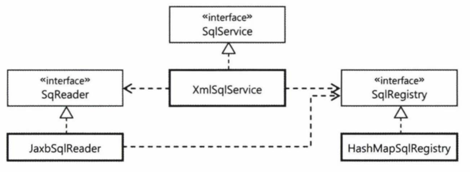

# 7.1 SQL과 DAO의 분리
UserDao의 SQL을 분리해보자. UserDao의 반복적인 JDBC 작업 흐름은 템플릿을 이용해 DAO에서 완벽하게 제거했다. 트랜잭션과 예외처리 작업도 서비스 추상화와 AOP 등을 이용해 처리했기 때문에 DAO 안에서 모두 제거할 수 있었다. 데이터 엑세스 작업을 둘러싼 다양한 코드를 책임과 성격이 다른 부분끼리 분리하고, 독립적으로 확장하거나 변경할 수 있도록 인터페이스를 이용해 연결하고, DI로 다이내믹하게 관계를 설정할 수 있도록 만들어줬다. 이렇게 해서 DAO에는 깔끔하게 다듬어진 순수한 데이터 엑세스 코드만 남게 했다. 하지만 더 분리하고 싶은게 있다. 바로 SQL이다.

SQL의 변경작업은 자주 발생한다. 어떤 이유든지 SQL 변경이 필요한 상황이면 DAO 코드가 수정될 수 밖에 없다. DAO 코드를 수정하고 컴파일하는 작업은 번거로울 뿐만 아니라 위험하다. 따라서 SQL을 분리하여 DAO 코드와 다른 파일이나 위치에 두고 관리할 수 있다면 좋을 것이다. 

### XML 설정을 이용한 분리
SQL은 문자로 되어 있으니 설정파일에 프로퍼티 값으로 정의해서 DAO에 주입해줄 수 있다. 

**개별 SQL 프로퍼티 방식**

UserDao의 JDBC 구현 클래스인 UserDaoJdbc에는 6개의 SQL 문장이 있다. 조회할 때 필드 매핑을 위해 사용하는 userMapper도 SQL은 아니지만 필드 이름을 갖고 있다. 일단 userMapper는 제외하고 순수한 SQL 문장만을 먼저 다뤄보자. 

UserDaoJdbc 클래스의 SQL 6개를 프로퍼티로 만들고 이를 XML에서 지정하도록 해보자.

```java
public class UserDaoJdbc implements UserDAO {
    private String sqlAdd;

    public void setSqlAdd(String sqlAdd) {
        this.sqlAdd = sqlAdd;
    }
}
```
> 코드 7-1

```java
public void add(User user) {
    this.jdbcTemplate.update(
        this.sqlAdd,
        user.getId(), user.getName(), user.getPassword(), user.getEmail(),
        user.getLevel().intValue(), user.getLogin(), user.getRecommend()
    );
}
```
> 코드 7-2

```java
<bean id="userDao" class="springbook.user.dao.UserDaoJdbc">
    <property name="dataSource" ref="dataSource"/>
    <property name="sqlAdd" value="insert into users(id, name, password, emial, level, login, recommend) values(?,?,?,?,?,?,?)"/>
    ...
```
> 코드 7-3

이제 SQL은 코드의 수정 없이 XML 파일만 수정하는 것으로 변경이 가능하다. 비밀번호 필드 이름이 pwd로 바뀌더라도 XML 파일만 수정하면 된다. 스프링에서 스트링 값을 DI해서 사용할 수 있기 때문에 손쉽게 SQL을 분리하는데 성공했다. 하지만 아직 아쉽다. 매번 새로운 SQL이 필요할 때마다 프로퍼티를 추가하고 DI를 위한 변수와 수정자 메서드도 만들어줘야 한다. 

**SQL 맵 프로퍼티 방식**

SQL이 점점 많아지면 그때마다 DAO에 DI용 프로퍼티를 추가하기는 귀찮다. 그래서 이번에는 SQL을 하나의 컬렉션으로 담아두는 방법을 시도해보자. 맵을 이용하면 키를 통해 SQL을 가져올 수 있다.

```java
public class UserDaoJdbc implements UserDao {
    ...
    private Map<String, String> sqlMap;

    public void setSqlMap(Map<String, String> sqlMap) {
        this.sqlMap = sqlMap;
    }
}
```
> 코드 7-4

```java
public void add(User user) {
    this.jdbcTemplate.update(
        this.sqlMap.get("add"),
        user.getId(), user.getName(), user.getPassword(), user.getEmail(),
        user.getLevel().intValue(), user.getLogin(), user.getRecommend()
    );
}
```
> 코드 7-5

Map을 주입해주기 위해서는 `<property>` 태그가 아닌 `<map>` 태그를 사용해야 한다.

```java
<bean id="userDao" class="springbook.user.dao.UserDaoJdbc">
    <property name="dataSource" ref="dataSource"/>
    <property name="sqlMap">
        <map>
            <entry key="add" value="insert into users(id, name, password, emial, level, login, recommend) values(?,?,?,?,?,?,?)"/>
            ...
        </map>
    </property>
    ...
```
> 코드 7-6

이렇게 맵으로 만들어두면 새로운 SQL이 필요할 때 entry만 추가해주면 되니 작업량도 적어지고 코드도 간단해진다. 하지만 메서드에서 SQL을 가져올 때 문자열 키를 활용하기 때문에 실수를 잡아주지 못한다. 따라서 테스트를 통해 미리미리 검증을 하는 과정이 필요하다.

### SQL 제공 서비스
스프링의 설정파일에 SQL을 두면 손쉽게 분리 할 수 있지만 적용하기엔 몇가지 문제점이 있다. 
1. 데이터 엑세스 로직의 일부인 SQL 정보를 애플리케이션 구성 정보와 함께 두는 것은 옳지 않다.
2. 스프링의 설정정보로부터 생성된 오브젝트와 정보는 애플리케이션을 다시 시작하기 전에는 변경이 어렵다. 

위의 문제를 해결하기 위해서는 결국 독립적인 SQL 제공 서비스가 필요하다. SQL 제공 기능을 본격적으로 분리해서 다양한 SQL 정보 소스를 사용할 수 있고, 운영 중에 동적으로 갱신도 가능한 유연하고 확장성이 뛰어난 SQL 서비스를 만들어보자.

**SQL 서비스 인터페이스**

가장 먼저 할 일은 SQL 서비스의 인터페이스를 설계하는 것이다. 클라이언트인 DAO를 SQL 서비스의 구현에서 독립적으로 만들도록 인터페이스를 사용하고, DI로 구현 클래스의 오브젝트를 주입해주어야 한다. SQL 서비스의 기능은 SQL에 대한 키 값을 전달하면 그에 해당하는 SQL을 돌려주는 것이다. DAO는 SQL 서비스가 어떻게 SQL을 찾아오는지에 대한 관심은 없고 오로지 적절한 키를 제공해주고 응답을 받기만 하면 된다.

```java
public interface SqlService {
    String getSql(String key) throws SqlRetrievalFailureException;
}
```
> 코드 7-7

주어진 키를 가지고 SQL을 가져오다가 실패를 하게되면 SqlRetrievalFailureException를 던지도록 정의한다. 물론 이 예외는 대개 복구가 불가능하기 때문에 RuntimeException으로 정의해둔다. 예외의 원인을 구분해야 된다면 서브클래스를 만들어 사용하면 된다. 

```java
public class SqlRetrievalFailureException extends RuntimeException {
    public SqlRetrievalFailureException(String message) {
        super(message);
    }

    public SqlRetrievalFailureException(String message, Throwable cause) {
        super(message, cause); // SQL을 가져오는데 실패한 근본 원인을 담을 수 있도록 중첩 예외를 저장할 수 있는 생성자
    }
}
```
> 코드 7-8

```java
public class UserDaoJdbc implements UserDao {
    ...
    private SqlService sqlService;

    public void setSqlService(SqlService sqlService) {
        this.sqlService = sqlService;
    }
}
```
> 코드 7-9 

SqlService 타입의 빈을 주입받을 수 있도록 프로퍼티를 추가한다. 모든 DAO에서 서비스 빈을 사용하게 만들 것이기 때문에 키 이름이 DAO별로 중복되지 않게 해야 한다. 

```java
public void add(User user) {
    this.jdbcTemplate.update(
        this.sqlService.getSql("userAdd"),
        user.getId(), user.getName(), user.getPassword(), user.getEmail(),
        user.getLevel().intValue(), user.getLogin(), user.getRecommend()
    );
}

...
```
> 코드 7-10

**스프링 설정을 사용하는 단순 SQL 서비스**

앞에서 키와 SQL을 엔트리로 갖는 맵을 빈 설정에 넣었던 방법을 SqlService에도 그대로 적용해보자.

```java
public class SimpleSqlService implements SqlService {
    private Map<String, String> sqlMap;

    public void setSqlMap(Map<String, String> sqlMap) {
        this.sqlMap = sqlMap;
    }

    public String getSql(String key) throws SqlRetrievalFailureException {
        String sql = sqlMap.get(key);
        if (sql == null) {
            throw new SqlRetrievalFailureException(key + "에 대한 SQL을 찾을 수 없습니다.");
        }
        else return sql;
    }
}
```
> 코드 7-11

simpleSqlService를 빈으로 등록하고, SQL들을 주입할 수 있도록 SimpleSqlService의 프로퍼티에 `<map>`을 이용해 등록한다.

사실 코드와 설정만 보면 앞의 방법과는 큰 차이가 없어보인다. 하지만 사실 큰 차이가 있다. 이제 UserDao를 포함한 모든 DAO들은 SQL을 어디에 저장해두고 가져오는지 신경쓰지 않아도 된다. DAO에 영향을 주지않고 다양한 방법으로 구현된 SqlService 타입 클래스를 적용할 수 있다. 

## 7.2 인터페이스의 분리와 자기참조 빈
### XML 파일 매핑
XML 설정 파일에서 `<bean>` 태그 안에 SQL 정보를 두는 것은 바람직하지 못하다. SQL을 저장해두는 전용 포맷을 가진 독립적인 파일을 이용하는 편이 바람직하다. 검색용 키와 SQL 문장 두 가지를 담을 수 있는 간단한 XML 문서를 설계해보자. 

**JAXB**

XML에 담긴 정보를 파일에서 읽어오는 방법은 다양한데, 그중 가장 간단한 방법인 JAXB를 활용해보자. JAXB의 장점은 XML 문서 정보를 거의 동일한 구조의 오브젝트로 직접 매핑해준다는 것이다. JAXB는 XML 문서의 구조를 정의한 스키마를 이용해서 매핑할 오브젝트의 클래스까지 자동으로 만들어주는 컴파일러도 제공해준다. 스키마 컴파일러를 통해 자동생성된 오브젝트에는 매핑정보가 에노테이션으로 담겨 있다. JAXB API는 에노테이션에 담긴 정보를 이용해서 XML과 매핑된 오브젝트 트리 사이의 자동변환 작업을 수행해준다. 


**SQL 맵을 위한 스키마 작성과 컴파일**
```java
<sqlmap>
    <sql key="userAdd">insert into...</sql>
    <sql key="userGet">select * from users...</sql>
</sqlmap>
```
> 코드 7-12

코드 7-12의 XML 문서의 구조를 정의하는 스키마를 만들어보자.

```java
<?xml version="1.0" encoding="UTF-8" ?>
<schema xmlns="http://www.w3.org/2001/XMLSchema"
        targetNamespace="http://www.epril.com/sqlmap"
        xmlns:tns="http://www.epril.com/sqlmap" elementFormDefault="qualified">

    <element name="sqlmap">
        <complexType>
            <sequence>
                <element name="sql" maxOccurs="unbounded" type="tns:sqlType"/>
            </sequence>
        </complexType>
    </element>

    <complexType name="sqlType">
        <simpleContent>
            <extension base="string">
                <attribute name="key" use="required" type="string"/>
            </extension>
        </simpleContent>
    </complexType>

</schema>
```
> 코드 7-13

코드 7-13은 코드 7-12의 XML 문서 구조를 정의하고 있는 XML 스키마다. 이렇게 만든 스키마 파일을 프로젝트 루트에 저장하고, JAXB 컴파일러로 컴파일해보자. 명령을 실행하면 두 개의 바인딩용 자바 클래스와 팩토리 클래스가 만들어진다. 

```java
@XmlAccessorType(XmlAccessType.FIELD)
@XmlType(name = "", propOrder = {
    "sql"
})
@XmlRootElement(name = "sqlmap")
public class Sqlmap {

    @XmlElement(required = true)
    protected List<SqlType> sql; // <sql> 태그의 정보를 담을 sqlType 오브젝트를 리스트로 갖고 있다.

    public List<SqlType> getSql() {
        if (sql == null) {
            sql = new ArrayList<SqlType>();
        }
        return this.sql;
    }
}
```
> 코드 7-14

코드 7-14는 `<sqlmap>`이 바인딩될 SqlmapType 클래스다. 

```java
@XmlAccessorType(XmlAccessType.FIELD)
@XmlType(name = "sqlType", propOrder = {
    "value"
}) 
public class SqlType {

    @XmlValue
    protected String value; // SQL 값을 저장할 스트링 타입 필드
    @XmlAttribute(name = "key", required = true)
    protected String key; // 검색용 키 스트링 타입 필드

    public String getValue() {
        return value;
    }
    
    public void setValue(String value) {
        this.value = value;
    }
    
    public String getKey() {
        return key;
    }

    public void setKey(String value) {
        this.key = value;
    }
}
```
> 코드 7-15

코드 7-15는 `<sql>` 태그의 정보를 담을 SqlType 클래스다. 

### XML 파일을 이용하는 SQL 서비스
이제 SqlService에 JAXB를 적용해보자.

**SQL 맵 XML 파일**

UserDaoJdbc에서 사용할 SQL이 담긴 XML 문서부터 만들어보자. 

```java
<?xml version="1.0" encoding="UTF-8" ?>

<sqlmap xmlns="http://www.epril.com/sqlmap"
 xmlns:xsi="http://www.w3.org/2001/XMLSchema-instance" xsi:schemaLocation="http://www.epril.com/sqlmap/sqlmap.xsd">
    <sql key="userAdd">insert into users(id, name, password, email, level, login, recommend) values(?,?,?,?,?,?,?)</sql>
    <sql key="userGet">select * from users where id = ?</sql>
    ...
</sqlmap>
```
> 코드 7-16

**XML SQL 서비스**

코드 7-16의 SQL을 가져와 DAO에 제공해주는 SqlService 인터페이스의 구현 클래스를 만들어보자. 그런데 언제 JAXB를 사용해 XML 문서를 가져올지 생각해봐야 한다. DAO가 요청할때마다 가져오는 것은 비효율적이다. 특별한 이유가 없는 한 XML 파일은 단 한번만 읽도록 해야한다. 일단은 생성자에서 읽어오도록 해보자. 그리고 읽어온 SQL들은 map에 key/value 형태로 저장하면 된다.

생성자에서 JAXB를 이용해 XML로 된 SQL문서를 읽어오고, 변환된 Sql 오브젝트들을 맵으로 옮겨서 저장해둬싿가 DAO의 요청에 따라 SQL을 찾아서 전달하는 방식으로 구현해보자.

```java
public class XmlSqlService implements SqlService {

    private final Map<String, String> sqlMap = new HashMap<>();

    public XmlSqlService() {
        String contextPath = Sqlmap.class.getPackage().getName();
        try {
            JAXBContext context = JAXBContext.newInstance(contextPath);
            Unmarshaller unmarshaller = context.createUnmarshaller();
            Sqlmap sqlmap = (Sqlmap) unmarshaller.unmarshal(getXmlFile("mapper/sqlmap.xml"));

            for (SqlType sql : sqlmap.getSql()) {
                sqlMap.put(sql.getKey(), sql.getValue());
            }
        } catch (JAXBException e) {
            throw new RuntimeException(e);
        }
    }

    @Override
    public String getSql(String key) throws SqlRetrievalFailureException {
        String sql = sqlMap.get(key);
        if (sql == null) {
            throw new SqlRetrievalFailureException(key + "를 이용해서 SQL을 찾을 수 없습니다");
        }
        return sql;
    }

    private File getXmlFile(String fileName) {
        ClassLoader classLoader = getClass().getClassLoader();
        return new File(classLoader.getResource(fileName).getFile());
    }
}
```
> 코드 7-17

이제 SQL 문장을 스프링의 빈 설정에서 완벽하게 분리하는 데 성공했다. DAO 로직이나 파라미터가 바뀌지 않는 한 SQL 내용을 변경하더라도 애플리케이션의 코드나 DI 설정을 전혀 수정할 필요가 없어졌다. 

### 빈의 초기화 작업
XmlSqlService의 코드에 개선점이 존재한다. 생성자에서 예외가 발생할 수 있는 복잡한 초기화 작업을 해주는 것은 좋지 않다. 오브젝트 생성 중에 발생하는 예외는 다루기 힘들고, 상속하기 불편하며, 보안에도 문제가 생길 수 있다. 

또 다른 문제점으로는 읽어들일 파일의 위치와 이름이 코드에 고정되어 있다는 점이다. 코드의 로직과 여타 이유로 바뀔 수 있는 가능성이 있는 내용은 외부에서 DI로 설정할 수 있게 만들어야 한다. 

먼저 파일의 이름을 외부에서 지정할 수 있도록 수정해보자. 

```java
public void setSqlmapFile(String sqlmapFile) {
    this.sqlmapFile = sqlmapFile;
}
```
> 코드 7-18 

다음은 생성자에서 수행하던 작업을 별도의 초기화 메서드를 만들어 옮긴다.

```java
public void loadSql() [
    String contextPath = Sqlmap.class.getPackage().getName();
    try {
        ...
        InputStream is = UserDao.class.getResourceAsStream(this.sqlmapFile);
    }
]
```
> 코드 7-19

그런데 초기화 메서드는 언제 실행돼야 할까? 이 XmlSqlService 오브젝트에 대한 제어권이 우리에 있다면, 생성시에 호출하면 되지만 스프링 빈이기 때문에 제어권은 스프링에게 있다. 따라서 초기화도 스프링에게 맡길 수 밖에 없다. 그래서 스프링은 미리 지정한 초기화 메서드를 생성시점에 호출해주는 기능을 제공한다.

빈 후처리기는 스프링 컨테이너가 빈을 생성한 뒤에 부가적인 작업을 수행할 수 있게 해주는 특별한 기능이다. 그 중에서 에노테이션을 이용한 빈 설정을 지원해주는 빈 후처리기가 있다. 우리가 사용할 에노테이션은 @PostConstruct이다.  스프링은 @PostConstruct 에노테이션을 빈 오브젝트의 초기화 메서드를 지정하는 데 사용한다.

@PostConstruct를 지정하면, 빈의 오브젝트를 생성하고 DI 작업을 마친 뒤 지정된 메서드를 자동으로 실행해준다. 

```java
@PostConstruct
public void loadSql() {...}
```
> 코드 7-20 

### 변화를 위한 준비:인터페이스 분리
현재 XmlSqlService는 특정 포맷의 XML에서 SQL 데이터를 가져오고, 이를 HashMap 타입의 맵 오브젝트에 저장한다. SQL을 가져오는 방법에 있어서는 특정 기술에 고정되어 있다. SQL을 가져오는 것과 보관해두고 사용하는 것은 충분히 독자적인 이유로 변경 가능한 독립적인 전략이다. 
서로 영향을 주지 않으면서 유연하게 확장 가능하도록 DI를 적용해보자.

**책임에 따른 인터페이스 정의**

가장 먼저 할일은 분리 가능한 관심사를 구분해보는 것이다. 
1. SQL 정보를 외부의 리소스로부터 읽어오는 것 
2. 읽어온 SQL을 보관해두고 있다가 필요할 때 제공해주는 것

이 외에 부가적인 책임을 생각해보면, 서비스를 위해 한번 가져온 SQL을 필요에 따라 수정할 수 있게 하는 것이다. 

이 두가지 책임을 어떻게 조합해서 사용할지 생각해보자. 기본적으로 SqlService를 구현해서 DAO에 서비스를 제공하는 오브젝트가 이 두 가지 책임을 가진 오브젝트와 협력해서 동작하도록 만들어야 한다. 변경 가능한 기능은 전략 패턴을 적용해 별도의 오브젝트로 분리해줘야 한다. 


구조는 위와 같다, Dao는 SqlService에 의존하고 있기 때문에 크게 달라질 구조는 없다. 그런데 여기서 생각해야할 부분은 SqlReader가 SQL을 읽어와 SqlRegistry에 저장하는 부분이다. 전달하는 과정과 전달되는 형식을 생각해봐야 한다. SqlReader는 SQL을 임의 리소스를 가져올 수 있기 때문에 JAXB가 제공해주는 클래스를 사용하는건 곤란하다. SQLReader라는 범용적인 인터페이스를 JAXB라는 특정 구현에 의존하도록 정의해서는 안되기 때문이다. SQLRedaer가 가져올 내용은 간단하니 간단하게 배열이나 맵 방식을 이용할 수 있다. 

SQLRedaer가 리소스로부터 읽어온 SQL 정보를 맵으로 준다고 정의하자.

```java
Map<String, String> sqls = sqlReader.readSql();
sqlRegistry.addSqls(sqls);
```
> 코드 7-21 SqlService 구현 클래스

그런데 이 방식은 한계가 보인다. SqlReader와 SqlRegistry는 각각 SQL 정보를 읽어 가져오는 방법과 이를 저장해두는 방법의 구체적인 기술과 구현으로부터 독립적으로 사용 가능하도록 인터페이스를 만들 것이다. 그런데 이 둘사이에서 정보를 전달하기 위해 일시적으로 Map 타입의 형식을 갖도록 만들어야 한다는 건 불편하다. 

이렇게 꼭 변환하는 과정이 필요할까? 발상을 조금 바꿔보자.  SqlService가 SqlReader에게 데이터를 달라고 요청하고, 다시 SqlRegistry에게 이 데이터를 사용하라고 하는 것보다는 SqlReader에게 SqlRegistry 전략을 제공해주면서 이를 이용해 SQL 정보를 SqlRegistry에 저장하라고 요청하는 것이 낫다. 

```java
sqlReader.readSql(sqlRegistry);
```
> 코드 7-22 변경된 SqlService 코드

```java
interface SqlRegistry {
    void registerSql(String key, String sql); // 레지스트리에 저장
}
```
> 코드 7-23 등록 기능을 제공하는 SqlRegistry 메서드

이렇게 만들어두면 불필요하게 SqlService 코드를 통해특정 포맷을 변환한 SQL 정보를 주고 받을 필요 없이 SqlReader가 직접 SqlRegistry에 SQL 정보를 등록할 수 있다.

오브젝트가 자신의 데이터를 이용해 어떻게 작업해야 할지 잘 알고 있기 때문에 쓸데없이 오브젝트 내부의 데이터를 외부로 노출시킬 필요는 없다.

SqlReader는 내부에 갖고 있는 SQL 정보를 형식을 갖춰서 돌려주는 대신, SqlRegistry에게 필요에 따라 등록을 요청할 때만 할용하면 된다.


여기서 SqlReader가 사용할 SqlRegistry 오브젝트를 제공해주는 건 SqlService의 코드가 담당한다. SqlRegistry가 일종의 콜백 오브젝트처럼 사용된다고 생각해도 좋다. SqlRegistry는 콜백 오브젝트이자, Sql을 검색해서 돌려주는 역할을 갖고 있기 때문에 SqlService의 의존 오브젝트이기도 하다.

**SqlRegistry 인터페이스**

```java
public interface SqlRegistry {
    void registerSql(String key, String sql);
    String findSql(String key) throws SqlNotFoundExcetion;
}
```
> 코드 7-24 SqlRegistry 인터페이스

검색의 경우 실패할 경우 코드에 버그가 있거나, 설정에 문제가 있는 복구할 가능성이 거의 없기 때문에 런타임 예외로 만들었다. 하지만 Registry가 여러개 있어서 복구를 할 수도 있기 때문에 명시적으로 던질 수 있는 예외를 선언해두는 편이 좋다.

**SqlReader 인터페이스**

```java
public interface SqlReader {
    void read(SqlRegistry sqlRegistry); 
}
```
> 코드 7-25 SqlReader 인터페이스

SqlReader는 SqlRegistry를 DI 받아서 사용하도록 만들어야 한다.

### 자기참조 빈으로 시작하기
**다중 인터페이스 구현과 간접 참조**

SqlService의 구현 클래스는 이제 SqlReader와 SqlRegistry 두 개의 프로퍼티를 DI 받을 수 있는 구조로 만들어야 한다. 일단 기존에 만들었던 XmlSqlProvider를 이 구조에 맞게 변경하자. 



인터페이스 구현은 타입을 상속하는 것이다. 인터페이스를 구현하는 경우에도 구현 클래스는 인텊에ㅣ스 타입을 그대로 물려받는다. 그 덕분에 같은 타입으로 존재하지만 다른 구현을 가진 오브젝트를 만들 수 있다는 다형성을 활용할 수 있는 것이다. 인터페이스는 한 클래스에서 하나 이상을 구현할 수 있다. XmlSqlService 클래스 하나가 SqlService, SqlReader, SqlRegistry 세 개의 인터페이스를 구현하게 만들어도 상관없다. 어차피 이 세가지 책임을 모두 갖는 클래스였으니, 구현하게 만드는 건 어렵지 않을 것이다. 

**인터페이스를 이용한 분리**

일단 XmlSqlService는 SqlService만을 구현한 클래스라고 생각하자. 그러면 SqlReader와 SqlRegistry를 의존하는 구조로 만들어야 한다. 

```java
public class XmlSqlService implements SqlService {
    private SqlRedaer sqlReader;
    private SqlRegistry sqlRegistry;

    public void ...
}
```
> 코드 7-26 SqlService의 DI 코드

이제 여기에 더 얹어서 SqlRegistry도 구현하도록 만들어보자. 

```java
public class XmlSqlService implements SqlService, SqlRegistry {
    
    private final Map<String, String> sqlMap = new HashMap<>();

    @Override
    public void registerSql(String key, String vale) {
        sqlMap.put(key, vale);
    }

    @Override
    public String findSql(String key) throws SqlNotFoundException {
        String sql = sqlMap.get(key);
        if (sql == null) {
            throw new SqlRetrievalFailureException(key + "를 이용해서 SQL을 찾을 수 없습니다");
        }
        return sql;
    }
}    
```
> 코드 7-27

sqlMap은 SqlRegistry의 일부가 됐으므로 직접 사용해서는 안된다. 다음은 SqlRedaer도 구현하도록 만들어보자. 

이제 어떻게 읽어오는지는 SqlReader의 메서드 뒤로 숨기고, 어떻게 저장해둘지는 SqlRegistry 타입 오브젝트가 알아서 처리하도록 코드륿 변경해보자.

```java
public class XmlSqlService implements SqlService, SqlRegistry, SqlReader {
    
    ...
    private String sqlMapFile;
    pulbic void setSqlmapFile(String sqlmapFile) {
        ...
    }

    public void read(SqlRegistry sqlRegistry) {
        String contextPath = Sqlmap.class.getPackage().getName();
        try {
            JAXBContext context = JAXBContext.newInstance(contextPath);
            Unmarshaller unmarshaller = context.createUnmarshaller();
            Sqlmap sqlmap = (Sqlmap) unmarshaller.unmarshal(getXmlFile(this.sqlMapFile));

            for (SqlType sql : sqlmap.getSql()) {
                sqlRegistry.registerSql(sql.getKey(),  sql.getValue()); 
            }
        } catch (JAXBException e) {
            throw new RuntimeException(e);
        }
    }
}  
```
> 코드 7-28

```java
public class XmlSqlService implements SqlService, SqlRegistry, SqlReader { 
    ...

    @PostConstruct
    public void loadSql() {
        sqlReader.read(this.sqlRegistry);
    }

    @Override
    public String getSql(String key) throws SqlRetrievalFailureException {
        try {
            return sqlRegistry.findSql(key);
        } catch (SqlNotFoundException e) {
            throw new SqlRetrievalFailureException(e);
        }
    }
}
```
> 코드 7-29 

loadSql()은 XmlSqlService의 구현 방법에 따른 메서드고, getSql()은 SqlService 인터페이스의 메서드다. XmlSalService는 SqlService와 SqlReisgtry라는 두 가지 전략을 이용하도로고 재구성됐으므로, 이 두가지 오브젝트를 활용하는 방식으로 코드를 작성하면 된다. 

**자기참조 빈 설정**

XmlSqlService 클래스 안에 혼재되어 있던 성격이 다른 코드를 세 가지 인터페이스를 구현하는 방법을 통해 서로 깔끔하게 분리해냈다. 같은 클래스 안에 구현된 내용이기는 하지만 모두 간접적으로 접근하게 했다. 이제 Xml을 통해 세 가지 빈을 주입받도록 수정하면 된다.

```java
<bean id="userService"....>
    <property name="sqlRedaer" ref="sqlService"/>
    ...
</bean>
```
> 코드 7-30

자기 자신을 참조하는 빈은 흔히 쓰이진 않는다. 책임이 다르다면 클래스 별로 분리하는게 자연스럽다. 다만 자기 참조빈을 사용하는 방법은 복잡하게 얽혀있는 것을 유연한 구조로 만드려고 할 때 처음 시도해볼 수 있는 방법이다. 일단 인터페이스를 통해 책임과 역할을 구분해두고 DI를 통해 연결해줬다면 다음 단계부터는 아주 쉽다. 

### 디폴트 의존관계
다음은 이를 완전히 분리해두고 DI로 조합해서 사용하게 만드는 단계다.


**확장 가능한 기반 클래스**

SqlRegistry와 SqlReader를 이용하는 가장 간단한 SqlService 구현 클래스를 만들어보자.

```java
public class BaseSqlService implements SqlService {
    protected SqlReader sqlReader;
    protected SqlRegistry sqlRegistry; // BaseSqlService는 상속을 통해 확장해서 사용하기에 적합하기 때문에 protected로 선언한다. 

    public void setSqlReader(SqlReader sqlReader) {
        this.sqlReader = sqlReader;
    }
    public void setSqlRegistry(SqlRegistry sqlRegistry) {
        this.sqlRegistry = sqlRegistry;
    }

    @PostConstruct
    public void loadSql() {
        sqlReader.read(this.sqlRegistry);
    }

    @Override
    public String getSql(String key) throws SqlRetrievalFailureException {
        try {
            return sqlRegistry.findSql(key);
        } catch (SqlNotFoundException e) {
            throw new SqlRetrievalFailureException(e);
        }
    }
}
```
> 코드 7-31 SqlRedaer와 SqlRegistry를 사용하는 SqlService 구현 클래스

BaseSqlService를 SqlService 빈으로 등록하고 SqlReader와 SqlRegistry를 DI 해주면 된다. 

```java
public class HashMapSqlRegistry implements SqlRegistry {

    private final Map<String, String> sqlMap = new HashMap<>();

    @Override
    public void registerSql(String key, String vale) {
        sqlMap.put(key, vale);
    }

    @Override
    public String findSql(String key) throws SqlNotFoundException {
        String sql = sqlMap.get(key);
        if (sql == null) {
            throw new SqlRetrievalFailureException(key + "를 이용해서 SQL을 찾을 수 없습니다");
        }
        return sql;
    }
}
```
> 코드 7-32 SqlRegistry 구현 클래스

코드 7-32는 SqlRegistry를 분리한 것이다.

```java
public class JaxbXmlSqlReader implements SqlReader {
    private String sqlMapFile;

    public void setSqlMapFile(String sqlMapFile) {
        this.sqlMapFile = sqlMapFile;
    }

    @Override
    public void read(SqlRegistry sqlRegistry) {
        String contextPath = Sqlmap.class.getPackage().getName();
        try {
            JAXBContext context = JAXBContext.newInstance(contextPath);
            Unmarshaller unmarshaller = context.createUnmarshaller();
            Sqlmap sqlmap = (Sqlmap) unmarshaller.unmarshal(getXmlFile(this.sqlMapFile));

            for (SqlType sql : sqlmap.getSql()) {
                sqlRegistry.registerSql(sql.getKey(), sql.getValue());
            }
        } catch (JAXBException e) {
            throw new RuntimeException(e);
        }
    }

    private File getXmlFile(String fileName) {
        ClassLoader classLoader = getClass().getClassLoader();
        return new File(classLoader.getResource(fileName).getFile());
    }
}
```
> 코드 7-33 

코드 7-33은 JAXB를 이용해 XML 파일로부터 SQL 정보를 읽어오는 코드를 SqlReader 구현 클래스로 분리시킨 것이다. xml 설정 파일에서도 자기 자신을 참조하는 것이 아닌 각각 분리시킨 클래스를 주입받도록 수정하면 된다. 

**디폴트 의존관계를 갖는 빈 만들기**

사실 이렇게 유연한 구조로 분리하면서 적어도 3개의 빈을 주입해줘야 한다는 것은 귀찮기도 하다. 이렇게 확장을 고려해서 분리하다보면 결국 의존관계 설정에 대한 부담은 감수해야 한다. 특정 의존 오브젝트가 대부분의 환경에서 거의 디폴트라고 해도 좋을 만큼 기본적으로 사용될 가능성이 있따면, 디폴트 의존관계를 갖는 빈을 만드는 것을 고려해봐야 한다. 

디폴트 의존관계란, 외부에서 DI를 받지 않는 경우 기본적으로 자동 적용되는 의존관계를 말한다. 

```java
public class DefaultSqlService extends BaseSqlService {

    public DefaultSqlService() {
        setSqlReader(new JaxbXmlSqlReader());
        setSqlRegistry(new HashMapSqlRegistry());
    }
}
```
> 코드 7-34 

코드 7-34는 미리 설정된 디폴트 의존 오브젝트를 갖는 클래스다. 생성자에서 디폴트 의존 오브젝트를 직접 만들어서 스스로 DI 해준다. 하지만 이는 테스트를 돌려보면 원하는 대로 기능이 동작하지 않는다. 왜냐하면 JaxbXmlSqlReader의 sqlmapFile 프로퍼티가 비어 있기 때문이다. 직접 의존 오브젝트를 넣어주다보니, 프로퍼티를 외부에서 직접 지정해줄 수 있는 방법이 없다. 

그렇다면 sqlmapFile도 디폴트로 넣어주는 값이 있으면 어떨까? 

```java
public class DefaultSqlService extends BaseSqlService {

    private static final String DEFAULT_SQLMAP_FILE = "mapper/sqlMapper.xml";

    public DefaultSqlService() {
        setSqlReader(new JaxbXmlSqlReader());
        setSqlRegistry(new HashMapSqlRegistry());
    }
}
```
> 코드 7-35

코드 7-35처럼 디폴트 파일 이름을 넣어주자. 테스트를 돌려보면 성공한다. 이렇게 DefaultSqlService 처럼 자주 사용될 오브젝트는 미리 지정한 디폴트 의존 오브젝트로 지정하는 것도 좋은 방법이다.

그런데 이러한 방법에는 단점이 한가지 있다. 설정을 통해 다른 구현 오브젝트를 사용하도록 해도 이 기본 오브젝트는 무조건 생성된다. 물론 대체가 되긴 하겠지만 꺼림칙하다. 하지만 장점이 있기 때문에 이러한 부담 정도는 무시할 수도 있다. 하지만 너무 많은 리소스를 소모한다면 아예 만들어지지 않는 방법을 쓸 수 있다. 

예를 들어 @PostConstruct를 통해 프로퍼티가 설정됐는지 확인하고 없는 경우 주입해주는 방식ㅇ ㅣ있다.

## 7.3 서비스 추상화 적용
JaxbXmlSqlReader는 좀 더 개선할 부분이 있다.
1. JAXB외에도 XML과 오브젝트를 매핑시킬 수 있는 기술이 있다. 필요에 따라 교체할 수 있어야 한다.
2. XML 파일을 좀 더 다양한 소스에서 가져올 수 있게 만든다. 임이의의 클래스패스나 파일 시스템 상의 절대위치 또는 HTTP 프로토콜을 통해 원격에서 가져오도록 말이다. 

### OXM 서비스 추상화
JAXB 외에도 다양한 매핑 기술이 있다.
1. Castor XML
2. JiBX
3. XmlBeans
4. Xstream

이러한 기술들을 OXM이라고도 한다. 기능이 같은 여러 기술이 나타나면 나오는 말이 있다. 바로 서비스 추상화다. 스프링은 OXM에 대해서도 서비스 추상화를 제공한다.

**OXM 서비스 인터페이스**

스프링이 제공하는 OXM 추상화 서비스 인터페이스에는 자바오브젝트를 XML로 변환하는 Marshaller와 반대로 XML을 자바오브젝트로 변환하는 Unmarshaller가 있다. SqlReader는 Unmarshaller를 이용하면 된다.

```java
public interface Unmarshaller {
	boolean supports(Class<?> clazz);
    
    Object unmarshal(Source source) throws IOException, XmlMappingException;
}
```
> 코드 7-36

XML에 대한 Source 타입의 오브젝트를 주면, 설정에서 지정한 OXM 기술을 이용해 자바오브젝트 트리로 변환하고, 루트 오브젝트를 돌려준다. OXM 기술에 따라 이를 구현한 다섯가지 구현체가 있다. 각 클래스는 해당 기술에서 필요로 하는 추가 정보를 빈 프로퍼티로 지정할 수 있게 되어 있다. 

### OXM 서비스 추상화 적용
이제 스프링의 OXM 추상화 기능을 이용하는 SqlService를 만들어보자. 이름은 OxmSqlService라 하고, SqlRegistry는 DI 받을 수 있게 만들지만 SqlReader는 스프링의 OXM 언마샬러를 이용하도록 OxmSqlService 내에 고정시켜야 한다. SQL을 읽는 방법을 OXM으로 제한해서 사용성을 극대화 하는게 목적이다.

**멤버 클래스를 참조하는 통합 클래스**

**OxmSqlService는 BaseSqlService와 유사하게 SqlRedaer 타입의 의존 오브젝트를 사용하되 이를 스태틱 멤버 클래스로 내장하고 자신만이 사용할 수 있도록 만들어보자.** 의존 오브젝트를 자신만이 사용하도록 독점하는 구조로 만드는 방법이다. 내장된 SqlReader 구현을 외부에서 사용하지 못하도록 제한하고 스스로 최적화된 구조로 만들어두는 것이다. 밖에서 볼 때는 하나의 오브젝트로 보이지만, 내부에서는 의존관계를 가진 두 개의 오브젝트가 깔끔하게 결합돼서 사용된다. 유연성은 조금 손해를 보더라도 내부적으로 낮은 겷바도를 유지한 채로 응집도가 높은 구현을 만들 때 유용하게 쓸 수 있는 방법이다.

OxmlSqlService와 OxmSqlRedaer는 구조적으로는 강하게 결합되어 있지만 논리적으로 명확하게 분리되는 구조다. 자바의 스태틱 멤버 클래스는 이런 용도로 쓰기에 적합하다. 

```java
public class OxmSqlService implements SqlService {
    
    private final OxmSqlReader sqlReader = new OxmSqlReader();
    
    @Override
    public String getSql(String key) throws SqlRetrievalFailureException {
        // TODO : implementation
        return null;
    }

    private static class OxmSqlReader implements SqlReader {
        @Override
        public void read(SqlRegistry sqlRegistry) {
            // TODO : implementation
        }
    }
}
```
> 코드 7-37

OxmSqlRedaer는 private여서 외부에서 접근할 수 없고, static 이기 때문에 DI도 할 수 없다. 이렇게 강하게 결합시키고, 확장이나 변경을 제한해두는 이유가 뭘까? 그것은 OXM을 이용하는 서비스로 최적화하기 위해서다. 하나의 클래스로 만들어두기 때문에 빈의 등록과 설정은 단순해지고 쉽게 사용할 수 있다.

OXM 서비스 추상화를 사용하려면 언마샬러를 빈으로 등록해줘야 한다. SqlService 위해 등록할 빈이 계속 늘어난다. 물론 유연한 구조는 중요한거지만, 실제로 사용할 때 불편하게 느껴질 수도 있다. 빈의 개수를 줄이고 설정을 단순하게 하는 방법에는 디폴트 설정을 두는 방법도 있다. 하지만 이 디폴트 의존 오브젝트를 만드는 것의 한계는 프로퍼티를 외부에서 지정하기 힘들다는 점이다. 그래서 디폴트 값을 지정해주는 방식을 사용했는데, 반면에 OXM을 적용하는 경우 DI 해줄게 굉장히 많기 때문에 이 방식을 고집하기에는 힘들다.

이런 경우에는 하나의 빈 설정만으로 필요한 프로퍼티 설정이 모두 가능하도록 만들 필요가 있다. 그래서 SqlService의 구현이 Sqlreader의 구체 클래스가 무엇인지도 알고, 자신의 프로퍼티를 통해 필요한 설정정보도 넘겨주고, 심지어 멤버 클래스로 소유도 하고 있는 강한 결합 구조를 만드는 방법을 사용한 것이다.


따라서 OxmSqlReader는 외부에 노출되지 않기 때문에 프로퍼티를 주입 받기 위해서는 OxmSqlService의 공개된 프로퍼티를 통해 간접적으로 DI 받아야 한다.

```java
public class OxmSqlService implements SqlService {

    private final OxmSqlReader sqlReader = new OxmSqlReader();

    public void setUnmarshaller(Unmarshaller unmarshaller) {
        this.sqlReader.setUnmarshaller(unmarshaller);
    }

    public void setSqlmapFile(String sqlmapFile) {
        this.sqlReader.setSqlmapFile(sqlmapFile);
    } // DI 받은 것을 멤버 클래스의 오브젝트에게 전달한다, 창구이다.


    @Override
    public void loadSql() {
        ...
    }

    @Override
    public String getSql(String key) throws SqlRetrievalFailureException {
        ...
    }


    private static class OxmSqlReader implements SqlReader {
        private Unmarshaller unmarshaller;
        private String sqlmapFile;

        public void setUnmarshaller(Unmarshaller unmarshaller) {
            this.unmarshaller = unmarshaller;
        }

        public void setSqlmapFile(String sqlmapFile) {
            this.sqlmapFile = sqlmapFile;
        }

        @Override
        public void read(SqlRegistry sqlRegistry) {
            ...
        }
    }
}
```
> 코드 7-38

**위임을 이용한 BaseSqlService의 재사용**

한가지 꺼림칙한 부분이 있다. loadSql()과 getSql()이라는 SqlService의 핵심 메서드 구현 코드가 BaseSqlService와 동일하다는 점이다. 

사실 이렇게 간단한 구조라면 슈퍼 클래스로 분리하는 방법은 부담스럽다. 그래서 그냥 운영해나가는 방식도 크게 문제 될 것은 없을 것 같다. 하지만 만약 코드가 복잡하고, 변경이 자주 일어난다면? 그래도 혹시 미래는 모르니 중복을 제거해보자.

이런 경우에는 위임 구조를 이용해 코드의 중복을 제거할 수도 있다. loadSql, getSql 구현은 BaseSqlService에만 두고, OxmSqlService는 일종의 설정과 기본 구성을 변경해주기 위한 어댑터 같은 개념으로 BaseSqlService의 앞에 두는 설계가 가능하다. 

위임을 위해서는 두 개의 빈을 등록하고 클라이언트의 요청을 직접 받는 빈이 주요한 내용은 뒤의 빈에게 전달해주는 구주로 만들어야 한다.

위임 구조를 위해 두가지 빈을 모두 등록하는 것은 불편한 일이다. 프록시처럼 많은 타깃에 적용할 것도 아니고, 특화된 서비스를 위해 한번만 사용할 것이기 때문에 유연한 DI는 포기하고 한 클래스로 묶는 방법을 생각해보자.


OxmSqlService는 설정을 한번에 지정하는 확장구조만 가지고, BaseSqlService가 SqlReader와 SqlRegistry를 이용해 SqlService의 기능을 구현하는 일을 하도록 위임할 것이다. 

```java
public class OxmSqlService implements SqlService {

    private final BaseSqlService sqlService = new BaseSqlService();

    @PostConstruct
    public void loadSql() {
        this.sqlService.setSqlReader(this.sqlReader);
        this.sqlService.setSqlRegistry(this.sqlRegistry);

        this.sqlService.loadSql(); // 위임한다.
    }

    @Override
    public String getSql(String key) throws SqlRetrievalFailureException {
        return sqlService.getSql(key); // 위임한다.
    }
    ...
}        
```
> 코드 7-39

### 리소스 추상화
여전히 문제가 있다. SQL 매핑 정보가 담긴 XML 파일 이름을 프로퍼티로 외부에서 지정할 수는 있지만 UserDao 클래스와 같은 클래스패스에 존재하는 파일로 제한된다는 점이다. 안타깝게도 자바에는 다양한 위치에 존재하는 리소스에 대해 단일화된 접근 인터페이스를 제공해주는 클래스가 없다. 대신 다양한 기술이 존재한다. 그렇기 때문에 이 부분도 추상화를 적용할 수 있을 것이다.

**리소스**

스프링은 자바에 존재하는 일관성 없는 리소스 접근 API를 추상화해서 Resource라는 추상화 인터페이스를 정의했다. 

```java
public interface Resource extends InputStreamSource {
	boolean exists();
	default boolean isReadable() {
		return true;
	}
	default boolean isOpen() {
		return false;
	}
	default boolean isFile() {
		return false;
	}
	URL getURL() throws IOException;
	URI getURI() throws IOException;
	File getFile() throws IOException;
	default ReadableByteChannel readableChannel() throws IOException {
		return Channels.newChannel(getInputStream());
	}
	long contentLength() throws IOException;
	long lastModified() throws IOException;
	Resource createRelative(String relativePath) throws IOException;
	@Nullable
	String getFilename();
	String getDescription();
}
```
> 코드 7-40

스프링의 거의 모든 API는 외부의 리소스 정보가 필요할 때는 항상 이 Resource를 사용한다. Resource는 스프링에서 빈이 아니라 값으로 취급되기 때문에, 매번 빈으르 등록할  필요는 없다. 

그래서 추상화를 적용하는게 문제다. 만약 빈으로 등록된다면 다양한 형태의 Resource를 DI 해주면 되는데 어떻게 해야할까?

**리소스 로더**

그래서 스프링에는 URL 클래스와 유사하게 접두어를 이용해 Resource 오브젝트를 선언하는 방법이 있다. 문자열 안에 리소스의 종류와 리소스의 위치를 함께 표현하게 해주는 것이다. 그리고 실제 Resource 타입의 오브젝트로 변환해주는 ResourceLoader를 제공한다. 

애플리케이션 컨텍스트는 리소스 로더를 구현하고 있는데, `<property>`에 Resource 타입이 등록되어 있으면 이 리소스 정보를 Resource로 변환해서 프로퍼티에 주입한다. 

```java
<bean id="sqlService">
    <property name="sqlMap" value="http:~~~">
</bean>
```
> 코드 7-41

이렇게 하면 HTTP 프로토콜도 가져올 수 있다.

## 7.4 인터페이스 상속을 통한 안전한 기능확장
원칙적으로 권장되진 않지만 운영 도중에 SQL을 변경해야할수도 있다. 지금까지 만든 클래스들은 메모리에 SQL을 담아두고 사용한다. SQL 매핑 정보를 수정해도 반영되지 않는다, 재시작해야한다. 

애플리케이션을 새로 시작하지 않고 반영하려면 어떻게 해야할까? 여기서는 기존에 설계하고 개발했던 기능이 발전돼야 할 경우 스프링 답게 접근하는 방법이 무엇인지 살펴볼 것이다.

### DI와 기능의 확장
인터페이스 분리 원칙이란, 오브젝트 그 자체로 충분히 응집도가 높은 작은 단위로 설계됐더라도, 목적과 관심이 각기 다른 클라언트가 있다면 인터페이스를 통해 이를 적절하게 분리해줄 필요가 있다는 것이다.

만약 클래스로 직접 참조를 했다면, 인터페이스 분리 원칙 자체를 적용시킬 수가 없다. 

인터페이스 분리 원칙을 적용시키면, 만약 인터페이스가 변경되더라도 그 인터페이스가 관심사가 아닌 클라이언트에는 변경이 영향이 가지 않는다. 

### 인터페이스 상속
하나의 오브젝트가 구현하는 인터페이스를 여러 개 만들어서 구분하는 이유 중의 하나는 오브젝트의 기능이 발전하는 과정에서 다른 종류의 클라이언트가 등장하기 때문이다.

인터페이스 분리 원칙이 주는 장점은 모든 클라이언트가 자신의 관심에 따른 접근 방식을 불필요한 간섭 없이 유지할 수 있다는 점이다. 그래서 클라이언트에 영향을 주지 않고 확장하거나 수정할 수 있다.

## 7.5 DI를 이용해 구현 방법 적용하기
### ConcurrentHashMap을 이용한 수정 가능한 SQL 레지스트리
HashMap으로는 멀티스레드 환경에서 동시에 수정을 시도하거나 수정과 동시에 요청하는 경우 예상하지 못한 결과가 발생할 수 있다. 그래서 Collections.synchorizedMap() 등을 이용해 외부에서 동기화해줘야 하는데, 성능에 문제가 생긴다. 

구래서 보통 동기화된 해시 데이터 조작에 최적화되도록 만들어진 ConcurrentHashMap을 사용하는 방법이 일반적이다. 

**수정 가능 SQL 레지스트리 구현**
```java
public class ConcurrentHashMapSqlRegistry implements UpdatableSqlRegistry {

    private final ConcurrentHashMap<String, String> sqls = new ConcurrentHashMap<>();

    @Override
    public void updateSql(String key, String newValue) throws SqlUpdateFailureException {
        String oldValue = sqls.get(key);
        if (oldValue == null || oldValue.equals(newValue)) {
            throw new SqlUpdateFailureException();
        }
        sqls.put(key, newValue);
    }

    @Override
    public void updateSql(Map<String, String> sqls) throws SqlUpdateFailureException {
        sqls.forEach(this::updateSql);
    }

    @Override
    public void registerSql(String key, String value) {
        sqls.put(key, value);
    }

    @Override
    public String findSql(String key) throws SqlNotFoundException {
        String value = sqls.get(key);
        if (value == null) {
            throw new SqlNotFoundException();
        }
        return value;
    }
}
```
> 코드 7-42

### 내장형 데이터베이스를 이용한 SQL 레지스트리 만들기
이번엔 ConcurrentHashMap 대신 내장형 DB를 이용해 SQL을 저장하고 수정하도록 만들어보자. ConcurrentHashMap은 저장되는 데이터 양이 많아지고 잦은 조회와 변경이 일어나는 환경이라면 한계가 있다.

직접 데이터베이스를 구축하는 것은 배보다 배꼽이 큰 경우이므로, 이런 경우에는 내장형 DB를 사용하는 것이 적당하다.

**스프링의 내장형 DB 지원 기능**

스프링은 내장형 DB를 손쉽게 이용할 수 있도록 내장형 DB 지원 기능을 제공하고 있다. 일종의 서비스 추상화 기능이다. 하지만 별도의 레이어와 인터페이스를 제공하지는 않는다. 어차피 DB 엑세스시에는 JDBC, Datasource를 이용하면 되고, 필요할 경우 스프링이 제공하는 JDBC 지원 템플릿을 활용하면 충분하기 때문이다.

대신 스프링은 내장형 DB를 초기화하는 작업을 지원하는 편리한 내장형 DB 빌더를 제공한다. 모든 준비가 끝나면 내장형 DB에 대한 Datasource를 돌려주는데, 이를 사용하면 된다. 

내장형 DB는 애플리케이션 안에서 직접 DB 종료를 할 수 있어야 하기 때문에, 이를 위해 스프링은 DataSource 인터페이스를 상속해서 
shutdown()이라는 내장형 DB용 메서드를 추가한 EmbeddedDatabase 인터페이스를 제공한다.

**내장형 DB를 이용한 SqlRegistry 만들기**

스프링에서 내장형 DB를 이용하려면 EmbeddedDatabaseBuilder를 사용하면 된다. 그런데 이 Builder는 직접 빈으로 등록한다고 바로 사용할 수 있는게 아니라 적절한 메서드를 호출해주는 초기화 코드가 필요하다. 초기화 코드가 필요하다면 팩토리 빈으로 만드는 것이 좋다.

다행히 스프링에는 팩토리 빈을 만드는 번거로운 작업을 대신해주는 전용 태그가 있다. 내장형 DB와 관련된 빈을 설정하고 등록해주는 기능이 있는 태그들은 jdbc 스키마에 정의되어 있다. jdbc 네임 스페이스를 선언해두고 간단한 전용 태그로 빈을 정의해주면 내장형 DB를 손쉽게 사용할 수 있다.

```java
<jdbc:embedded-database id="embeddedDatabase" type="HSQL">
    <jdbc:script location="classpath:schema.sql"/>
</jdbc:embedded-database>
```
> 코드 7-43

이렇게 설정하면 EmbeddedDatabase 타입 빈 오브젝트를 이용해 내장형 DB를 바로 사용할 수 있다.

그럼 이를 이용해 SqlRegistry를 만들어보자.

```java
public class EmbeddedDbSqlRegistry implements UpdatableSqlRegistry{
  SimpleJdbcTemplate jdbc;
  
  public void setDataSource(DataSource dataSource){
    jdbc= new SimpleJdbcTemplate(dataSource); } // EmbeddedDatabase 타입이 아닌 DataSource 타입.

  public void registerSql(String key, String sql){
    jdbc.update(“insert into sqlmap(key_,sql_) values(?,?)”,key,sql);}

  public String findSql(String key) throws SqlNotFoundException{
    try{
      return jdbc.queryForObject(“select sql_ from sqlmap where key_=?”, String.class,key);
    }
    catch(EmptyResultDataAccessException e){
      throw new SqlNotFoundException(key+”에 해당하는 SQL을 찾을 수 없습니다.”.e);
      }
   }

  public void updateSql(String key,String sql) throws SqlUpdateFailureException{
    int affected = jdbc.update(“update sqlmap set sql_=? where key_=?”,sql,key);
    if(affected == 0){
      throw new SqlUpdateFailureException(key+”에 해당하는 SQL을 찾을 수 없습니다.”);
    }
  }

  public void updateSql(Map<String, String> sqlmap) throws SqlUpdateFailureException{
    for(Map.Entry<String, String> entry: sqlmap.entrySet()){
      updateSql(entry.getKey(), entry.getValue());
    }
  }
}
```

**UpdatableSqlRegistry 테스트 코드의 재사용**

ConcurrentHashMapSqlRegistry와 EmbeddedDbSqlRegistry 둘 다 UpdatableRegistry 인터페이스를 구현하고 있기 때문에 테스트 내용이 중복될 가능성이 높다. 

그렇기에 기존에 만들었던 ConcurrentHashmapSqlRegistryTest의 테스트 코드를 EmbeddedDbSqlRegistry를 위한 테스트가 공유하는 방법을 찾으면 좋을 것이다.

가장 좋은 방법은 상속이다. Junit4.x를 사용하는 테스트 클래스는 상속구조로 만들 수 있다. 

ConcurrentHashmapSqlRegistryTest의 코드 중에서 테스트 대상 클래스인 ConcurrentHashmapSqlRegistry에게 직접 의존하는 코드는 sqlRegistry를 등록해주는 문장 뿐이다.

```java
public void setUp() {
    slqRegistry = new ConcuurentHashMapSqlRegistry();
}
```

따라서 이 부분만 분리하여 추상 메서드로 전환하면 된다.

```java
public void setUp() {
    sqlRegistry = createRegistry();
}

abstract protected UpdatableSqlRegistry createRegistry();
```

그리고 각 Registry 테스트들은 이를 상속하여 자신이 주입되도록 구현하면 된다. 

### 트랜잭션 적용
EmbeddedSqlRegistry는 내장형 DB를 사용하여 안전하게 SQL을 수정하도록 보장해 준다. 하지만 하나 이상의 SQL을 hashMap으로 전달받아 한 번에 수정해야 하는 경우에는 문제가 생길 수 있다. hashMap으로 SQL과 키의 쌍을 전달받은 updateSql()메소드는 한 번에 한개의 SQL을 수정해주는 같은 이름의 updateSql()메소드를 맵 안에 있는 SQL의 개수만큼 반복해서 호출하도록 되어있다.

만약 중간에 문제가 생긴다면 이미 수정한 SQL은 DB에 그대로 반영되고 예외가 발생한 SQL 부터 그 이후는 적용되지 않은 채로 작업을 마치게 된다.

따라서 트랜잭션을 적용해야한다. AOP를 이용해도 되지만 트랜잭션 경계가 DAO밖에 있지않고 제한된 오브젝트내에서 간단한 트랜잭션이 필요하기 때문에 간단히 트랜잭션 추상화 API를 사용하는게 편리하다.

**코드를 이용한 트랜잭션 적용**
```java
public class EmbeddedDbSqlRegistry implements UpdateSqlRegistry{
  SimpleJdbcTemplate jdbc;
  TransactionTemplate transactionTemplate; // jdbcTemplate과 트랜잭션을 동기화해주는 트랜잭션 템플릿 멀티스레드에서도 공유 가능

  public void setDataSource(DataSource dataSource){
    jdbc = new SimpleJdbcTemplate(dataSource);
    transactionTemplate = new TransactionTemplate( new DataSourceTransactionManager(dataSource)); // dataSource로 트랜잭션매니저를 만들고, 이를 이용해 TrasnactionTemplate을 생성
  }

// 직접 내부 클래스로 만들어지는 콜백 오브젝트 안에서 사용되는 것이라 final로 선언
  public void updateSql(final Map<String, String> sqlmap) throws SqlUpdateFailureException{
    transactionTemplate.execute(new TransactionCallbackWithoutResult() {
      protected void doInTransactionWithoutResult(TransactionStatus status){
        for(Map.Entry<String, String> entry: sqlmap.entrySet() ) {
          updateSql(entry.getKey(), entry.getValue());
        }
      }
    }); 
  }
)
```

## 7.6 스프링 3.1의 DI
**자바 언어의 변화와 스프링**

1. 에노테이션의 메타정보 할용
   
자바 코드는 바이트코드로 컴파일되어 JVM에 의해 로딩되어 실행되지만, 때론 코드가 다른 코드에 의해 데이터 취급을 받기도 한다. 자바 코드의 일부를 리플렉션 API를 이용해 코드를 분석하고 그에 따라 동작하도록 하는 스타일이 자바 5 이후로 확산되었다.

이러한 프로그래밍의 정점은 애너테이션이라고 할 수 있다. 애너테이션은 코드 실행에 직접적으로 영향을 끼치지 못하고, 인터페이스처럼 타입을 부여하는 것도 아니며, 오버라이드나 상속이 불가능하다. 대신 프레임워크가 코드의 특성을 분석할 수 있는 메타정보로써 활용된다.

에너테이션이 부여된 클래스나 메서드의 패키지, 클래스 이름, 메서드 시그니쳐, 접근제한자, 상속한 클래스나 구현 인터페이스 등을 알 수 있다. 반면에 XML은 모든 내용을 명시적으로 작성해야 하기에 번거롭다.

리팩토링의 경우, 변수 이름 하나가 바뀌어도 XML은 모두 찾아 바꿔주어야 하지만, 애너테이션은 IDE가 이를 지원해주는 장점이 있다.

하지만 애너테이션은 변경이 발생하면 새로 컴파일을 해야하지만, XML은 그렇지 않다.

2. 정책과 관례를 이용한 프로그래밍
   
에노테이션은 작성하는 코드의 양에 비해 부가적으로 얻을 수 있는 정보가 많기 때문에 일정한 패턴을 따르는 경우 관례를 부여해 명시적인 설정을 최대한 배제하면 애플리케이션의 코드가 매우 간략해진다. 간결하고 빠르게 구현이 가능하기 때문에 인기를 끌고 있다. 각각 선호하는 개발자들이 있는데, 어쨌든 스프링은 점차 에노테이션으로 메타정보를 작성하고, 미리 정해진 정책과 관례를 활용해서 간결한 코드에 많은 내용을 담을 수 있는 방식을 적극 도입하고 있다.


