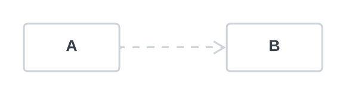
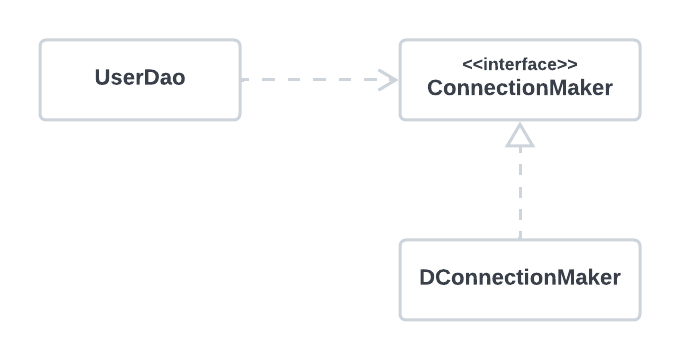

###### 1장 오브젝트와 의존관계
# 1.7. 의존관계 주입(DI)

### 의존관계           

                  

* A는 B에 의존한다
  * B의 변화가 A에 영향을 미친다.
* B는 A에 의존하지 않는다.
  * A의 변화는 B에 영향을 미치지 않는다.

<br/>
 
### UserDao의 의존관계

   

* `UserDao`는 `ConnectionMaker` 인터페이스에 의존한다.
* `UserDao`는 `DConnectionMaker`에 의존하지 않는다.
* 인터페이스를 통해 의존관계를 제한해주면 그만큼 변경에서 자유로워진다. (= 결합도가 낮다) 

<br/>

### 의존관계 주입

의존관계 주입은 구체적인 의존 오브젝트와 그것을 사용할 주체, 보통 클라이언트라고 부르는 오브젝트를 런타임 시에 연결해주는 작업을 말한다. 
* 클래스 모델이나 코드에는 런타임 시점의 의존관계가 드러나지 않는다. 그러기 위해서는 인터페이스에만 의존하고 있어야 한다. 
* 런타임 시점의 의존관계는 컨테이너나 팩토리같은 제 3의 존재가 결정한다.
* 의존관계는 사용할 오브젝트에 대한 레퍼런스를 외부에서 주입해줌으로써 만들어진다. 

주입이라는 것은 외부에서 내부로 무엇인가를 넘겨줘야 하는 것인데, 자바에서 오브젝트에 무엇인가를 넣어준다는 개념은 메소드를 실행하면서 파라미터로 오브젝트의 레퍼런스를 전달해주는 방법뿐이다. 
가장 손쉽게 사용할 수 있는 파라미터 전달이 가능한 메소드는 생성자이며, 이외에도 Setter나 일반 메소드를 이용해서 의존성을 주입해줄 수 있다. 

```java
public class UserDao {
    private ConnectionMaker connectionMaker;
    
    public UserDao(ConnectionMaker connectionMaker) {
        this.connectionMaker = connectionMaker;
    }
}
```

-----

이전 글 - [*1.6. 싱글톤 레지스트리와 오브젝트 스코프*](./1.6.%20싱글톤%20레지스트리와%20오브젝트%20스코프.md)                  
**다음 글 - [*1.8. XML을 이용한 설정*](./1.8.%20XML을%20이용한%20설정.md)**
