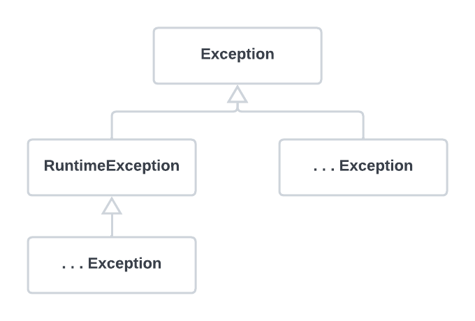

###### 4장 예외
# 4.1. 사라진 SQLException

3장에서 `JdbcContext`로 만들었던 코드를 스프링의 `JdbcTemplate`을 적용하도록 바꾸면서 달라진 것이 하나 있다. 

```java
// JdbcTemplate 적용 전
public void deleteAll() throws SQLException {
    this.jdbcContext.executeSql("delete from users");
}

// JdbcTemplate 적용 후 
public void deleteAll() {
    this.jdbcTemplate.update("delete from users");
}
```
바로 `JdbcTemplate` 적용 이전에는 있었던 `throw SQLException` 선언이 사라진 것이다. 
`JdbcTemplate`을 적용하면서 왜 `SQLException`이 사라지게 된 건지 알아보기 전에 먼저 개발자들의 코드에서 종종 발견되는 예외처리 문제점들을 살펴보자.         

<br/>

### 예외 블랙홀 

```java
try {
    ...
} catch (SQLException e) {
}
```

위 코드에서는 예외를 잡고는 아무것도 하지 않는다. 예외 발생을 무시해버리고 정상적인 상황인 것처럼 다음 라인으로 넘어가버리는건 정말 위험한 일이다. 프로그램 실행 중에 
어디선가 오류가 있어서 예외가 발생했는데 그것을 무시하고 계속 진행해버리기 때문이다. 더 큰 문제는 이로 인해 발생한 시스템 오류나 이상한 결과의 원인이 무엇인지 찾아내기가 
매우 힘들다는 점이다. 어떤 경우에도 위와 같은 코드를 만들면 안된다.                         

```java
catch (SQLException e) {
    System.out.println(e);
}
```
```java
catch (SQLException e) {
    e.printStackTrace();
}
```

위와 같은 코드도 절대 만들어서는 안된다. **예외는 처리돼야 한다.** 위와 같이 `catch` 블록을 이용해 화면에 메시지를 출력한 것은 예외를 **처리**한 게 아니다. 
모든 예외는 적절하게 복구되든지 아니면 작업을 중단시키고 운영자 또는 개발자에게 분명하게 통보돼야 한다.                              

굳이 예외를 잡아서 뭔가 조치를 취할 방버빙 없다면 잡지 말아야 한다. 메소드에 `throws SQLException`을 선언해서 메소드 밖으로 던지고 자신을 호출한 코드에 
예외처리 책임을 전가해버려라.                      

<br/>

### 무의미하고 무책임한 throws

`catch` 블록으로 예외를 잡아봐야 해결할 방법도 없고 각종 긴 이름의 예외들을 처리하는 코드를 매번 `throws`로 선언하기도 귀찮아지기 시작하면, 다음과 같이 메소드 선언에 
`throws Exception`을 기계적으로 붙이는 개발자도 있다. 

```java
public void method1() throws Exception {
    method2();
    ...
}

public void method2() throws Exception {
    method3();
    ...
}

public void method3() throws Exception {
    ...
}
```
이런 식으로 매번 `throws Exception`을 선언해버리면 의미 있는 정보를 얻을 수 없다. 정말 무엇인가 실행 중에 예외적인 상황이 발생할 수 있다는 것인지, 
아니면 그냥 습관적으로 복사해서 붙여 놓은 것인지 알 수가 없다. 결국 이런 메소드를 사용하는 메소드에서도 역시 `throws Exception`을 따라서 붙이는 수밖에 없다. 
결과적으로 적절한 처리를 통해 복구될 수 있는 예외상황도 제대로 다룰 수 있는 기회를 박탈당한다.       

<br/>

그렇다면 예외를 어떻게 다뤄야 할까? 자바에서 `throw`를 통해 발생시킬 수 있는 예외는 크게 세 가지가 있다. 

                         

* **Error**
  * `java.lang.Error` 클래스의 서브클래스
  * 시스템에 비정상적인 상황이 발생했을 경우에 사용 
  * 주로 자바 VM에서 발생시키며, 애플리케이션 코드에서 대응할 수 없다
   
* **Checked Exception**
  * `Exception` 클래스의 서브클래스이면서 `RuntimeException` 클래스를 상속하지 않은 클래스
  * 체크 예외가 발생할 수 있는 메소드를 사용할 경우 반드시 예외를 처리하는 코드를 함께 작성해야 한다 (or else 컴파일 에러 발생)

* **Unchecked Exception (Runtime Exception)**
  * `RuntimeException`을 상속한 클래스
  * 에러와 마찬가지로 예외처리를 강제하지 않는다   
  * 개발자의 부주의로 인해 발생할 수 있는 예외 


먼저 예외를 처리하는 일반적인 방법을 살펴보고 나서 효과적인 예외처리 전략을 생각해보도록 하자. 

<br/>

### 예외 복구 

첫 번째 예외처리 방법은 예외상황을 파악하고 문제를 해결해서 정상 상태로 돌려놓는 것이다. 예외로 인해 기본 작업 흐름이 불가능하면 다른 작업 흐름으로 자연스럽게 유도해주는 것이다. 
단, 에러 메시지가 사용자에게 그냥 던져지는 것은 예외 복구라고 볼 수 없다. 예외가 처리됐으면 비록 기능적으로는 예외상황으로 비쳐도 애플리케이션에서는 정상적으로 설계된 흐름을 따라 
진행돼야 한다.        

예외 처리를 강제하는 체크 예외들은 예외를 어떤 식으로든 복구할 가능성이 있는 경우에 사용한다. API를 사용하는 개발자로 하여금 예외상황이 발생할 수 있음을 인식하도록 도와주고 이에 대한 
적절한 처리를 시도해보도록 요구하는 것이다.

```java
int maxretry = MAX_RETRY;

while (maxretry -- > 0) {
    try {
        ...        // 예외가 발생할 가능성이 있는 시도
        return;    // 작업 성공
    } catch (SomeException e) {
        // 로그 출력. 정해진 시간만큼 대기
    } finally {
        // 리소스 반납. 정리 ㅈ가업
    }
} 

throw new RetryFailedException(); // 최대 재시도 횟수를 넘기면 직접 예외 발생 
```
> 재시도를 통해 예외를 복구하는 코드

<br/>

### 예외처리 회피

두 번째 방법은 예외처리를 자신이 담당하지 않고 자신을 호출한 쪽으로 던져버리는 것이다. `throws` 문으로 선언해서 예외가 발생하면 알아서 던져지게 하거나 
`catch` 문으로 일단 예외를 잡은 후에 로그를 남기고 다시 예외를 던지는 것이다. 

```java
public void add() throws SQLException {
    // JDBC API
}
```
> 예외처리 회피 1

```java
public void add() throws SQLException {
    try {
        // JDBC API
    }
    catch (SQLException e) {
        // 로그 출력
        throw e;
    }
}
```
> 에외처리 회피 2  

예외를 회피하는 것은 예외를 복구하는 것처럼 의도가 분명해야 한다. 콜백/템플릿처럼 긴밀한 관계에 있는 다른 오브젝트에게 예외처리 책임을 분명히 지게 하거나, 자신을 사용하는 
쪽에서 예외를 다루는 게 최선의 방법이라는 분명한 확신이 있어야 한다. 

<br/>

### 예외 전환

마지막으로 예외를 처리하는 방법은 발생한 예외를 적절한 예외로 전환해서 메소드 밖으로 던지는 것이다. 예외 전환은 보통 두 가지 목적으로 사용된다.            

<br/> 

**1. 의미를 분명하게 해줄 수 있는 예외로 바꿔주기 위해서** 

```java
public void add(User user) throws DuplicateUserIdException, SQLException {
    try {
        // JDBC를 이용해 user 정보를 DB에 추가하는 코드
    } carch (SQLException e) {
        if (e.getErrorCode() == MysqlErrorNumbers.ER_DUP_ENTRY) 
            throw DuplicateUserIdException();
        else throw e;
    }
}
```
보통 전환하는 예외에 원래 발생한 예외를 담아서 **중첩 예외**로 만드는 것이 좋다. 중첩 예외는 `getCause()` 메소드를 이용해서 처음 발생한 예외가 무엇인지 확인할 수 있다. 
중첩 예외는 다음과 같이 새로운 예외를 만들면서 생성자나 `initCause()` 메소드로 근본 원인이 되는 예외를 넣어주면 된다. 

```java
catch (SQLException e) {
    ...
    throw DuplicateUserIdException(e);
}
```
```java
catch (SQLException e) {
    ...
    throw DuplicateUserIdException().initCause(e);
}
```

<br/>

**2. 예외 처리를 쉽고 단순하게 만들기 위해서**

주로 예외처리를 강제하는 체크 예외를 언체크 예외인 런타임 예외로 바꾸는 경우에 예외 전환을 사용한다.            

일반적으로 체크 예외를 계속 `throws`를 사용해 넘기는 건 무의미하다. 어차피 복구가 불가능한 예외라면 가능한 한 빨리 런타임 예외로 포장해 던지게 해서 다른 계층의 메소드를 작성할 때 
불필요한 `throws` 선언이 들어가지 않도록 해줘야 한다.          

대부분의 서버환경에서는 애플리케이션 코드에서 처리하지 않고 전달된 예외들을 일괄적으로 다룰 수 있는 기능을 제공한다.
어차피 복구하지 못할 예외라면 애플리케이션 코드에서는 런타임 예외로 포장해서 던져버리고, 발생한 예외에 대한 자세한 로그를 남기는 식으로 처리하는게 바람직하다.              

<br/>

### 애플리케이션 예외 

시스템 또는 외부의 예외상황이 원인이 아니라 애플리케이션 자체의 로직에 의해 의도적으로 발생시키고, 반드시 catch해서 무엇인가 조치를 취하도록 요구하는 예외도 있다. 
이런 예외들을 일반적으로 **애플리케이션 예외**라고 한다.          

정상적인 흐름을 따르는 코드는 그대로 두고, 잔고 부족과 같은 예외 상황에서는 비즈니스적인 의미를 띤 예외를 던지도록 만드는 것이다. 이 때 사용하는 예외는 의도적으로 
**체크 예외**로 만든다. 그래서 개발자가 잊지 않고 잔고 부족처럼 자주 발생 가능한 예외상황에 대한 로직을 구현하도록 강제해주는게 좋다.          

```java
try {
    BigDecimal balance = account.withdraw(amount);
    ...
    // 정상적인 처리 결과를 출력
} catch (InsufficientBalanceException e) { // 체크 예외
    // InsufficientBalanceException에 담긴 인출 가능한 잔고금액 정보를 가져옴
    BigDecimal availFunds = e.getAvailFunds();
    ...
    // 잔고 부족 안내 메시지를 출력 
}
```

<br/>

### SQLException은 어떻게 됐나? 

지금까지 다룬 예외처리에 대한 내용은 `JdbcTemplate`을 적용하는 중에 `throws SQLException` 선언이 왜 사라졌는가를 설명하는 데 필요한 것이었다. 지금까지 
살펴본 예외처리에 관한 내용을 바탕으로, DAO에 존재하는 `SQLException`에 대해 생각해보자.               

99%의 `SQLException`은 코드 레벨에서는 복구할 방법이 없다. 더군다나 DAO 밖에서 `SQLException`을 다룰 수 있는 가능성은 거의 없다. 
따라서 가능한한 빨리 언체크/런타임 예외로 전환해줘야 한다.          

스프링의 `JdbcTemplate`은 바로 이 예외처리 전략을 따르고 있다. `JdbcTemplate` 템플릿과 콜백 안에서 발생하는 모든 `SQLException`을 런타임 예외인 
`DataAccessException`으로 포장해서 던져준다. 따라서 `JdbcTemplate`을 사용하는 `UserDao` 메소드에선 꼭 필요한 경우에만 런타임 예외인 
`DataAccessException`을 잡아서 처리하면 되고 그 외의 경우에는 무시해도 된다. 그래서 DAO 메소드에서 `SQLException`이 모두 사라진 것이다.           

그 밖에도 스프링의 API 메소드에 정의되어 있는 대부분의 예외는 런타임 예외다. 따라서 발생 가능한 예외가 있다고 하더라도 이를 처리하도록 강제하지 않는다. 

-----

**다음 글 - [*4.2. 예외 전환*](./4.2.%20예외%20전환.md)**
