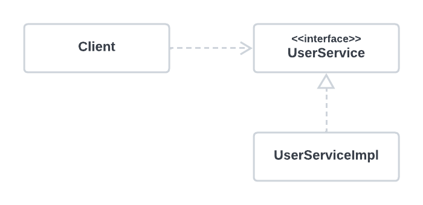

###### 6장 AOP
# 6.1. 트랜잭션 코드의 분리 

AOP는 IoC/DI, 서비스 추상화와 더불어 스프링의 3대 기반기술의 하나다. 스프링에 적용된 가장 인기 있는 AOP의 적용 대상은 바로 선언적 트랜잭션 기능이다. 
서비스 추상화를 통해 많은 근본적인 문제를 해결했던 트랜잭션 경계설정 기능을 AOP를 이용해 더욱 세련되고 깔끔한 방식으로 바꿔보자.                 

<br/>

### 메소드 분리 

지금까지 서비스 추상화 기법을 적용해 트랜잭션 기술에 독립적으로 만들어줬고, 메일 발송 기술과 환경에도 종속적이지 않은 깔끔한 코드로 다듬어온 `UserService`이지만, 
코드를 볼 때마다 여전히 찜찜한 구석이 있는 것은 어쩔 수 없다. 트랜잭션 경계설정을 위해 넣은 코드 때문이다. 
스프링이 제공하는 깔끔한 트랜잭션 인터페이스를 썼음에도 비즈니스 로직이 주인이어야 할 메소드 안에 트랜잭션 코드가 더 많은 자리를 차지하고 있다.             

트랜잭션이 적용된 서비스 코드를 다시 한번 살펴보자. 

```java
public void upgradeLevels() throws Exception {
    TransactionStatus status = this.transactionManager.getTransaction(new DefaultTransactionDefinition());
    try {
    
        /** 비즈니스 로직 start **/
        List<User> users = userDao.getAll();
        for ( User user : users) {
            if (canUpgradeLevel(user)) {
                upgradeLevel(user);
            }
        }
        /** 비즈니스 로직 end **/
        
        this.transactionManager.commit(status);
    } catch (Exception e) {
        this.transactionManager.rollback(status);
        throw e;
    }
}
```
코드를 자세히 살펴보면 다음과 같은 특징이 있음을 알 수 있다. 
* 비즈니스 로직 코드의 앞뒤로 트랜잭션 시작과 종료를 담당하는 코드가 위치하고 있어 뚜렷하게 두 가지 종류의 코드가 구분된다.                 
* 트랜잭션 경계설정 코드와 비즈니스 로직 코드 간에 서로 주고받는 정보가 없다.

즉, 이 두 가지 코드는 성격이 다를 뿐 아니라 서로 주고받는 것도 없는, 완벽하게 독립적인 코드다. 다만 이 비즈니스 로직을 담당하는 코드가 트랜잭션의 시작과 종료 작업 사이에서 
수행돼야 한다는 사항만 지켜지면 된다. 그러므로 비즈니스 로직을 담당하는 코드를 메소드로 추출해보자.              

```java
public void upgradeLevels() throws Exception {
    TransactionStatus status = this.transactionManager.getTransaction(new DefaultTransactionDefinition());
    
    try {
        upgradeLevelsInternal();
        this.transactionManager.commit(status);
    } catch (Exception e) {
        this.transactionManager.rollback(status);
        throw e;
    }
}

private void upgradeLevelsInternal() {
    List<User> users = userDao.getAll();
    for (User user : users) {
        if (canUpgradeLevel(user)) {
            upgradeLevel(user);
        }
    }
}
```
코드를 분리하고 나니 보기가 한결 깔끔해졌다. 그렇지만 여전히 트랜잭션을 담당하는 기술적인 코드가 `UserService` 안에 자리 잡고 있다. 
어차피 서로 직접적으로 정보를 주고받는 것이 없다면, 적어도 `UserService`에서는 보이지 않게 할 수 있지 않을까? 간단하게 트랜잭션 코드를 클래스 밖으로 뽑아내면 된다. 

<br/>

### DI 적용을 이용한 트랜잭션 분리 

그러나 트랜잭션 코드를 `UserService` 밖으로 빼버리면 `UserService` 클래스를 직접 사용하는 클라이언트 코드에서는 트랜잭션 기능이 빠진 `UserService`를 사용하게 될 것이다. 
구체적인 구현 클래스를 직접 참조하는 경우의 전형적인 단점이다. 
직접 사용하는 것이 문제가 된다면 간접적으로 사용하면 된다. 
DI의 기본 아이디어는 실제 사용할 오브젝트 클래스는 감춘 채 인터페이스를 통해 간접으로 접근하는 것이다.                

현재 구조는 아래와 같이 `UserService` 클래스와 그 사용 클라이언트 간의 관계가 강한 결합도로 고정되어 있다. 이 사이를 비집고 다른 무언가를 추가하기는 힘들다.                  

                    

그래서 다음과 같이 `UserService`를 인터페이스로 만들고 기존 코드는 `UserService` 인터페이스의 구현 클래스를 만들어넣도록 한다.                  

                    

그런데 보통 이렇게 인터페이스를 이용해 구현 클래스를 클라이언트에 노출하지 않고 런타임 시에 DI받아 사용하는 이유는, 일반적으로 구현 클래스를 바꿔가면서 사용하기 위해서다. 
하지만 꼭 그래야 한다는 제약은 없다. 한 번에 두 개의 `UserService` 인터페이스 구현 클래스를 동시에 이용한다면 어떨까? 지금 해결하려는 문제는 비즈니스 로직을 담고있는 코드와 
트랜잭션 경계설정을 담당하는 코드를 분리하되, 함께 사용하는 것이다. 그래서 다음과 같은 구조를 생각해볼 수 있다.                

               

`UserService`를 구현한 또 다른 구현 클래스 `UserServiceTx`를 만든다. 이 클래스는 트랜잭션의 경계설정이라는 책임을 맡고 있다. 
그리고 실제적인 비즈니스 로직 처리 작업은 `UserServce`의 또 다른 구현 클래스 `UserServiceImpl`에 위임하는 것이다. 
그 위임을 위한 호출 작업 이전과 이후에 적절한 트랜잭션 경계를 설정해주면 결국 트랜잭션이 적용된 비즈니스 로직의 구현이라는 기대하는 동작이 일어날 것이다.                

이 방법을 이용해 트랜잭션 경계설정 코드를 분리해낸 결과를 살펴보자.             

<br/>

### UserService 인터페이스 도입

먼저 기존의 `UserService` 클래스를 `UserServiceImpl`로 이름을 변경한다. 그리고 클라이언트가 사용할 로직을 담은 핵심 메소드만 `UserService` 인터페이스로 만든 후 
`UserServiceImpl`이 구현하도록 만든다.                      

```java
public interface UserService {
    void add(User user);
    void upgradeLevels();
}
```
> UserService 인터페이스

```java
public class UserServiceImpl implements UserService {
    UserDao userDao;
    MailSender mailSender;
    
    public void upgradeLevels() {
        List<User> users = userDao.getAll();
        for (User user : users) {
            if (canUpgradeLevel(user)) {
                upgradeLevel(user);
            }
        }
    }
}
```
> 트랜잭션 코드를 제거한 UserService 구현 클래스 

<br/>

### 분리된 트랜잭션 기능 

이제 비즈니스 트랜잭션 처리를 담은 `UserServiceTx`를 만들어보자. `UserServiceTx`는 기본적으로 `UserService`를 구현하게 만든다. 
그리고 같은 인터페이스를 구현한 다른 오브젝트에게 고스란히 작업을 위임하게 만들면 된다.            

```java
public class UserServiceTx implements UserService {
    UserService userService;
    
    // UserService를 구현한 다른 오브젝트를 DI 받는다.
    public void setUserService(UserService userService) {
        this.userService = userService;
    }
    
    // DI 받은 UserService 오브젝트에 모든 기능을 위임한다. 
    public void add(User user) {
        userService.add(user);
    }
    
    // DI 받은 UserService 오브젝트에 모든 기능을 위임한다. 
    public void upgradeLevels() {
        userService.upgradeLevels();
    }
}
```
> 위임 기능을 가진 UserServiceTx 클래스 

이렇게 준비된 `UserServiceTx`에 트랜잭션의 경계설정이라는 부가적인 작업을 부여해보자. 

```java
public class UserServiceTx implements UserService {
    UserService userService;
    PlatformTransactionManager transactionManager;
    
    public void setTransactionManager(PlatformTransactionManager transactionManager) {
        this.transactionManager = transactionManager;
    }
    
    public void setUserService(UserService userService) {
        this.userService = userService;
    }
    
    public void add(User user) {
        this.userService.add(user);
    }
    
    public void upgradeLevels() {
        TransactionStatus status = this.transactionManager.getTransaction(new DefaultTransactionDefinition());
        
        try {
            userService.upgradeLevels();
            
            this.transactionManager.commit(status);
        } catch (RuntimeException e) {
            this.transactionManager.rollback(status);
            throw e;
        }
    }
}
```
> 트랜잭션이 적용된 UserServiceTx

<br/>

### 트랜잭션 적용을 위한 DI 설정 

이제 남은 것은 설정파일을 수정하는 부분이다. 스프링의 DI 설정에 의해 결국 만들어질 빈 오브젝트와 그 의존관계는 다음과 같이 구성돼야 한다. 

               

다음은 이렇게 수정한 스프링 설정파일의 내용이다. 

```xml
<bean id="userService" class="springbook.user.service.UserServiceTx">
    <property name="transactionManager" ref="transactionManager" />
    <property name="userService" ref="userServiceImpl" />
</bean>

<bean id="userServiceImpl" class="springbook.user.service.UserServiceImpl">
    <property name="userDao" ref="userDao" />
</bean>
```

이제 클라이언트는 `UserServiceTx` 빈을 호출해서 사용하도록 만들어야 한다. 따라서 `userService`라는 대표적인 빈 아이디는 `UserServiceTx` 클래스로 정의된 빈에게 부여해준다. 
`userService` 빈은 `UserServiceImpl` 클래스로 정의되는, 아이디가 `userServiceImpl`인 빈을 DI하게 만든다.                  

<br/>

### 트랜잭션 분리에 따른 테스트 수정 

기본적인 분리 작업이 끝났으니 테스트를 돌려봐야 하는데, 그 전에 테스트 코드에 손볼 곳이 제법 있다. 기존의 `UserService` 클래스가 인터페이스와 두 개의 클래스로 분리된 만큼 
테스트에서도 적합한 타입과 빈을 사용하도록 변경해야 할 것이다.                  

먼저 스프링의 테스트용 컨텍스트에서 가져올 빈들을 생각해보자. 
1. 기존에는 `UserService` 클래스 타입의 빈을 `@Autowired`로 가져다가 사용했다.
2. `@Autowired`는 기본적으로 타입이 일치하는 빈을 찾아준다. 
3. `UserService`는 이제 인터페이스로 바뀌었고, 설정파일에는 `UserService` 타입을 가진 두 개의 빈이 존재한다.
4. `@Autowired`는 타입으로 하나의 빈을 결정할 수 없는 경우에 필드 이름을 이용해 빈을 찾는다. 

따라서 `UserServiceTest`에서 다음과 같은 `userService` 변수를 설정해두면 아이디가 `userService`인 빈이 주입될 것이다. 

```java
@Autowired
UserService userService;
```

`UserService`는 인터페이스로 변경했으므로 테스트 코드는 이제 구체적인 클래스 정보는 알지 못한 채로 컨테이너가 제공해주는 대표적인 `UserService` 구현 오브젝트를 
사용하게 된다.                 

그런데 `UserServiceTest`는 하나의 빈을 더 가져와야 한다. 바로 `UserServiceImpl`로 정의된 빈이다. 따라서 다음과 같이 `UserServiceImpl` 타입의 변수를 선언하고 
`@Autowired`를 지정해서 해당 클래스로 만들어진 빈을 주입받도록 한다. 그래야만 `MockMailSender`의 수정자 메소드에 접근할 수 있기 때문이다. 

```java
@Autowired
UserServiceImpl userServiceImpl;

@Test
public void upgradeLevels() throws Exception {
    ...
    MockMailSender mockMailSender = new MockMailSender();
    userServiceImpl.setMailSender(mockMailSender);
}
```

그리고 기존의 `upgradeAllOrNothing()` 메소드에 분리된 테스트 기능을 포함시킨다. 다음과 같이 `TestUserService` 오브젝트를 `UserServiceTx` 오브젝트에 
수동 DI시킨 후에 트랜잭션 기능까지 포함된 `UserServiceTx`의 메소드를 호출하면서 테스트를 수행하도록 해야 한다. 

```java
@Test
public void upgradeAllOrNothing() throws Exception {
    TestUserService testUserService = new TestUserService(users.get(3).getId());
    testUserService.setUserDao(userDao);
    testUserService.setMailSender(mailSender);
    
    UserServiceTx txUserService = new UserServiceTx();
    txUserService.setTransactionManager(transactionManager);
    txUserService.setUserService(testUserService);
    
    userDao.deleteAll();
    
    for (User user : users) {
        userDao.add(user);
    }
    
    try {
        txUserService.upgradeLevels();
        fail("TestUserServiceException expected");
    }
}
```

트랜잭션 테스트용으로 특별히 정의한 `TestUserService` 클래스는 이제 `UserServiceImpl` 클래스를 상속하도록 바꿔주면 된다. 

```java
static class TestUserService extends UserServiceImpl {
```

<br/>

### 트랜잭션 경계설정 코드 분리의 장점 
* 비즈니스 로직을 담당하는 `UserServiceImpl`의 코드를 작성할 때는 트랜잭션에 대해 신경 쓰지 않아도 된다. 
* 비즈니스 로직에 대한 테스트를 손쉽게 만들어낼 수 있다. 

-----

**다음 글 - [*6.2. 고립된 단위 테스트*](./6.2.%20고립된%20단위%20테스트.md)**
