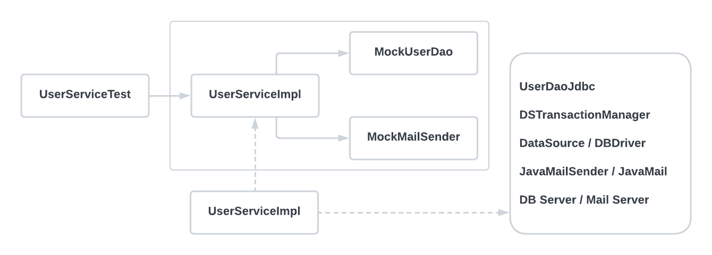

###### 6장 AOP
# 6.2. 고립된 단위 테스트

가장 편하고 좋은 테스트 방법은 가능한 한 작은 단위로 쪼개서 테스트하는 것이다. 테스트의 단위가 작으면 테스트가 실패했을 때 그 원인을 찾기 쉽기 때문이다. 
또한 테스트 단위가 작아야 테스트의 의도나 내용이 분명해지고, 만들기도 쉬워진다.              

하지만 작은 단위로 테스트하고 싶어도 그럴 수 없는 경우가 많다. 테스트 대상이 다른 오브젝트와 환경에 의존하고 있다면 작은 단위의 테스트가 주는 장점을 얻기 힘들다.              

`UserService`의 경우를 생각해보자. `UserService`는 엔터프라이즈 시스템의 복잡한 모듈과는 비교할 수 없을 만큼 간단한 기능만을 갖고 있다. 
그럼에도 `UserService`는 `UserDao`, `TransactionManager`, `MailSender`라는 세 가지 의존관계를 갖고 있다. 
따라서 그 세 가지 의존관계를 갖는 오브젝트들이 테스트가 진행되는 동안에 같이 실행된다. 더 큰 문제는 그 세 가지 의존 오브젝트도 자신의 코드만 실행하고 마는 게 아니라는 점이다. 
그래서 `UserService`라는 테스트 대상이 테스트 단위인 것처럼 보이지만 사실은 그 뒤의 의존관계를 따라 등장하는 오브젝트와 서비스, 환경 등이 모두 합쳐져 테스트 대상이 되는 것이다.           

따라서 이런 경우의 테스트는 준비하기 힘들고, 환경이 조금이라도 달라지면 동일한 테스트 결과를 내지 못할 수도 있으며, 수행 속도는 느리고 그에 따라 테스트를 작성하고 실행하는 빈도가 점차로 
떨어질 것이 분명하다. 그래서 테스트의 대상이 환경이나 외부 서버, 다른 클래스의 코드에 종속되고 영향을 받지 않도록 고립시킬 필요가 있다.                       

<br/>

### 테스트를 위한 UserServiceImpl 고립 

고립된 테스트가 가능하도록 `UserService`를 재구성해보면 다음과 같은 구조가 될 것이다.                  
                         

이제 `UserServiceImpl`에 대한 테스트가 진행될 때 사전에 테스트를 위해 준비된 동작만 하도록 만든 두 개의 목 오브젝트에만 의존하는, 
완벽하게 고립된 테스트 대상으로 만들 수 있다.                     

`UserDao`는 테스트 대상의 코드가 정상적으로 수행되도록 도와주기만 하는 스텁이 아니라, 부가적인 검증 기능까지 가진 목 오브젝트로 만들었다. 
그 이유는 고립된 환경에서 동작하는 `upgradeLevels()`의 테스트 결과를 검증할 방법이 필요하기 때문이다.               

`UserServiceImpl`의 `upgradeLevels()` 메소드는 리턴 값이 없는 `void`형이기 때문에 메소드를 실행하고 그 결과를 받아서 검증할 수가 없다. 
따라서 기존 테스트 코드에서는 `UserService`를 실행시킨 후에 `UserDao`를 이용해 DB에 들어간 결과를 가져와 검증하는 방법을 사용했다.                 

그런데 의존 오브젝트나 외부 서비스에 의존하지 않는 고립된 테스트 방식으로 만든 `UserServiceImpl`은 아무리 그 기능이 수행돼도 그 결과가 DB등을 통해서 남지 않으니, 
기존의 방법으로는 작업 결과를 검증하기 힘들다. `upgradeLevels()`처럼 결과가 리턴되지 않는 경우는 더더욱 그렇다.             

그래서 이럴 땐 테스트 대상인 `UserServiceImpl`과 `UserDao` 오브젝트에게 어떤 요청을 했는지를 확인하는 작업이 필요하다. 
테스트 중에 DB에 결과가 반영되지는 않았지만, `UserDao`의 `update()` 메소드를 호출하는 것을 확인할 수 있다면, 결국 DB에 그 결과가 반영될 것이라고 결론내릴 수 있기 때문이다. 
`UserDao`와 같은 역할을 하면서 `UserServiceImpl`과의 사이에서 주고받은 정보를 저장해뒀다가, 테스트의 검증에 사용할 수 있게 하는 목 오브젝트를 만들 필요가 있다.            

<br/>

### 고립된 단위 테스트 활용 

고립된 단위 테스트 방법을 `UserServiceTest`의 `upgradeLevels()` 테스트에 적용해보자. 우선 기존 테스트 코드의 구성을 자세히 살펴보자.               

```java
@Test
public void upgradeLevels() throws Exception {
    userDao.deleteAll();
    for (User user : users) userDao.add(user);
    
    MockMailSender mockMailSender = new MockMailSender();
    userServiceImpl.setMailSender(mockMailSender);
    
    userService.upgradeLevels();
    
    checkLevelUpgraded(users.get(0), false);
    checkLevelUpgraded(users.get(1), true);
    checkLevelUpgraded(users.get(2), false);
    checkLevelUpgraded(users.get(3), true);
    checkLevelUpgraded(users.get(4), false);
    
    List<String> request = mockMailSender.getRequests();
    assertThat(request.size(), is(2));
    assertThat(request.get(0), is(users.get(1).getEmail()));
    assertThat(request.get(1), is(users.get(3).getEmail()));
}

private void checkLevelUpgraded(User user, boolean upgraded) {
    User userUpdate = userDao.get(user.getId());
    ...
}
```
> upgradeLevels() 테스트

이 테스트는 다섯 단계의 작업으로 구성된다.            
1. 테스트 실행 중에 `UserDao`를 통해 가져올 테스트용 정보를 DB에 넣는다. 
2. 메일 발송 여부를 확인하기 위해 `MailSender` 목 오브젝트를 DI 해준다. 
3. 실제 테스트 대상인 `userService`의 메소드를 실행한다. 
4. 결과가 DB에 반영됐는지 확인하기 위해서 `UserDao`를 이용해 DB에서 데이터를 가져와 결과를 확인한다. 
5. 목 오브젝트를 통해 `UserService`에 의한 메일 발송이 있었는지를 확인하면 된다. 

처음 두 가지는 `upgradeLevels()` 메소드가 사용하는 의존 오브젝트가 테스트의 목적에 맞게 동작하도록 준비하는 과정이다. 
* 첫 번째 작업은 의존관계를 따라 마지막에 등장하는 DB를 준비
* 두 번째는 테스트를 의존 오브젝트와 서버 등에서 고립시키도록 테스트만을 위한 목 오브젝트를 준비

네 번째와 다섯 번째는 테스트 대상 코드를 실행한 후에 결과를 확인하는 작업이다. 
* 네 번째는 의존관계를 따라 결국 최종 결과가 반영된 DB의 내용을 확인
* 다섯 번째는 메일 서버까지 갈 필요 없이 목 오브젝트를 통해 `upgradeLevels()` 메소드가 실행되는 중에 메일 발송 요청이 나간 적이 있는지만 확인

<br/>

### UserDao 목 오브젝트 

실제 `UserDao`와 DB까지 직접 의존하고 있는 첫 번째와 네 번째의 테스트 방식도 목 오브젝트를 만들어서 적용해보자. 목 오브젝트는 기본적으로 스텁과 
같은 방식으로 테스트 대상을 통해 사용될 때 필요한 기능을 지원해줘야 한다.           

다음의 `UserServiceImpl` 코드를 살펴보면 `upgradeLevels()` 메소드와 그 사용 메소드에서 `UserDao`를 사용하는 경우는 두 가지다. 

```java
public void upgradeLevels() {
    List<User> users = userDao.getAll(); // 업그레이드 후보 사용자 목록을 가져온다. 
    for (User user : users) {
        if (canUpgradeLevel(user)) {
            upgradeLevel(user);
        }
    }
}

protected void upgradeLevel(User user) {
    user.upgradeLevel();
    userDao.update(user); // 수정된 사용자 정보를 DB에 반영한다.
    sendUpgradeEMail(user);
}
```
> 사용자 레벨 업그레이드 작업 중에 UserDao를 사용하는 코드

* `userDao.getAll()`
  * 레벨 업그레이드 후보가 될 사용자의 목록을 받아온다.
  * 이 메소드 기능을 지원하기 위해서 테스트용 `UserDao`에는 DB에서 읽어온 것처럼 미리 준비된 사용자 목록을 제공해줘야 한다. 
* `userDao.update(user)`
  * '업그레이드 대상자는 레벨을 변경해준다'는 핵심 로직에서 '변경'에 해당하는 부분을 검증할 수 있는 기능 

그래서 `getAll()`에 대해서는 스텁으로서, `update()`에 대해서는 목 오브젝트로서 동작하는 `UserDao` 타입의 테스트 대역이 필요하다. 
이 클래스의 이름을 `MockUserDao`라고 하자.            

`MockUserDao`의 코드는 다음과 같이 만들 수 있다. `UserServiceTest` 전용일테니 스태틱 내부 클래스로 만들면 편리하다.               

```java
static class MockUserDao implements UserDao {
    private List<User> users; // 레벨 업그레이드 후보 User 오브젝트 목록
    private List<User> updated = new ArrayList(); // 업그레이드 대상 오브젝트를 저장해둘 목록
    
    private MockUserDao(List<User> users) {
        this.users = users;
    }
    
    public List<User> getUpdated() {
        return this.updated;
    }
    
    // 스텁 기능 제공
    public List<User> getAll() {
        return this.users;
    }
    
    // 목 오브젝트 기능 제공
    public void update(User user) {
        updated.add(user);
    }
    
    // 테스트에 사용되지 않는 메소드
    public void add(User user) { throw new UnsupportedOperationException(); }
    public void deleteAll() { throw new UnsupportedOperationException(); }
    public User get(String id) { throw new UnsupportedOperationException(); }
    public int getCount() { throw new UnsupportedOperationException(); }
}
```

`MockUserDao`는 `UserDao` 구현 클래스를 대신해야 하니 당연히 `UserDao` 인터페이스를 구현해야 한다. 인터페이스를 구현하려면 인터페이스 내의 
모든 메소드를 만들어줘야 한다는 부담이 있다. `upgradeLevels()` 테스트 중에 사용할 것은 `getAll()`과 `update()` 뿐인데도 말이다.           

사용하지 않을 메소드에 대해서는 실수로 사용될 위험이 있으므로 `UnsupportedOperationException`을 던지게 해서 지원하지 않는 기능이라는 예외가 발생하도록 만드는게 좋다.                 

`MockUserDao`에는 두 개의 `User` 타입 리스트를 정의해둔다.        

하나는 생성자를 통해 전달받은 사용자 목록을 저장해뒀다가, `getAll()` 메소드가 호출되면 DB에서 가져온 것처럼 돌려주는 용도다. 
목 오브젝트를 사용하지 않을 때는 일일이 DB에 저장했다가 다시 가져와야 했지만, `MockUserDao`는 미리 준비된 테스트용 리스트를 메모리에 갖고 있다가 돌려주기만 하면 된다.                

다른 하나는 `update()` 메소드를 실행하면서 넘겨준 업그레이드 대상 `User` 오브젝트를 저장해뒀다가 검증을 위해 돌려주기 위한 것이다.           

```java
@Test
public void upgradeLevels() throws Exception {
    UserServiceImpl userServiceImpl = new UserServiceImpl(); // 고립된 테스트에서는 테스트 대상 오브젝트를 직접 생성하면 된다. 
    
    MockUserDao mockUserDao = new MockUserDao(this.users); 
    userServiceImpl.setUserDao(mockUserDao); // 목 오브젝트로 만든 UserDao를 직접 DI 해준다.
    
    MockMailSender mockMailSender = new MockMailSender();
    userServiceImpl.setMailSender(mockMailSender);
    
    userServiceImpl.upgradeLevels();
    
    List<User> updated = mockUserDao.getUpdated(); // MockUserDao로부터 업데이트 결과를 가져온다.
    assertThat(updated.size(), is(2));
    checkUserAndLevel(updated.get(0), "joytouch", Level.SILVER);
    checkUserAndLevel(updated.get(1), "madnite1", Level.GOLD);
    
    List<String> request = mockMailSender.getRequests();
    assertThat(request.size(), is(2));
    assertThat(request.get(0), is(users.get(1).getEmail()));
    assertThat(request.get(1), is(users.get(3).getEmail()));
}

private void checkUserAndLevel(User updated, String expectedId, Level expectedLevel) {
    assertThat(updated.getId(), is(expectedId));
    assertThat(updated.getLevel(), is(expectedLevel));
}
```
> MockUserDao를 사용해서 만든 고립된 테스트

테스트 대역 오브젝트를 이용해 고립된 테스트로 만들기 전의 테스트 대상은 스프링 컨테이너에서 `@Autowired`를 통해 가져온 `UserService` 타입의 빈이었다. 
컨테이너에서 가져온 `UserService` 오브젝트는 DI를 통해서 많은 의존 오브젝트와 서비스, 외부 환경에 의존하고 있었다. 이제는 완전히 고립돼서 테스트만을 위해 
독립적으로 동작하는 테스트 대상을 사용할 것이기 때문에 스프링 컨테이너에서 빈을 가져올 필요가 없다.            

`UserServiceImpl` 내의 다른 테스트들이 아직 스프링 빈을 가지고 테스트하기 때문에 테스트 클래스 설정은 그대로 뒀지만 `upgradeLevels()` 테스트만 있었다면 
스프링의 테스트 컨텍스트를 이용하기 위해 도입한 `@RunWith` 등은 제거할 수 있다.              

<br/>

### 단위 테스트와 통합 테스트 

단위 테스트의 단위는 정하기 나름이다. 중요한 것은 하나의 단위에 초점을 맞춘 테스트라는 점이다. 앞으로 `upgradeLevels()` 테스트처럼 '테스트 대상 클래스를 
목 오브젝트 등의 테스트 대역을 이용해 의존 오브젝트나 외부의 리소스를 사용하지 않도록 고립시켜서 테스트하는 것'을 **단위 테스트**라고 부르겠다.            

반면에 두 개 이상의, 성격이나 계층이 다른 오브젝트가 연동하도록 만들어 테스트하거나, 또는 외부의 DB나 파일, 서비스 등의 리소스가 참여하는 테스트는 **통합 테스트**라고 부르겠다. 
통합 테스트란 두 개 이상의 단위가 결합해서 동작하면서 테스트가 수행되는 것이라고 보면 된다.               

단위 테스트와 통합 테스트 중에서 어떤 방법을 쓸지를 결정하기 위한 몇 가지 가이드라인을 살펴보자. 

* 항상 단위 테스트를 먼저 고려한다. 
* 하나의 클래스나 성격과 목적이 같은 긴밀한 클래스 몇 개를 모아서 외부와의 의존관계를 모두 차단하고 필요에 따라 스텁이나 목 오브젝트 등의 테스트 대역을 이용하도록 테스트를 만든다. 
* 외부 리소스를 사용해야만 가능한 테스트는 통합 테스트로 만든다.
* 단위 테스트로 만들기가 어려운 코드도 있다. 대표적인게 DAO다. DAO는 DB까지 연동하는 테스트로 만드는 편이 효과적이다. 
* DAO 테스트는 DB라는 외부 리소스를 사용하기 때문에 통합 테스트로 분류된다. DAO를 테스트를 통해 충분히 검증해두면, DAO를 이용하는 코드는 DAO 역할을 스텁이나 목 오브젝트로 대체해서 테스트할 수 있다. 
* 여러 개의 단위가 의존관계를 가지고 동작할 때를 위한 통합 테스트는 필요하다. 
* 단위 테스트를 만들기가 너무 복잡하다고 판단되는 코드는 처음부터 통합 테스트를 고려해본다. 
* 스프링 테스트 컨텍스트 프레임워크를 이용하는 테스트는 통합 테스트다. 가능하면 스프링의 지원 없이 직접 코드 레벨의 DI를 사용하면서 단위 테스트를 하는게 좋겠지만 스프링의 설정 자체도 테스트 대상이고, 스프링을 이용해 좀 더 추상적인 레벨에서 테스트해야 할 경우도 종종 있다. 이럴 땐 스프링 테스트 컨텍스트 프레임워크를 이용해 통합 테스트를 작성한다. 

<br/>

단위 테스트가 많은 장점이 있고 가장 우선시해야 할 테스트 방법인 건 사실이지만 작성이 번거롭다는 점이 문제다. 특히 목 오브젝트를 만드는 일이 가장 큰 짐이다. 
`MockUserDao`를 만들 때 이야기했듯이 테스트에서는 사용하지 않는 인터페이스도 모두 일일이 구현해줘야 한다. 특히 테스트 메소드별로 다른 검증 기능이 필요하다면, 
같은 의존 인터페이스를 구현한 여러 개의 목 클래스를 선언해줘야 한다.              

다행히도, 이런 번거로운 목 오브젝트를 편리하게 작성하도록 도와주는 다양한 목 오브젝트 지원 프레임워크가 있다.         

<br/>

### Mockito 프레임워크 

Mockito와 같은 목 프레임워크의 특징은 목 클래스를 일일이 준비해둘 필요가 없다는 점이다. 간단한 메소드 호출만으로 다이내믹하게 특정 인터페이스를 구현한 테스트용 목 오브젝트를 만들 수 있다.             

`UserDao` 인터페이스를 구현한 테스트용 목 오브젝트는 다음과 같이 Mockito의 스태틱 메소드를 한 번 호출해주면 만들어진다. 

```java
UserDao mockUserDao = mock(UserDao.class);
```

여기에 `getAll()` 메소드가 불려올 때 사용자 목록을 리턴하도록 스텁 기능을 추가해준다. 

```java
when(mockUserDao.getAll()).thenReturn(this.users); // mockUserDao.getAll()이 호출됐을 때 users 리스트를 리턴    
```        

다음은 `update()` 호출이 있었는지를 검증하는 부분이다. Mockito를 통해 만들어진 목 오브젝트는 메소드의 호출과 관련된 모든 내용을 자동으로 저장해두고, 
이를 간단한 메소드로 검증할 수 있게 해준다. 

```java
verify(mockUserDao, times(2)).update(any(User.class)); // 테스트를 진행하는 동안 mockUserDao의 update() 메소드가 두 번 호출됐는지 확인
```

Mockito 목 오브젝트는 다음의 네 단계를 거쳐서 사용하면 된다. 두 번째와 네 번째는 각각 필요할 경우에만 사용할 수 있다. 
* 인터페이스를 이용해 목 오브젝트를 만든다.
* 목 오브젝트가 리턴할 값이 있으면 이를 지정해준다. 메소드가 호출되면 예외를 강제로 던지게 만들 수도 있다. 
* 테스트 대상 오브젝트에 DI해서 목 오브젝트가 테스트 중에 사용되도록 만든다.
* 테스트 대상 오브젝트를 사용한 후에 목 오브젝트의 특정 메소드가 호출됐는지, 어떤 값을 가지고 몇 번 호출됐는지를 검증한다. 

다음은 Mockito를 이용해 만든 테스트 코드다. 

```java
@Test
public void mockUpgradeLevels() throws Exception {
    UserServiceImpl userServiceImpl = new UserServiceImpl();
    
    UserDao mockUserDao = mock(UserDao.class);
    when(mockUserDao.getAll()).thenReturn(this.users);
    userServiceImpl.setUserDao(mockUserDao);
    
    MailSender mockMailSender = mock(MailSender.class);
    userServiceImpl.setMailSender(mockMailSender);
    
    userServiceImpl.upgradeLevels();
    
    verify(mockUserDao, times(2)).update(any(User.class));
    verify(mockUserDao, times(2)).update(any(User.class));
    verify(mockUserDao).update(users.get(1));
    assertThat(users.get(1).getLevel(), is(Level.SILVER));
    verify(mockUserDao).update(users.get(3));
    assertThat(users.get(3).getLevel(), is(Level.GOLD));
    
    ArgumentCaptor<SimpleMailMessage> mailMessageArg = ArgumentCaptor.forClass(SimpleMailMessage.class);
    verify(mockMailSender, times(2)).send(mailMessageArg.capture()); // 파라미터를 정밀하게 검사하기 위해 캡처할 수도 있다. 
    List<SimpleMailMessage> mailMessages = mailMessageArg.getAllValues();
    assertThat(mailMessages.get(0).getTo()[0], is(users.get(1).getEmail()));
    assertThat(mailMessages.get(1).getTo()[0], is(users.get(3).getEmail()));
}
```

-----

이전 글 - [*6.1. 트랜잭션 코드의 분리*](./6.1.%20트랜잭션%20코드의%20분리.md)                    
**다음 글 - [*6.3. 다이내믹 프록시와 팩토리 빈*](./6.3.%20다이내믹%20프록시와%20팩토리%20빈.md)**
