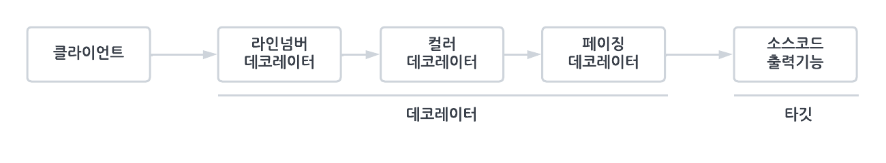
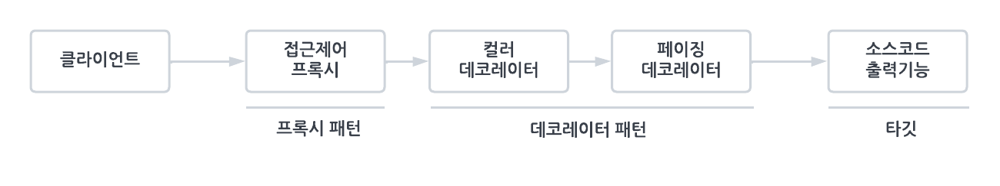

###### 6장 AOP
# 6.3. 다이내믹 프록시와 팩토리 빈

트랜잭션 경계설정 코드를 비즈니스 로직 코드에서 분리해낼 때 적용했던 기법을 다시 검토해보자.                 

단순히 확장성을 고려해서 한 가지 기능을 분리한다면 전형적인 전략 패턴을 사용하면 된다. 트랜잭션 기능에는 추상화 작업을 통해 이미 전략 패턴이 적용되어 있다. 하지만 
전략 패턴으로는 트랜잭션 기능의 구현 내용을 분리해냈을 뿐이고, 트랜잭션을 적용한다는 사실은 코드에 그대로 남아 있다.          

트랜잭션이라는 기능은 사용자 관리 비즈니스 로직과는 성격이 다르기 때문에 아예 그 적용 사실 자체를 밖으로 분리할 수 있다. 그렇게 `UserServiceTx`를 만들었고, 
`UserServiceImpl`에는 트랜잭션 관련 코드가 하나도 남지 않게 됐다.                 

이렇게 분리된 부가기능을 담은 클래스는 중요한 특징이 있다. 부가기능 외의 나머지 모든 기능은 핵심기능을 가진 클래스로 위임해줘야 한다. 핵심기능은 부가기능을 가진 
클래스의 존재를 모른다. 따라서 부가기능이 핵심기능을 사용하는 구조가 된다.            

문제는 이렇게 구성했더라도 클라이언트가 핵심기능을 가진 클래스를 직접 사용해버리면 부가기능이 적용될 기회가 없다는 점이다. 그래서 부가기능은 마치 자신이 핵심기능을 가진 
클래스인 것처럼 꾸며서, 클라이언트가 자신을 거쳐 핵심기능을 사용하도록 만들어야 한다. 그러기 위해서는 클라이언트는 인터페이스를 통해서만 핵심기능을 사용하게 하고, 부가기능 자신도 
같은 인터페이스를 구현한 뒤에 자신이 그 사이에 끼어들어야 한다.            

부가기능 코드에서는 핵심기능으로 요청을 위임해주는 과정에서 자신이 가진 부가적인 기능을 적용해줄 수 있다. 
비즈니스 로직 코드에 트랜잭션 기능을 부여해주는 것이 바로 그런 대표적인 경우다.             

이렇게 마치 자신이 클라이언트가 사용하려고 하는 실제 대상인 것처럼 위장해서 클라이언트의 요청을 받아주는 것을 대리자, 대리인과 같은 역할을 한다고 해서 **프록시**<sup>proxy</sup>라고 부른다. 
그리고 프록시를 통해 최종적으로 요청을 위임받아 처리하는 실제 오브젝트를 **타깃**<sup>target</sup> 또는 **실체**<sup>real subject</sup>라고 부른다.             

#### 프록시의 특징
* 타깃과 같은 인터페이스를 구현
* 프록시가 타깃을 제어할 수 있다

#### 프록시의 사용목적 
* 클라이언트가 타깃에 접근하는 방법을 제어하기 위해
* 타깃에 부가적인 기능을 부여해주기 위해

<br/>

### 데코레이터 패턴 

데코레이터 패턴은 타깃에 부가적인 기능을 런타임 시 다이내믹하게 부여해주기 위해 프록시를 사용하는 패턴을 말한다. 이 패턴의 이름이 데코레이터라고 불리는 이유는 마치 제품이나 케익 등을 
여러 겹으로 포장하고 그 위에 장식을 붙이는 것처럼 실제 내용물은 동일하지만 부가적인 효과를 부여해줄 수 있기 때문이다. 따라서 데코레이터 패턴에서는 프록시가 꼭 한 개로 제한되지 않는다. 
프록시가 직접 타깃을 사용하도록 고정시킬 필요도 없다. 데코레이터 패턴에서는 같은 인터페이스를 구현한 타겟과 여러 개의 프록시를 사용할 수 있다. 프록시가 여러 개인 만큼 순서를 정해서 
단계적으로 위임하는 구조로 만들면 된다.                     

                         

프록시로서 동작하는 각 데코레이터는 위임하는 대상에도 인터페이스로 접근하기 때문에 자신이 최종 타깃으로 위임하는지, 아니면 다음 단계의 데코레이터 프록시로 위임하는지 알지 못한다. 
그래서 데코레이터의 다음 위임 대상은 인터페이스로 선언하고 생성자나 수정자 메소드를 통해 위임 대상을 외부에서 런타임 시에 주입받을 수 있도록 만들어야 한다.                

`UserService` 인터페이스를 구현한 타깃인 `UserServiceImpl`에 트랜잭션 부가기능을 제공해주는 `UserServiceTx`를 추가한 것도 데코레이터 패턴을 적용한 것이라고 볼 수 있다. 
이 경우는 수정자 메소드를 이용해 데코레이터인 `UserServiceTx`에 위임할 타깃인 `UserServiceImpl`을 주입해줬다.             

인터페이스를 통한 데코레이터 정의와 런타임 시의 다이내믹한 구성 방법은 스프링 DI를 이용하면 편리하다. 데코레이터 빈의 프로퍼티로 같은 인터페이스를 구현한 다른 데코레이터 또는 타깃 빈을 
설정하면 된다.             

```xml
<!-- 데코레이터 -->
<bean id="userService" class="springbook.user.service.UserServiceTx">
    <property name="transactionManager" ref="transactionManager" />
    <property name="userService" ref="userServiceImpl" />
</bean>

<!-- 타깃 -->
<bean id="userServiceImpl" class="springbook.user.service.UserServiceImpl">
    <property name="userDao" ref="userDao" />
    <property name="mailSender" ref="mailSender" />
</bean>
```
> 데코레이터 패턴을 위한 DI 설정

데코레이터 패턴은 인터페이스를 통해 위임하는 방식이기 때문에 어느 데코레이터에서 타깃으로 연결될지 코드 레벨에선 미리 알 수 없다. `UserServiceTx`도 `UserService`라는 인터페이스를 통해 
다음 오브젝트로 위임하도록 되어 있지 `UserServiceImpl`이라는 특정 클래스로 위임하도록 되어 있지 않다.             

데코레이터 패턴은 타깃의 코드를 손대지 않고, 클라이언트가 호출하는 방법도 변경하지 않은 채로 새로운 기능을 추가할 때 유용한 방법이다. 

<br/>

### 프록시 패턴

* **일반적인 프록시** - 클라이언트와 사용 대상 사이에 대리 역할을 맡은 오브젝트를 두는 방법 
* **디자인 패턴에서의 프록시** - 프록시를 사용하는 방법 중에서 타깃에 대한 접근 방법을 제어하려는 목적을 가진 경우

프록시 패턴의 프록시는 타깃의 기능을 확장하거나 추가하지 않는다. 대신 클라이언트가 타깃에 접근하는 방식을 변경해준다.                    

타깃 오브젝트를 생성하기가 복잡하거나 당장 필요하지 않은 경우에는 꼭 필요한 시점까지 오브젝트를 생성하지 않는 편이 좋다. 그런데 타깃 오브젝트에 대한 레퍼런스가 미리 필요할 수 있다. 
이럴 때 프록시 패턴을 적용하면 된다. 

1. 클라이언트에게 타깃에 대한 레퍼런스를 넘겨야 할 때, 실제 타깃 오브젝트를 만드는 대신 프록시를 넘겨준다. 
2. 프록시의 메소드를 통해 타깃을 사용하려고 시도하면, 그 때 프록시가 타깃 오브젝트를 생성하고 요청을 위임해준다. 

#### 언제 사용하나
* 레퍼런스는 갖고 있지만 끝까지 사용하지 않거나 많은 작업이 진행된 후에 사용되는 경우
* 원격 오브젝트를 이용하는 경우
* 타깃에 대한 접근제어가 필요할 때
  * 수정 가능한 오브젝트가 있는데, 특정 레이어로 넘어가서는 읽기전용으로만 동작하도록 강제
  * `Collection`의 `unmodifiableCollection()`을 통해 만들어지는 오브젝트 (전형적인 접근권한 제어용 프록시)  

이렇게 프록시 패턴은 타깃의 기능 자체에는 관여하지 않으면서 접근하는 방법을 제어해주는 프록시를 이용하는 것이다. 구조적으로 보자면 프록시와 데코레이터는 유사하다. 
다만 프록시는 코드에서 자신이 만들거나 접근할 타깃 클래스 정보를 알고 있는 경우가 많다.               

다음은 프록시 패턴과 데코레이터 패턴을 함께 적용한 예다. 두 가지 모두 프록시의 기본 원리대로 타깃과 같은 인터페이스를 구현해두고 위임하는 방식으로 만들어져 있다.                    

                   

앞으로는 타깃과 동일한 인터페이스를 구현하고 클라이언트와 타깃 사이에 존재하면서 기능의 부가 또는 접근 제어를 담당하는 오브젝트를 모두 프록시라고 부르겠다. 

<br/>

### 프록시의 구성과 프록시 작성의 문제점

프록시는 기존 코드에 영향을 주지 않으면서 타깃의 기능을 확장하거나 접근 방법을 제어할 수 있는 유용한 방법이다. 그럼에도 불구하고 프록시를 만드는 일은 상당히 번거롭게 느껴진다.                

프록시는 다음의 두 가지 기능으로 구성된다.  

* 타깃과 같은 메소드를 구현하고 있다가 메소드가 호출되면 타깃 오브젝트로 위임한다.
* 지정된 요청에 대해서는 부가기능을 수행한다. 

트랜잭션 부가기능을 위해 만든 `UserTx`는 기능 부가를 위한 프록시다. 다음의 `UserTx` 코드에서 위임과 부가작업이라는 이 두 가지 역할을 구분할 수 있다. 

```java
public class UserServiceTx implements UserService {
    UserService userService; // 타깃 오브젝트
    ...
    
    public void add(User user) {
        this.userService.add(user); // 메소드 구현과 위임 
    }
    
    public void upgradeLevels() {
        TransactionStatus status = this.transactionManager.getTransaction(new DefaultTransactionDefinition()); 
        try {
            userService.upgradeLevels(); // 위임
            
            this.transactionManager.commit(status); 
        } catch (RuntimeException e) {
            this.transactionMapper.rollback(status);
            throw e;
        }
    }
}
```

그렇다면 프록시를 만들기가 번거로운 이유는 무엇일까? 역시 두 가지 이유를 찾아볼 수 있다. 

* 타깃의 인터페이스를 구현하고 위임하는 코드를 작성하기가 번거롭다. 
  * 부가기능이 필요없는 메소드도 구현해서 타깃으로 위임하는 코드를 일일이 만들어줘야 한다. 
* 부가기능 코드가 중복될 가능성이 많다. 
  * 트랜잭션 기능을 제공하는 유사한 코드가 여러 메소드에 중복돼서 나타날 것이다. 

두 번째 문제인 부가기능의 중복 문제는 중복되는 코드를 분리해서 어떻게든 해결해보면 될 것 같지만, 첫 번째 문제인 인터페이스 메소드의 구현과 위임 기능 문제는 간단해 보이지 않는다. 
바로 이런 문제를 해결하는 데 유용한 것이 바로 JDK의 다이내믹 프록시다.             

<br/>

### 리플렉션 

다이내믹 프록시는 리플렉션 기능을 이용해서 프록시를 만들어준다. 리플렉션은 자바의 코드 자체를 추상화해서 접근하도록 만든 것이다.              

다음과 같이 만들어진 간단한 스트링 타입의 오브젝트가 있다고 하자. 

```java
String name = "Spring";
```

이 스트링의 길이를 알고 싶으면 String 클래스의 `length()` 메소드를 호출하면 된다.            

자바의 모든 클래스는 그 클래스 자체의 구성정보를 담은 `Class` 타입의 오브젝트를 하나씩 갖고 있다. '클래스이름.class'라고 하거나 오브젝트의 `getClass()` 메소드를 호출하면 
클래스 정보를 담은 `Class` 타입의 오브젝트를 가져올 수 있다.                 

리플렉션 API 중에서 메소드에 대한 정의를 담은 `Method`라는 인터페이스를 이용해 메소드 호출하는 방법을 살펴보자. 클래스 정보에서 특정 이름을 가진 메소드 정보를 가져올 수 있다. 
`String`의 `length()` 메소드라면 다음과 같이 하면 된다. 

```java
Method lengthMethod = String.class.getMethod("length");
```

스트링이 가진 메소드 중에서 "length"라는 이름을 갖고 있고, 파라미터는 없는 메소드의 정보를 가져오는 것이다. `java.lang.reflect.Method` 인터페이스는 메소드에 대한 자세한 
정보를 담고 있을 뿐만 아니라, 이를 이용해 특정 오브젝트의 메소드를 실행시킬 수도 있다. `Method` 인터페이스에 정의된 `invoke()` 메소드를 사용하면 된다. `invoke()` 메소드는 
메소드를 실행시킬 대상 오브젝트(obj)와 파라미터 목록(args)을 받아 메소드를 호출한 뒤 그 결과를 `Object` 타입으로 돌려준다. 

```java
public Object invoke(Object obj, Object... args)
```

`Method`를 이용해 메소드를 호출하는 방법을 익히기 위해서 간단한 학습 테스트를 만들어보자. 

```java
public class ReflectionTest {
    @Test
    public void invokeMethod() throws Exception {
        String name = "Spring";
        
        // length()
        assertThat(name.length(), is(6));
        
        Method lengthMethod = String.class.getMethod("length");
        assertThat((Integer)lengthMethod.invoke(name), is(6));
        
        // charAt()
        assertThat(name.charAt(0), is('S'));
        
        Method charAtMethod = String.class.getMethod("charAt", int.class);
        assertThat((Character)charAtMethod.invoke(name, 0), is('S'));
    }
}
```
`String` 클래스의 `length()` 메소드와 `charAt()` 메소드를 코드에서 직접 호출하는 방법과, `Method`를 이용해 리플렉션 방식으로 호출하는 방식을 비교한 것이다. 

</br>

### 프록시 클래스 

다이내믹 프록시를 이용한 프록시를 만들어보자. 프록시를 적용할 간단한 타깃 클래스와 인터페이스를 다음과 같이 정의하자. 

```java
interface Hello {
    String sayHello(String name);
    String sayHi(String name);
    String sayThankYou(String name);
}
```
> Hello 인터페이스

```java
public class HelloTarget implements Hello {
    public String sayHello(String name) {
        return "Hello " + name;
    }
    
    public String sayHi(String name) {
        return "Hi " + name;
    }
    
    public String sayThankYou(String name) {
        return "Thank You " + name;
    }
}
```
> 타깃 클래스 

이제 `Hello` 인터페이스를 통해 `HelloTarget` 오브젝트를 사용하는 클라이언트 역할을 하는 간단한 테스트를 만들자. 

```java
@Test
public void simpleProxy() {
    Hello hello = new HelloTarget(); // 타깃은 인터페이스를 통해 접근하는 습관을 들이자.
    assertThat(hello.sayHello("Toby"), is("Hello Toby"));
    assertThat(hello.sayHi("Toby"), is("Hi Toby"));
    assertThat(hello.sayThankYou("Toby"), is("Thank You Toby"));
}
```
> 클라이언트 역할의 테스트

이제 `Hello` 인터페이스를 구현한 프록시를 만들어보자. 프록시에는 데코레이터 패턴을 적용해서 타깃인 `HelloTarget`에 부가기능을 추가하겠다. 추가할 기능은 
리턴하는 문자를 모두 대문자로 바꿔주는 것이다. 

```java
public class HelloUppercase implements Hello {
    Hello hello; // 위임할 타깃 오브젝트
    
    public HelloUppercase(Hello hello) {
        this.hello = hello;
    }
    
    public String sayHello(String name) {
        return hello.sayHello(name).toUpperCase(); // 위임과 부가기능 적용
    }
    
    public String sayHi(String name) {
        return hello.sayHi(name).toUpperCase();
    }
    
    public String sayThankYou(String name) {
        return hello.sayThankYou(name).toUpperCase();
    }
}
```
> 프록시 클래스


```java
Hello proxiedHello = new HelloUppercase(new HelloTarget()); // 프록시를 통해 타깃 오브젝트에 접근하도록 구성한다. 
assertThat(proxiedHello.sayHello("Toby"), is("HELLO TOBY"));
assertThat(proxiedHello.sayHi("Toby"), is("HI TOBY"));
assertThat(proxiedHello.sayThankYou("Toby"), is("THANK YOU TOBY"));
```
> HelloUppercase 프록시 테스트

이 프록시는 프록시 적용의 일반적인 문제점 두 가지를 모두 갖고 있다. 인터페이스의 모든 메소드를 구현해 위임하도록 코드를 만들어야 하며, 부가기능인 리턴 값을 대문자로 바꾸는 
기능이 모든 메소드에 중복돼서 나타난다. 

<br/>

### 다이내믹 프록시 적용 

클래스로 만든 프록시인 `HelloUppercase`를 다이내믹 프록시를 이용해 만들어보자.                   

다이내믹 프록시는 프록시 팩토리에 의해 런타임 시 다이내믹하게 만들어지는 오브젝트다. 다이내믹 프록시 오브젝트는 타깃의 인터페이스와 같은 타입으로 만들어진다. 클라이언트는 다이내믹 프록시 
오브젝트를 타깃 인터페이스를 통해 사용할 수 있다. 이 덕분에 프록시를 만들 때 인터페이스를 모두 구현해가면서 클래스를 정의하는 수고를 덜 수 있다. 프록시 팩토리에게 인터페이스 정보만 
제공해주면 해당 인터페이스를 구현한 클래스의 오브젝트를 자동으로 만들어주기 때문이다.                

다이내믹 프록시가 인터페이스 구현 클래스의 오브젝트는 만들어주지만, 프록시로서 필요한 부가기능 제공 코드는 직접 작성해야 한다. 부가기능은 프록시 오브젝트와 독립적으로 `InvocationHandler`를 
구현한 오브젝트에 담는다. `InvocationHandler` 인터페이스는 다음과 같은 메소드 한 개만 가진 간단한 인터페이스다.           

```java
public Object invoke(Object proxy, Method method, Object[] args)
```

다이내믹 프록시 오브젝트는 클라이언트의 모든 요청을 리플렉션 정보로 변환해서 `InvocationHandler` 구현 오브젝트의 `invoke()` 메소드로 넘기는 것이다. 타깃 인터페이스의 모든 메소드 요청이 
하나의 메소드로 집중되기 때문에 중복되는 기능을 효과적으로 제공할 수 있다.             

남은 것은 각 메소드 요청을 어떻게 처리할지 결정하는 일이다. 리플렉션으로 메소드와 파라미터 정보를 모두 갖고 있으므로 타깃 오브젝트의 메소드를 호출하게 할 수도 있다. `InvocationHandler` 
구현 오브젝트가 타깃 오브젝트 레퍼런스를 갖고 있다면 리플렉션을 이용해 간단히 위임 코드를 만들어낼 수 있다.           

`Hello` 인터페이스를 제공하면서 프록시 팩토리에게 다이내믹 프록시를 만들어달라고 요청하면 `Hello` 인터페이스의 모든 메소드를 구현한 오브젝트를 생성해준다. `InvocationHandler` 인터페이스를 
구현한 오브젝트를 제공해주면 다이내믹 프록시가 받는 모든 요청을 `InvocationHandler`의 `invoke()` 메소드로 보내준다. `Hello` 인터페이스의 메소드가 아무리 많더라도 `invoke()` 메소드 하나로 
처리할 수 있다.               

다이내믹 프록시를 만들어보자. 먼저 다이내믹 프록시로부터 메소드 호출 정보를 받아서 처리하는 `InvocationHandler`를 만들어보자. 다음은 `HelloUppercase` 클래스와 마찬가지로 모든 요청을 타깃에 
위임하면서 리턴 값을 대문자로 바꿔주는 부가기능을 가진 `InvocatopnHandler` 구현 클래스다.        

```java
public class UppercaseHandler implements InvocationHandler {
    Hello target;
    
    public UppercaseHandler(Hello target) {
        this.target = target;
    }
    
    public Object invoke(Object proxy, Method method, Object[] args) throws Trowable {
        String ret = (String)method.invoke(target, args);
        return ret.toUpperCase(); 
    }
}
```

다이내믹 프록시로부터 요청을 전달받으려면 `InvocationHandler`를 구현해야 한다. 메소드는 `invoke()` 하나뿐이다. 다이내믹 프록시가 클라이언트로부터 받는 모든 요청은 `invoke()` 메소드로 
전달된다. 다이내믹 프록시를 통해 요청이 전달되면 리플렉션 API를 이용해 타깃 오브젝트의 메소드를 호출한다. 타깃 오브젝트의 메소드 호출이 끝났으면 프록시가 제공하려는 부가기능인 리턴 값을 
대문자로 바꾸는 작업을 수행하고 결과를 리턴한다. 리턴된 값은 다이내믹 프록시가 받아서 최종적으로 클라이언트에게 전달한다.           

이제 이 `InvocationHandler`를 사용하고 `Hello` 인터페이스를 구현하는 프록시를 만들어보자. 

```java
Hello proxiedHello = (Hello)Proxy.newProxyInstance(
        getClass().getClassLoader(),
        new Class[] { Hello.class },
        new UppercaseHandler(new HelloTarget()));
);
```
> 프록시 생성

<br/>

### 트랜잭션 InvocationHandler


이제 `UserServiceTx`를 다이내믹 프록시 방식으로 변경해보자. `UserServiceTx`는 서비스 인터페이스의 메소드를 모두 구현해야 하고 트랜잭션이 필요한 메소드마다 트랜잭션 처리코드가 
중복돼서 나타나는 비효율적인 방법으로 만들어져 있다. 따라서 트랜잭션 부가기능을 제공하는 다이내믹 프록시를 만들어 적용하는 방법이 효율적이다.          

트랜잭션 부가기능을 가진 핸들러의 코드는 다음과 같이 정의할 수 있다. 

```java
public class TransactionHandler implements InvocationHandler {
    private Object target; // 부가기능을 제공할 타깃 오브젝트
    private PlatformTransactionManager transactionManager; // 트랜잭션 기능을 제공하는데 필요한 트랜잭션 매니저
    private String pattern; // 트랜잭션을 적용할 메소드 이름 패턴
    
    public void setTarget(Object target) {
        this.target = target;
    }
    
    public void setTransactionManager(PlatformTransactionManager transactionManager) {
        this.transactionManager = transactionManager;
    }
    
    public void setPattern(String pattern) {
        this.pattern = pattern;
    }
    
    public Object invoke(Object proxy, Method method, Object[] args) throws Throwable {
        if (method.getName().startsWith(pattern)) {
            return invokeInTransaction(method, args);
        } else {
            return method.invoke(target, args);
        }
    }
    
    private Object invokeInTransaction(Method method, Object[] args) throws Throwable {
        TransactionStatus status = this.transactionManager.getTransaction(new DefaultTransactionDefinition());
        try {
            Object ret = method.invoke(target, args);
            this.transactionManager.commit(status);
            return ret;
        } catch (InvocationTargetException e) {
            this.transactionManager.rollback(status);
            throw e.getTargetException();
        }
    }
}
```

타깃 오브젝트의 모든 메소드에 무조건 트랜잭션이 적용되지 않도록 트랜잭션을 적용할 메소드 이름의 패턴을 DI 받는다. 간단히 메소드 이름의 시작 부분을 비교할 수 있게 만들었다. 
`pattern`을 `"get"`으로 주면 `get`으로 시작하는 모든 메소드에 트랜잭션이 적용된다.      

이제 `UserServiceTx`보다 코드는 복잡하지 않으면서도 `UserService`뿐 아니라 모든 트랜잭션이 필요한 오브젝트에 적용 가능한 트랜잭션 프록시 핸들러가 만들어졌다.            

이제 `TransacitonHandler`와 다이내믹 프록시를 스프링의 DI를 통해 사용할 수 있도록 만들어야 할 차례다. 그런데 문제는 DI의 대상이 되는 다이내믹 프록시 오브젝트는 일반적인 
스프링 빈으로는 등록할 방법이 없다는 점이다. 스프링의 빈은 기본저긍로 클래스 이름과 프로퍼티로 정의된다. 스프링은 지정된 클래스 이름을 가지고 리플렉션을 이용해서 해당 클래스의 
오브젝트를 만든다. 클래스의 이름을 갖고 있다면 다음과 같은 방법으로 새로운 오브젝트를 생성할 수 있다. `Class`의 `newInstance()` 메소드는 해당 클래스의 파라미터가 없는 
생성자를 호출하고, 그 결과 생성되는 오브젝트를 돌려주는 리플렉션 API다. 

```java
Date now = (Date) Class.forName("java.util.Date").newInstance();
```

스프링은 내부적으로 리플렉션 API를 이용해서 빈 정의에 나오는 클래스 이름을 가지고 빈 오브젝트를 생성한다. 문제는 다이내믹 프록시 오브젝트는 이런 식으로 프록시 오브젝트가 생성되지 않는다는 점이다. 
따라서 사전에 프록시 오브젝트의 클래스 정보를 미리 알아내서 스프링 빈에 정의할 방법이 없다. 다이내믹 프록시는 `Proxy` 클래스의 `newProxyInstance()`라는 스태틱 팩토리 메소드를 통해서만 
만들 수 있다.             

<br/>

### 팩토리 빈 

사실 스프링 빈은 클래스 정보를 가지고 디폴트 생성자를 통해 오브젝트를 만드는 방법 외에도 빈을 만들 수 있는 여러 가지 방법을 제공한다. 대표적으로 팩토리 빈을 이용한 빈 생성 방법을 들 수 있다. 
팩토리 빈이란 스프링을 대신해서 오브젝트의 생성로직을 담당하도록 만들어진 특별한 빈을 말한다.               

팩토리 빈을 만드는 방법에는 여러 가지가 있는데, 가장 간단한 방법은 스프링의 `FactoryBean`이라는 인터페이스를 구현하는 것이다. `FactoryBean` 인터페이스는 다음 세 가지 메소드로 구성되어 있다. 

```java
public interface FactoryBean<T> {
    T getObject() throws Exception; // 빈 오브젝트를 생성해서 돌려준다.
    Class<? extends T> getObjectType(); // 생성되는 오브젝트의 타입을 알려준다.
    boolean isSingleton(); // getObject()가 돌려주는 오브젝트가 항상 같은 싱글톤 오브젝트인지 알려준다. 
}
```
> FactoryBean 인터페이스

`FactoryBean` 인터페이스를 구현한 클래스를 스프링의 빈으로 등록하면 팩토리 빈으로 동작한다. 팩토리 빈의 동작원리를 확인할 수 있도록 만들어진 학습 테스트를 하나 살펴보자. 

```java
public class Message {
    String text;
    
    private Message(String text) {
        this.text = text;
    }
    
    public String getText() {
        return text;
    }
    
    public static Message newMessage(String text) {
        return new Message(text);
    }
}
```
> 생성자를 제공하지 않는 클래스

`Message` 클래스의 오브젝트를 만들려면 `newMessage()`라는 스태틱 메소드를 사용해야 한다. 따라서 이 클래스를 직접 스프링 빈으로 등록해서 사용할 수 없다.         

사실 스프링은 `private` 생성자를 가진 클래스도 빈으로 등록해주면 리플렉션을 이용해 오브젝트를 만들어준다. 리플렉션은 `private`로 선언된 접근 규약을 위반할 수 있는 강력한 기능이 있기 때문이다. 
하지만 생성자를 `private`으로 만들었다는 것은 스태틱 메소드를 통해 오브젝트가 만들어져야 하는 중요한 이유가 있기 때문이므로 이를 무시하고 오브젝트를 강제로 생성하면 위험하다.       

`Message` 클래스의 오브젝트를 생성해주는 팩토리 빈 클래스를 만들어보자. 

```java
public class MessageFactoryBean implements FactoryBean<Message> {
    String text;
    
    public void setText(String text) {
        this.text = text;
    }
    
    public Message getObject() throws Exception {
        return Message.newMessage(this.text);
    }
    
    public Class<? extends Message> getObjectType() {
        return Message.class;
    }
    
    public boolean isSingleton() {
        return false;
    }
}
```
> Message의 팩토리 빈 클래스 

</br>

### 트랜잭션 프록시 팩토리 빈

다음은 `TransactionHandler`를 이용하는 다이내믹 프록시를 생성하는 팩토리 빈 클래스다. 

```java
public class TxProxyFactoryBean implements FactoryBean<Object> {
    Object target;
    PlatformTrasactionManager transactionManager;
    String pattern;
    Class<?> serviceInterface;
    
    public void setTarget(Object target) {
        this.target = target;
    }
    
    public void setTransactionManager(PlatformTransactionManager transactionManager) {
        this.transactionManager = transactionManager;
    }
    
    public void setPattern(String pattern) {
        this.pattern = pattern;
    }
    
    public void setServiceInterface(Class<?> serviceInterface) {
        this.serviceInterface = serviceInterface;
    }
    
    public Object getObject() throws Exception {
        TransactionHandler txHandler = new TransactionHandler();
        txHandler.setTarget(target);
        txHandler.setTransactionManager(transactionManager);
        txHandler.setPattern(pattern);
        return Proxy.newProxyInstance(getClass().getClassLoader(), new Class[] {serviceInterface }, txHandler);
    }
    
    public Class<?> getObjectType() {
        return serviceInterface;
    }
    
    public boolean isSingleton() {
        return false;
    }
}
```
> 트랜잭션 프록시 팩토리 빈

```java
public class UserServiceTest {
    ...
    @Autowired
    ApplicationContext context;
    ...
    
    @Test
    @DirtiesContext
    public void upgradeAllOrNothing() throws Exception {
        TestUserService testUserService = new TestUserService(users.get(3).getId());
        testUserService.setUserDao(userDao);
        testUserService.setMailSender(mailSender);
        
        TxProxyFactoryBean txProxyFactoryBean = context.getBean("&userService", TxProxyFactoryBean.class);
        txProxyFactoryBean.setTarget(testUserService);
        UserService txUserService = (UserService) txProxyFactoryBean.getObject();
        
        userDao.deleteAll();
        for (User user : users) userDao.add(user);
        
        try {
            txUserService.upgradeLevels();
            fail("TestUserServiceException expected");
        } catch(TestUserServiceException e) {
        }
        
        checkLevelUpgraded(users.get(1), false);
    }
}
```
> 트랜잭션 프록시 팩토리 빈을 적용한 테스트 

-----

이전 글 - [*6.2. 고립된 단위 테스트*](./6.2.%20고립된%20단위%20테스트.md)                    
**다음 글 - [*6.4. 스프링의 프록시 팩토리 빈*](./6.4.%20스프링의%20프록시%20팩토리%20빈.md)**
