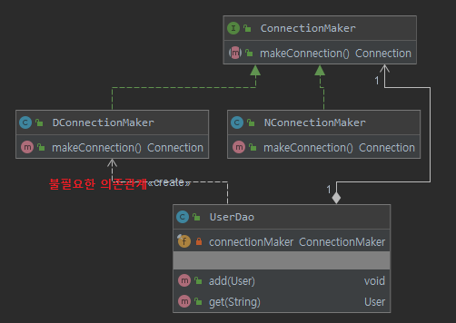

# 1장 오브젝트와 의존관계

생성일: 2022년 8월 1일 오후 10:24
태그: progress

---

`**스프링의 핵심 철학**` 

- 자바 엔터프라이즈 기술의 혼란 속에서 잃어버렸던 객체지향 기술의 진정한 가치를 회복
- 객체지향 프로그래밍이 제공하는 폭넓은 혜택을 누릴 수 있도록 기본으로 돌아가는 것

# 1.1 초난감 DAO

> **자바빈(JavaBean) 이란?**
자바빈은 다음 두 가지 관례를 따라 만들어진 오브젝트를 가리킨다.
- **디폴트 생성자:** 자바빈은 파라미터가 없는 디폴트 생성자를 갖고 있어야한다. 툴이나 프레임워크에서 리플렉션을 이용해 오브젝트를 생성하기 때문에 필요하다.
- **프로퍼티:** 자바빈이 노출하는 이름을 가진 속성을 프로퍼티라고 한다. 프로퍼티는 set으로 시작하는 수정자 메소드(setter)와 get으로 시작하는 접근자 메소드(getter)를 이용해 수정 또는 조회할 수 있다.
> 

```jsx
public class UserDao {

    public void add(User user) throws ClassNotFoundException, SQLException {
        Class.forName("org.h2.Driver");
        Connection conn = DriverManager.getConnection("jdbc:h2:tcp://localhost/~/test", "sa", "");

        PreparedStatement ps = conn.prepareStatement("insert into users (id, name, password) values (?, ?, ?)");
        ps.setString(1, user.getId());
        ps.setString(2, user.getName());
        ps.setString(3, user.getPassword());

        ps.executeUpdate();

        ps.close();
        conn.close();
    }

    public User get(String id) throws ClassNotFoundException, SQLException {
        Class.forName("org.h2.Driver");
        Connection conn = DriverManager.getConnection("jdbc:h2:tcp://localhost/~/test", "sa", "");

        PreparedStatement ps = conn.prepareStatement("select * from users where id = ?");
        ps.setString(1, id);

        ResultSet rs = ps.executeQuery();
        rs.next();
        User user = new User();
        user.setId(rs.getString("id"));
        user.setName(rs.getString("name"));
        user.setPassword(rs.getString("password"));

        rs.close();
        ps.close();
        conn.close();

        return user;
    }
}
```

위 UserDao는 회원의 정보를 저장(add())하고 저장된 정보를 id로 조회(get())하는 코드이다.

**UserDao의 주요 관심 사항**은 다음과 같다.

- DB 커넥션 연결
- Statement에 담긴 SQL을 DB를 통해 실행
- 리소스(Connection, ResultSet, Statement) 자원 해제

그러나, 특정한 작업을 반복하고 있어 **기능 확장 및 유지보수가 어려운 상황**이다.

# 1.2 DAO 분리

- 객체를 설계할 때 가장 염두에 둬야 할 사항은 **미래의 변화를 어떻게 대비할 것인가**이다.
- 객체지향이 절차지향에 비해 번거로운 작업을 요구하는 이유는 객체지향 기술 자체가 지니는, **변화에 효과적으로 대처할 수 있다**는 기술적인 특징을 가지고 있기 때문이다.
- 변경이 일어날 때 필요한 작업을 최소화하고, 그 변경이 다른 곳에 문제를 일으키지 않게 할 수 있는 방법은 **분리와 확장을 고려한 설계**를 하는 것이다.
- **관심사의 분리(Separation of Concerns)** 란, 관심이 같은 것끼리는 모으고, 관심이 다른 것은 따로 떨어져 있게 한다는 의미
    - **객체지향**에 적용하면, **관심이 같은 것끼리는 하나의 객체 안으로** 또는 친한 객체로 모이게 하고, **관심이 다른 것은 가능한 한 따로 떨어져서 서로 영향을 주지 않도록 분리**하는 것

## 중복 코드의 메소드 추출

```jsx
public class UserDao {

    public void add(User user) throws ClassNotFoundException, SQLException {
        Connection conn = getConnection();
				...
    }

    public User get(String id) throws ClassNotFoundException, SQLException {
	      Connection conn = getConnection();  
				...
    }

		private Connection getConnection() throws ClassNotFoundException, SQLException {
        Class.forName("org.h2.Driver");
        return DriverManager.getConnection("jdbc:h2:tcp://localhost/~/test", "sa", "");
    }
}
```

UserDao의 add(), get() 메소드 내부에는 **DB 연결 코드가 중복으로 존재**한다. 새로운 메소드가 추가되는 경우 DB 연결 코드가 계속해서 중복 생성될 수 있다. 

그래서, UserDao의 DB 연결에 대한 관심사를 별도의 메소드(getConnection())으로 분리(메소드 추출 기법)하였다. 

이렇게 기능에는 영향을 주지 않으면서 더 나은 구조 혹은 코드로 재구성하는 작업을 **리팩토링(refactoring)**이라고 한다.

## 상속을 통한 확장

한 프로젝트에서 서로 다른 DBMS에 접근해야하는 상황이라고 가정하고 UserDao 리팩토링


1-1

```jsx
public abstract class UserDao {

    public void add(User user) throws ClassNotFoundException, SQLException {
        Connection conn = getConnection();
				...
    }

    public User get(String id) throws ClassNotFoundException, SQLException {
        Connection conn = getConnection();
				...
        return user;
    }

    public abstract Connection getConnection() throws ClassNotFoundException, SQLException;
}

public class NUserDao extends UserDao {
    @Override
    public Connection getConnection() throws ClassNotFoundException, SQLException {
        return null;
    }
}

public class DUserDao extends UserDao {
    @Override
    public Connection getConnection() throws ClassNotFoundException, SQLException {
        return null;
    }
}
```

- UserDao를 추상클래스로 변경하고 getConnection() 메소드를 추상 메소드로 변경한다.
- UserDao를 상속받는 하위 클래스에서 각각의 DBMS에 연결하는 코드를 getConnection() 메소드를 Override 해서 구현하도록 한다.
    - DB 커넥션의 관심사는 UserDao가 아닌 하위클래스가 가지게 된다.
- UserDao의 계층을 분리하는 것으로 여러 DBMS에 연결할 일이 생겨도 유연하게 **확장이 가능한 구조로 변경**됐다.
- 이렇게 **슈퍼클래스에 기본적인 로직의 흐름(커넥션, SQL 생성 등)을 만들고**, 그 기능의 일부를 추상 메소드나 Override가 가능한 protected 메소드 등으로 만든 뒤 **서브클래스에서 이런 메소드를 필요에 맞게 구현해서 사용하도록 하는 방법**을 디자인 패턴에서 **템플릿 메소드 패턴(Template method pattern)**이라고 한다.
- 또한, 서브클래스의 getConnection() 메소드에서 Connection 객체를 생성 하는 것 처럼 **서브클래스에서 구체적인 오브젝트를 생성하는 방법을 결정하게 하는 것을 팩토리 메소드 패턴(factory mehtod pattern)**이라고 한다.
- 상속구조를 통해 관심이 다른 기능을 분리하고, 필요에 따라 확장성을 부여했지만 여전히 결합도가 높은 것이 단점이다.
    - 서브클래스가 슈퍼클래스의 기능을 직접 사용할 수 있고 슈퍼클래스의 코드가 변경되는 경우에 서브클래스까지 영향을 받을 수 있다.
- getConnection() 구현 코드는 UserDao를 상속받는 경우에만 사용할 수 있고 다른 Dao가 추가되면, 추가된 클래스마다 중복돼서 나타나는 단점이 있다.

# 1.3 DAO의 확장

- 변화의 성격이 다르다는 것
    - 변화의 **이유, 시기, 주기** 등이 다르다는 뜻

앞선 작업들로 UserDao를 **상속을 활용하여 상,하위 클래스로 분리하는 것으로 두 개의 관심사로 분리**하였다.

- 데이터 액세스 로직을 어떻게 만들 것인가?
- DB 연결을 어떤 방법으로 할 것인가?

## 클래스의 분리

상속을 활용하면 **상위 클래스에 변경이 일어났을때 그 클래스를 상속받는 하위 클래스들에게 영향을 받게 되는 단점**이 있다. 그래서 **상속**이 아닌 **조합**을 활용하여 클래스를 분리해보자.


1-2

- SimpleConnectionMaker 클래스에는 DB  생성 기능을 넣는다.

```jsx
package toby.spring.user.dao;

import java.sql.Connection;
import java.sql.DriverManager;
import java.sql.SQLException;

public class SimpleConnectionMaker {

    public Connection makeNewConnection() throws SQLException, ClassNotFoundException {
        Class.forName("org.h2.Driver");
        return DriverManager.getConnection("jdbc:h2:tcp://localhost/~/test", "sa", "");
    }
}

---

package toby.spring.user.dao;

import toby.spring.user.domain.User;
import java.sql.*;

public class UserDao {
    private final SimpleConnectionMaker simpleConnectionMaker;

    public UserDao() {
        this.simpleConnectionMaker = new SimpleConnectionMaker();
    }

    public void add(User user) throws ClassNotFoundException, SQLException {
        Connection conn = simpleConnectionMaker.makeNewConnection();
				...
    }

    public User get(String id) throws ClassNotFoundException, SQLException {
        Connection conn = simpleConnectionMaker.makeNewConnection();
				...

        return user;
    }
}
```

- UserDao는 SimpleConnectionMaker 클래스를 필드로 가지고 UserDao 인스턴스를 생성(new 키워드로)할 때, SimpleConnectionMaker 인스턴스를 주입하여 생성한다.
    - `UserDao userDao = new UserDao(new SimpleConnectionMaker);`
- 기존 코드의 수정이 있긴했지만 기능에 변화를 준 것은 없다. 단지 **내부 설계를 변경해서 좀 더 나은 코드로 개선**했을 뿐이다.
    - 기능에 변화가 없다는 것은 리팩토링 작업의 전제다.
- 그러나 UserDao는 SimpleConnectionMaker라는 **특정 클래스에 종속되어 있기 때문**에 상속을 사용했을 때 처럼 UserDao 코드의 수정 없이 DB 커넥션 생성 기능을 변경할 방법이 없다.
    - UserDao가 DB 커넥션을 가져오는 클래스에 대해 너무 많이 알고 있다.
    

## 인터페이스의 도입

- 위의 **특정 클래스에 종속되어 발생하는 문제점**을 해결하기 위해서 두 개의 클래스가 서로 긴밀하게 연결되어 있지 않도록 중간에 **추상적인 느슨한 연결고리를 만들어주는 것으로 해결할 수 있다.**
- 자바에서 추상화를 제공하는 가장 유용한 도구는 **인터페이스**가 있다.
    - 인터페이스는 자신을 구현한 클래스에 대한 구체적인 정보는 모두 감춰버린다.

> **추상화란?** 
어떤 것들의 **공통적인 성격**을 뽑아내어 이를 따로 분리해내는 작업
> 


1-3

- 인터페이스(ConnectionMaker)는 어떤 일을 하겠다는 기능(행위)만을 정의해놓은 것이다.
    - 인터페이스에는 어떻게 하겠다는 구현 방법은 나타나 있지 않다. 구체적인 구현 방법은 인터페이스를 구현한 클래스들이 결정할 일이다.

```jsx
package toby.spring.user.dao;

import java.sql.Connection;
import java.sql.SQLException;

public interface ConnectionMaker {
    Connection makeConnection() throws SQLException, ClassNotFoundException;
}

---

package toby.spring.user.dao;

import java.sql.Connection;
import java.sql.DriverManager;
import java.sql.SQLException;

public class DConnectionMaker implements ConnectionMaker {

    public Connection makeConnection() throws SQLException, ClassNotFoundException {
        Class.forName("org.h2.Driver");
        return DriverManager.getConnection("jdbc:h2:tcp://localhost/~/test", "sa", "");
    }
}

public class UserDao {
    private final ConnectionMaker connectionMaker;

    public UserDao() {
        this.connectionMaker = new DConnectionMaker(); // 여전히 특정 클래스에 종속되어 있다.
    }

    public void add(User user) throws ClassNotFoundException, SQLException {
				Connection conn = connectionMaker.makeConnection();
				...
		}
}
```

- ConnectionMaker 인터페이스에 makeConnection()는 **커넥션을 만들고 Connection 객체를 반환한다는 행위**를 정의한 것이다.
- 그리고 ConnectionMaker 를 구현한 DConnectionMaker 클래스에는 DB 연결과 관련된 구체적인 구현 방법을 정의하도록한다.
- UserDao 클래스의 생성자를 보면 DB 연결에 대한 관심사를 추상화를 수행했음에도 특정 클래스에 종속되어 있음을 볼 수 있다.
    - 만약 DConnectionMaker가 아닌 다른 방식의 DB 연결이 필요한 상황, 특정 상황에 맞게 서로다른 방식으로 동적으로 DB 연결을 수행해야하는 경우 UserDao의 코드의 변경을 불가피해질 것이다.

## 관계설정 책임의 분리



1-4

- UserDao는 ConnectionMaker 인터페이스 뿐아니라 ConnectionMaker 의 구현클래스까지 알고 있는 상황이다.
- UserDao는 **어떤 ConnectionMaker 구현 클래스를 사용할지 결정하는 관심사가 남아있다.**
- **“어떤 ConnectionMaker 구현 클래스를 사용할지 결정하는 관심사”**를 분리해야 하는 상황에서 생각해야할 점은 UserDao를 사용하는 클래스가 누구인가이다.
- 여기서 UserDao를 사용하는 클래스는 **클라이언트**라고 부르고 UserDao는 기능을 제공 **다시말해, 서비스**를 제공한다고 볼 수 있다.
- UserDao를 사용하는 클래스인 **클라이언트 클래스가 어떤 ConnectionMaker 구현 클래스를 사용할지에 대한 결정을 하도록 분리하기 적절한 곳**이다.
- UserDao에서는 ConnectionMaker라는 인터페이스를 필드로 가지고 있기 때문에 ConnectionMaker를 구현한 클래스를 외부(**UserDao 클라이언트**)에서 주입해주는 것으로 객체간의 관계를 연결할 수 있게된다.
    - UserDao는 단지 DB 연결에 대한 관심사를 추상화한 ConnectionMaker 인터페이스에만 의존할 뿐 구체적으로 어떤 방식으로 연결할지 구현한 클래스가 무엇인지는 알 필요가 없는 것이다.
    - 위와 같은 방식은 객제지향 특징 중 **다형성을 활용한 방법**이다.
    - 객체간의 관계 연결은 UserDao에 **생성자를 이용한 방법(권장)**과 **Setter 메소드를 활용한 방법**으로 연결할 수 있다.

```jsx
public class UserDao {
    private final ConnectionMaker connectionMaker;

    public UserDao(ConnectionMaker connectionMaker) {
        this.connectionMaker = connectionMaker;
    }
		...
}

---
// UserDao 클라이언트 클래스
class UserDaoTest {
    public static void main(String[] args) throws SQLException, ClassNotFoundException {
				// NConnectionMaker: ConnectionMaker 인터페이스 구현 클래스
				// DB 연결을 위한 구체적인 방법으로 UserDao 인스턴스 생성
        UserDao userDao = new UserDao(new NConnectionMaker());

        User user = new User();
        user.setId("gildong1");
        user.setName("홍길동");
        user.setPassword("1004");

        userDao.add(user);

        System.out.println("user = " + user + " 등록 성공!");

        User findUser = userDao.get(user.getId());
        System.out.println(findUser.getName());
    }
}
```


1-5

- UserDao 생성자에서 DB 연결에 대한 방법을 결정하던 관심사를 UserDaoTest라는 클라이언트 클래스로 책임을 분리
    - UserDaoTest는 UserDao와 ConnectionMaker 구현 클래스간의 런타임 오브젝트 의존관계를 설정하는 책임을 담당한다.

## 원칙과 패턴

### 개방 폐쇄 원칙(OCP, Open-Closed Principle)

- 개방 폐쇄 원칙은 **깔끔한 설계를 위해 적용 가능한 객체지향 설계 원칙 중의 하나**
- 개방 폐쇄 원칙의 정의는 **‘클래스나 모듈은 확장에는 열려 있어야 하고 변경에는 닫혀 있어야 한다’** 이다.
- UserDao는 DB 연결 방법(ConnectionMaker)의 **기능을 확장하는 데는 열려 있다고 할 수 있다.** 그리고 UserDao 자신의 핵심 기능을 구현한 코드는 **기능 확장으로 인한 영향을 받지 않고 유지할 수 있으므로 변경에는 닫혀 있다**고 할 수 있다.

> **객체지향 설계 원칙(SOLID)**
**객체지향 설계 원칙**은 객체지향의 특징을 잘 살릴 수 있는 설계의 특징을 말한다.
**원칙**이라는 건 어떤 상황에서든 100% 지켜져야 하는 절대적인 기준이라기보다는, 예외는 있겠지만 대부분의 상황에 잘 들어맞는 가이드라인과 같은 것이다.

**디자인 패턴**은 특별한 상황에서 발생하는 문제에 대한 좀 더 **구체적인 솔루션**이라고 한다면, **객체지향 설계 원칙**은 좀 더 **일반적인 상황에서 적용 가능한 설계 기준**이라고 볼 수 있다.

**SRP(The Single Responsibility Principle):** 단일 책임 원칙
**OCP(The Open Closed Principle):** 개방 폐쇄 원칙
**LSP(The Liskov Substitution Principle):** 리스코프 치환 원칙
**ISP(The Interface Segregation Principle):** 인터페이스 원칙
**DIP(The Inversion Principle):** 의존관계 역전 원칙
> 

### 높은 응집도와 낮은 결합도

개방 폐쇄 원칙은 **높은 응집도와 낮은 결합도(high coherence and low coupling)**라는 소프트웨어 개발의 고전적인 원리로도 설명이 가능하다.

`**높은 응집도**`

- 응집도가 높다는 것은 **하나의 모듈, 클래스가 하나의 책임 또는 관심사에만 집중**되어 있다는 뜻
- 불필요하거나 직접 관련이 없는 외부의 관심과 책임이 얽혀 있지 않으며, 하나의 공통 관심사는 한 클래스에 모여있다.
- 높은 응집도는 클래스 레벨뿐 아니라, 패키지, 컴포넌트, 모듈에 이르기까지 그 대상의 크기가 달라도 동일한 원리로 적용된다.
- 변화가 일어날 때 해당 모듈에서 변하는 부분이 크다는 것으로 설명할 수 있다.
    - 즉 변경이 일어날 때 모듈의 많은 부분이 함께 바뀐다면 응집도가 높다고 할 수 있다.
- UserDao에서 DB 연결 방식에 대한 관심사를 ConnectionMaker 인터페이스로 분리한것은 응집도를 높였다고 할 수 있다.

`**낮은 결합도**`

- 결합도란 **‘하나의 오브젝트가 변경이 일어날 때에 관게를 맺고 있는 다른 오브젝트에게 변화를 요구하는 정도’**
    - 다시말해, 하나의 변경이 발생할 때 연관된 다른 객체나 모듈에 변경이 전파되지 않는 상태를 말한다.
- 결합도가 낮다는 것은 **책임과 관심사가 다른 객체 또는 모듈 즉 느슨하게 연결된 형태를 유지하는 것**이다.
- 낮을 결합도를 만드는 것은 느슨한 연결은 관계를 유지하는 데 꼭 필요한 최소한의 방법만 간접적인 형태로 제공하고, 나머지는 서로 독립적이고 알 필요도 없게 만들어주는 것이다.
- 결합도가 낮으면?
    - 변화에 대응하는 속도가 높아진다.
    - 구성이 깔끔해진다.
    - 확장이 편리해진다.
- 결합도가 높아지면 **변경에 따른 작업량이 많아지고, 변경으로 인해 버그가 발생할 가능성이 높아진다.**
- UserDao는 ConnectionMaker 인터페이스 도입으로 DB 생성 방식이 추가되더라도 UserDao의 코드의 변경 없이 확장할 수 있다.
    - ConnectionMaker 도입으로 UserDao의 결합도가 낮아졌다고 할 수 있다.

### 전략 패턴

- `전략패턴`은 자신의 **기능 맥락(context)에서 필요에 따라 변경이 필요한 알고리즘을 인터페이스를 통해 통째로 외부로 분리**시키고, 이를 구현한 **구체적인 알고리즘 클래스를 필요에 따라 바꿔서 사용**할 수 있게 하는 디자인 패턴이다.
- UserDaoTest - UserDao - ConnectionMaker 구조를 디자인 패턴의 시각으로 보면 **전략 패턴(Strategy Pattern)**에 해당한다고 볼 수 있다.
    - 클라이언트(client): UserDaoTest
    - 컨텍스트(context): UserDao
    - 알고리즘 & 전략(strategy): ConnectionMaker
        - NConnectionMaker, DConnectionMaker
- **컨텍스트(context)**는 자신의 기능을 수행하는 데 필요한 기능 중에서 변경 가능한, DB 연결 방식이라는 알고리즘을 ConnectionMaker라는 인터페이스로 정의하고, 이를 구현한 클래스, 즉 전략을 바꿔가면서 사용할 수 있게 분리했다.
- **클라이언트(client)**는 **컨텍스트에 적용할 전략을 컨텍스트의 생성자 등을 통해 제공**해주는 역할을 수행한다.

# 1.4 제어의 역전(IoC)

**IoC**: Inversion of Control

## 오브젝트 팩토리

UserDaoTest는 UserDao를 사용하는 클라이언트로서 어떤 구체적인 DB 연결 방식을 사용할지 결정하는 역할을 수행했다.

그러나 UserDaoTest는 테스트를 위해 만든 것이기 때문에 객체간의 관계를 연결하는 책임 또한 분리해보자

### 팩토리

- 팩토리(factory)는 **객체 생성 방법을 결정하고 반환의 역할을 수행**하는 클래스이다.
- 객체의 생성과 사용의 역할과 책임을 분리하기 위한 목적(추상 팩토리, 팩토리 메소드 패턴과 다름)

```jsx
public class DaoFactory {

    public UserDao userDao() {
        ConnectionMaker connectionMaker = new DConnectionMaker();
        return new UserDao(connectionMaker);
    }
}

class UserDaoTest {
    public static void main(String[] args) throws SQLException, ClassNotFoundException {
				// before
				//UserDao userDao = new UserDao(new NConnectionMaker());

				// after
        UserDao userDao = new DaoFactory().userDao();
				...
		}
}
```


1-6

- DaoFactory는 UserDao와 ConnectionMaker 생성 작업의 역할을 수행한다.
- UserDao와 ConnectionMaker는 각각 핵심적인 데이터 로직과 기술 로직을 담당하고 있고 DaoFactory는 이런 오브젝트들을 구성하고 관계를 정의를 담당한다.
    - 컴포넌트의 의존관계에 대한 설계도와 같은 역할
- 컴포넌트 역할을 하는 오브젝트(UserDao, ConnectionMaker)와  구조를 결정하는 오브젝트(DaoFactory)를 분리한 것이 포인트

## 오브젝트 팩토리의 활용

```jsx
public class DaoFactory {

    public UserDao userDao() {
        return new UserDao(connectionMaker());
    }

		// 다른 DAO 추가된 경우
    public UserDao userDao2() {
        return new UserDao(connectionMaker());
    }
		
		...

    public ConnectionMaker connectionMaker() {
        return new DConnectionMaker();
    }
}
```

- 기존 DaoFactory는 ConnectionMaker 구현체를 new 키워드로 생성하는 형태
- 새로운 Dao가 추가되는 경우 ConnectionMaker 구현체를 new 키워드로 생성하는 코드가 중복으로 나타날 수 있다.
- 중복 문제를 해결하기 위해 별도 메소드 connectionMaker() 로 분리

## 제어권의 이전을 통한 제어관계 역전

> **제어의 역전**
프로그램의 제어 흐름 구조가 뒤바뀌는 것
> 

**제어의 역전**은 오브젝트가 **자신이 사용할 오브젝트를 스스로 생성하거나 선택** 그리고 **자신이 어떻게 만들어지고 선택**되는지에 대한 **모든 제어 권한을 자신이 아닌 다른 대상에게 위임**하는 것을 말한다.

### 제어의 역전 예시

1. **서블릿**
    
    일반적인 자바 프로그램의 경우 main() 메소드에서 시작해서 개발자가 정의해둔 코드에 따라 절차적으로 객체가 생성되고 실행된다.
    
    서블릿의 경우 서블릿 내부에 main() 메소드가 있어서 직접 실행할 수 있는 것도 아니다. 서블릿에 대한 제어 권한을 가진 컨테이너가 적절한 시점에 서블릿 클래스의 객체를 생성하고 메소드를 호출한다.
    
2. **템플릿 메소드 패턴**
    
    추상 클래스로 만들었던 UserDao에서 UserDao를 상속한 서브클래스에서는 getConnection()을 구현해야했는데, 해당 메소드가 언제 어떻게 실행될지는 알지 못한다.
    
    단지 getConnection()에서 DB 연결과 관련된 내용을 정의할 뿐 UserDao의 템플릿 메소드인 add(), get() 등에서 필요할 때 호출되어 사용하는 것이다.
    
    즉, 제어권을 상위 템플릿 메소드에 넘기고 getConnection()은 필요할 때 호출되어 사용하는 제어의 역전 개념이 포함된 것을 알 수 있다.
    
3. **프레임워크**
    
    **라이브러리 vs 프레임워크**
    
    **라이브러리**를 사용하는 애플리케이션 코드는 애플리케이션 흐름을 직접 제어한다. 단지 동작하는 중에 필요한 기능이 있을 때 능동적으로 라이브러리를 사용할 뿐이다.
    
    **프레임워크**는 거꾸로 애플리케이션 코드가 프레임워크에 의해 사용된다. 보통 프레임워크 위에 개발한 클래스를 등록하고 프레임워크가 흐름을 주도하는 중에 개발자가 만든 애플리케이션 코드를 사용하도록 만드는 방식이다.
    

# 1.5 스프링의 IoC

스프링의 핵심은 `**빈 팩토리**` 또는 `**애플리케이션 컨텍스트**` 이다.

## 오브젝트 팩토리를 이용한 스프링 IoC

### DaoFactory를 사용하는 애플리케이션 컨텍스트

```jsx
import org.springframework.context.annotation.Bean;
import org.springframework.context.annotation.Configuration;

@Configuration
public class DaoFactory {

    @Bean
    public UserDao userDao() {
        return new UserDao(connectionMaker());
    }

    @Bean
    public ConnectionMaker connectionMaker() {
        return new DConnectionMaker();
    }
}
```

- @Configuration: 빈 팩토리를 위한 오브젝트 설정을 담당하는 클래스 설정
- @Bean: 스프링 빈 등록

```jsx
class UserDaoTest {
    public static void main(String[] args) throws SQLException, ClassNotFoundException {
				// before
				// UserDao userDao = new DaoFactory().userDao();

        // after
				AnnotationConfigApplicationContext context = new AnnotationConfigApplicationContext(DaoFactory.class);
        UserDao userDao = context.getBean("userDao", UserDao.class);
		}
}
```

- @Configuration 이 붙은 클래스를 설정 정보로 사용하려면 AnnotationConfigApplicationContext를 이용해야한다.
- 설정 정보에 등록된 빈을 가져오려면 context의 getBean()으로 가져올 수 있다.
    - 이때 getBean()의 이름은 설정 정보에 등록한 메소드 이름과 동일하다.

## 애플리케이션 컨텍스트의 동작방식

```jsx
public interface ApplicationContext extends 
		EnvironmentCapable, 
		ListableBeanFactory, 
		HierarchicalBeanFactory,
		MessageSource, 
		ApplicationEventPublisher, 
		ResourcePatternResolver {
}
```

- 애플리케이션 컨텍스트
    - **IoC 컨테이너, 스프링 컨테이너, 빈 팩토리** 라고도 부른다.
- 애플리케이션 컨텍스트는 애플리케이션에서 IoC를 적용해서 관리할 모든 오브젝트에 대한 생성과 관계설정을 담당한다.
    - 컨텍스트에서 오브젝트를 직접 생성하고 관계를 맺어주는 코드를 생성하는것은 아니고 **생성정보와 연관관계 정보를 통해(ex, DaoFactory) 수행**한다.


1-7

- 애플리케이션 컨텍스트는 DaoFactory 클래스를 설정정보로 등록해두고 @Bean이 붙은 메소드의 이름을 가져와 빈 목록을 만들어둔다.
- 빈을 가져올때 메소드 이름을 파라미터로 getBean()을 호출하면 요청한 이름의 객체를 반환한다.

### 애플리케이션 컨텍스트를 사용하는 이유

DaoFactory와 같은 오브젝트 팩토리가 아닌 애플리케이션 컨텍스트를 사용하는 이유

1. **클라이언트는 구체적인 팩토리 클래스를 알 필요가 없다.**
    
    애플리케이션의 규모가 커지면서 DaoFactory와 같은 IoC를 적용한 객체도 계속 추가될 것이고 클라이언트가 사용해야할 팩토리 클래스가 무엇인지 필요한 경우 팩토리 클래스를 생성해야하는 번거로움이 있다.
    
    애플리케이션 컨텍스트를 사용하면 위와 같은 것들을 고려할 필요가 없고 일관된 방식으로 객체를 가져올 수 있다.
    
2. **애플리케이션 컨텍스트는 종합 IoC 서비스를 제공해준다.**
    
    애플리케이션 컨텍스트는 객체의 생성, 관계설정 뿐아니라 객체 생성 방식, 시점과 전략, 자동생성, 후처리, 정보의 조합, 설정 방식의 다변화, 인터셉팅 등 다양한 기능을 제공한다.
    
3. **애플리케이션 컨텍스트는 빈을 검색하는 다양한 방법을 제공한다.**
    
    빈의 이름 뿐아니라 객체 타입, 특정 애너테이션 등으로 찾을 수 있다.
    

## 스프링 IoC의 용어 정리

### 빈(bean)

- 스프링이 IoC 방식으로 관리하는 오브젝트
    - 애플리케이션에서 만들어지는 모든 오브젝트가 전부 빈은 아님
    - 스프링이 제어권을 가지고 직접 만들고 관계를 부여하는 오브젝트
- 오브젝트 단위의 애플리케이션 컴포넌트

### **스프링 빈**

- 스프링 컨테이너가  생성과 관계설정, 사용 등을 제어해주는 **제어의 역전(IoC)**이 적용된 오브젝트

### 빈 팩토리(bean factory)

- 스프링의 IoC를 담당하는 핵심 컨테이너
    - 빈의 생성과 관계설정 그 외 부가적인 빈 관리하는 기능을 담당하는 IoC 오브젝트
- 빈 팩토리보다는 조금 더 확장한 애플리케이션 컨텍스트(application context)를 주로 사용한다.
- 빈을 생성하고 관계를 설정하는 IoC의 기본 기능에 초점
- BeanFactory 인터페이스

### **애플리케이션 컨텍스트(application context)**

- 빈 팩토리를 확장한 IoC 컨테이너
    - 애플리케이션 전반에 걸쳐 모든 구성요소의 제어 작업을 담당하는 IoC 엔진
    - 스프링이 제공하는 각종 부가 서비스를 추가로 제공
- 별도의 정보를 참고(가져와)하여 빈의 생성, 관계설정 등의 제어 작업을 총괄
    - 별도의 정보란 어떤 클래스를 생성하고 연결 할지에 대한 정보(ex. DaoFactory)
- ApplicationContext 인터페이스
    - BeanFactory 인터페이스 상속

### 설정정보/설정 메타정보(configuration metadata)

- 애플리케이션 컨텍스트 또는 빈 팩토리가 IoC를 적용하기 위해 사용하는 메타정보를 의미
- 청사진(blueprints)라고도 한다.

### 컨테이너(container) 또는 IoC 컨테이너

- IoC 방식으로 빈을 관리한다는 의미에서 애플리케이션 컨텍스트, 빈 팩토리를 의미하는 명칭

# 1.6 싱글톤 레지스트리와 오브젝트 스코프

스프링의 **애플리케이션 컨텍스트**와 **오브젝트 팩토리**의 주요한 차이점이 존재

```jsx

// 오브젝트 팩토리로 객체 생성
DaoFactory daoFactory = new DaoFactory();
UserDao userDao1 = daoFactory.userDao();
UserDao userDao2 = daoFactory.userDao();
System.out.println("userDao1 = " + userDao1);
System.out.println("userDao2 = " + userDao2);

// 스프링의 애플리케이션 컨텍스트로 객체 가져오기
AnnotationConfigApplicationContext context = new AnnotationConfigApplicationContext(DaoFactory.class);
UserDao userDao3 = context.getBean("userDao", UserDao.class);
UserDao userDao4 = context.getBean("userDao", UserDao.class);
System.out.println("userDao3 = " + userDao3);
System.out.println("userDao4 = " + userDao4);
```

**오브젝트 팩토리**로 동일한 객체(userDao1, 2)를 생성하면 DaoFactory에서 매번 new 키워드로 객체를 생성하기 때문에 새로운 인스턴스를 생성된다.

반면 **애플리케이션 컨텍스트**에서 객체를 가져왔을때(userDao3, 4) 동일한 주소의 인스턴스임을 확인할 수 있다.

> **오브젝트의 `동일성`과** **`동등성`**
자바에서 두 개의 오브젝트가 **완전히 같은 동일한(identical) 오브젝트**와 **동일한 정보를 담고 있는(equivalent) 오브젝트**와는 분명한 차이가 있다.
▪전자는 동일성(identity, ==) 비교
▪후자는 동등성(equals()) 비교
> 

## 싱글톤 레지스트리로서의 애플리케이션 컨텍스트

- **애플리케이션 컨텍스트**는 오브젝트 팩토리와 비슷한 방식으로 동작하는 **IoC 컨테이너**이다.
- **애플리케이션 컨텍스트**는 싱글톤을 저장하고 관리하는 **싱글톤 레지스트리(singleton registry)** 역할도 수행한다.
    - 스프링은 기본적으로 내부에서 생성하는 빈 객체를 모두 **싱글톤**으로 만든다.

### 서버 애플리케이션과 싱글톤

왜 스프링은 싱글톤으로 빈을 만드는 것일까?

스프링은 서버 하나당 최대로 초당 수십 ~ 수백번의 요청을 받아 처리하는 등 멀티스레드 및 엔터프라이즈 시스템을 위해 고안된 기술이다. 

만약 클라이언트에서 요청이 올 때마다 각 로직을 담당하는 객체를 새롭게 생성한다면 자바의 GC의 부하가 생기고 서버에 부담이 생기게 될 것이다.

따라서, 멀티스레드 환경에서 사용자의 요청을 담당하는 여러 스레드들이 하나의 객체를 공유하고 동시에 사용하도록 하기 위해 **싱글톤으로 객체를 생성하는 것**이다.

### 싱글톤 패턴의 한계

- private 생성자를 갖고 있기 때문에 상속할 수 없다.
    - 오직 싱글톤 클래스 자신만이 자기 객체를 만들도록 제한해야하기 때문
    - 상속, 다형성을 적용할 수 없다.
- 싱글톤은 테스트하기가 힘들다.
- 서버환경에서는 싱글톤이 하나만 만들어지는 것을 보장하지 못한다.
    - 여러 개의 JVM에 분산돼서 설치되는 경우 각각 독립적인 객체가 생성되기 때문이다.
- 싱글톤의 사용은 **전역 상태**를 만들 수 있기 때문에 바람직하지 못하다.
    - 아무 객체나 자유롭게 접근하고 수정하고 공유할 수 있는 전역 상태를 갖는 것은 객체지향 프로그래밍에서는 권장하지 않는 방식이다.

### 싱글톤 레지스트리

- 스프링은 서버환경에서 **싱글톤이 만들어져서 서비스 오브젝트 방식으로 사용되는 것을 권장**
- 스프링은 직접 **싱글톤 형태의 오브젝트를 만들고 관리하는 기능을 제공**
    - **싱글톤 레지스트리(singleton registry)**
- 평범한 자바 클래스의 생성, 관계설정, 사용 등에 대한 제어권을 **IoC 방식의 컨테이너**에게 넘기면 싱글톤 방식으로 만들어져 관리되게 할 수 있다.
- 싱글톤 방식으로 사용될 클래스도 **public 생성자**를 가질 수 있다.
- 빈을 싱글톤으로 만드는 것은 **오브젝트의 생성 방법을 제어하는 IoC 컨테이너로서의 역할**

## 싱글톤과 오브젝트의 상태

- 싱글톤은 멀티스레드 환경이라면 여러 스레드가 동시에 접근해서 사용할 수 있기 때문에 **객체의 상태 관리에 주의가 필요**하다.
    - 기본적으로 싱글톤은 멀티스레드 환경에서 서비스 형태의 오브젝트로 사용되는 경우 상태정보를 내부에 갖고 있지 않은 무상태(stateless) 방식으로 만들어져야 한다.
    

## 스프링 빈의 스코프

- **빈 스코프(scope)**: 빈이 생성되고, 존재하고, 적용되는 범위
    - **스코프 종류:** 싱글톤(singleton, **default scope**), 프로토타입(prototype), 요청(request), 세션(session)
- **프로토타입(prototype):** 컨테이너에 빈을 요청할 때마다 매번 새로운 오브젝트를 만들어주는 방식
- **요청(request):** 웹을 통해 새로운 HTTP 요청이 생길 때마다 생성되는 방식
- **세션(session):** 웹 세션과 유사한 방식

# 1.7 의존관계 주입(DI)

## 제어의 역전(IoC)과 의존관계 주입

- IoC의 개념은 폭넓게 사용되는 용어
    - 스프링을 IoC 컨테이너라고만 하면 스프링이 제공하는 기능의 특징을 명확하게 설명하지 못한다.(느낌상 너무 추상적인 용어라서?)
- 스프링의 IoC 기능의 대표적인 동작원리는 주로 **의존관계 주입(Denpendency Injection)**이라고 불린다.
    - **의존관계 주입**이라는 용어로 스프링이 제공해주는 기능을 명확하게 드러낸다.
    - IoC 컨테이너를 **의존관계 주입 컨테이너, DI 컨테이너**라고 부르기도 한다.

> **의존관계 주입(DI)**
DI는 오브젝트 레퍼런스를 외부로부터 제공(주입)받고 이를 통해 다른 오브젝트와 동적으로 의존관계가 만들어지는 것이 핵심이다.
> 

## 런타임 의존관계 설정

### 의존관계


1-8

- 두 개의 클래스 또는 모듈이 의존관계에 있을때 UML 모델에서는 아래와 같이 **점선으로 된 화살표**로 표현한다.
- B 클래스는 A 인터페이스에 **의존**하고 있음을 나타낸다.
- 의존하고 있다는 것은 **A 인터페이스가 B 클래스에 영향을 미친다**는 뜻이다.
    - A 인터페이스가 변경되면 그 영향이 B 클래스에 미침
- 의존관계에는 **방향성**이 있다.

### UserDao 의존관계

- 위 UML 모델에서 B Class를 UserDao, A interface는 ConnectionMaker, C Class는 DConnectionMaker로 치환하면 UserDao의 의존관계 형태이다.
- UserDao는 ConnectionMaker에 의존하고 있고 ConnectionMaker가 변경되면 UserDao에 직접적인 영향을 주게 된다.
- 다만 ConnectionMaker의 구현 클래스 DConnectionMaker가 변경되는 경우엔 UserDao에 영향을 주지 않는다.
- 인터페이스에 의존하는 관계를 만들어두면 인터페이스 구현 클래스와의 관계는 느슨해지면서 변화에 영향을 덜 받는 상태가 된다.
    - 결합도가 낮다고 할 수 있음
- 의존관계는 모델이나 코드에서 클래스와 인터페이스를 통해 드러나는 것 뿐아니라 **런타임 시에 만들어지는 의존관계**도 있다.
    - 설계 시점의 의존관계가 실체화된 것
- **의존 관계 주입**은 구체적인 의존 오브젝트와 그것을 사용할 주체(클라이언트)를 런타임 시에 연결해주는 작업을 말한다.
    - 클래스 모델이나 코드에는 런타임 시점의 의존관계가 드러나지 않는다(인터페이스에만 의존하는 형태)
    - 런타임 시점의 의존관계는 컨테이너나 팩토리 같은 제3의 존재가 결정
        - 제3의 존재: 전략 패턴의 클라이언트, DaoFactory, 스프링의 애플리케이션 컨텍스트, 빈 팩토리, IoC 컨테이너
    - 의존관계는 사용할 오브젝트에 대한 레퍼런스를 외부에서 제공(주입)하는 것으로 만들어진다.

### UserDao 의존관계 주입

초기 UserDao의 관계설정의 관심사는 아래와 같이 UserDao가 가지고 있었다.

```jsx
public UserDao() {
		this.connectionMaker = new DConnectionMaker();
}
```

위 코드의 문제점은 **이미 런타임 시의 의존관계가 코드 속에 미리 결정**되어 있다는 점이다.

그래서 DaoFactory를 생성하여 IoC 방식으로 UserDao에 런타임 의존관계를 드러내는 코드(DConnectionMaker)를 제거하고 제3의 존재에 런타임 의존관계 결정 권한을 위임했다.

DaoFactory는 UserDao를 생성하는 시점에 UserDao의 생성자 파라미터로 이미 만들어진 DConnectionMaker 객체를 전달한다.

```jsx
private final ConnectionMaker connectionMaker;

public UserDao(ConnectionMaker connectionMaker) {
		this.connectionMaker = connectionMaker;
}
```

이렇게 DaoFactory와 같이 두 객체 사이의 런타임 의존관계를 설정해주는 의존관계 주입 작업을 주도하고 IoC 방식으로 객체의 생성, 초기화, 제공 등의 작업을 수행하기 때문에 **DI 컨테이너**라고 부를 수 있다.

**DI 컨테이너**에 의해 런타임 시에 의존 객체를 사용할 수 있도록 생성자 파라미터를 통해 주입해주는 것을 **의존관계 주입**이라고 부른다.

## 의존관계 검색과 주입

**의존관계 검색(dependency lookup)**은 의존관계 맺는 방법이 외부로부터의 주입이 아닌 스스로 검색해서 주입하는 방식을 말한다.

의존관계 검색은 런타임 시 의존관계를 맺을 객체를 결정하는 것과 객체 생성 작업은 외부 컨테이너에게 IoC로 맡기지만, 이를 **가져올 때는 메소드나 생성자를 통한 주입 대신 스스로 컨테이너에게 요청하는 방법을 사용**한다.

```jsx
public UserDao() {
		AnnotationConfigApplicationContext context = new AnnotationConfigApplicationContext(DaoFactory.class);
		this.connectionMaker = context.getBean("connectionMaker", ConnectionMaker.class);
}
```

위의 의존관계 검색 코드를 보면 오브젝트 팩토리 클래스나 스프링 API가 나타나는 것을 볼 수 있는데 **애플리케이션 컴포넌트(UserDao)가 컨테이너와 같이 성격이 다른 객체에 의존하는 것은 어색**하게 보인다. 그래서 보통은 **의존관계 주입 방식**을 사용하는 것이 좋다.

그럼에도 애플리케이션 기동 시점에 적어도 한 번은 **의존관계 검색 방식**을 사용해 객체를 가져와야 한다. (ex, main(), 서블릿, UserDaoTest, 등) 

### 의존관계 검색 vs 의존관계 주입

**의존관계 검색 방식**은 검색하는 오브젝트는 자신이 스프링 빈일 필요가 없다.

getBean()으로 빈을 검색할 때 굳이 자신도 스프링 빈일 필요는 없기 때문이다.

**의존관계 주입 방식**은 UserDao, ConnectionMaker 사이에 DI가 적용되려면 UserDao도 반드시 컨테이너가 만드는 빈이어야 한다.

컨테이너가 UserDao에 ConnectionMaker를 주입해주려면, UserDao에 대한 생성, 초기화 권한을 가지고 있어야 하기 때문에 UserDao는 IoC 방식으로 컨테이너에서 관리되는 빈이어야 한다.

## 의존관계 주입의 응용

**DI 기술의 장점**

모든 객체지향 설계와 프로그래밍의 원칙을 따랐을 때 얻을 수 있는 장점이 그대로 DI 기술에도 적용된다. 또한, 코드에는 런타임 클래스에 대한 의존관계가 나타나지 않고, 인터페이스를 통해 결합도가 낮은 코드를 만들므로 의존관계 대상이 바뀌거나 변경에는 자신에 영향을 받지 않고 변경을 통한 확장 방법에는 자유롭다. 

### 기능 구현의 교환

초기 초난감 DAO를 생각해보면 DB 연결과 관련된 코드가 add(), get() 메소드에 중복으로 들어가있었다. 만약 개발용, 운영용 DB가 분리돼 있다고 할 때, 개발할 땐 개발 DB 정보를 운영에 배포할 때는 운영 DB 정보로 수정해줘야 할 것이다. 지금은 2개의 메소드만 수정하면 되지만 DB 연결 관련 코드가 수십 수백개로 늘어나면 하나하나 수정해 줘야 하는 상황이 생길 것 이다. 

그러나 다음과 같이 DI를 활용하면

```jsx
@Bean
public ConnectionMaker connectionMaker() {
		// 개발용 DB
		return new LocalDBConnectionMaker();
		// 운영용 DB
		return new ProdDBConnectionMaker();
}
```

위와 같이 중복된 코드를 개선할 수 있다.

### 부가기능 추가

만약 DAO가 DB 연결을 얼마나 많이 하는지 파악하고 싶다고 할 때, ConnectionMaker를 구현하는 CountingConnectionMaker 구현 클래스를 생성하여 DB 연결 횟수를 카운팅 하는 부가 기능을 추가하면 된다.

```jsx
public class CountingConnectionMaker implements ConnectionMaker {
		private int count = 0;
		private final ConnectionMaker realConnectionMaker;

		public CountingConnectionMaker(ConnectionMaker connectionMaker) {
				this.realConnectionMaker = connectionMaker;
		}
		
		public Connection makeConnection() throws ClassNotFoundException, SQLException {
				this.count++;
				return realConnectionMaker.makeConnection();
		}

		public int getCounter() {
				return count;
		}
}
```

CountingConnectionMaker 클래스를 보면 makeConnection()에서 DB 연결 카운팅을 수행하고 실제 DB 연결은 수행하지 않는다. DB 연결 카운팅의 역할만을 수행하고 실제 연결은 다른 구현체에서 수행하도록 책임을 분리한 것이다.

해당 구현 클래스를 컨테이너에서 사용하도록 하면 다음과 같다.

```jsx
@Configuration
public class CountingDaoFactory {
		@Bean
		public UserDao userDao() {
				return new UserDao(connectionMaker());		
		}

		@Bean
		public ConnectionMaker connectionMaker() {
				return new CountingConnectionMaker(realConnectionMaker());
		}

		@Bean
		public ConnectionMaker realConnectionMaker() {
				return new DConnectionMaker();
		}
}
```

그리고 클라이언트에서 새로운 Factory 설정 정보를 사용하면된다.

```jsx
class UserDaoConnectionCountingTest {
    public static void main(String[] args) throws SQLException, ClassNotFoundException {
        AnnotationConfigApplicationContext context = new AnnotationConfigApplicationContext(CountDaoFactory.class);
        UserDao userDao = context.getBean("userDao", UserDao.class);

        User user = new User();
        user.setId("gildong1");
        user.setName("홍길동");
        user.setPassword("1004");

        userDao.add(user);
        System.out.println("user = " + user + " 등록 성공!");

        User findUser = userDao.get(user.getId());
        System.out.println(findUser.getName());

        CountingConnectionMaker countingConnectionMaker = context.getBean("countingConnectionMaker", CountingConnectionMaker.class);
        int count = countingConnectionMaker.getCount();
        System.out.println("count = " + count);
    }
}
```

DI의 장점은 관심사의 분리(SoC)를 통해 얻어지는 높은 응집도에서 나온다.

## 메소드를 이용한 의존관계 주입

> 과거에는 수정자를 통한 DI가 권장된 것 같은데 **최근에는 생성자를 이용한 DI 방식을 권장**
> 

- 수정자 메소드를 이용한 주입
    - 수정자(setter) 메소드는 외부에서 객체 내부의 상태 값을 변경하려는 용도로 사용
    - 수정자 메소드로 의존관계 객체를 파라미터로 인스턴스 변수에 저장하는 방식
- 일반 메소드를 이용한 주입
    - 수정자 메소드 처럼 set으로 시작해야하고 한 번에 한 개의 파라미터만 가져야하는 제약이 싫을 때 사용할 수 있는 방법
        - 여러 개의 파라미터를 갖는 일반 메소드를 DI용으로 사용할 수 있다.

# XML을 이용한 설정

- DaoFactory와 같이 자바를 이용해 의존관계 설정하는 방식 외에 XML로 의존관계 설정이 가능하다.
- XML방식은 컴파일과 같은 별도의 빌드 작업이 필요없다.

## XML 설정

- **@Configuration**: <beans>
- **@Bean**: <bean>
    - **빈의 이름**: @Bean 메소드 이름이 빈의 이름(getBean()에서 사용)
    - **빈의 클래스**: 빈 오브젝트를 어떤 클래스를 이용해서 만들지를 정의
    - **빈의 의존 객체**: 빈의 생성자나 수정자 메소드를 통해 의존 객체를 주입. 의존 객체 또한 빈이기 때문에 이름이 있을 것이고 해당 이름의 메소드를 호출해서 의존 객체를 가져온다.

### connectionMaker() 전환

```jsx
@Bean ---> <bean
public ConnectionMaker connectionMaker() { ---> id="connectionMaker"
    return new DConnectionMaker(); ---> class="{package}.DConnectionMaker" />
}

// XML
<bean id="connectionMaker" class="{package}.DConnectionMaker" />
```

### UserDao() 전환

```jsx
@Bean ---> <bean
public UserDao userDao() { ---> id="userDao"
		UserDao userDao = new UserDao();
		userDao.setConnectionMaker(connectionMaker()); ---> <property name="connectionMaker", ref="connectionMaker" />
    return userDao;
}

// XML
<bean id="userDao" class="{package}.UserDao">
		<property name="connectionMaker" ref="connectionMaker" />
</bean>
```

- setter 메소드: property 태그
- name: 수정자 메소드의 프로퍼티 이름
- ref: 주입할 객체를 정의한 빈의 DI

> **DTD와 스키마**
DTD와 스키마를 활용하면 XML 문서는 미리 정해진 구조를 따라서 작성됐는지 검사할 수 있다.
> 

## XML을 이용하는 애플리케이션 컨텍스트

```jsx
<?xml version="1.0" encoding="UTF-8"?>
<beans xmlns="http://www.springframework.org/schema/beans"
       xmlns:xsi="http://www.w3.org/2001/XMLSchema-instance"
       xsi:schemaLocation="http://www.springframework.org/schema/beans http://www.springframework.org/schema/beans/spring-beans.xsd">

    <bean id="connectionMaker" class="toby.spring.user.dao.DConnectionMaker" />

    <bean id="userDao" class="toby.spring.user.dao.UserDao">
        <property name="connectionMaker" ref="connectionMaker" />
    </bean>
</beans>
```

```jsx
class UserDaoXmlTest {
    public static void main(String[] args) throws SQLException, ClassNotFoundException {
        ApplicationContext context = new GenericXmlApplicationContext("applicationContext.xml");
        UserDao userDao = context.getBean("userDao", UserDao.class);

        User user = new User();
        user.setId("gildong5");
        user.setName("홍길동");
        user.setPassword("1004");

        userDao.add(user);

        System.out.println("user = " + user + " 등록 성공!");

        User findUser = userDao.get(user.getId());
        System.out.println(findUser.getName());
    }
}
```

- ClassPathXmlApplicationContext: 클래스패스의 경로정보를 클래스에서 가져오게 할 수 있다.

## DataSource 인터페이스로 변환

### DataSource 인터페이스 적용

자바에서는 DB 커넥션을 가져오는 객체 기능을 추상화한 DataSource 인터페이스르 제공하고 있다.

```jsx
public class UserDataSourceDao {
    private DataSource dataSource;

    public void add(User user) throws ClassNotFoundException, SQLException {
        Connection conn = dataSource.getConnection();
				...
    }

    public User get(String id) throws ClassNotFoundException, SQLException {
        Connection conn = dataSource.getConnection();
				...
    }

    public void setDataSource(DataSource dataSource) {
        this.dataSource = dataSource;
    }
}
```

### 자바 코드 설정 방식

```jsx
@Configuration
public class DataFactory {

    @Bean
    public UserDataDao userDataDao() {
        UserDataDao userDao = new UserDataDao();
        userDao.setDataSource(dataSource());
        return userDao;

    }

    @Bean
    public DataSource dataSource() {
        SimpleDriverDataSource dataSource = new SimpleDriverDataSource();
        dataSource.setDriverClass(org.h2.Driver.class);
        dataSource.setUrl("jdbc:h2:tcp://localhost/~/test");
        dataSource.setUsername("sa");
        dataSource.setPassword("");
        return dataSource;
    }
}

// 테스트
class UserDataDaoTest {
    public static void main(String[] args) throws SQLException, ClassNotFoundException {
        AnnotationConfigApplicationContext context = new AnnotationConfigApplicationContext(DataFactory.class);
        UserDataDao userDataDao = context.getBean("userDataDao", UserDataDao.class);

        User user = new User();
        user.setId("gildong7");
        user.setName("홍길동");
        user.setPassword("1004");

        userDataDao.add(user);

        System.out.println("user = " + user + " 등록 성공!");

        User findUser = userDataDao.get(user.getId());
        System.out.println(findUser.getName());
    }
}
```

### XML 설정 방식

```jsx
<bean id="dataSource" class="org.springframework.jdbc.datasource.SimpleDriverDataSource">
    <property name="driverClass" value="org.h2.Driver" />
    <property name="url" value="jdbc:h2:tcp://localhost/~/test" />
    <property name="username" value="sa" />
    <property name="password" value="" />
</bean>
```