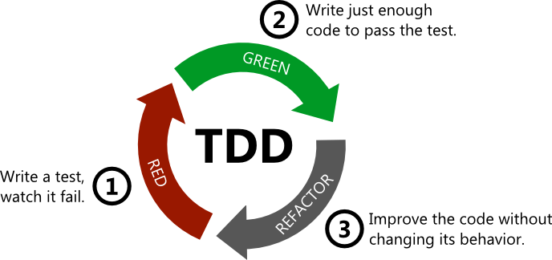

# 2장 테스트

애플리케이션은 계속 변하고 복잡해져 가기 때문에 **변화에 대응이 필요**하다.

- 확장과 변화를 고려한 객체지향적 설계(IoC)
- 만들어진 코드를 확신할 수 있게 해주고, 변화에 유연하게 대처할 수 있는 자신감을 주는 **테스트 기술**

# 2.1 UserDaoTest 다시 보기

## 테스트의 유용성

**테스트**란 내가 예상하고 의도한 대로 코드가 정확히 동작하는지를 확인해서, 만든 코드를 확신할 수 있게 해주는 작업

## UserDaoTest의 특징

```java
class UserDaoTest {
    public static void main(String[] args) throws SQLException, ClassNotFoundException {
        AnnotationConfigApplicationContext context = new AnnotationConfigApplicationContext(DaoFactory.class);
        UserDao userDao = context.getBean("userDao", UserDao.class);

        User user = new User();
        user.setId("gildong1");
        user.setName("홍길동");
        user.setPassword("1004");

        userDao.add(user);

        System.out.println("user = " + user + " 등록 성공!");

        User findUser = userDao.get(user.getId());
        System.out.println(findUser.getName());
    }
}
```

- Java에서 endpoint가 되는 main() 를 실행시켜 테스트 진행

### 웹을 통한 DAO 테스트 방법의 문제점

- MVC 계층을 모두 구현해야한다.
    - 에러가 발생하면 추적하기 어렵다
- 매번 웹 화면에서 입력 값을 입력하고 테스트를 수행해야한다.
- 테스트 하고자 하는 영역과 다른 계층, 컴포넌트 등에 영향을 줄 수 있다.

### 작은 단위의 테스트

- 테스트 하고자 하는 대상에만 집중해서 테스트하는 것이 중요
- 테스트는 가능한 **작은 단위**로 쪼개서 수행한다.
    - **관심사 분리**는 테스트에도 적용되는 원리
- 작은 **단위**의 코드에 대해 테스트를 수행하는 것은 **단위 테스트(unit test)**라고 한다.
    - 단위의 범위는 개개인의 차이가 있을 수 있다
    - 단위는 작을 수록 좋지만 과연 의미있는 테스트인지는 상황에 맞게 판단이 필요하다.
- 물론 작은 단위의 테스트를 모아서 한번에 수행하는 테스트도 필요하다.

### 자동수행 테스트 코드

UserDaoTest는 main() 를 실행하는 것으로 입력 값을 자동으로 넣고 테스트를 수행한다.

이는 웹 화면에서 수동으로 값을 입력하고 각 계층을 거쳐 DB까지 저장되는 과정을 생각하면 훨씬 효율적이다.

이렇게 자동으로 수해오디는 테스트의 장점은 자주 반복할 수 있다는 것이다.

### 지속적인 개선과 점진적인 개발을 위한 테스트

앞서 초난감 DAO에서 문제점을 찾고 개선하는 과정에서 테스트 코드 덕분에 안전하게 리펙토링을 할 수 있었다.

> 레거시 프로젝트를 리펙토링해야하는 상황에서 기존 코드에 대한 테스트 코드를 먼저 작성한 후에 작은 단위부터 리펙토링을 수행하는 것이 좋다.
> 

## UserDaoTest의 문제점

- 수동 확인 작업의 번거로움
    - 테스트 검증을 콘솔 로그에 찍힌 정보를 직접 확인해야한다.
- 실행 작업의 번거로움
    - 매번 main() 메소드를 호출해야한다.
    - main()은 한 클래스에 하나만 정의할 수 있어서 다른 테스트를 수행해야할 때 각각 클래스를 만들어줘야한다.

# 2.2 UserDaoTest 개선

## 테스트 검증의 자동화

테스트는 **성공, 실패** 두 가지 결과를 가진다.

실패는 2가지로 구분할 수 있다.

- 에러가 발생해서 실패하는 경우
- 에러가 발생하지 않았지만 기대 값과 달라 실패한 경우

기존 매번 수동으로 검증해야 했던 부분의 코드를 추가하면 아래와 같다.

```jsx
class UserDaoTest {
    public static void main(String[] args) throws SQLException, ClassNotFoundException {
        AnnotationConfigApplicationContext context = new AnnotationConfigApplicationContext(DaoFactory.class);
        UserDao userDao = context.getBean("userDao", UserDao.class);

        User user = new User();
        user.setId("gildong1");
        user.setName("홍길동");
        user.setPassword("1004");

        userDao.add(user);
        System.out.println("user = " + user + " 등록 성공!");

				//검증 부분 추가
        User findUser = userDao.get(user.getId());
        if (!findUser.getName().equals(user.getName())) {
            System.out.println("테스트 실패 (name)");
        } else if (!findUser.getPassword().equals(user.getPassword())) {
            System.out.println("테스트 실패 (password)");
        } else {
            System.out.println("조회 테스트 성공");
        }
    }
}
```

- 위 코드의 동작에 영향을 미칠 수 있는 어떤 변화라도 생기면 언제든 테스트를 수행하여 로직을 검증할 수 있다.
- 이렇게 테스트 코드를 작성해 두면 개발 과정에서, 또는 유지보수를 하면서 기존 애플리케이션 코드에 수정을 할 때 안정감있게 개발을 진행할 수 있다.

## 테스트의 효율적인 수행과 결과 관리

- 현재 main()를 실행하여 테스트하는 방법에는 다음과 같은 한계가 있다.
    - 일정한 패턴을 가진 테스트만들기
    - 많은 테스트를 실행하기
    - 테스트 결과를 종합해서 보기
    - 테스트가 실패한 곳을 빠르게 찾기
- 자바 테스팅 프레임워크 JUnit을 활용
- 테스트가 main() 메소드로 작성되었다는 것은 제어권을 직접 갖는다는 의미
- JUnit 을 사용하면 제어권을 프레임워크가 갖도록할 수 있다.

### UserDaoTest main > JUnit 전환

```java
import org.junit.jupiter.api.Test;
import org.springframework.context.annotation.AnnotationConfigApplicationContext;
import toby.spring.user.domain.User;

import java.sql.SQLException;

import static org.junit.jupiter.api.Assertions.assertEquals;

class UserDaoTest {

    //junit 5 는 메소드에 접근제어자(public)을 생략해도된다.
    @Test
    void addAndGet() throws SQLException, ClassNotFoundException {
        AnnotationConfigApplicationContext context = new AnnotationConfigApplicationContext(DaoFactory.class);
        UserDao userDao = context.getBean("userDao", UserDao.class);

        User user = new User();
        user.setId("gildong2");
        user.setName("홍길동");
        user.setPassword("9999");

        userDao.add(user);
        System.out.println("user = " + user + " 등록 성공!");

        User findUser = userDao.get(user.getId());
        assertEquals(user.getName(), findUser.getName());
        assertEquals(user.getPassword(), findUser.getPassword());
    }
}
```

# 2.3 개발자를 위한 테스팅 프레임워크 JUnit

- JUnit 은 한 번에 여러 테스트 클래스를 동시에 실행할 수 있다.

## 테스트 결과의 일관성

- UserDaoTest는 매번 테이블의 데이터를 삭제해줘야하고 상황에 따라 언제는 성공하고 언제는 실패하는 테스트이다.
- 테스트가 일관되도록 테스트 실행 전, 후에 데이터를 삭제하는 기능을 추가가 필요하다.

### deleteAll(), getCount() 추가

```java
public int getCount() throws ClassNotFoundException, SQLException {
    Connection conn = connectionMaker.makeConnection();

    PreparedStatement ps = conn.prepareStatement("select count(*) from users");

    ResultSet rs = ps.executeQuery();
    rs.next();
    int count = rs.getInt(1);
    
    rs.close();
    ps.close();
    conn.close();

    return count;
}

public void deleteAll() throws ClassNotFoundException, SQLException {
    Connection conn = connectionMaker.makeConnection();

    PreparedStatement ps = conn.prepareStatement("delete from users");
    ps.executeUpdate();

    ps.close();
    conn.close();
}
```

**테스트 수행(addAndGet()에 추가)**

```java
class UserDaoTest {

    //junit 5 는 메소드에 접근제어자(public)을 생략해도된다.
    @Test
    void addAndGet() throws SQLException, ClassNotFoundException {
        AnnotationConfigApplicationContext context = new AnnotationConfigApplicationContext(DaoFactory.class);
        UserDao userDao = context.getBean("userDao", UserDao.class);

        userDao.deleteAll();
        assertEquals(userDao.getCount(), 0);
        
        User user = new User();
        user.setId("gildong2");
        user.setName("홍길동");
        user.setPassword("9999");

        userDao.add(user);
        assertEquals(userDao.getCount(), 1);
        System.out.println("user = " + user + " 등록 성공!");

        User findUser = userDao.get(user.getId());
        assertEquals(user.getName(), findUser.getName());
        assertEquals(user.getPassword(), findUser.getPassword());
    }
}
```

- 매번 테이블의 데이터를 삭제하여 항상 성공하는 테스트로 개선하였다.
- **단위 테스트**는 코드가 바뀌지 않는다면 매번 실행할 때마다 동일한 테스트 결과를 얻을 수 있어야 한다.
- **단위 테스트**는 DB에 남아있는 데이터와 같은 외부 환경에 영향을 받지 말아야한다.
- **단위 테스트**는 순서를 바꿔도 동일한 결과가 보장되도록 만들어야 한다.

## 포괄적인 테스트

- 테스트 메소드는 한 번에 한 가지 검증 목적에만 충실한 것이 좋다.

### getCount() 테스트

getCount() 메소드를 addAndGet()에서가 아닌 새로운 테스트 메소드에서 검증해보자

```java
@Test
void count() throws SQLException, ClassNotFoundException {
    AnnotationConfigApplicationContext context = new AnnotationConfigApplicationContext(DaoFactory.class);
    UserDao userDao = context.getBean("userDao", UserDao.class);
    User user1 = new User("user1", "kim", "1001");
    User user2 = new User("user2", "kim", "1002");
    User user3 = new User("user3", "kim", "1003");

    userDao.deleteAll();
    assertEquals(userDao.getCount(), 0);

    userDao.add(user1);
    assertEquals(userDao.getCount(), 1);
    
    userDao.add(user2);
    assertEquals(userDao.getCount(), 2);
    
    userDao.add(user3);
    assertEquals(userDao.getCount(), 3);
}
```

### addAndGet() 테스트 보완

id로 user 정보를 가져오는 get()의 테스트를 보완해보자

- get() 기능이 정확한 user 정보를 가져오는지 테스트

```java
//junit 5 는 메소드에 접근제어자(public)을 생략해도된다.
@Test
void addAndGet() throws SQLException, ClassNotFoundException {
    AnnotationConfigApplicationContext context = new AnnotationConfigApplicationContext(DaoFactory.class);
    UserDao userDao = context.getBean("userDao", UserDao.class);

    userDao.deleteAll();
    assertEquals(userDao.getCount(), 0);

    User user1 = new User("gildong1", "홍길동1", "1001");
    User user2 = new User("gildong2", "홍길동2", "1002");

    userDao.add(user1);
    userDao.add(user2);
    assertEquals(userDao.getCount(), 2);

    User findUser1 = userDao.get(user1.getId());
    assertEquals(user1.getName(), findUser1.getName());
    assertEquals(user1.getPassword(), findUser1.getPassword());

    User findUser2 = userDao.get(user2.getId());
    assertEquals(user2.getName(), findUser2.getName());
    assertEquals(user2.getPassword(), findUser2.getPassword());
}
```

### get() 예외조건에 대한 테스트

- get() 기능의 예외조건 처리
    - 조회 결과가 없는 경우 null 반환 or throws Exception

**get() 수정**

```java
public User get(String id) throws ClassNotFoundException, SQLException {
    Connection conn = connectionMaker.makeConnection();

    PreparedStatement ps = conn.prepareStatement("select * from users where id = ?");
    ps.setString(1, id);

    ResultSet rs = ps.executeQuery();
    User user = null;
    if (rs.next()) {
        user = new User();
        user.setId(rs.getString("id"));
        user.setName(rs.getString("name"));
        user.setPassword(rs.getString("password"));
    }

    rs.close();
    ps.close();
    conn.close();
		// 조회된 데이터가 없으면 Exception
    if (user == null) {
        throw new EmptyResultDataAccessException(1);
    }
    return user;
}
```

**get() 테스트**

```java
@Test
void get_exception() {
    AnnotationConfigApplicationContext context = new AnnotationConfigApplicationContext(DaoFactory.class);
    UserDao userDao = context.getBean("userDao", UserDao.class);

    assertThatThrownBy(() -> userDao.get("unknown"))
            .isInstanceOf(EmptyResultDataAccessException.class);
}
```

### 포괄적인 테스트

- 테스트 작성 시 자주하는 실수는 성공하는 테스트만을 작성하는 것이다.
- 테스트는 성공 뿐 아니라 실패하는 시나리오에 대해서도 반드시 작성하는 것이 좋다.

## 테스트가 이끄는 개발

### 테스트 주도 개발



- **RED**: 실패하는 테스트 코드를 먼저 만든다.
- **GREEN**: 해당 테스트가 성공하도록 만든다.
- **REFACTOR**: 성공한 테스트 코드를 리펙토링하여 개선한다.

> **TDD의 기본 원칙**
실패한 테스트를 성공시키기 위한 목적이 아닌 코드는 만들지 않는다.
> 

## 테스트 코드 개선

- 애플리케이션 코드 뿐 아니라 테스트 코드도 개선이 필요하다.
- UserDaoTest의 테스트 메소드에서 반복적으로 userDao 빈을 가져오는 코드를 개선해보자

```java
AnnotationConfigApplicationContext context = new AnnotationConfigApplicationContext(DaoFactory.class);
UserDao userDao = context.getBean("userDao", UserDao.class);
```

### JUnit 테스트 수행 순서

1. 테스트 클래스에서 @Test가 붙은 메소드를 찾는다
2. 테스트 클래스의 객체를 생성
    1. 테스트 메소드 하나당 하나의 객체가 생성된다.
3. @BeforeEach가 붙은 메소드 실행
4. @Test가 붙은 메소드 실행, 결과 저장
5. @AfterEach가 붙은 메소드 실행
6. 2~5번 반복
7. 모든 테스트 결과 제공

- JUnit은 각 테스트가 서로 영향을 주지 않고 독립적으로 실행됨을 보장하기 위해서 매번 새로운 객체가 생성된다.

### 픽스처

- 테스트를 수행하는 데 필요한 정보나 객체를 픽스처(fixture)라고 한다.
- 여러 테스트에서 반복적으로 사용되기 때문에 @Before 메소드를 이용해 생성해두면 편리하다.

# 2.4 스프링 테스트 적용

UserDaoTest에서 애플리케이션 컨텍스트가 테스트 메소드 하나가 수행될 때마다 생성되는 문제점이 있다. 테스트 혹은 빈이 많아지면 컨텍스트 생성 시간도 많이 걸리게 되기 때문에 이를 개선해보자.

## 테스트를 위한 애플리케이션 컨텍스트 관리

### 스프링 테스트 컨텍스트 프레임워크 적용

```java
@SpringBootTest
@ContextConfiguration(locations = "/applicationContext.xml")
class UserDaoTest {

    @Autowired
    private UserDao userDao;

    private User user1;
    private User user2;
    private User user3;
		...
}
```

- @SpringBootTest: 테스트 수행 시 테스트 애플리케이션 로드하겠다고 선언하는 어노테이션
- @ContextConfiguration:  컨텍스트가 로드랑 설정파일의 위치를 설정
- 각 테스트 메소드, 클래스들은 **하나의 애플리케이션 컨텍스트를 공유**한다.
- @Autowired가 붙은 인스턴스 변수가 있으면 변수 타입과 일치하는 컨텍스트 내의 빈을 찾는다. 타입이 일치하는 빈이 있으면 인스턴스 변수에 주입해준다.
    - `변수 타입 > 변수 이름` 순으로 일치하는 빈을 찾는다.(없으면 에러)
- 스프링 애플리케이션 컨텍스트는 초기화할 때 자기 자신도 빈으로 등록한다.

## DI와 테스트

의존성 주입을 위한 인스턴스의 타입은 구현 클래스가 아닌 인터페이스로 두는 것이 좋다.

1. 소프트웨어 개발에서 절대 바뀌지 않는 것은 없기 때문에 다양한 확장 가능성을 두고 인터페이스로 선언하는 것이 좋다.
2. 클래스 구현 방식이 변하지 않아도 인터페이스를 두고 DI를 적용하면 다른 차원의 서비스 기능을 도입할 수 있다.
3. 인터페이스로 DI 해두면 테스트 하기가 용이해진다.

### 테스트 코드에 의한 DI

테스트 환경에서 운영의 DataSource 를 사용할 수 없으니 테스트 전용 DataSource를 DI를 통해 분리할 수 있다.

```java
@DirtiesContext
class UserDaoDataTest {

    @Autowired
    private UserDataDao userDao;

    private User user1;
    private User user2;
    private User user3;

    @BeforeEach
    void setUp() {
        DataSource dataSource = new SingleConnectionDataSource("jdbc:h2:tcp://localhost/~/test", "sa", "", true);
        userDao.setDataSource(dataSource);
				...
		}
```

- 스프링 테스트 컨텍스트 프레임워크를 적용했다면 **애플리케이션 컨텍스트는 테스트 중에 딱 한 개만 만들어지고 모든 테스트에서 공유해서 사용**한다.
    - 따라서 애플리케이션 컨텍스트의 구성이나 상태를 테스트 내에서 변경하지 않는 것이 원칙이다.
- `**@DirtiesContext**` 스프링의 상태를 변경한다는 것을 알려주는 어노테이션
    - 테스트 컨텍스트는 해당 어노테이션이 붙은 테스트 클래스에는 애플리케이션 컨텍스트 공유를 허용하지 않는다.
    - 테스트 메소드를 수행하면 매번 새로운 애플리케이션 컨텍스트를 만들어서 다음 테스트가 사용하게 한다.
    - 클래스가 아닌 메소드 단위에 적용할 수 있다.

### 테스트를 위한 별도의 DI 설정

- 설정파일을 운영, 테스트 용으로 분리해서 관리하는 방법

기존 applicationContext.xml 파일을 그대로 복사해서 DataSource 내용을 테스트용 DB의 정보로 수정한다.

```xml
<?xml version="1.0" encoding="UTF-8"?>
<beans xmlns="http://www.springframework.org/schema/beans"
       xmlns:xsi="http://www.w3.org/2001/XMLSchema-instance"
       xsi:schemaLocation="http://www.springframework.org/schema/beans http://www.springframework.org/schema/beans/spring-beans.xsd">

    <bean id="connectionMaker" class="toby.spring.user.dao.DConnectionMaker" />

    <bean id="dataSource" class="org.springframework.jdbc.datasource.SimpleDriverDataSource">
        <property name="driverClass" value="org.h2.Driver" />
        <property name="url" value="jdbc:h2:tcp://localhost/~/test" />
        <property name="username" value="sa" />
        <property name="password" value="" />
    </bean>

    <bean id="userDao" class="toby.spring.user.dao.UserDao">
        <property name="connectionMaker" ref="connectionMaker" />
    </bean>
</beans>
```

그리고 해당 설정 파일을 테스트에서 사용하도록 설정한다

```java
@SpringBootTest
@ContextConfiguration(locations = "/test-applicationContext.xml")
class UserDaoDataTest {
```

### 컨테이너 없는 DI 테스트

```java
class UserDaoDataNoContainerTest {
    private UserDataDao userDao;

    private User user1;
    private User user2;
    private User user3;

    @BeforeEach
    void setUp() {
        userDao = new UserDataDao();
        DataSource dataSource = new SingleConnectionDataSource("jdbc:h2:tcp://localhost/~/test", "sa", "", true);
        userDao.setDataSource(dataSource);

        user1 = new User("gildong1", "홍길동1", "1001");
        user2 = new User("gildong2", "홍길동2", "1002");
        user3 = new User("gildong3", "홍길동3", "1003");
    }
		...
}
```

- DI는 객체지향 프로그래밍 스타일이다. 따라서 DI를 위해 컨테이너가 반드시 필요한 것은 아니다.
- DI 컨테이너나 프레임워크는 DI를 편하게 적용하도록 도움을 줄 뿐, 컨테이너가 DI를 가능하게 해주는 것은 아니다.
- DI가 적용된 코드는 테스트에서도 다양한 방식으로 활용할 수 있을 만큼 유연하다.

> **테스트하기 좋은 코드가 좋은 코드일 가능성이 높다.**
> 

### DI를 이용한 테스트 방법 선택

- 스프링 컨테이너 없이 테스트할 수 있는 방법을 가장 우선적으로 고려한다.
    - 이 방법은 테스트 수행 속도가 가장 빠르고 테스트 자체가 간결하다.
- 여러 오브젝트와 복잡한 의존관계를 갖고 있는 오브젝트를 테스트해야 할 경우 **스프링의 설정을 이용한 DI 방식의 테스트를 이용**하는 것이 좋다.
- 테스트 전용 설정파일을 두고 사용하는 것이 좋다.

# 2.5 학습 테스트로 배우는 스프링

- 라이브러리나 API에 대해서 테스트를 작성하는 것을 학습 테스트(learning test)라고 한다.
- 자신이 사용할 API나 프레임워크의 기능을 테스트로 보면서 사용 방법을 익히려는 목적이다.

## 학습 테스트의 장점

- 다양한 조건에 따른 기능을 손쉽게 확인해볼 수 있다.
- 학습 테스트 코드를 개발 중에 참고할 수 있다.
- 프레임워크나 제품을 업그레이드할 때 호환성 검증을 도와준다.
- 테스트 작성에 대한 좋은 훈련이 된다.
- 새로운 기술을 공부하는 과정이 즐거워진다.

> [스프링 저장소](https://github.com/spring-projects/spring-boot/tree/main/spring-boot-project/spring-boot)을 참고하면 수 많은 테스트 코드를 참고할 수 있다.
> 

## 학습 테스트 예제

### JUnit 테스트 오브젝트 테스트

각 테스트 메소드가 실행될 때마다 테스트 오브젝트가 매번 생성되는지 테스트

```java

import org.junit.jupiter.api.Test;

import java.util.HashSet;
import java.util.Set;

import static org.assertj.core.api.Assertions.assertThat;

public class JUnitTest {
    static Set<JUnitTest> set = new HashSet<>();

    @Test
    void test1() {
        assertThat(set).doesNotContain(this);
        set.add(this);
    }

    @Test
    void test2() {
        assertThat(set).doesNotContain(this);
        set.add(this);
    }

    @Test
    void test3() {
        assertThat(set).doesNotContain(this);
        set.add(this);
    }
}
```

### 스프링 테스트 컨텍스트 테스트

테스트 메소드, 클래스의 개수와 상관없이 스프링의 테스트용 애플리케이션 컨텍스트는 한 개만 만들어지고 모든 테스트에서 공유되는지 테스트

```java
@SpringBootTest
@ContextConfiguration(locations = "/junit.xml")
public class JUnitTest {
    @Autowired
    ApplicationContext context;

    static Set<JUnitTest> set = new HashSet<>();
    static ApplicationContext contextObj = null;

    @Test
    void test1() {
        assertThat(set).doesNotContain(this);
        set.add(this);

        assertThat(contextObj == null || contextObj == this.context).isTrue();
        contextObj = this.context;
    }

    @Test
    void test2() {
        assertThat(set).doesNotContain(this);
        set.add(this);

        assertThat(contextObj == null || contextObj == this.context).isTrue();
        contextObj = this.context;
    }

    @Test
    void test3() {
        assertThat(set).doesNotContain(this);
        set.add(this);

        assertThat(contextObj == null || contextObj == this.context).isTrue();
        contextObj = this.context;
    }
}
```

## 버그 테스트

- **버그 테스트(bug test)**란 코드에 오류가 있을 때 그 오류를 가장 잘 드러내줄 수 있는 테스트를 말한다.
- 버그 테스트는 실패하도록 만들어야 한다.

**버그 테스트의 필요성**

- 테스트의 완성도를 높여준다.
- 버그의 내용을 명확하게 분석하게 해준다.
    - 실패하는 테스트를 만드려면 어떤 이유로 문제가 생겼는지를 명확하게 알아야 하기 때문에 버그를 효과적으로 분석할 수 있다.
- 기술적인 문제를 해결하는 데 도움이 된다.

> **동등분할(equivalence partitioining)**
같은 결과를 내는 값의 범위를 구분해서 각 대표 값으로 테스트를 하는 방법

**경계값 분석(boundary value analysis)**
에러는 동등분할 범위의 경계에서 주로 많이 발생한다는 특징을 이용해서 경계의 근처에 있는 값을 이용해 테스트하는 방법
> 

# References