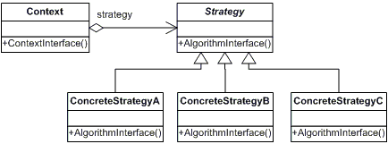
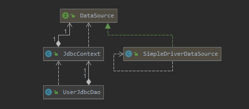

# 3. 템플릿

- **개방 폐쇄 원칙(OPC):** 확장에는 자유롭게 열려 있고 변경에는 굳게 닫혀 있다는 객체지향 설계의 핵심 원칙
    - 어떤 부분은 변경을 통해 그 기능이 다양해지고 확장하려는 성질이 있고, 어떤 부분은 고정되어 있고 변하지 않으려는 성질이 있음을 말한다.
    - 변화의 특성이 다른 부분을 구분해주고, 각각 다른 목적과 다른 이유에 의해 다른 시점에 독립적으로 변경될 수 있는 효율적인 구조
- **템플릿**이란 개발 폐쇄 원칙과 같이 성질이 다른 코드 중에서 변경이 거의 일어나지 않으며 일정한 패턴으로 유지되는 특성을 가진 부분을 자유롭게 변경되는 성질을 가진 부분으로부터 독립시켜서 효과적으로 활용할 수 있도록 하는 방법을 말한다.

# 3.1 다시 보는 초난감 DAO

## 예외처리 기능을 갖춘 DAO

### JDBC 수정 기능의 예외처리 코드

```java
public void deleteAll() throws ClassNotFoundException, SQLException {
    Connection conn = dataSource.getConnection();

    PreparedStatement ps = conn.prepareStatement("delete from users");
    ps.executeUpdate();

    ps.close();
    conn.close();
}
```

위 코드에서 공유 리소스(connection, preparedstatement 와 같이)에 대한 자원을 해제해야하는데 자원을 해제 하는 시점에 예외가 발생하는 부분에 대한 처리가 고려되지 않았다.

만약 예외가 발생하면 해당 메소드를 빠져나가게 되고 자원을 제대로 해제되지 않게된다. 이렇게 리소스가 반환되지 않으면 결국 서버의 리소스가 고갈하게 되서 장애가 발생하게 될 것이다.

```java
public void deleteAll() throws ClassNotFoundException, SQLException {
		Connection conn = null;
		PreparedStatement ps = null;
		try {
		    conn = dataSource.getConnection();
		    ps = conn.prepareStatement("delete from users");
		    ps.executeUpdate();
		} catch (SQLException e) {
		    throw e;
		} finally {
		    if (ps != null) {
		        try {
		            ps.close();
		        } catch (SQLException e) {
		        }
		    }
		    if (conn != null) {
		        try {
		            conn.close();
		        } catch (SQLException e) {
        }
    }
}
```

- close() 메소드를 수행할 때도 예외가 발생할 수 있기 때문에 try-catch 로 감싸서 예외 처리를 반드시 해준다.

### JDBC 조회 기능의 예외처리

```java
public int getCount() throws ClassNotFoundException, SQLException {
    Connection conn = dataSource.getConnection();

    PreparedStatement ps = conn.prepareStatement("select count(*) from users");

    ResultSet rs = ps.executeQuery();
    rs.next();
    int count = rs.getInt(1);

    rs.close();
    ps.close();
    conn.close();

    return count;
}
```

조회 기능의 경우 ResultSet에 대한 처리가 추가되기 때문에 앞서본 기능보다 복잡하다.

```java
public int getCount() throws ClassNotFoundException, SQLException {
    Connection conn = null;
    PreparedStatement ps = null;
    ResultSet rs = null;
    try {
        conn = dataSource.getConnection();

        ps = conn.prepareStatement("select count(*) from users");

        rs = ps.executeQuery();
        rs.next();
        int count = rs.getInt(1);
        return count;
    } catch (SQLException e) {
        if (rs != null) {
            try {
                rs.close();
            } catch (SQLException e1) {
            }
        }
        if (rs != null) {
            try {
                ps.close();
            } catch (SQLException e1) {
            }
        }
        if (rs != null) {
            try {
                conn.close();
            } catch (SQLException e1) {
            }
        }
    }
    return 0;
}
```

- 위 코드에서 자원을 얻는 순서가 Connection > PreparedStatement > ResultSet 이라면 자원 해제의 순서는 역순이다.

# 3.2 변하는 것과 변하지 않는 것

## JDBC try/catch/finally 코드의 문제점

앞서 본 코드의 문제점은 try/catch/finally 구문이 반복되서 코드 수를 늘리고 있다는 것이다. 또한, 사람이 직접 작성하는 것이기 때문에 실수로 리소스 반환이 필요한 부분을 빼먹을 수 도 있다.

이러한 문제를 해결하기 위한 핵심은 변하지 않는, 그러나 **많은 곳에서 중복되는 코드와 로직에 따라 자꾸 확장되고 자주 변하는 코드를 잘 분리해내는 작업**이다.

## 분리와 재사용을 위한 디자인 패턴 적용

```java
// 변하는 부분
conn = dataSource.getConnection();
ps = conn.prepareStatement("select count(*) from users");
rs = ps.executeQuery();
rs.next();
int count = rs.getInt(1);
return count;

//변하지 않는 부분
Connection conn = null;
PreparedStatement ps = null;
ResultSet rs = null;
try {
		...//변하는 부분
} catch() {
		...
}
```

try/catch/finally 구문을 적용한 코드들을 살펴보면 자주 변하는 부분은 실제 구문을 수행하는 부분이고 변하지 않는 부분은 객체(Connection, PreparedStatement, ResultSet)를 생성하고 반환하는 부분일 것 이다.

### 템플릿 메소드 패턴의 적용

**템플릿 메소드 패턴**은 **상속**을 통해 기능을 확장해서 사용하는 부분이다. 변하지 않는 부분은 슈퍼클래스에 두고 변하는 부분은 추상 메소드로 정의해둬서 서브클래스에서 오버라이드하여 새롭게 정의해 쓰도록하는 것이다.

```java
public class UserDaoDeleteAll extends UserDataDao {

    protected PreparedStatement makeStatement(Connection conn) throws SQLException {
        PreparedStatement ps = conn.prepareStatement("delete from users");
        return ps;
    }
}
```

- UserDao클래스의 기능을 확장하고 싶을 때마다 상속을 통해 자유롭게 확장할 수 있다.
- 확장으로 기존의 상위 DAO 클래스에 영향을 주지 않아 개발 폐쇄 원칙을 지키는 구조다.
- DAO 로직마다 상속을 통해 새로운 클래스를 만들어야하는 단점이 존재한다.
- 확장구조가 이미 클래스를 설게하는 시점에 고정되어 버린다.
- 상속을 통해 확장하는 템플릿 메소드 패턴의 단점이 존재

### 전략 패턴의 적용

**전략 패턴**은 개방 폐쇄 원칙을 잘 지키는 구조이면서 템플릿 메소드 패턴보다 유연하고 확장성이 뛰어난 것, 오브젝트를 둘로 분리하여 클래스 레벨에서 인터페이스를 통해서만 의존하도록 만드는 방법이다.



여기서 Strategy는 **자주 변하는 부분**이고 Context가 **변하지 않는 부분**에 해당한다.

자주 변하는 부분은 위와 같이 인터페이스로 정의하고 해당 인터페이스를 구현하는 클래스를 정의하면된다.

```java
// Strategy
public interface StatementStrategy {
    PreparedStatement makePreparedStatement(Connection conn) throws SQLException;
}

// Concrete Strategy
public class DeleteAllStatement implements StatementStrategy {
    @Override
    public PreparedStatement makePreparedStatement(Connection conn) throws SQLException {
        PreparedStatement ps = conn.prepareStatement("delete from users");
        return ps;
    }
}

// Context
public void deleteAll() throws ClassNotFoundException, SQLException {
    Connection conn = null;
    PreparedStatement ps = null;
    try {
        conn = dataSource.getConnection();
				// 전략 적용
        StatementStrategy statement = new DeleteAllStatement();
        statement.makePreparedStatement(conn);
    } catch (SQLException e) {
        throw e;
		}
		...
}
```

Context를 보면 특정 구현 클래스인 DeleteAllStatement에 의존하고 있다는 것은 OCP을 위반하고 있다고 할 수 있다.

### DI 적용을 위한 클라이언트/컨텍스트 분리

**전략 패턴**은 Context가 어떤 전략을 사용하게 할 것인가는 Context를 사용하는 앞단의 Client가 결정하는 게 일반적이다. Client가 구체적인 전략의 하나를 선택하고 오브젝트로 만들어서 Context에 전달하는 것이다. 

결국 **OCP를 지키기 위해서 전략 객체 생성과 Context로의 전달을 담당하는 책임을 분리**하는 ObjectFactory와 같은 클래스를 두고 **DI를 수행**하는 것이다.

DI란 이러한 **전략 패턴의 장점을 일반적으로 활용할 수 있도록 만든 구조**이다.

```java
StatementStrategy statement = new DeleteAllStatement();
```

따라서, Context에서 구체적인 클래스를 의존하고 있는 부분인 위 코드를 분리해내는 것이 목표이다.

그렇기 위해서 해당 전략을 메소드 파라미터로 받아서 처리하도록 한다.

```java
public void deleteAll() throws SQLException {
    jdbcContextWithStatementStrategy(new DeleteAllStatement());
}

public void jdbcContextWithStatementStrategy(StatementStrategy stmt) throws SQLException {
    Connection conn = null;
    PreparedStatement ps = null;
    try {
        conn = dataSource.getConnection();
        stmt.makePreparedStatement(conn);
    } catch (SQLException e) {
        throw e;
    } finally {
        if (ps != null) {
            try {
                ps.close();
            } catch (SQLException e) {
            }
        }
        if (conn != null) {
            try {
                conn.close();
            } catch (SQLException e) {
            }
        }
    }
}
```

deleteAll()은 클라이언트가 되고 전략 객체를 생성하고 컨텍스트를 호출하는 책임을 가지게된다.

> DI의 가장 중요한 개념은 제3자의 도움을 통해 두 객체 사이의 유연한 관계가 설정되도록 만드는 것이다.
> 

# 3.3 JDBC 전략 패턴의 최적화

## 전략 클래스의 추가 정보

add() 메소드의 경우 User라는 부가적인 정보를 필요로 한다. 이 경우를 전략 클래스로 옮겨보자

```java
public class UserDataDao {
    private DataSource dataSource;

    public void add(User user) throws SQLException {
        AddStatement st = new AddStatement(user);
        jdbcContextWithStatementStrategy(st);
    }
		...
}

// 전략 클래스
public class AddStatement implements StatementStrategy {
    private User user;

    public AddStatement(User user) {
        this.user = user;
    }

    @Override
    public PreparedStatement makePreparedStatement(Connection conn) throws SQLException {
        PreparedStatement ps = conn.prepareStatement("insert into users (id, name, password) values (?, ?, ?)");
        ps.setString(1, user.getId());
        ps.setString(2, user.getName());
        ps.setString(3, user.getPassword());
        return ps;
    }
}
```

## 전략과 클라이언트의 동거

지금까지 구현한 것의 문제점은 다음과 같다.

- DAO 메소드마다 새로운 StatementStrategy 구현 클래스를 만들어야 한다는 점이다.
    - 이렇게 되면 클래스 파일의 수가 많이 늘어나게 된다. 이전에 템플릿 메소드 패턴을 적용했을 때보다 더 나은점이 없다.
- add()와 같이 부가 정보 처리가 필요한 경우 부가 정보에 대한 인스턴스를 전략 클래스 인스턴스로 관리해야한다는 점이다.

### 로컬 클래스

클래스 파일이 많아지는 문제는 StatementStrategy 전략 클래스를 매번 생성하는 것이 아니라 UserDao 클래스 안에 내부 클래스로 정의하는 것이다.

```java
public void add(User user) throws SQLException {
    class AddStatement implements StatementStrategy {
        private User user;

        public AddStatement(User user) {
            this.user = user;
        }

        @Override
        public PreparedStatement makePreparedStatement(Connection conn) throws SQLException {
            PreparedStatement ps = conn.prepareStatement("insert into users (id, name, password) values (?, ?, ?)");
            ps.setString(1, user.getId());
            ps.setString(2, user.getName());
            ps.setString(3, user.getPassword());
            return ps;
        }
    }
    AddStatement st = new AddStatement(user);
    jdbcContextWithStatementStrategy(st);
}
```

AddStatement는 add()와 강하게 결합되어 있어 로컬 클래스로 만들어도 무리는 없어보인다.

로컬 클래스는 클래스가 내부 클래스이기 때문에 자신이 선언된 곳의 정보에 접근할 수 있다.

내부 메소드는 자신이 정의된 메소드의 로컬 변수에 직접 접근할 수 있기 때문에 내부 클래스에서 외부 변수를 사용하면서 변경을 방지하기 위해 외부 변수는 final로 선언하는 것이 좋다.

```java
public void add(final User user) throws SQLException {
    class AddStatement implements StatementStrategy {
        @Override
        public PreparedStatement makePreparedStatement(Connection conn) throws SQLException {
            PreparedStatement ps = conn.prepareStatement("insert into users (id, name, password) values (?, ?, ?)");
            ps.setString(1, user.getId());
            ps.setString(2, user.getName());
            ps.setString(3, user.getPassword());
            return ps;
        }
    }
    AddStatement st = new AddStatement();
    jdbcContextWithStatementStrategy(st);
}
```

> **중첩 클래스의 종류**
다른 클래스 내부에 정의되는 클래스를 **중첩 클래스(nested class)**라고 한다.
**중첩 클래스**는 독립적으로 오브젝트로 만들어질 수 있는 스태틱 클래스(static class)와 자신이 정의된 클래스의 오브젝트 안에서만 만들어질 수 있는 내부 클래스(inner class)로 구분된다.
 - 오브젝트 레벨에 정의되는 멤버 내부 클래스(member inner class)
- 메소드 레벨에 정의되는 로컬 클래스(local class)
- 이름을 갖지 않는 익명 내부 클래스(annoymous inner class)
> 

### 익명 내부 클래스

익명 내부 클래스는 이름을 갖지 않는 클래스로 클래스 선언과 오브젝트 생성이 결합된 형태로 만들어 진다.

add()와 deleteAll()을 **익명 내부 클래스**로 전환해보자

```java
public void add(final User user) throws SQLException {
    StatementStrategy st = conn -> {
        PreparedStatement ps = conn.prepareStatement("insert into users (id, name, password) values (?, ?, ?)");
        ps.setString(1, user.getId());
        ps.setString(2, user.getName());
        ps.setString(3, user.getPassword());
        return ps;
    };
    jdbcContextWithStatementStrategy(st);
}

public void deleteAll() throws SQLException {
    jdbcContextWithStatementStrategy(conn -> {
            PreparedStatement ps = conn.prepareStatement("delete from users");
            return ps;
        }
    );
}
```

# 3.4 컨텍스트와 DI

## JdbcContext의 분리

jdbcContextWithStatementStrategy()는 UserDao에 종속된 기능이 아닌 JDBC의 일반적인 로직을 담고 있다. 아닌 다른 클래스에서도 사용할 수 있도록 분리해보자.

### 클래스 분리

```java
public class JdbcContext {
    private DataSource dataSource;

    public void setDataSource(DataSource dataSource) {
        this.dataSource = dataSource;
    }

    public void workWithStatementStrategy(StatementStrategy stmt) throws SQLException {
        Connection conn = null;
        PreparedStatement ps = null;
        try {
            conn = dataSource.getConnection();
            stmt.makePreparedStatement(conn);
        } catch (SQLException e) {
            throw e;
        } finally {
            if (ps != null) {
                try {
                    ps.close();
                } catch (SQLException e) {
                }
            }
            if (conn != null) {
                try {
                    conn.close();
                } catch (SQLException e) {
                }
            }
        }
    }
}

//UserJdbcDao
public class UserJdbcDao {
    private JdbcContext jdbcContext;

    public UserJdbcDao(JdbcContext jdbcContext) {
        this.jdbcContext = jdbcContext;
    }

    public void add(final User user) throws SQLException {
        StatementStrategy st = conn -> {
            PreparedStatement ps = conn.prepareStatement("insert into users (id, name, password) values (?, ?, ?)");
            ps.setString(1, user.getId());
            ps.setString(2, user.getName());
            ps.setString(3, user.getPassword());
            return ps;
        };
        jdbcContext.workWithStatementStrategy(st);
    }

    public void deleteAll() throws SQLException {
        jdbcContext.workWithStatementStrategy(conn -> {
                PreparedStatement ps = conn.prepareStatement("delete from users");
                return ps;
            }
        );
    }
}
```

### 빈 의존관계 변경



JdbcContext는 DadaSource와 달리 구체 클래스 이다. 스프링의 DI는 인터페이스를 사이에 두고 의존 클래스를 바꿔서 사용하도록 하는 것이 목적이다. **JdbcContext는 그 자체로 독립적인 JDBC 컨텍스트를 제공해주는 서비스 오브젝트로서 의미가 있을 뿐 구현 방법이 변경될 가능성이 없어** 인터페이스로 구현하지 않은 것이다.

> 스프링의 빈 설정은 클래스 레벨이 아닌 **런타임 시에 만들어지는 오브젝트 레벨의 의존관계를 따라 정의**된다.
> 

jdbcContext를 사용하는 UserJdbcDao 클래스의 의존관계를 새롭게 추가해주자. (dataSource의 경우 jdbcContext를 설정하지 않는 메소드가 있어 남겨둔다.)

```xml
//test-applicationContext.xml
...
<bean id="jdbcContext" class="toby.spring.user.dao.JdbcContext">
    <property name="dataSource" ref="dataSource" />
</bean>

<bean id="userJdbcDao" class="toby.spring.user.dao.UserJdbcDao">
    <property name="jdbcContext" ref="jdbcContext" />
    <property name="dataSource" ref="dataSource" />
</bean>
```

## JdbcContext의 특별한 DI

UserJdbcDao와 JdbcContext 사이에는 인터페이스를 두지 않고 DI를 적용했다. 다시말해 클래스 레벨에서 의존관계가 결정되었다는 것이다.

### 스프링 빈으로 DI

1. 클래스 레벨에서 의존관계가 결정되는 것은 문제가 있는 것인가?? 
2. 스프링의 의도에 맞게 의존 객체 사이에 인터페이스를 두고 사용해야하는 걸까?? 

답은 꼭 그럴 필요는 없다는 것이다.

**DI 개념을 충실히 따르면, 인터페이스를 두고 객체간의 의존관계가 고정되지 않게 하고, 런타임 시에 의존할 객체와의 관계를 동적으로 주입해주는 것이 맞다 또한 인터페이스를 사용하지 않았다면 엄밀히 말해 온전한 DI라고 볼 수 없다.**

**스프링의 DI는 넓게 보자면 객체의 생성과 관계성정에 대한 제어권한을 오브젝트에서 제거하고 외부로 위임했다는 IoC라는 개념을 포괄한다.**

### UserJdbcDao와 JdbcContext 사이를 DI 구조로 만들어야 하는 이유

- JdbcContext가 스프링 컨테이너의 싱글톤 레지스트리에서 관리되는 싱글톤 빈이다
    - 내부에 dataSource 인스턴스가 있지만 읽기전용이므로 JdbcContext가 싱글톤이 되는 데 문제가 없다.
    - JdbcContext는 JDBC 컨텍스트 메소드를 제공해주는 일종의 **서비스 오브젝트**로서 의미가 있고 싱글톤으로 등록돼서 여러 오브젝트에서 공유해 사용하는 것이 이상적이다.
- JdbcContext가 DI를 통해 다른 빈에 의존하고 있다.
    - DI를 위해서는 주입되는 오브젝트와 주입받는 오브젝트 양쪽 모두 스프링 빈으로 등록돼야 한다.
    - 스프링이 생성하고 관리하는 IoC 대상이어야 DI에 참여할 수 있기 때문이다.
- 인터페이스를 사용하지 않은 이유?
    - 인터페이스를 사용하지 않았다는 것은 의존 객체간에 강하게 결합되어 있다는 것을 의미한다. 만약 UserDao가 Jdbc가 아닌 JPA와 같은 ORM으로 변경한다고 할 때, JdbcContext를 통채로 바꿔야할 것이다. 이러한 경우 굳이 인터페이스를 둘 이유가 없다.
    - 다만 이런 클래스를 바로 사용하는 코드 구성을 DI에 적용하는 것은 가장 마지막 단계에서 고려해야할 사항이다.

### 코드를 이용하는 수동 DI

UserJdbcDao 내부에서 직접 DI를 적용할 수 있는 방법이 있다. 다만 JdbcContext를 스프링 빈으로 등록해야하는 이유를 포기해야한다.

첫 번째는 JdbcContext를 싱글톤으로 만드는 것은 포기해야 한다. 다시말해 DAO마다 하나의 JdbcContext 객체를 갖고 있게 하는 것이다.(기껏해야 DAO 개수 만큼의 JdbcContext 인스턴스가 생기게 되는 것이다.)

결국 JdbcContext의 생성과 초기화를 UserJdbcDao가 갖게 되는 것이다. **자신이 사용할 오브젝트를 직접 만들고 초기화하는 전통적인 방법을 사용하는 것이다.**

두 번째는 스프링 빈으로 등록된 오브젝트와 관계가 설정되려면 자신도 스프링 빈으로 등록해야하는 것이다. 여전히 JdbcContext는 dataSource를 동적으로 주입받아야한다. 그러나 JdbcContext는 스프링 빈으로 등록되지 못하기 때문에 DI를 통해 주입받을 수 없다.

이를 위한 방법은 UserJdbcDao가 dataSource의 DI를 수행하도록 하는 것이다.

```xml
<bean id="userJdbcDao" class="toby.spring.user.dao.UserJdbcDao">
    <property name="dataSource" ref="dataSource" />
</bean>
```

```java
public class UserJdbcDao {
    private JdbcContext jdbcContext;
    private DataSource dataSource;

    public void setDataSource(DataSource dataSource) {
        this.jdbcContext = new JdbcContext();
        jdbcContext.setDataSource(dataSource);
        this.dataSource = dataSource;
    }
		...
}
```

setDataSource() 는 DI 컨테이너가 DataSource 오브젝트를 주입해줄 때 호출된다. 이때 JdbcContext에 대한 수동 DI 작업을 진행하게 된다.

이 방법의 장점은 인터페이스를 두지 않아도 될 만큼 긴밀한 관계를 갖는 DAO 클래스와 JdbcContext를 어색하게 따로 빈으로 분리하지 않고 내부에서 직접 만들어 사용하면서도 다른 오브젝트에 대한 DI를 적용할 수 있다는 것이다.

- 스프링의 DI를 이용하기 위해 빈으로 등록하는 방법
    - 장점
        - 오브젝트 사이의 실제 의존관계가 설정파일에 명확하게 드러난다.
    - 단점
        - DI의 근본적인 원칙에 부합하지 않는 구체적인 클래스와의 관계가 설정에 직접 노출된다.
- DAO의 코드를 이용해 수동 DI하는 방법
    - 장점
        - JdbcContext가 UserJdbcDao의 내부에서 만들어지고 사용되면서 그 관계를 외부에는 드러내지 않는다.
        - 필요에 따라 내부에서 은밀히 DI를 수행하고 그 전략을 외부에는 감출 수 있다.
    - 단점
        - JdbcContext를 여러 오브젝트가 사용하더라고 싱글톤으로 만들 수 없고, DI 작업을 위한 부가적인 코드가 필요하다.

# 3.5 템플릿과 콜백

지금까지 적용한 전략 패턴은 복잡하지만 바뀌지 않는 일정한 패턴을 갖는 작업 흐름이 존재하고 그중 일부분만 자주 바꿔서 사용해야 하는 경우에 적합한 구조이다. 이러한 방식은 스프링에서 `**템플릿/콜백 패턴**`이라고 부른다.

전략 패턴의 컨텍스트를 **`템플릿`**, 익명 내부 클래스로 만들어지는 오브젝트를 **`콜백`**이라고 부른다.

## 템플릿/콜백의 동작원리

- **템플릿**은 고정된 작업 흐름을 가진 코드를 재사용한다는 의미
- **콜백**은 템플릿 안에서 호출되는 것을 목적으로 만들어진 오브젝트

### 템플릿/콜백의 특징

- **템플릿/콜백 패턴의 콜백**은 보통 단일 메소드 인터페이스를 사용한다.
    - 여러 개의 메소드를 가진 일반적인 인터페이스를 사용할 수 있는 전략 패턴의 전략과 차이가 있다.
    - 템플릿의 작업 흐름 중 특정 기능을 위해 **한 번 호출되는 경우가 일반적**이기 때문이다.
- **콜백**은 일반적으로 하나의 메소드를 가진 인터페이스를 구현한 익명 내부 클래스로 만들어진다고 보면된다.
- 콜백 인터페이스의 메소드에는 보통 파라미터가 있다.
    - 이 파라미터는 템플릿의 작업 흐름 중에 만들어지는 컨텍스트 정보를 전달받을 때 사용된다.
- 클라이언트가 템플릿 메소드를 호출하면서 콜백 오브젝트를 전달하는 것은 메소드 레베에서 일어나는 DI다.
    - 템플릿이 사용할 콜백 인터페이스를 구현한 오브젝트를 메소드를 통해 주입해주는 DI작업이 클라이언트가 템플릿의 기능을 호출하는 것과 동시에 일어난다.
- 템플릿/콜백 방식에서는 매번 메소드 단위로 사용할 오브젝트를 새롭게 전달받는다.
- 콜백 오브젝트가 내부 클래스로서 자신을 생성한 클라이언트 메소드 내의 정보를 직접 참조한다는 것도 템플릿/콜백의 고유한 특징이다.
- 클라이언트와 콜백이 강하게 결합된다는 점도 일반적인 DI와 조금 다르다.
    - 템플릿/콜백 방식은 전략 패턴과 DI의 장점을 익명 내부 클래스 사용 전략과 결합한 활용법이라고 이해하면된다.
- 템플릿/콜백를 이해하기 위해서 해당 패턴에 녹아있는 전략 패턴과 수동 DI를 이해할 수 있어야한다.

### JdbcContext에 적용된 템플릿/콜백

UserJdbcDao, JdbcContext를 템플릿/콜백 패턴의 구조에서 살펴보면 템플릿과 클라이언트가 **메소드 단위**인 것이 특징이다.

## 편리한 콜백의 재활용

템플릿/콜백 방식은 템플릿에 담긴 코드를 여기저기서 반복적으로 사용하는 원시적인 방법에 비해 많은 장점이 있다.

- 클라이언트인 DAO의 메소드는 간결해진다.
    - 최소한의 데이터 액세스 로직만 갖는다.

다만 DAO 메소드에서 매번 익명 내부 클래스를 사용하기 때문에 상대적으로 코드를 작성하고 읽기가 불편함이 있다.

### 콜백의 분리와 재활용

기존 jdbcContext가 적용된 deleteAll()를 살펴보면 자주 바뀔 수 있는 부분은 "delete from users” 부분이다. 이 쿼리를 파라미터로 넘길 수 있도록 분리해보자.

```java
public void deleteAll() throws SQLException {
    executeSql("delete from users");
}

private void executeSql(final String query) throws SQLException {
    jdbcContext.workWithStatementStrategy(conn -> conn.prepareStatement(query));
}
```

바뀌지 않는 부분을 executeSql()로 만들고 바뀌는 부분인 쿼리는 파라미터로 받도록 분리하였다.

### 콜백과 템플릿의 결합

executeSql()를 여러 DAO에서 사용할 수 있도록 개선해보자

재사용 가능한 콜백을 담고 있는 메소드라면 DAO가 공유할 수 있는 템플릿 클래스로 옮겨도 무방해보인다. 정확히 JdbcContext 클래스로 콜백 생성과 템플릿 호출이 담긴 옮겨도 무방해 보인다.

```java
//UserJdbcDao.class
public void deleteAll() throws SQLException {
    jdbcContext.executeSql("delete from users");
}

//JdbcContext.class
public void executeSql(final String query) throws SQLException {
    workWithStatementStrategy(conn -> conn.prepareStatement(query));
}
```

성격이 다른 코드들은 가능한 한 분리하는 편이 낫지만, 이 경우는 반대다. 하나의 목적을 위해 서로 긴밀하게 연관되어 동작하는 응집력이 강한 코드들이기 때문에 한 군데 모여 있는 게 유리하다.

## 템플릿/콜백의 응용

템플릿/콜백 패턴은 스프링에서만 종속된 기술이 아니다. 스프링만큼 이 패턴을 적극적으로 활용한 프레임워크는 없다는 점이다.

또한, DI도 순수 스프링의 기술이 아니며, 기본적으로 객체지향의 장점을 잘 살려서 설계하고 구현하도록 도와주는 여러 가지 원칙과 패턴의 활용 결과일 뿐이다.

스프링은 이를 편리하게 사용할 수 있도록 도와주는 컨테이너를 제공하고 이런 패턴의 사용 방법을 지지해주는 것 뿐이다.

스프링을 사용하는 개발자라면 스프링이 제공하는 템플릿/콜백 기능을 잘 사용할 수 있어야 하고 직접 만들어서 사용할 줄도 알아야 한다.

> 고정된 작업 흐름을 갖고 있으면서 여기저기서 자주 반복되는 코드가 있다면, 중복되는 코드를 분리할 방법을 생각해보는 습관을 기르자.
**중복된 코드**는 먼저 메소드로 분리해보고 일부 작업을 필요에 따라 바꾸어 사용해야 한다면 인터페이스를 사이에 두고 분리해서 전략 패턴을 적용하고 DI로 의존관계를 관리해보자. 만약 바뀌는 부분이 한 애플리케이션에서 동시에 여러 종류가 만들어질 수 있다면 템플릿/콜백 패턴을 적용하는 것을 고려해보자.
> 

### 테스트와 try/catch/finally

numbers.txt 파일의 숫자를 합산하는 코드를 예시로 진행해보자.

```java
public class CalcSumTest {

    @Test
    void sumOfNumbers() {
        Calculator calculator = new Calculator();
        int sum = calculator.sum("./src/test/resources/numbers.txt");
        assertEquals(sum, 10);
    }

    private class Calculator {
        public Calculator() {
        }

        public int sum(String filePath) {
            BufferedReader br = null;
            int sum = 0;
            try {
                br = new BufferedReader(new FileReader(filePath));
                String line = null;
                while ((line = br.readLine()) != null) {
                    sum += Integer.parseInt(line);
                }
                return sum;
            } catch (IOException e) {
                e.printStackTrace();
            } finally {
                try {
                    if (br != null) {
                        br.close();
                    }
                } catch (IOException e) {
                    e.printStackTrace();
                }
            }
            return sum;
        }
    }
}
```

### 중복의 제거와 템플릿/콜백 설계

모든 숫자의 곱을 계산하는 기능을 구현하는 요구사항 추가된 상황에서 기존 합산 코드에 더해서 중복 코드가 발생할 수 있는 상황이다.

1~2번 반복되는 것은 넘어갈 순 있지만 3번 이상 반복되는 경우 코드의 개선이 필요한 시점이라고 봐야한다.

중복되는 코드를 템플릿/콜백 패턴을 적용해보자.

템플릿에 담을 반복되는 작업 흐름은 어떤 것인지 살펴봐야한다. 템플릿이 콜백에게 전달해줄 내부의 정보는 무엇이고, 콜백이 템플릿에게 돌려줄 내용은 무엇인지를 생각해야한다.

우선 파일을 처리하는 로직 중 값을 읽어올 수 있는 BufferedReader를 파라미터로 전달하는 콜백 인터페이스를 정의하고 콜백 기능을 적용해보자.

```java
public interface BuferredReaderCallback {
    Integer doSomethingWithReader(BufferedReader br) throws IOException;
}

// CalcSumTest
public class CalcSumTest {

    private Calculator calculator;
    private String filePath;

    @BeforeEach
    public void setUp() {
        calculator = new Calculator();
        filePath = "./src/test/resources/numbers.txt";
    }
    
    @Test
    void sumOfNumbers() {
        int result = calculator.fileReadTemplate(filePath,
                br -> {
                    int sum = 0;
                    String line = null;
                    while ((line = br.readLine()) != null) {
                        sum += Integer.parseInt(line);
                    }
                    return sum;
                });
        assertEquals(result, 10);
    }

    private class Calculator {
        public Calculator() {
        }

        public int fileReadTemplate(String filePath, BufferedReaderCallback callback) {
            BufferedReader br = null;
            try {
                br = new BufferedReader(new FileReader(filePath));
                return callback.doSomethingWithReader(br);
            } catch (IOException e) {
                e.printStackTrace();
            } finally {
                try {
                    if (br != null) {
                        br.close();
                    }
                } catch (IOException e) {
                    e.printStackTrace();
                }
            }
            return 0;
        }
    }
}
```

BufferedReader를 만들어서 넘겨주는 것과 그 외의 모든 번거로운 작업에 대한 작업 흐름은 템플릿에서 진행하고 실제 덧셈, 곱셈등을 자주 변경되는 작업을 콜백을 호출해서 처리하도록 하였다.

```java
@Test
void multiplyOfNumbers() {
    int result = calculator.fileReadTemplate(filePath,
            br -> {
                int sum = 1;
                String line = null;
                while ((line = br.readLine()) != null) {
                    sum *= Integer.parseInt(line);
                }
                return sum;
            });
    assertEquals(result, 24);
}
```

### 템플릿/콜백의 재설계

덧셈과 곱셈 로직을 잘 살펴보면 유사한 부분이 반복되는 것을 알 수 있다. 실제 변경되는 부분은 아래 부분이다.

```java
//sumOfNumbers()
sum += Integer.parseInt(line);
int sum = 0;

//multiplyOfNumbers()
int mul = 1;
mul *= Integer.parseInt(line);
```

템플릿과 콜백을 찾아낼 때는, **변하는 코드의 경계를 찾고 그 경계를 사이에 두고 주고받는 일정한 정보가 있는지 확인**하면 된다.

```java
@Test
void sumOfNumbersLineCallback() {
    int result = calculator.lineReadTemplate(filePath,
            (line, initVal) -> initVal + Integer.parseInt(line),
            0);
    assertEquals(result, 10);
}

@Test
void multiplyOfNumbersLineCallback() {
    int result = calculator.lineReadTemplate(filePath,
            (line, initVal) -> initVal * Integer.parseInt(line),
            1);
    assertEquals(result, 24);
}

private class Calculator {
    
    public int lineReadTemplate(String filePath, LineCallback callback, int initVal) {
        BufferedReader br = null;
        try {
            int result = initVal;
            br = new BufferedReader(new FileReader(filePath));
            String line = null;
            while ((line = br.readLine()) != null) {
                result = callback.doSomethingWithLine(line, result);
            }
            return result;
        } catch (IOException e) {
            e.printStackTrace();
        } finally {
            try {
                if (br != null) {
                    br.close();
                }
            } catch (IOException e) {
                e.printStackTrace();
            }
        }
		    return 0;
    }
}
```

### 제네릭을 이용한 콜백 인터페이스

java5에 추가된 기능을 활용하면 더 강력한 템플릿/콜백 구조를 만들 수 있다. 현재 구현한 lineCallback은 콜백 인터페이스는 결과 타입이 Integer로 고정되어 있다. 만약 다양한 결과 타입으로 처리하고 싶다면 제네릭을 활용하면 된다.

```java
//콜백
public interface LineCallback<T> {
    T doSomethingWithLine(String line, T value);
}

//템플릿
public <T> T lineReadTemplate(String filePath, LineCallback<T> callback, T initVal) {
    BufferedReader br = null;
    T result = initVal;
    try { }
}

//테스트
@Test
void concatenate() {
    String result = calculator.lineReadTemplate(filePath,
            (line, initVal) -> initVal + line,
            "");
    assertEquals(result, "1234");
}
```

# 3.6 스프링의 JdbcTemplate

스프링이 제공하는 템플릿/콜백 기술을 살펴보자.

스프링은 JDBC를 이용하는 DAO에서 사용할 수 있도록 준비된 다양한 템플릿과 콜백을 제공한다. 스프링이 제공하는 JDBC 코드용 기본 템플릿은 JdbcTemplate이다. JdbcContext를 JdbcTemplate으로 전환해보자.

```java
public class UserJdbcTemplateDao {
    private JdbcTemplate jdbcTemplate;
    private DataSource dataSource;
		
		public void setDataSource(DataSource dataSource) {
        this.jdbcTemplate = new JdbcTemplate();
        jdbcTemplate.setDataSource(dataSource);
        this.dataSource = dataSource;
    }
}
```

## update()

StatementStrategy 인터페이스의 makePreparedStatement()와 대응되는  JdbcTemplate의 콜백은 PreparedStatementCreator 인터페이스의 createPreparedStatement() 이다.

템플릿으로부터 Connection을 제공받아서 PreparedStatement를 만들어 돌려준다는 면에서 구조는 동일하다.

PreparedStatementCreator 타입의 콜백을 받아서 사용하는 JdbcTemplate의 템플릿 메소드는 update()다.

deleteAll()에 적용하면 다음과 같다.

```java
public void deleteAll() throws SQLException {
    jdbcTemplate.update("delete from users");
}
```

다음은 add()에 적용해보자

```java
public void add(final User user) throws SQLException {
    jdbcTemplate.update(
            "insert into users (id, name, password) values (?, ?, ?)",
            user.getId(),
            user.getName(),
            user.getPassword());
}
```

각 필드에 넣을 데이터를 순서대로 파라미터로 넣어준다.

## queryForInt()

아직 템플릿/콜백 방식을 적용하지 않은 메소드에 JdbcTemplate을 적용해보자.

getCount()는 쿼리 실행 후 ResultSet을 통해 결과 값을 가져오는 코드이다. 이에 매핑되는 템플릿은 PreparedStatementCreator 콜백과 ResultSetExtractor 콜백을 파라미터로 받는 query() 메소드다.

```java
public int getCount() {
    return jdbcTemplate.query("select count(*) from users", rs -> {
        rs.next();
        return rs.getInt(1);
    });
}
```

> queryForInt 는 deprecated 된 것인지 조회가 안된다.
> 

## queryForObject()

다음은 get() 메소드에 적용해보자. get()은 조건 파라미터를 필요로 하고 ResultSet의 데이터를 담는 기능도 필요하다.

getCount()와 다른 점은 ResultSetExtractor 콜백이 아닌 RowMapper 콜백을 사용한다는 점이다. 

ResultSetExtractor는 ResultSet을 한 번 전달받아 알아서 추출 작업을 모두 진행하고 최종 결과만 리턴해주면 되는 데 반해, RowMapper는 ResultSet의 로우 하나를 매핑하기 위해  사용되기 떄문에 여러 번 호출될 수 있다는 점이다.

```java
public User get(String id) throws SQLException {
    return jdbcTemplate.queryForObject("select * from users where id = ?",
            new RowMapper<User>() {
                @Override
                public User mapRow(ResultSet rs, int rowNum) throws SQLException {
                    User user = new User();
                    user.setId(rs.getString("id"));
                    user.setName(rs.getString("name"));
                    user.setPassword(rs.getString("password"));
                    return user;
                }
            }, id);
}
```

> 책 예시에 있는 queryForObject는 deprecated 됐다.
> 

## query()

현재 등록되어 있는 모든 사용자 정보를 가져오는 getAll() 메소드를 추가해보자

JdbcTemplate을 위한 테스트를 생성하고 위해 빈을 새롭게 등록해주자

```xml
<bean id="userJdbcTemplateDao" class="toby.spring.user.dao.UserJdbcTemplateDao">
    <property name="dataSource" ref="dataSource" />
</bean>
```

```java
@Test
void getAll() throws SQLException {
    userJdbcTemplateDao.deleteAll();
    assertEquals(userJdbcTemplateDao.getCount(), 0);

    userJdbcTemplateDao.add(user1);
    userJdbcTemplateDao.add(user2);
    userJdbcTemplateDao.add(user3);
    assertEquals(userJdbcTemplateDao.getCount(), 3);

    List<User> userList = userJdbcTemplateDao.getAll();
    assertEquals(userList.size(), 3);
    checkSameUser(user1, userList.get(0));
    checkSameUser(user2, userList.get(1));
    checkSameUser(user3, userList.get(2));
}

private void checkSameUser(User expect, User actual) {
    assertEquals(expect.getId(), actual.getId());
    assertEquals(expect.getName(), actual.getName());
    assertEquals(expect.getPassword(), actual.getPassword());
}
```

### query() 템플릿을 이용하는 getAll() 구현

```java
public List<User> getAll() {
    return jdbcTemplate.query("select * from users", (rs, rowNum) -> {
        User user = new User();
        user.setId(rs.getString("id"));
        user.setName(rs.getString("name"));
        user.setPassword(rs.getString("password"));
        return user;
    });
}
```

### 테스트 보완

> 스프링 개발자인 로드 존슨은 테스트를 작성할 때 항상 네거티브 테스트부터 만드는 습관이 있다고 한다.
> 

## 재사용 가능한 콜백의 분리

### DI를 위한 코드 정리

필요 없어진 DataSource 인스턴스 변수를 제거하자.

```java
public void setDataSource(DataSource dataSource) {
    this.jdbcTemplate = new JdbcTemplate(dataSource);
}
```

### 중복 제거

get(), getAll()에서 중복되는 rowMapper 콜백을 공통화하자.

```java
public class UserJdbcTemplateDao {
    private JdbcTemplate jdbcTemplate;
    private RowMapper<User> userRowMapper = (rs, rowNum) -> {
        User user = new User();
        user.setId(rs.getString("id"));
        user.setName(rs.getString("name"));
        user.setPassword(rs.getString("password"));
        return user;
    };

	...
}
```

### 템플릿/콜백 패턴과 UserDao

지금 까지 템플릿/콜백 패턴을 적용하여 응집도는 높고 결합도가 낮게 구현하였다. 다만 JdbcTemplate이라는 템플릿 클래스를 직접 이용하고 있다는 것이 특정 템플릿/콜백에 강한 결합되어있다는 점이다. 그러나 JdbcTemplate은 스프링에서 JDBC를 이용해 DAO를 만드는 데 사용되는 표준이 되는 기술이라 특별히 문제는 없을 것이다.

만약 더 낮은 결합도를 유지하고 싶다면 JdbcTemplate을 독립적인 빈으로 등록하고 JdbcTemplate이 구현하고 있는 JdbcOperations 인터페이스를 통해 DI 받아 사용하도록 만들어도 된다.

# References