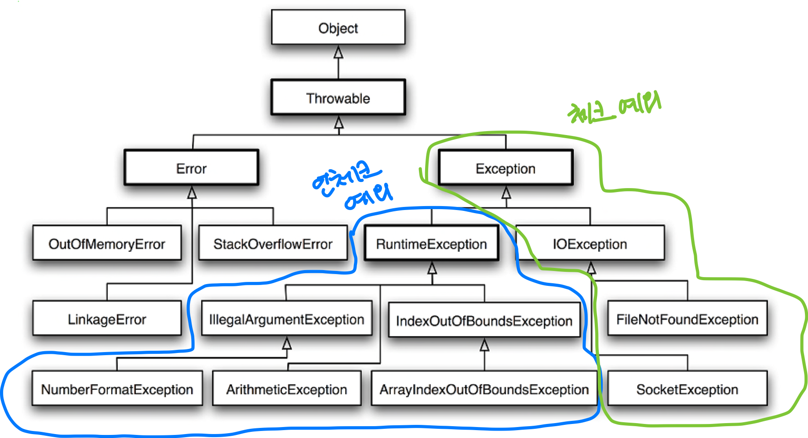

# 4. 예외

# 4.1 사라진 SQLException

## 초난감 예외처리

### 예외 블랙홀

```java
try {
} catch (SQLException e) {
}
```

- 일반적으로 try-catch 구문을 이용하여 예외처리 한다.
- 문제는 예외를 catch 구문에서 잡았지만 아무런 액션을 하지 않는 경우다.
- 예외에 대한 아무런 처리가 없다면 메모리나 리소스가 소진될 수 있고 예상치 못한 문제를 일으킬 수 있다.

```java
//초난감 예외처리1
try {
} catch (SQLException e) {
	System.out.println(e);
}

//초난감 예외처리2
try {
} catch (SQLException e) {
	e.printStackTrace();
}
```

- 위와 같이 예외에 대한 스택 정보를 출력하는 것은 예외처리를 제대로 한 것이 아니다.
- 예외 스택 정보를 콘솔 로그로 남기는 것은 예외 스택을 추적하는데 서버 리소스 낭비로 이어지게 되기 때문에 지양하는 것이 좋다.
- 예외 처리 시 적절하게 복구하던지 작업을 중단시키고 운영자 또는 개발자에게 알림이 가도록 하는 것이 좋다.

### 무의미 하고 무책임한 throws

```java
public void method1() throws Exception {
	method2();
}

public void method2() throws Exception {
	method3();
}

public void method3() throws Exception {
	...
}
```

위와 같이 메소드에 throws를 붙여서 상위 메소드에 예외처리의 책임을 전가하는 것은 EJB에서 흔히 볼 수 있는 방식이다. 구체적인 예외를 정의하기 귀찮으니 무책임하게 예외 클래스의 최상위 클래스인 Exception 클래스로 예외를 던지는 것이다.

- Exception 클래스로 throws를 하는 경우 의미 있는 정보를 얻을 수 없다.

## 예외의 종류와 특징

- **Error**
    - java.lang.Error 클래스의 서브 클래스
    - 에러는 시스템에 비정상적인 상황이 발생했을 경우 사용된다. 주로 VM에서 발생시키고 애플리케이션 코드로 잡는 것은 지양하는 것이 좋다.
        - ex) OutOfMemoryError, ThreadDeath
- **Exception과 체크 예외(Checked Exception)**
    - java.lang.Exception
    - `checked exception`, `unchecked exception`으로 구분된다.
        - **checked exception**은 Excepion 클래스의 서브클래스이면서 RuntimeException 클래스를 상속하지 않는 것
            - 체크 예외가 발생할 수 있는 메소드를 사용할 경우 반드시 예외를 처리하는 코드를 함께 작성해야 한다.
            - try-catch 구문을 사용하거나 메소드에 throws를 붙여서 예외를 외부로 던져야한다.(그렇지 않으면 컴파일 에러 발생)
        - **unchecked exception**은  RuntimeException를 상속한 클래스들을 말한다.



- **RuntimeException과 언체크/런타임 예외**
    - java.lang.RuntimeException 클래스를 상속한 예외들은 명시적인 예외처리를 강제하지 않기 때문에 언체크 예외라고 한다.
    - try-catch 구문을 사용하거나 메소드에 throws를 붙여서 예외처리를 하지 않아도 된다.
    - 런타임 예외는 주로 프로그램의 오류가 있을 때 발생하도록 의도된 것들이다.
    - ex) NullPointerException, IllegalArgumentException 등
    - 개발자의 부주의로 발생할 수 있는 예외

## 예외처리 방법

### 예외 복구

- 예외상황을 파악하고 문제를 해결해서 정상 상태로 돌려놓는 것
- 예외처리 코드를 강제하는 **체크 예외**들은 예외를 어떤 식으로든 복구할 가능성이 있는 경우에 사용한다.

### 예외처리 회피

- 예외처리를 자신이 담당하지 않고 자신을 호출한 쪽으로 던지는 것
- 메소드에 throws로 상위로 던지거나 catch 문에서 예외를 잡은 후 다시 예외를 throws로 던지는 것이다.

```java
// 예외처리 회피1
public void method1() throws SQLException {
}

// 예외처리 회피2
try {
} catch (SQLException e) {
	throw e;
}
```

### 예외 전환

```java
// 중첩 예외1
try {
	...
} catch(SQLException e) {
	throw DuplicateUserIdException(e);
}

// 중첩 예외2
try {
	...
} catch(SQLException e) {
	throw DuplicateUserIdException().initCause(e);
}
```

- 예외 회피와 비슷하게 예외를 복구해서 정상적인 상태로 만들 수 없기 때문에 예뢰를 메소드 밖으로 던지는 방법
- 발생한 예외가 아닌 구체적이고 적절한 예외로 전환해서 던지는 방법
- 내부에서 발생한 예외가 적절한 의미를 부여하지 못하는 경우에 적절한 의미를 부여하기 위해 사용한다.
- 예외 전환의 경우 발생한 예외를 담아서 중첩 예외(nested exception)로 만드는 것이 좋다.
- 예외처리를 강제하는 체크 예외를 언체크 예외인 런타임 예외로 바꾸기 위해 포장(wrap)하는 것으로 예외 전환이 가능하다.

```java
try {
	...
} catch(IOException e) {
	throw RuntimeException(e);
}
```

## 예외처리 전략

### 런타임 예외의 보편화

- 체크 예외는 일반적인 예외를 다룬다.
- 언체크 예외는 시스템 장애나 프로그램상의 오류를 다룬다.
- 체크 예외는 복구할 가능성이 조금이라도 있는, 말 그대로 예외적인 상황이기 때문에 자바에서 이를 처리하는 catch 블록이나 throws 선언을 강제한다.
- 대응 불가능한 체크 예외는 런타임 예외로 전환해서 처리하는 것이 좋다.
- 오픈소스 프레임워크 API에서 발생시키는 예외를 체크 예외 대신 언체크 예외로 정의하는 것이 일반화되고 있다.

### add() 메소드의 예외처리

add()의 SQLException은 여러 케이스의 문제로 인해 발생할 수 있는 예외이지만 add()를 수행하면서 Id의 중복으로 인해 예외가 발생할 수 있다. 이런 경우에 SQLException으로 던져진다면 이해하기가 어려울 것이다. Id 중복 예외를 뜻하는 DuplicateUserIdException 를 정의하고 중복 예외가 발생한 경우에 해당 예외를 던져보자.

```java
public class DuplicateUserIdException extends RuntimeException {
    public DuplicateUserIdException(Throwable cause) {
        super(cause);
    }
}
```

- DuplicateUserIdException는 체크 예외가 아닌 RuntimeException으로 정의한 이유?
    - 굳이 체크 예외로 둘 필요가 없을 뿐더러 add()를 호출한 쪽에서도 해당 예외를 잡아서 처리해도 무방하기 때문이다.

```java
public void add(final User user) throws DuplicateUserIdException {
    try {
        StatementStrategy st = conn -> {
            PreparedStatement ps = conn.prepareStatement("insert into users (id, name, password) values (?, ?, ?)");
            ps.setString(1, user.getId());
            ps.setString(2, user.getName());
            ps.setString(3, user.getPassword());
            ps.executeUpdate();
            return ps;
        };
        jdbcContext.workWithStatementStrategy(st);
    } catch (SQLException e) {
        if (e.getErrorCode() == ErrorCode.DUPLICATE_KEY_1) {
            throw new DuplicateUserIdException(e); // 예외 전환
        } else {
            throw new RuntimeException(e); // 예외 포장
        }
    }
}
```

### 애플리케이션 예외

**런타임 예외**는 복구할 수 있는 예외는 없다고 가정하고 예외가 생겨도 어차피 런타임 예외이므로 시스템 레벨에서 처리하고, 꼭 필요한 경우는 런타임 예외라도 잡아서 복구하거나 대응해줄 수 있으니 문제 될 것이 없다는 태도를 기반으로 한다.

반면 시스템 또는 외부의 예외 상황이 아닌 애플리케이션 자체의 로직에 의해 의도적으로 발생시키고, 반드시 catch 해서 무엇인가 조치를 취하도록 요구하는 예외를 **애플리케이션 예외**라고 한다.

## SQLException은 어떻게 됐나?

- JdbcTemplate을 적용하면서 SQLException가 왜 사라진 것인가?
- 생각해볼 점은 SQLException은 복구가능한 예외인가?
    - 복구할 방법이 없다.(네트워크 불안정, DB 커넥션 풀 등의 시스템 예외)

JdbcTemplate은 SQLException과 같이 복구할 수 없는 예외로 인해 무분별한 throws 선언을 언체크/런타임 예외로 전환하는 전략을 사용하고 있다.

# 4.2 예외 전환

- 런타임 예외로 포장해서 불필요한 catch/throws를 줄이는 목적
- 로우레벨의 예외를 좀 더 의미 있고 추상화된 예외로 바꿔서 던지는 목적
- JdbcTemplate의 DataAccessException은 런타임 예외로 SQLException을 포장해주는 역할을한다.

## JDBC의 한계

- JDBC는 자바를 이용해 DB에 접근하는 방법을 추상화된 API 형태로 정의하고 각 DB 업체가 JDBC 표준을 따라 만들어진 드라이버를 제공한다.
- DB 종류에 상관없이 사용할 수 있는 데이터 액세스 코드를 작성하는 일은 쉽지 않다.
- 표준화된 JDBC API가 DB 프로그램 개발 방법을 학습하는 부담은 줄여주지만 DB를 자유롭게 변경해서 사용할 수 있는 유연한 코드를 보장해주지는 못한다.

### 비표준 SQL

- SQL은 어느 정보 표준화된 언어, 몇 가지 표준 규약이 있지만, 대부분의 DB는 표준을 따르지 않는 비표준 문법과 기능을 제공한다.
    - ANSI SQL or DB 종속된 기능??
- 비표준 SQL은 폭넓게 사용되고 DB의 특별한 기능을 사용하거나 최적화된 SQL을 만들 때 유용하다.

### 호환성 없는 SQLException의 DB 에러정보

- DB를 사용하다가 발생할 수 있는 예외의 원인은 다양하다.
- 원인과 에러의 종류는 다양하지만 예외는 SQLException 하나에 모두 담는 점이 문제다.
    - JDBC API는 SQLException 한 가지만 던지도록 설계되어있다.
    
    ```java
    if (e.getErrorCode() == ErrorCode.DUPLICATE_KEY_1) {
        throw new DuplicateUserIdException(e); // 예외 전환
    }
    ```
    
    - SQLException은 예외가 발생했을 때 DB 상태를 담은 SQL 상태정보를 부가적으로 제공한다.
        - getSQLState()

## DB 에러 코드 매핑을 통한 전환

DB 종류가 바뀌더라도 DAO를 수정하지 않으려면 다음 2가지를 고려해야한다.

- SQLException의 비표준 에러코드
- SQL 상태정보

SQLException의 SQL 상태 코드는 신뢰할 만한 정보는 아니다. DB 벤더별로 관리하는 DB 전용 에러 코드가 더 정확하다고 할 수 있다. DB별 에러 코드를 참고해서 발생한 예외의 원인이 무엇인지 해석해 주는 기능을 만들면 정확한 예외 사항을 처리할 수 있을 듯 하다. 다만 DB별로 에러 코드가 제각각이기 때문에 일일이 DB별 에러 코드를 확인하는 작업은 부담스럽다.

**스프링은 DB별 에러 코드를 분류해서 스프링이 정의한 예외 클래스와 매핑해놓은 에러 코드 매핑정보 테이블을 만들어두고 이를 이용**한다.

**JdbcTemplate**은 SQLException을 단지 런타임 예외인 DataAccessException으로 포장하는 것이 아닌 **DB의 에러 코드를 DataAccessException 계층의 클래스 중 하나로 매핑**해주는 것이다.

앞서 add()에 추가한 키 중복 예외 처리의 경우 JdbcTemplate을 사용하도록 변경하면 다음과 같이 변경할 수 있다.

```java
public void add(final User user) throws DuplicateKeyException {
    jdbcTemplate.update(
            "insert into users (id, name, password) values (?, ?, ?)",
            user.getId(),
            user.getName(),
            user.getPassword());
}
```

위와 같이 변경이 가능한 이유는 JdbcTemplate은 체크 예외인 SQLException을 런타임 예외인 DataAccessException 계층구조의 예외로 포장해주기 때문에 add() 메소드에는 예외 포장을 위한 코드가 따로 필요 없다. 또 DB의 종류와 상관없이 중복 키로 인해 발생하는 에러는 DataAccessException의 서브클래스인 DuplicateKeyException으로 매핑돼서 던져진다. 때문에 **DB가 변경되더라도 동일한 예외가 던져지는 것이 보장**된다.

추가로 **중복 키 에러가 발생했을 때 애플리케이션에서 직접 정의한 예외로 발생**시키고 싶을 수 있다. 정책의 이유일 수 도 런타임 예외는 예외처리를 강제하지 않아서의 이유 일 수 있다. 이런 경우 아래와 같이 **예외 전환**을 통해 처리할 수 있다.

```java
public void add(final User user) throws DuplicateUserIdException {
		try {
			...
		} catch (DuplicateKeyException e) { // 예외 잡기
	    throw new DuplicateUserIdException(e); // 직접 정의한 예외로 전환
		}
}
```

## DAO 인터페이스와 DataAccessException 계층구조

DataAccessException은 JDBC의 SQLException을 전환하는 용도로만 만들어진 것은 아니다. JDBC 외의 자바 데이터 액세스 기술에서 발생하는 예외에도 적용된다.

- ex) JDO, JPA, TopLink(Oracle), etc

즉, 스프링은 데이터 액세스 기술에 독립적인 추상화된 예외를 제공한다. **스프링은 왜 이렇게 DataAccessException 계층구조를 이용해 기술에 독립적인 예외를 정의하고 사용하게 할까?**

### DAO 인터페이스와 구현의 분리

**DAO를 따로 만들어서 사용하는 이유**는 **데이터 액세스 로직을 담은 코드를 성격이 다른 코드에서 분리**해놓기 위해서다. 또한, 분리된 DAO는 전략 패턴을 적용해 구현 방법을 변경해서 사용할 수 있게 만들기 위해서이기도 하다. 이렇게되면 DAO를 사용하는 쪽에서는 DAO 내부에서 어떤 흐름으로 동작하는지 신경 쓰지 않아도 된다. 때문에 DAO는 인터페이스를 사용해 구체적인 클래스 정보와 구현 방법을 감추고, DI를 통해 제공되도록 만드는 것이 바람직하다.

DAO의 사용 기술과 구현 코드는 클라이언트로 부터 감출 수 있지만, **메소드 선언에 나타나는 예외정보가 문제가 될 수 있다.** DAO에서 사용하는 데이터 액세스 기술의 API가 예외를 던지기 때문이다.

```java
public void add(User user) throws SQLException; // JDBC
public void add(User user) throws PersistentException; // JPA
public void add(User user) throws HibernateException; // Hibernate
...
```

위와 같이 특정 데이터 액세스 기술에 종속된 것이 아닌 독립적으로 만들려면 throws Exception으로 선언하는 것이다.

```java
public void add(User user) throws Exception;
```

그렇지 않으면 체크 예외가 발생하는 부분을 런타임 예외로 포장하여 던지게 되면 DAO 기술에 독립적인 인터페이스 선언이 가능하다.

그러나, **한 가지 알아둬야 할 점은 여전히 DAO 사용 기술에 의존적일 수 밖에 없다는 것**이다. 대부분의 데이터 액세스 예외는 애플리케이션에서 복구 불가능하거나 할 필요가 없다. 그렇다고 모든 예외를 무시해야하는 것은 아니다. 비즈니스 로직에서 처리해야하는 예외도 있을 것이다. 때문에 DAO 영역의 예외를 의미 있게 분류할 필요도 있을 것 이다.

데이터 액세스 기술이 달라지면 같은 상황에서도 다른 종류의 예외가 던져지기 때문에 클라이언트 입장에서는 DAO 사용 기술에 따라서 예외 처리 방법이 달라질 것이고 기술에 의존하게 될 수 밖에 없다.

### 데이터 액세스 예외 추상화와 DataAccessException 계층구조

스프링은 **자바의 다양한 데이터 액세스 기술을 사용할 때 발생하는 예외들을 추상화해서 DataAccessException 계층구조 안에 정리**해놓았다.

**DataAccessException** 은 자바의 주요 데이터 액세스 기술에서 발생할 수 있는 대부분의 예외를 추상화하고 있다. 데이터 액세스 기술에 상관없이 공통적인 예외도 있지만 일부 기술에서만 발생하는 예외도 있다. 스프링의 **DataAccessException** 은 이런 일부 기술에서만 공통적으로 나타나는 예외를 포함해서 데이터 액세스 기술에서 발생 가능한 대부분의 예외를 계층구조로 분류해놓았다.

결론은 인터페이스 사용, 런타임 예외 전환과 함께 DataAccessException 예외 추상화를 적용하면 데이터 액세스 기술과 구현 방법에 독립적인 이상적인 DAO를 만들 수 있다.

## 기술에 독립적인 UserDao 만들기

### 인터페이스 적용

UserDao 클래스를 인터페이스와 구현으로 분리해보자.

```java
// UserDao 인터페이스 정의
public interface UserDao {
    void add(User user);

    User get(String id);

    List<User> getAll();

    void deleteAll();

    int getCount();
}

// 구현 클래스
public class UserJdbcTemplateDao implements UserDao {
}
```

### 테스트 보완

```java
@SpringBootTest
@ContextConfiguration(locations = "/test-applicationContext.xml")
class UserJdbcTemplateDaoTest {

    @Autowired
    private UserDao userJdbcTemplateDao;
		...
}
```

@Autowired는 스프링 컨텍스트 내에서 정의된 빈 중에서 인스턴스 변수에 주입 가능한 타입의 빈을 찾아준다. UserDao는 UserJdbcTemplateDao(현재 프로젝트 기준)가 구현한 인터페이스이므로 DI 하는 데 문제 없다.

만약 특정 기술을 사용한 DAO를 테스트 하는 것이 **테스트의 관심**이라면 인터페이스를 구현한 클래스를 정의하면 된다.

다음은 중복 키에 대한 예외가 발생하는지 테스트를 추가해보자.

```java
// add()
public void add(final User user) {
    try {
        jdbcTemplate.update(
                "insert into users (id, name, password) values (?, ?, ?)",
                user.getId(),
                user.getName(),
                user.getPassword());
    } catch (DuplicateKeyException e) {
        throw new DuplicateUserIdException(e); // 예외 전환
    }
}

// 테스트
@Test
void add_exception() {
    userJdbcTemplateDao.deleteAll();
    
    userJdbcTemplateDao.add(user1);
    assertThatThrownBy(() -> userJdbcTemplateDao.add(user1))
            .isInstanceOf(DuplicateUserIdException.class);
}
```

### DataAccessException 활용 시 주의사항

DuplicateKeyException 는 JDBC를 이용하는 경우에만 발생한다. 따라서 다른 데이터 액세스 기술을 사용하는 경우 각 기술에 맞는 예외가 발생하니 주의가 필요하다. 때문에 DataAccessException이 기술에 상관없이 어느 정도 추상화된 공통 예외로 변환해주지만 근본적인 한계 때문에 완벽하다고 기대할 수 없다.

만약 DataAccessException을 잡아서 처리하는 코드를 만들려고 한다면 미리 학습 테스트를 만들어서 실제로 전환되는 예외의 종류를 확인해둘 필요가 있다.

스프링은 SQLException을 DataAccessException로 전환하는 다양한 방법을 제공한다. 가장 보편적인 방법은 DB 에러 코드를 이용하는 것이다. 만약 직접 전환하고 싶다면 SQLExcpetionTranslator 인터페이스를 구현한 클래스 중에서 SQLErrorCodeSQLExcpetionTranslator를 사용하면 된다.

```java
@Autowired
DataSource dataSource;

@Test
void sqlExceptionTranslate() {
    userJdbcTemplateDao.deleteAll();
    try {
        userJdbcTemplateDao.add(user1);
        userJdbcTemplateDao.add(user1);
    } catch (DuplicateKeyException e) {
        SQLException sqlEx = (SQLException) e.getRootCause();
        SQLErrorCodeSQLExceptionTranslator set = new SQLErrorCodeSQLExceptionTranslator(this.dataSource);
        assertThat(set.translate(null, null, sqlEx)).isInstanceOf(DuplicateKeyException.class);
    }
}
```

# References