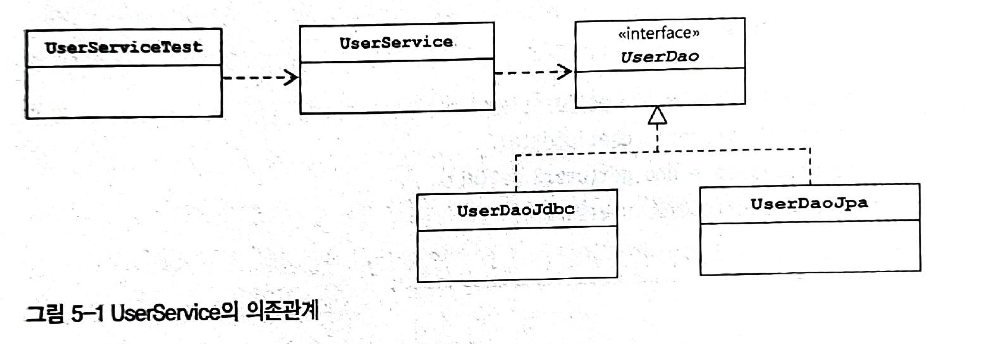
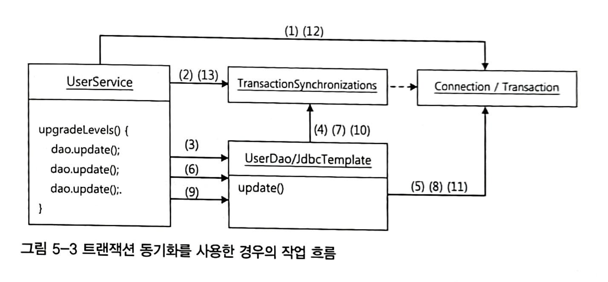
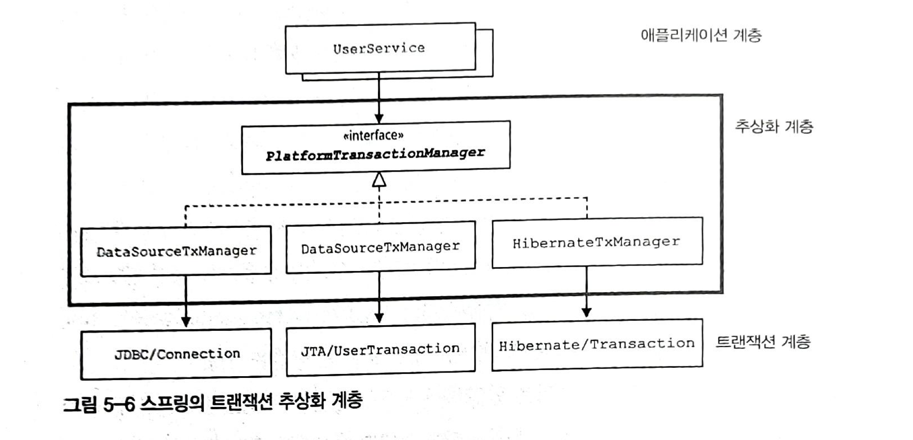
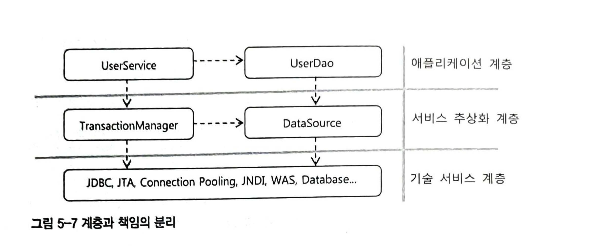
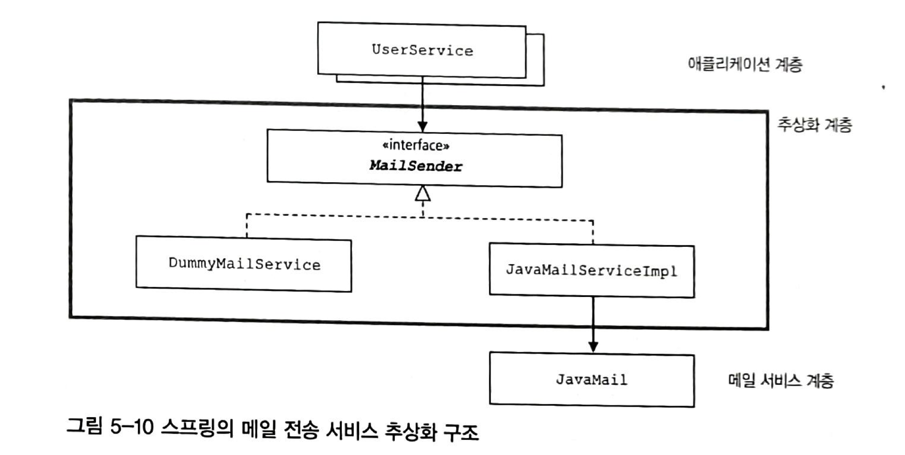

# 5. 서비스 추상화

DAO에 트랜잭션을 적용해보며 스프링이 어떻게 성격이 비슷한 여러 종류의 기술을 추상화하고 일관된 방법으로 사용할 수 있도록 지원하는지 알아본다.

# 5.1 사용자 레벨 관리 기능 추가

- 활동 내역을 참고해 레벨을 조정해주는 기능 추가
    - 사용자 레벨: BASIC, SILVER, GOLD
    - 처음 가입하면 BASIC 이후 활동을 통해 한 단계식 업그레이드
    - 가입 후 50회 이상 로그인하면 BASIC → SILVER
    - SILVER에서 추천 30번 이상 받으면 SILVER → GOLD
    - 레벨 변경을 일정한 주기로 일괄 변경된다.

## 필드 추가

### Level 이늄

```java
public enum Level {
    BASIC(1), SILVER(2), GOLD(3);

    private final int level;

    Level(int level) {
        this.level = level;
    }

    public static Level valueOf(int value) {
        switch (value) {
            case 1: return BASIC;
            case 2: return SILVER;
            case 3: return GOLD;
            default: throw new AssertionError("Unknown value: " + value);
        }
    }
}
```

### User 필드 추가

```java
public class User {
    ...
    private Level level;
    private Integer login;
    private Integer recommend;

    public User(String id, String name, String password,
                Level level, Integer login, Integer recommend) {
        this.id = id;
        this.name = name;
        this.password = password;
        this.level = level;
        this.login = login;
        this.recommend = recommend;
    }
		...

    public Level getLevel() {
        return level;
    }

    public void setLevel(Level level) {
        this.level = level;
    }

		...
}
```

```sql
alter table users add level integer not null default 1 ;
alter table users add login integer not null default 0 ;
alter table users add recommend integer not null default 0 ;
```

### UserDaoTest 테스트 수정

코드 참고

### UserDaoJdbc 수정

코드 참고

## 사용자 수정 기능 추가

### 수정 기능 테스트 추가

```sql
public void update(User user) {
    jdbcTemplate.update(
            "update users set " +
                    "name = ?, " +
                    "password = ?, " +
                    "level = ?, " +
                    "login = ?, " +
                    "recommend = ? " +
                    "where id = ?",
            user.getName(),
            user.getPassword(),
            user.getLevel().intValue(),
            user.getLogin(),
            user.getRecommend(),
            user.getId());
}

//테스트
@Test
void update() {
    userJdbcTemplateDao.deleteAll();

    userJdbcTemplateDao.add(user1);

    user1.setName("나는홍길동");
    user1.setPassword("9999");
    user1.setLevel(Level.GOLD);
    user1.setLogin(1000);
    user1.setRecommend(999);

    userJdbcTemplateDao.update(user1);

    User findUser1 = userJdbcTemplateDao.get(user1.getId());
    checkSameUser(user1, findUser1);
}
```

### 수정 테스트 보완

코드 참고

## UserService.upgradeLevels()



### UserService 클래스와 빈 등록

```java
public class UserService {
    private final UserDao userDao;

    public UserService(UserDao userDao) {
        this.userDao = userDao;
    }
}
```

- 수정자 주입이 아닌 생성자 주입으로 변경

### UserServiceTest 테스트 클래스

```java
@SpringBootTest
class UserServiceTest {

    @Autowired
    private UserService userService;

    @Test
    void bean() {
        assertThat(userService).isNotNull();
    }
}
```

### upgradeLevels() 메소드

```java
public void upgradeLevels() {
    List<User> users = userDao.getAll();
    for (User user : users) {
        Boolean changed = null;
        if (user.getLevel() == Level.BASIC && user.getLogin() >= 50) {
            user.setLevel(Level.SILVER);
            changed = true;
        } else if (user.getLevel() == Level.SILVER && user.getRecommend() >= 30) {
            user.setLevel(Level.GOLD);
            changed = true;
        } else if (user.getLevel() == Level.SILVER) {
            changed = false;
        } else {
            changed = false;
        }
        if (changed) {
            userDao.update(user);
        }
    }
}
```

### upgradeLevels() 테스트

```java
// Fixture
public static final User USER4 = new User("gildong4", "홍길동4", "1004", Level.BASIC, 49, 0);
public static final User USER5 = new User("gildong5", "홍길동5", "1005", Level.SILVER, 50, 0);
public static final User USER6 = new User("gildong6", "홍길동6", "1006", Level.SILVER, 60, 29);
public static final User USER7 = new User("gildong7", "홍길동7", "1007", Level.SILVER, 61, 30);

// 테스트
private List<User> userList;

@BeforeEach
void setUp() {
    userList = Arrays.asList(USER4, USER5, USER6, USER7);
}

@Test
void upgradeLevels() {
    userDao.deleteAll();
    for (User user : userList) {
        userDao.add(user);
    }
    userService.upgradeLevels();

    checkLevel(userList.get(0), Level.BASIC);
    checkLevel(userList.get(1), Level.SILVER);
    checkLevel(userList.get(2), Level.SILVER);
    checkLevel(userList.get(3), Level.GOLD);
}

private void checkLevel(User expect, Level level) {
    User user = userDao.get(expect.getId());
    assertEquals(user.getLevel(), level);
}
```

## UserService.add()

```java
// UserService.add()
public void add(User user) {
    if (user.getLevel() == null) {
        user.setLevel(Level.BASIC);
    }
    userDao.add(user);
}

// 테스트
@Test
void add() {
    userDao.deleteAll();

    User userWithLevel = userList.get(3);
    User userWithoutLevel = userList.get(0);
    userWithoutLevel.setLevel(null);

    userService.add(userWithLevel);
    userService.add(userWithoutLevel);

    User userWithLevelRead = userDao.get(userWithLevel.getId());
    User userWithoutLevelRead = userDao.get(userWithoutLevel.getId());

    assertThat(userWithLevelRead.getLevel()).isEqualTo(userWithLevel.getLevel());
    assertThat(userWithoutLevelRead.getLevel()).isEqualTo(Level.BASIC);
}
```

## 코드 개선

### upgradeLevels() 메소드 코드의 문제점

- 중첩된 if/else if/else 구문으로 인해 가독성이 좋지 않다.
- 성격이 다른 로직이 복합적으로 들어가있다.

### upgradeLevels() 리팩토링

```java
// Level
public enum Level {
    GOLD(3, null), SILVER(2, GOLD), BASIC(1, SILVER);

    private final int level;
    private final Level next;
}

// User
public void upgradeLevel() {
    Level nextLevel = this.level.getNext();
    if (nextLevel == null) {
        throw new IllegalArgumentException(this.level + "은 업그레이드가 불가능합니다");
    } else {
        this.level = nextLevel;
    }
}

// UserService
public void upgradeLevels() {
    List<User> users = userDao.getAll();
    for (User user : users) {
        if (canUpgradeLevel(user)) {
            upgradeLevel(user);
        }
    }
}

private void upgradeLevel(User user) {
    user.upgradeLevel();
    userDao.update(user);
}

private boolean canUpgradeLevel(User user) {
    Level currentLevel = user.getLevel();
    switch (currentLevel) {
        case BASIC:
            return (user.getLogin() >= 50);
        case SILVER:
            return (user.getRecommend() >= 30);
        case GOLD:
            return false;
        default:
            throw new IllegalArgumentException("Unknown Level:" + currentLevel); 
    }
}
```

- 각 오브젝트와 메소드가 각각 자기 몫의 책임을 맡아 일을 하는 구조로 개선
- 각 객체 내부에서 다루는 정보는 자신의 책임에 충실한 기능을 가지며 각 객체가 요청하는 구조
- 자기 책임에 충신한 작업만 하고 있으니 코드 이해가 쉽고 변경이 필요한 경우 수정 포인트를 파악하기 쉽다.
- 객체지향적인 코드는 다른 오브젝트의 데이터를 가져와서 작업하는 것이 아닌 데이터를 갖고 있는 다른 오브젝트에게 작업을 요청하는 것이다.

### User 테스트

```java
class UserTest {
    private User user;

    @BeforeEach
    void setUp() {
        user = new User();
    }

    @Test
    void upgradeLevel() {
        Level[] levels = Level.values();
        for (Level level : levels) {
            if (level.getNext() == null) continue;
            user.setLevel(level);
            user.upgradeLevel();
            assertThat(user.getLevel()).isEqualTo(level.getNext());
        }
    }

    @Test
    void cannotUpgradeLevel() {
        Level level = Level.GOLD;
        user.setLevel(level);
        assertThrows(IllegalArgumentException.class, () -> user.upgradeLevel());
    }
}
```

### UserServiceTest 개선

코드 참고

# 5.2 트랜잭션 서비스 추상화

- 만약 특정한 작업을 수행하는 중간에 장애가 발생하여 작업을 완료할 수 없는 상황에서 현 시점까지 작업한 것은 유지해야할까? 전부 초기 상태로 돌려놔야할까?

## 모 아니면 도

### 테스트용 UserService 대역

- 작업 중간에 예외를 강제하도록 하는 방법은 다음과 같다.
    - 테스트를 위해 애플리케이션 코드 수정 → 좋은 방법은 아님
    - 테스트용 UserService를 생성 → 위 방법보단 좋다.
- 테스트용 UserService를 만들기 위해 그대로 복사하는 방법이 있지만 중복 코드도 발생해서 관리가 불편해진다.
- UserService를 상속해서 일부 메소드를 오버라이딩 하는  방법을 사용해보자.

```java
@SpringBootTest
class UserServiceTest {
	
	...(생략)

	static class TestUserService extends UserService {
        private String id;
        
        public TestUserService(UserDao userDao) {
            super(userDao);
        }

        public TestUserService(UserDao userDao, String id) {
            super(userDao);
            this.id = id;
        }

        @Override
        protected void upgradeLevel(User user) {
            if (user.getId().equals(this.id)) throw new TestUserServiceException();
            super.upgradeLevel(user);
        }
    }
    
    static class TestUserServiceException extends RuntimeException {
    }
}
```

```java
@Test
void upgradeAllOrNothing() {
    UserService testUserService = new TestUserService(userDao, userList.get(3).getId());
    userDao.deleteAll();
    for (User user : userList) {
        userDao.add(user);
    }
    try {
        testUserService.upgradeLevels();
    } catch (TestUserServiceException e) {
        System.out.println("error occur!");
    }
    checkLevelUpgraded(userList.get(2), false);
}
```

- 위 테스트에서 기대하는 결과는 userList의 3번째 수행 시 exception이 발생하게 되는데 이때 1, 2번에서 업그레이드 결과가 유지되는지? 초기 상태로 돌아가는지 이다.
    - 결과는 업그레이드 결과가 유지된다.

```bash
org.opentest4j.AssertionFailedError: 
expected: SILVER
but was : GOLD
Expected :SILVER
Actual   :GOLD
```

### 테스트 실패의 원인

- 위 테스트 결과가 실패한 이유는 **트랜잭션 문제**이다.
- 모든 사용자 레벨을 업그레이드하는 작업인 upgradeLevels() 메소드가 하나의 트랜잭션 안에서 동작하지 않았기 때문이다.
- **트랜잭션이란** 더 이상 나눌 수 없는 단위 작업을 말한다. 작업을 쪼개서 작은 단위로 만들 수 없다는 것은 트랜잭션의 핵심 속성인 원자성을 의미한다.
    - 전체가 실패하던지 성공하던지 해야한다는 의미
    - 부분적으로 성공하고, 여러 번에 걸쳐서 진행할 수 있는 작업이 아니어야 함을 말한다.

## 트랜잭션 경계설정

- DB는 완벽한 트랜잭션을 지원한다.
- 하나의 SQL 명령을 처리하는 경우 DB가 트랜잭션을 보장해준다고 믿을 수 있다.
- 단 여러 개의 SQL이 사용되는 작업을 하나의 트랜잭션으로 취급해야 하는 경우도 있다.
    - ex) 계좌이체(출금은 성공했지만 입금은 실패하면 안되기 때문)
- 문제가 발생할 경우 앞서 작업이 완료된 건들을 취소시키는 작업을 **`트랜잭션 롤백(transaction rollback)`**이라고 한다.
- 반대로 문제 없이 모든 작업이 완료된 것을 확정시키는 것을 **`트랜잭션 커밋(transaction commit)`**이라고 한다.

### JDBC 트랜잭션의 트랜잭션 경계설정

- 트랜잭션이 시작하는 방법은 한가지 이지만 종료하는 방법은 롤백, 커밋 두 가지가 있다.
- 애플리케이션 내에서 트랜잭션이 시작되고 끝나는 위치를 **`트랜잭션 경계`**라고 한다.
- JDBC의 경우 트랜잭션이 하나의 Connection을 가져오면서 시작되고 닫는 시점에 종료된다.
    - 이때 JDBC에는 자동커밋 옵션을 false로 설정해야 여러 작업을 하나의 트랜잭션으로 묶을 수 있다.
    - 자동커밋 옵션을 false로 설정하면 여러 작업을 수행하고 commit 혹은 rollback이 호출되는 시점에 트랜잭션이 종료된다.
- 자동커밋 옵션을 false로 지정하고 commit 혹은 rollback으로 트랜잭션을 종료하는 작업을 **`트랜잭션의 경계설정(transaction demarcation)`**이라고 한다.
- 트랜잭션의 경계는 하나의 Connection이 만들어지고 닫히는 범위 안에 존재한다.
- 하나의 DB 커넥션 안에서 만들어지는 트랜잭션을 **`로컬 트랜잭션(local transaction)`**이라고 한다.

### UserService와 UserDao의 트랜잭션 문제

- UserService의 트랜잭션 테스트가 실패한 이유는 **트랜잭션 경계 설정을 위한 코드가 존재하지 않아서 실패했던 것**이다.
- JdbcTemplate의 경우 Connection을 생성하면서 트랜잭션이 시작되는데 트랜잭션은 Connection 보다도 생명 주기(?)가 짧다.
- JdbcTemplate을 호출할 때 마다 새로운 트랜잭션이 생성되고 처리됐기 때문에 Exception이 발생하기 전의 작업들은 영구적으로 반영이 된 것이다.
- 일련의 작업을 하나의 트랜잭션으로 묶기 위해서는 작업이 진행되는 동안 DB 커넥션이 하나만 사용돼야 한다.

### 비즈니스 로직 내의 트랜잭션 경계설정

- UserService 에서 트랜잭션 경계설정을 위한 관심사를 옮겨보는 것은 검토해보자
- UserDao의 update()메소드는 upgradeLevels() 메소드에서 만든 Connection을 사용해야 한다. 그래야 같은 트랜잭션 안에서 동작하기 때문이다.

```java
// UserDao
public interface UserDao {
    void add(Connection c, User user);
		...
    void update(Connection c, User user);
}

//UserService
public class UserService {

	public void upgradeLevels() {
			// DB Connection 생성
			// 트랜잭션 시작
			try {
				// 로직 수행
				upgradeLevel(c, user);
				// 트랜잭션 커밋
			} catch() {
				// 트랜잭션 롤백
			} finally {
				// DB Connection 종료
			}
   }

    protected void upgradeLevel(Connection c, User user) {
        user.upgradeLevel();
        userDao.update(user);
    }
}
```

하나의 Connection에서 동작하게 하기 위해서 위와 같이 Connection 파라미터를 추가했다. 그리고 생성한 Connection을 파라미터를 통해 전달하면 트랜잭션 경계설정을 할 수 있을 듯 하다. 그러나 이런 방식은 문제점을 가지고 있다.

### UserService 트랜잭션 경계설정의 문제점

- Connection 객체를 계속 전달해야한다.
- UserService에 비즈니스 뿐아니라 트랜잭션 경계라는 두 가지 관심사를 갖게된다.
- UserDao는 더 이상 데이터 액세스 기술에 독립적일 수 없다.

## 트랜잭션 동기화

트랜잭션의 경계를 설정하기 위한 방법을 알아보자

### Connection 파라미터 제거

- 스프링에서는 트랜잭션 경계 설정을 위해 Connection 객체를 파라미터로 넘기는 문제를 독립적인 **`트랜잭션 동기화(transaction synchronization)`** 방식을 제안한다.
- **트랜잭션 동기화**란 UserService에서 트랜잭션을 시작하기 위해 만든 Connection 객체를 특별한 저장소에 보관해두고, 이후에 호출되는 DAO의 메소드에서는 저장된 객체를 가져다 사용하는 것을 말한다.
    - DAO가 사용하는 JdbcTemplate이 트랜잭션 동기화 방식을 이용하도록 하는 것이다.
- 트랜잭션 동기화 방식을 사용하면 Connection 객체를 파라미터로 넘기지 않아도 된다.



### 트랜잭션 동기화 적용

- JdbcTemplate과 더불어 트랜잭션 동기화 기능을 지원하는 간단한 유틸리티 메소드를 제공하니 활용해보자.

```java
public class UserService {
    public static final int MIN_LOGCOUNT_FOR_SILVER = 50;
    public static final int MIN_RECOMMEND_FOR_GOLD = 30;

    private final UserDao userDao;
    private final DataSource dataSource;

    public UserService(UserDao userDao, DataSource dataSource) {
        this.userDao = userDao;
        this.dataSource = dataSource;
    }

    public void upgradeLevelsSyncTransaction() throws Exception {
        TransactionSynchronizationManager.initSynchronization();
        Connection c = DataSourceUtils.getConnection(dataSource);
        c.setAutoCommit(false);

        try {
            List<User> users = userDao.getAll();
            for (User user : users) {
                if (canUpgradeLevel(user)) {
                    upgradeLevel(user);
                }
            }
        } catch (Exception e) {
            c.rollback();
            throw e;
        } finally {
            DataSourceUtils.releaseConnection(c, dataSource);
            TransactionSynchronizationManager.unbindResource(this.dataSource);
            TransactionSynchronizationManager.clearSynchronization();
        }
    }
}
```

### 트랜잭션 테스트 보완

```java
@Autowired
private DataSource dataSource;

@Test
void upgradeAllOrNothingSyncTransaction() {
    UserService testUserService = new TestUserService(userDao, dataSource, userList.get(3).getId());
    userDao.deleteAll();
    for (User user : userList) {
        userDao.add(user);
    }
    try {
        testUserService.upgradeLevelsSyncTransaction();
    } catch (TestUserServiceException e) {
        System.out.println("error occur!");
    } catch (Exception e) {
        e.printStackTrace();
    }
    checkLevelUpgraded(userList.get(2), false);
}

static class TestUserService extends UserService {
    private String id;

    public TestUserService(UserDao userDao, DataSource dataSource) {
        super(userDao, dataSource);
    }

    public TestUserService(UserDao userDao, DataSource dataSource, String id) {
        super(userDao, dataSource);
        this.id = id;
    }

    @Override
    protected void upgradeLevel(User user) {
        if (user.getId().equals(this.id)) throw new TestUserServiceException();
        super.upgradeLevel(user);
    }
}
```

### JdbcTemplate과 트랜잭션 동기화

- 만약 트랜잭션 동기화 저장소에 등록된 DB 커넥션이나 트랜잭션이 없는 경우 JdbcTemplate이 직접 커넷견과 트랜잭션을 시작해서 JDBC 작업을 수행한다.
- 만약 트랜잭션 동기화 저장소에 등록된 DB 커넥션 객체나 트랜잭션이 존재한다면 JdbcTemplate은 해당 객체를 가져와 사용한다.
- JdbcTemplate이 제공하는 유용한 기능
    - 트랜잭션 동기화 사용
    - jdbc 코드의 try/catch/finally 작업 흐름
        - 알아서 커넥션과 트랜잭션 처리를 하는 것을 말하는 듯하다.
    - SQLException 런타임 예외 변환

## 트랜잭션 서비스 추상화

### 기술과 환경에 종속되는 트랜잭션 경계설정 코드

- 하나의 트랜잭션 안에서 여러 개의 DB에 데이터를 넣는 작업이 필요한 상황
- 하나의 트랜잭션으로 처리하는 것은 JDBC의 Connection을 이용한 트랜잭션 방식인 로컬 트랜잭션으로는 불가능
    - 로컬 트랜잭션은 하나의 DB Connection에 종속되기 때문
- 별도 트랜잭션 관리자를 통해 트랜잭션을 관리하는 `**글로벌 트랜잭션(global transaction)**` 방식을 사용
    - 자바는 JDBC 외에 글로벌 트랜잭션을 지원하는 트랜잭션 매니저를 지원하기 위한 API **`JTA(Java Transaction API**)`를 제공하고 있다.
- JTA는 트랜잭션 관리를 트랜잭션 관리자에게 위임하는 방식

### 트랜잭션 API의 의존관계 문제와 해결책

- JTA를 사용하더라고 특정 기술에 종속된 코드가 생성될 수 있는 상황
- 스프링은 어떻게 특정 기술에 종속되지 않고 트랜잭션 처리를 추상화했을까?
- UserDao를 추상화 했던 것과 동일하게 트랜잭션 처리의 공통적인 특징을 모아 추상화된 트랜잭션 관리 계층을 만들 수 있다.

### 스프링의 트랜잭션 서비스 추상화



- 스프링이 제공하는 트랜잭션 경계설정을 위한 추상 인터페이스는 **`PlatformTransactionManager`**이다.

```java
// UserService
public void upgradeLevelsTransactionManager() {
    PlatformTransactionManager txm = new DataSourceTransactionManager(dataSource);
    TransactionStatus status = txm.getTransaction(new DefaultTransactionDefinition());
    
    try {
        List<User> users = userDao.getAll();
        for (User user : users) {
            if (canUpgradeLevel(user)) {
                upgradeLevel(user);
            }
        }
        txm.commit(status);
    } catch (Exception e) {
        txm.rollback(status);
        throw e;
    }
}
```

- JDBC의 경우 Connection 생성 후 트랜잭션을 시작했지만 트랜잭션 관리자의 경우 바로 getTransaction() 메소드를 호출하기만 하면 된다.
    - 필요에 따라 트랜잭션 매니저가 DB 커넥션을 가져오는 작업도 수행하기 때문이다.
- PlatformTransactionManager로 시작한 트랜잭션은 트랜잭션 동기화 저장소에 저장된다.
- PlatformTransactionManager를 구현한 DataSourceTransactionManager는 JdbcTemplate에서 사용될 수 있는 방식으로 트랜잭션을 관리해준다.

### 트랜잭션 기술 설정의 분리

트랜잭션 추상화 API를 적용한 코드를 JTA를 이용하는 글로벌 트랜잭션으로 변경하는 방법을 알아보자

- PlatformTransactionManager를 구현한 DataSourceTransactionManager클래스를 JTATransactionManager로 바꿔주면된다.
    - 자바 서버에서 제공하는 JTA 정보를 JNDI를 통해 자동으로 인식하는 기능을 갖고 있다.

그러나 문제는 UserService에서 어떤 트랜잭션 구현체를 사용할지 알고있다는 점이다. 이는 **DI 원칙에 위배**된다. 이 문제를 컨테이너를 통해 외부에서 제공받게 하는 스프링 DI의 방식으로 바꿔보자.

1. DataSourceTransactionManager를 스프링 빈으로 등록
2. UserService에서 DI 하도록 한다.

> 스프링 빈으로 등록할 때 먼저 싱글톤으로 만들어져 여러 스레드에서 동시에 사용해도 괜찮은지 검토하는 것이 좋다.
스프링이 제공하는 모든 PlatformTransactionManager 구현 클래스는 싱글톤으로 사용이 가능하다.
> 

```java
// UserTransactionService
private final PlatformTransactionManager transactionManager;

public UserTransactionService(UserDao userDao, PlatformTransactionManager transactionManager) {
    this.userDao = userDao;
    this.transactionManager = transactionManager;
}

public void upgradeLevels() {
    List<User> users = userDao.getAll();
    for (User user : users) {
        if (canUpgradeLevel(user)) {
            upgradeLevel(user);
        }
    }
}

public void upgradeLevelsTransactionManager() {
    TransactionStatus status = transactionManager.getTransaction(new DefaultTransactionDefinition());

    try {
        List<User> users = userDao.getAll();
        for (User user : users) {
            if (canUpgradeLevel(user)) {
                upgradeLevel(user);
            }
        }
        transactionManager.commit(status);
    } catch (Exception e) {
        transactionManager.rollback(status);
        throw e;
    }
}
```

# 5.3 서비스 추상화와 단일 책임 원칙

### 수직, 수평 계층구조와 의존관계

기술과 서비스에 대한 추상화 기법을 이용하면 특정 기술환경에 종속되지 않는 유연한 코드를 만들 수 있다.



- UserDao와 UserService는 인터페이스와 DI를 통해 연결함으로써 결합도가 낮아졌다.
- 결합도가 낮다는 것은 데이터 액세스 로직이 바뀌거나, 기술이 바뀌더라도 UserService의 코드에는 영향을 주지 않는다는 뜻이다.
- 서로 독립적으로 확장 가능하다.
- UserDao와 DB 연결 기술은 결합도가 낮다.
- UserService와 트랜잭션 기술과도 스프링이 제공하는 PlatformTransactionManager 인터페이스를 통해 추상화 계층을 뒀기 때문에 결합도를 낮췄다고 할 수 있다.
- 이렇게 낮을 결합도는 스프링의 DI가 중요한 역할을 했다.
- DI의 가치는 관심, 책임, 성격이 다른 코드를 깔끔하게 분리하는 데 있다.

### 단일 책임 원칙

**단일 책임 원칙(Single Responsibility Principle)**은 하나의 모듈은 한 가지 책임을 가져야 한다는 의미, 하나의 모듈이 바뀌는 이유는 한 가지여야 한다고 설명할 수도 있다.

UserService에서 JDBC Connection을 처리하는 코드를 예로 들면 UserService는 사용자 레벨 관리, 트랜잭션 관리 두 가지 책임을 갖고 있다. 이 말은 UserService 코드가 수정되는 이유가 두 가지라는 의미이다. 두 책임 중 하나가 변경되면 다른 하나도 영향을 받을 수 있게 된다.

그러나 트랜잭션 서비스의 추상화 방식을 도입하고, 이를 DI를 통해 외부에서 주입하도록 해서 UserService의 관심 책임을 독립적으로 분리할 수 있었다.

### 단일 책임 원칙의 장점

- 단일 책임 원칙을 잘 지키면 어떤 변경이 필요할 때 수정 대상이 명확해진다.
- 기술이 바뀌면 기술 계층과 연동을 담당하는 기술 추상화 계층의 설정만 바꿔주면 된다.
    - 각 계층에 해당하는 변경 사항만 변경하면 된다는 의미

> **단일 책임 원칙**을 잘 지키는 코드를 만들기 위해 인터페이스를 도입하고 이를 DI로 연결하며, 그 결과로 단일 책임 원칙뿐 아니라 개발 폐쇄 원칙도 지킬 수 있다. 모듈 간의 결합도가 낮기 때문에 서로의 변경에 영향을 주지 않고 변경되는 부분이 단일 책임에 집중되는 응집도 높은 코드가 될 수 있다.

**객체 지향 설계 원칙을 잘 지켜서 만든 코드는 테스트하기도 편하다.**
> 

# 5.4 메일 서비스 추상화

요구사항 추가

- 레벨이 업그레이드되는 사용자에게 안내 메일 발송
- User에 email 필드 추가

## JavaMail을 이용한 메일 발송 기능

- DB User 테이블 email 필드 추가
- User 도메인 email 필드 추가(getter, setter 메소드 추가)
- DAO 수정

### JavaMail 메일 발송

- 자바 메일 발송 표준 기술인 javax.mail 패키지 사용
- UserService에 upgradeLevel() 메소드에 메일 발송 기능 추가

## JavaMail이 포함된 코드의 테스트

- 메일 발송 서버가 준비되지 않는 상황이라 메일 발송 시 에러가 발생한다.
- 레벨 업그레이드 후 메일 발송 테스트가 필요하다.
- 테스트용 JavaMail을 구성하여 테스트를 진행해보자

## 테스트를 위한 서비스 추상화

- JavaMail 대신 테스트에서 사용할 객체를 구성

### JavaMail을 이용한 테스트의 문제점

- JavaMail의 경우 DataSource처럼 인터페이스로 만들어져서 구현을 바꿀 수 없다.
- JavaMail처럼 테스트하기 힘든 구조인 API를 테스트하기 좋게 만드는 방법은 서비스 추상화를 적용하는 것이다.
- 스프링은 JavaMail에 대한 추상화 기능을 제공하고 있다.
    
    ```bash
    // build.gradle 추가
    implementation 'org.springframework.boot:spring-boot-starter-mail'
    ```
    

```java
// UserService
protected void upgradeLevel(User user) {
    user.upgradeLevel();
    userDao.update(user);
    sendUpgradeMail(user);
}

private void sendUpgradeMail(User user) {
    JavaMailSenderImpl mailSender = new JavaMailSenderImpl();
    mailSender.setHost("mail.server.com");
    
    SimpleMailMessage simpleMailMessage = new SimpleMailMessage();
    simpleMailMessage.setTo(user.getEmail());
    simpleMailMessage.setFrom("admin");
    simpleMailMessage.setSubject("Upgrade 안내");
    simpleMailMessage.setText("사용자님의 등급이 " + user.getLevel().name());

    mailSender.send(simpleMailMessage);
}
```

### (번외) 메일 기능을 DI 가능한 구조로 변경하기

- sendUpgradeMail() 메소드에는 JavaMailSenderImpl라는 구현 클래스가 존재하고 있음 때문에 DI를 통해 서비스 추상화를 적용해보자

```java
@Component
public class UserService {
		private final MailSender mailSender;

    public UserService(UserDao userDao, DataSource dataSource, MailSender mailSender) {
        this.userDao = userDao;
        this.dataSource = dataSource;
        this.mailSender = mailSender;
    }

		protected void upgradeLevel(User user) {
        user.upgradeLevel();
        userDao.update(user);
        sendUpgradeMail(user);
    }

    private void sendUpgradeMail(User user) {
        SimpleMailMessage simpleMailMessage = new SimpleMailMessage();
        simpleMailMessage.setTo(user.getEmail());
        simpleMailMessage.setFrom("admin");
        simpleMailMessage.setSubject("Upgrade 안내");
        simpleMailMessage.setText("사용자님의 등급이 " + user.getLevel().name());

        mailSender.send(simpleMailMessage);
    }
}
```

### 테스트용 메일 발송 오브젝트

```java
@Slf4j
@Component
public class DummyMailSender implements MailSender {
    @Override
    public void send(SimpleMailMessage simpleMessage) throws MailException {
        log.info("메일 발송");
        log.info("To={}", simpleMessage.getTo());
        log.info("From={}", simpleMessage.getFrom());
        log.info("Subject={}", simpleMessage.getSubject());
        log.info("Text={}", simpleMessage.getText());
    }

    @Override
    public void send(SimpleMailMessage... simpleMessages) throws MailException {
        log.info("메일 발송 완료!");
    }
}

// 테스트

@Autowired
private DummyMailSender mailSender;

@Test
void upgradeAllOrNothingSyncTransaction() {
    UserService testUserService = new TestUserService(userDao, dataSource, mailSender, userList.get(3).getId());
    ...
}
```

### 테스트와 서비스 추상화



- 트랜잭션 기술에 대한 추상화 클래스와 달리 MailSender를 구현한 추상화 클래스는 하나뿐이다.
- MailSender를 구현한 DummyMailSender와 같이 다양한 형태로 확장할 수 있다.

### 메일 발송 트랜잭션 적용

- 대안 1. 메일 발송을 레벨 업그레이드 직후에 바로 발송하는 것이 아닌 발송 대상을 별도 목록으로 가지고 업그레이드가 전부 완료된 이후에 한 번에 메일을 발송하는 방법
    - 메일 저장용 리스트 등을 파라미터로 가지고 다녀야하는 단점이 있다.
- 대안 2. MailSender를 확장해 메일 전송에 트랜잭션 개념을 적용하기
- 서비스 추상화는 원활한 테스트를 가능하게 하는 장점을 가지고 있다.
- 기술이나 환경이 바뀔 가능성이 있지만 확장이 어려운 API를 사용해야하는 경우라면 추상화 계층을 도입해보는 것을 고려해보자

## 테스트 대역

- 스프링의 XML 설정파일을 테스트용으로 만든 이유는 운영과 테스트 환경의 분리를 위함이다.
- 테스트 환경에서 유용하게 사용하는 기법을 알아보자
    - DI를 통해 바꿔치기하는 방법 소개

### 의존 오브젝트의 변경을 통한 테스트 방법

- 하나의 오브젝트가 사용하는 오브젝트를 DI에서 의존 오브젝트라고 불러왔다.
- 의존한다는 말은 종속되거나 기능을 사용한다는 의미
    - 작은 기능이라도 다른 오브젝트의 기능을 사용하면, 사용하는 오브젝트의 기능이 바뀌었을 때 자신의 영향을 받을 수 있기 때문에 의존하고 있다고 말한다.
- 의존 오브젝트는 협력(collaborator) 오브젝트라고도 한다.
- 의존 오브젝트를 갖는 것으로 테스트 시 문제점
    - 간단한 오브젝트의 코드를 테스트하는 데 너무 많은 작업이 뒤따르는 경우
    - 스프링 DI를 적용하여 어느정도 해소할 수 있다.

### 테스트 대역의 종류와 특징

- 테스트용으로 사용되는 특별한 오브젝트가 존재한다.
    - 대부분 테스트 대상인 오브젝트의 의존 오브젝트가 되는 것들이 대상
    - UserDao의 DataSource, UserService의 MailSender
- 테스트 환경을 만들어주기 위해, 테스트 대상이 되는 오브젝트의 기능에만 충실하게 수행하면서 빠르게, 자주 테스트를 실행할 수 있도록 사용하는 오브젝트를 **`테스트 대역(test double)`** 이라고 부른다.
- 대표적인 테스트 대역은 `**테스트 스텁(test stub)`:** 목(Mock)객체(?)
    - 테스트 대상 오브젝트의 의존 객체로서 존재하면서 테스트 동안에 코드가 정상적으로 수행할 수 있도록 돕는 것을 말함
    - DummyMailSender가 가장 단순하고 심플한 테스트 스텁의 예시
- **`목 오브젝트(mock object)`**
    - 스텁처럼 테스트 오브젝트가 정상적으로 실행되도록 도와주면서, 테스트 오브젝트와 자신의 사이에서 일어나는 커뮤니케이션 내용을 저장해뒀다가 테스트 결과를 검증하는 데 활용

### 목 오브젝트를 이용한 테스트

- DummyMailSender로 수행한 테스트의 경우 메일 발송 대상을 검증할 수 없는 문제가 있다.
- 목 오브젝트를 활용해 메일 발송 대상을 검증해보자

```java
@SpringBootTest
class UserServiceMockTest {

    @Autowired
    private UserDao userDao;

    @Autowired
    private DataSource dataSource;

    @Autowired
    private MockMailSender mailSender;

    private List<User> userList;
    private UserService userService;

    @BeforeEach
    void setUp() {
        userService = new UserService(userDao, dataSource, mailSender);
        userList = Arrays.asList(USER4, USER5, USER6, USER7, USER8, USER9);
    }

    @Test
    void upgradeAllOrNothingSyncTransaction() {
        userDao.deleteAll();
        for (User user : userList) {
            userDao.add(user);
        }
        userService.upgradeLevels();

        checkLevelUpgraded(userList.get(0), false);
        checkLevelUpgraded(userList.get(1), false);
        checkLevelUpgraded(userList.get(2), true);
        checkLevelUpgraded(userList.get(3), false);
        checkLevelUpgraded(userList.get(4), true);
        checkLevelUpgraded(userList.get(5), true);

        List<String> targets = mailSender.getTargets();
        assertThat(targets.size()).isEqualTo(3);
        assertThat(targets.get(0)).isEqualTo(userList.get(2).getEmail());
        assertThat(targets.get(1)).isEqualTo(userList.get(4).getEmail());
        assertThat(targets.get(2)).isEqualTo(userList.get(5).getEmail());
    }

    private void checkLevelUpgraded(User user, boolean upgraded) {
        User userUpgrade = userDao.get(user.getId());
        if (upgraded) {
            assertThat(userUpgrade.getLevel()).isEqualTo(user.getLevel().getNext());
        } else {
            assertThat(userUpgrade.getLevel()).isEqualTo(user.getLevel());
        }
    }
}
```

# References