# 6. AOP(1)

- AOP는 IoC/DI, 서비스 추상화와 더불어 스프링의 3대 기반 기술 중 하나
- 스프링에 적용된 AOP 중 잘 알려진 것은 선언적 트랜잭션 기능이다.
- 앞서 서비스 추상화를 통해 많은 근본적인 문제를 해결했던 트랜잭션 경계설정 기능을 AOP를 이용해 깔끔한 방식으로 개선하는 것이 목표
- 스프링이 AOP를 도입해야 했던 이유를 알아보자

# 6.1 트랜잭션 코드의 분리

앞서 서비스 추상화를 통해 트랜잭션 코드를 분리했었다. 다음과 같은 문제점을 가지고 있다.

- 스프링이 제공하는 깔끔한 트랜잭션 인터페이스를 사용했음에도 비즈니스 로직에 트랜잭션 코드가 들어가있는 점

## 메소드 분리

```java
// UserTransactionService.class
public void upgradeLevelsTransactionManager() {
    TransactionStatus status = transactionManager.getTransaction(new DefaultTransactionDefinition());

    try {
        List<User> users = userDao.getAll();
        for (User user : users) {
            if (canUpgradeLevel(user)) {
                upgradeLevel(user);
            }
        }
        transactionManager.commit(status);
    } catch (Exception e) {
        transactionManager.rollback(status);
        throw e;
    }
}
```

위 메소드는 두 가지를 수행하고 있다.

- 비즈니스 코드 수행
- 트랜잭션 시작과 종료

트랜잭션 경계설정의 코드와 비즈니스 로직 코드 간에 협력이 존재하지 않는다. 위 메소드에서 수행된 트랜잭션 정보는 트랜잭션 동기화 방법을 통해 DAO가 알아서 사용한다.

비즈니스 로직이 트랜잭션 시작과 종료 사이에서 수행되기만 한다면 메소드 분리를 통해 리펙토링을 할 수 있을 듯 하다.

```java
public void upgradeLevelsTransactionManager() {
    TransactionStatus status = transactionManager.getTransaction(new DefaultTransactionDefinition());

    try {
        upgradeLevelsInternal();
        transactionManager.commit(status);
    } catch (Exception e) {
        transactionManager.rollback(status);
        throw e;
    }
}

private void upgradeLevelsInternal() {
    List<User> users = userDao.getAll();
    for (User user : users) {
        if (canUpgradeLevel(user)) {
            upgradeLevel(user);
        }
    }
}
```

## DI를 이용한 클래스 분리

메소드 분리를 통해 리펙토링을 했지만 여전히 같은 클래스 내부에 존재하는 것이 불편하다. 비즈니스 로직과 트랜잭션 코드 사이에 협력이 없다면 클래스를 분리하는 것으로 리펙토링을 수행할 수 있을 듯 하다.

### DI 적용을 이용한 트랜잭션 분리

- 트랜잭션 관련 코드를 UserService 외부로 꺼내고 DI를 통해 유연하게 처리하는 것이 목표
- 다만 UserService는 구체적인 클래스로 구현된 상황
- DI의 기본 아이디어는 실제 사용할 객체의 클래스 정체는 감춘 채 인터페이스를 통해 간접으로 접근하는 것
- UserService를 인터페이스로 재정의 해서 리펙토링 진행
- **인터페이스를 두는 이유**
    - 구현 클래스를 바꿔가면서 사용하기 위함
    - 테스트 시에 필요에 따라 테스트 구현 클래스, 운영 시에는 정규 구현 클래스를 DI 해서 런타임 시점에 유연하게 처리할 수 있다.

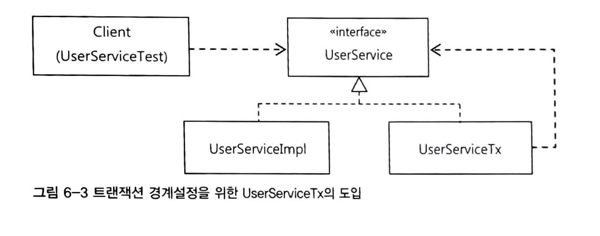

### UserService 인터페이스 도입

```java
// 인터페이스
public interface UserService {
    void add(User user);
    void upgradeLevels();
}

// 구현 클래스
public class UserServiceImpl implements UserService {
}
```

### 분리된 트랜잭션 기능

```java
public class UserServiceTx implements UserService {
    private final UserService userService;

    public UserServiceTx(UserService userService) {
        this.userService = userService;
    }

    @Override
    public void add(User user) {
        userService.add(user);
    }

    @Override
    public void upgradeLevels() {
        userService.upgradeLevels();
    }
}
```

(구조가 약간 프록시 패턴? 데코레이터 패턴 구조와 유사한듯 하다)

UserServiceTx에 트랜잭션의 경계설정이라는 부가적인 작업을 처리하도록 하자

```java
public class UserServiceTx implements UserService {
    private final UserService userService;
    private final PlatformTransactionManager transactionManager;

    public UserServiceTx(UserService userService, PlatformTransactionManager transactionManager) {
        this.userService = userService;
        this.transactionManager = transactionManager;
    }

    @Override
    public void add(User user) {
        userService.add(user);
    }

    @Override
    public void upgradeLevels() {
        TransactionStatus status = transactionManager.getTransaction(new DefaultTransactionDefinition());
        try {
            userService.upgradeLevels();
            transactionManager.commit(status);
        } catch (Exception e) {
            transactionManager.rollback(status);
            throw e;
        }
    }
}
```

### 트랜잭션 적용을 위한 DI 설정

클라이언트에서 DI를 통해 UserService의 구현체를 바꿔가며 동작하도록 해보자.

```java
@SpringBootTest
class UserServiceTest {

		@Autowired
		private UserService userServiceImpl;
		
		@Autowired
		private PlatformTransactionManager transactionManager;
		
		private UserService userService;
		
		@BeforeEach
		void setUp() {
		    userService = new UserServiceTx(userServiceImpl, transactionManager);
		}

		...
}
```

### 트랜잭션 분리에 따른 테스트 수정

- @Autowired는 기본적으로 타입이 일치하는 빈을 찾아준다.
- 만약 같은 타입의 빈이 두 개라면 필드 이름을 이용해 빈을 찾는다.
- 스프링은 기본적으로 빈 생성할 때 카멜케이스로된 클래스 이름을 필드 이름으로 해서 생성한다.

```java
// 아래와 같이 선언을 하면 해당 구현체로 주입해준다.
// 단, 아래 구현 클래스에 스프링 빈 어노테이션 선언을 해줘야한다.
// 스프링 빈 어노테이션: @Component, @Service, @Repository, @Controller
UserServiceTx -> UserService userServiceTx;
UserServiceImpl -> UserService userServiceImpl;
```

### 트랜잭션 경계설정 코드 분리의 장점

- 비즈니스 로직을 담당하고 있는 UserServiceImpl의 코드를 작성할 때는 트랜잭션과 같은 기술적인 내용은 고려하지 않아도 된다.
- 비즈니스 로직에 대한 테스트를 손쉽게 만들어낼 수 있다.

# 6.2 고립된 단위 테스트

- 가능한 한 작은 단위로 쪼개서 테스트하는 것이 가장 편하고 좋은 테스트 방법이다.
- 작은 단위의 테스트가 좋은 이유는 테스트 실패 시 원인을 찾기가 쉽기 때문이다.

## 복잡한 의존관계 속의 테스트

UserService의 경우 여러 객체의 의존관계가 연결돼있다. UserService의 기능을 테스트 하려고 할 때, 의존 객체 또한 테스트 진횅되는 동안 함께 실행된다는 것이다.

이렇게 의존 객체가 엮여 있는 경우 환경 혹은 코드가 조금만 변경되더라도 테스트 결과는 실패하게 될 것이다. 이는 테스트 코드를 작성했음에도 유지보수 비용이 훨씬 들어가는 상황이 되는 것이다.

## 테스트 대상 오브젝트 고립시키기

테스트의 대상이 환경이나 외부 서버, 다른 클래스 코드에 종속되고 영향을 받지 않도록 고립시킬 필요가 있다.

이를 위한 방법은 MailSender에 적용해봤던 **테스트를 위한 대역을 사용**하는 것이다. 대역 설정으로는 DummyMailSender라는 **테스트 스텁**을 적용했고 MockMailSender라는 목 오브젝트도 사용했었다.

### 테스트를 위한 UserServiceImpl 고립

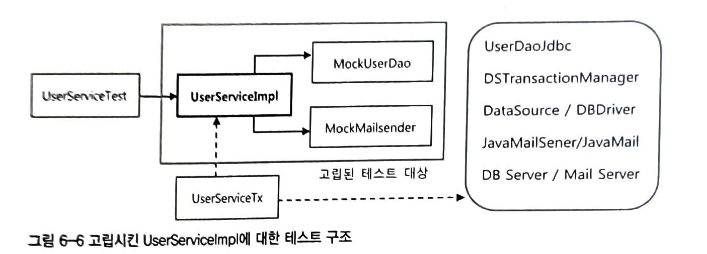

### 고립된 단위 테스트 활용

```java
@Autowired
private MockMailSender mailSender;

@BeforeEach
void setUp() {
    userServiceImpl = new UserServiceImpl(userDao, dataSource, mailSender);
}

@Test
void upgradeAllOrNothingSyncTransaction() {
    userDao.deleteAll();
    for (User user : userList) {
        userDao.add(user);
    }
    userServiceImpl.upgradeLevels();

    checkLevelUpgraded(userList.get(0), false);
    checkLevelUpgraded(userList.get(1), false);
    checkLevelUpgraded(userList.get(2), true);
    checkLevelUpgraded(userList.get(3), false);
    checkLevelUpgraded(userList.get(4), true);
    checkLevelUpgraded(userList.get(5), true);

    List<String> targets = mailSender.getTargets();
    assertThat(targets.size()).isEqualTo(3);
    assertThat(targets.get(0)).isEqualTo(userList.get(2).getEmail());
    assertThat(targets.get(1)).isEqualTo(userList.get(4).getEmail());
    assertThat(targets.get(2)).isEqualTo(userList.get(5).getEmail());
}
```

- 위 코드는 사용자 레벨 업그레이드 로직을 테스트하는 것이다.
- 여기서 핵심은 UserService의 레벨 업그레이드 기능이외에 메일 발송 등은 MockMailSender 으로 목 객체를 주입했다는 점이다.
- UserService의 기능에만 집중하도록 하여 테스트 대역을 고립시키는 것이다.

### UserDao 목 오브젝트

중요한 점은 UserService가 의존하는 객체들은 목 객체로 주입하여 고립 시키는 것이 가능하다는 것이다.

```java
@Component
public class UserServiceImpl implements UserService {
		public void upgradeLevels() {
		    List<User> users = userDao.getAll();
		    ...
		}
		...
}
```

위 코드 중 userDao.getAll() 부분에서 회원 리스트를 가져오는 부분을 목 객체로 대체하는 것이 가능하다.

```java
// UserDao 목 객체
public class MockUserDao implements UserDao {
    @Override
    public void add(User user) {
        throw new UnsupportedOperationException();
    }

    @Override
    public List<User> getAll() {
        return Arrays.asList(USER4, USER5, USER6, USER7);
    }
		...
}

// 테스트 코드
@SpringBootTest
class UserServiceMockTest {
		
		@BeforeEach
		void setUp() {
		    userServiceImpl = new UserServiceImpl(new MockUserDao(), dataSource, mailSender);
		}
		...
}
```

위와 같이 임의 값으로 반환하도록 고정하고 UserService 주입 시 MockUserDao 객체를 주입해주면 된다.

### 테스트 수행 성능의 향상

- 불필요한 의존 객체의 로직 수행을 줄였기 때문에 테스트 수행 속도가 향상

## 단위 테스트와 통합 테스트

- 테스트 대상 클래스를 목 오브젝트 등의 테스트 대역을 이용해 의존 오브젝트나 외부의 리소스를 사용하지 않도록 고립시켜서 테스트하는 것을 **단위 테스트**라고 한다.
- 두 개 이상의 성격이나 계층이 다른 오브젝트가 연동하도록 만들어 테스트하거나, 또는 외부 DB나 파일, 서비스 등의 리소스가 참여하는 테스트를 **통합 테스트**라고 한다.

### 테스트 가이드 라인

- 단위 테스트를 먼저 고려한다.
- 외부 리소스를 사용해야 테스트 가능한 것은 통합 테스트로 만든다.
- DAO와 같은 것은 DB를 통해 로직을 수행하는 인터페이스와 같은 역할을 하기 때문에 테스트 작성이 어려운 부분이다.
    - DAO 테스트는 통합 테스트로 분류한다.
- 스프링 컨텍스트를 이용하는 테스트는 통합 테스트다.

## 목 프레임워크

앞서 구현한 MockUserDao와 같은 테스트를 위한 클래스를 매번 정의하는 것은 아주 불편한 점이다. 이렇게 목 오브젝트를 편리하게 작성할 수 있는 프레임워크가 있다.

### Mockito 프레임워크

Mockito 프레임워크를 사용하면 목 오브젝트 생성은 다음과 같이 생성할 수 있다.

```java
UserDao mockUserDao = mock(UserDao.class);
```

그리고 이렇게 생성한 목 오브젝트에 행위(스텁)를 지정하는 것은 다음과 같이 할 수 있다.

```java
when(mockUserDao.getAll()).thenReturn(this.user);
```

마지막으로 목 오브젝트가 제대로 실행됐는지 검증은 아래와 같이 한다.

```java
verify(mockUserDao, times(2)).update(any(User.class));
```

아래는 Mockito 프레임워크를 적용한 테스트 코드이다.

```java
@SpringBootTest
@ExtendWith(MockitoExtension.class)
class UserServiceMockitoTest {

    @Mock
    private UserDao userDao;

    @Mock
    private DataSource dataSource;

    @Mock
    private MockMailSender mailSender;

    private UserService userServiceImpl;

    private List<User> userList;

    @BeforeEach
    void setUp() {
        userServiceImpl = new UserServiceImpl(userDao, dataSource, mailSender);
        userList = Arrays.asList(USER4, USER5, USER6, USER7, USER8, USER9);
    }

    @Test
    void mockitoUpgradeLevels() {
        when(userDao.getAll()).thenReturn(userList);

        userServiceImpl.upgradeLevels();

        verify(userDao, times(3)).update(any(User.class));
    }
}
```

# 6.3 다이내믹 프록시와 팩토리 빈

## 프록시와 프록시 패턴, 데코레이터 패턴

트랜잭션 경계설정 코드에 적용한 기법 검토

- 확장성을 고려해 한 가지 기능을 분리한다면 **전략 패턴**을 사용하면 된다. 그러나 트랜잭션 경계설정 코드에는 전략 패턴이 적용되어 있다.

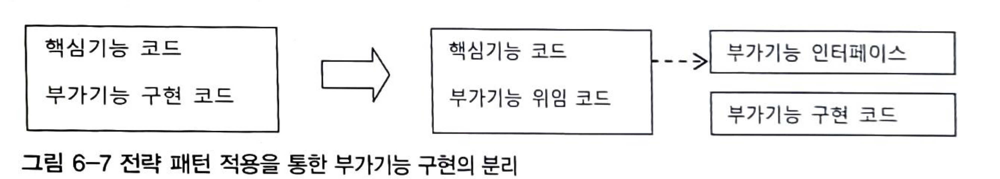

- 전략 패턴이 적용됐지만 트랜잭션 기능의 구현 내용을 분리했을 뿐 트랜잭션 적용 부분은 여전히 남아있는 상황

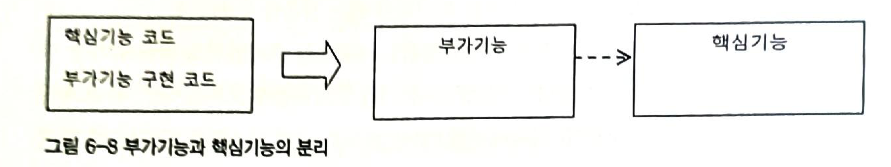

- 비즈니스 로직과 트랜잭션과 같은 부가적인 기능은 **성격이 다르기** 때문에 부가기능 전체를 핵심기능과 분리하였다.

**클래스 역할 분리의 중요성**

- 부가기능 외의 나머지 모든 기능은 핵심기능을 가진 클래스로 위임
- 핵심기능은 부가기능을 가진 클래스의 존재를 모른다.
- 부가기능이 핵심기능을 사용하는 구조

**역할 분리의 한계**

- 클라이언트가 핵심기능을 직접 사용하는 경우
    - 부가기능을 적용할 수 가 없다.
- 부가기능을 핵심기능인 것 처럼 클라이언트가 사용하도록 해야하는 것이 핵심

**해결 방안**

- 이를 위한 방안으론 클라이언트는 인터페이스를 통해서 핵심기능을 사용하게 하고, 부가기능 자신도 같은 인터페이스를 구현하여 자연스럽게 사용하도록 한다.
    - 클라이언트는 인터페이스만을 의존하기 때문에 부가기능을 사용하는지 여부를 알 수 없다.

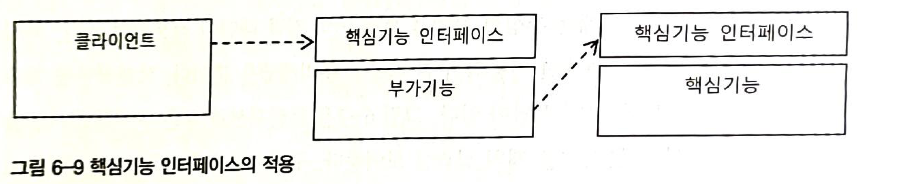

- 여기서 핵심은 부가기능 코드에서 부가기능을 적용한 이후에 핵심기능으로 요청을 위임해준다는 사실이다.
- 부가기능의 역할은 대리인과 같은 역할을 한다고 해서 **`프록시(proxy)`**라고 한다.
    - 프록시를 통해 최종적으로 요청을 위임받아 처리하는 실제 오브젝트를 **`타깃(target)`** 또는 **`실체(real subject)`** 라고 한다.

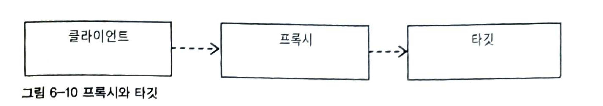

**프록시의 특징**

- 타깃과 같은 인터페이스를 구현
- 프록시가 타깃을 제어할 수 있는 위치에 존재(요청을 위임)
- 프록시는 사용 목적에 따라 두 가지로 구분
    - 클라이언트가 타깃에 접근하는 방법을 제어
    - 타깃에 부가적인 기능을 부여

### 데코레이터 패턴

- 타깃에 부가적인 기능을 런타임 시 동적으로 부여해주기 위해 프록시를 사용하는 디자인 패턴
- 동적으로 기능을 부가한다는 의미는 컴파일 시점에 프록시와 타깃 간의 의존성이 결정되어 있지 않다는 의미
- 데코레이터 패턴에서 프록시는 꼭 한 개로 제한하지 않는다.
- 프록시가 직접 타깃을 사용하도록 고정시킬 필요도 없다.

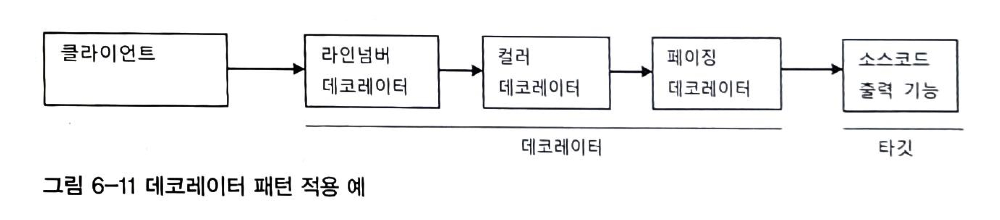

- 프록시로 동작하는 각 데코레이터는 위임하는 대상도 인터페이스로 접근하기 때문에 자신이 최종 타깃으로 위임하는지 프록시로 위임하는지 알지 못한다.
- 때문에 데코레이터의 다음 위임 대상은 인터페이스로 선언하고 생성자 혹은 수정자 메소드를 통해 위임 대상을 외부에서 런타임 시에 주입받을 수 있도록 만들어야 한다.

> 데코레이터 패턴의 대표적인 예시는 자바 IO 패키지의 InputStream과 OutputStream 구현 클래스가 있다.

ex)
InputStream is = new BufferedInputStream(new FileInputStream(”a.txt”));
> 

그리고 UserService 인터페이스를 구현한 타깃인 UserServiceImpl에 트랜잭션 부가기능을 제공해주는 UserServiceTx를 추가한 것도 데코레이터 패턴을 적용한 것이라고 볼 수 있다.

데코레이터 패턴은 인터페이스를 통해 위임하는 방식이기 때문에 어느 데코레이터에서 타깃으로 연결될지 코드 레벨에선 미리 알 수 없다.

### 프록시 패턴

- 프록시라는 용어는 디**자인 패턴에서의 프록시와 구분할 필요가 있다.**
    - 일반적으로 말하는 프록시는 **클라이언트와 사용 대상 사이에 대리 역할을 맡은 오브젝트는 두는 방법**을 총징
    - 디자인 패턴에서 말하는 프록시는 **타깃에 대한 접근 방법을 제어하려는 목적**을 가진 경우를 말한다.
- **프록시 패턴의 프록시는 타깃의 기능을 확장하거나 추가하지 않는다.**
    - 클라이언트가 **타깃에 접근하는 방식을 변경**해주는 것이 핵심이다.
- 타깃 오브젝트가 생성하기 복잡하거나 당장 필요하지 않는 경우 필요한 시점까지 생성하지 않는 것이 좋다. 다만 타깃에 대한 레퍼런스가 미리 필요할 수 있는데 이러한 경우 프록시 패턴을 적용하면 된다.
- 클라이언트는 타깃 객체를 바로 의존하는 것이 아닌 프록시 객체를 의존하도록 한다.
- 원격 객체를 이용하는 경우, 각종 원격 기술을 이용해 다른 서버에 존재하는 객체를 사용해야한다면, 원격 객체에 대한 프록시를 만들어두고 클라이언트는 마치 로컬에 존재하는 것 처럼 프록시를 사용하게 할 수 있다.
- 클라이언트로 하여금 원격 오브젝트에 대한 접근 방법을 제공해주는 것은 프록시 패턴의 예시이다.
- 특별한 상황에서 타깃에 대한 접근권한을 제어하기 위해 프록시 패턴을 사용할 수 있다.
    - Collection의 unmodifiableCollection()
    - 지원하지 않는 메소드는 UnsupportedOperationException 예외를 발생시킨다.
- 프록시 패턴은 타깃의 기능 자체에는 관여하지 않으면서 접근하는 방법을 제어해주는 프록시를 이용하는 것이다.
- 프록시 패턴과 데코레이터 패턴은 프록시를 사용한다는 점에서 아주 유사하다.
    - 프록시는 접근제어의 역할을 위주로 처리하고 데코레이터 패턴은 이름과 같이 부가기능을 부여하는 역할을 수행한다.
- 이 둘을 조합하여 활용할 수 도 있다.

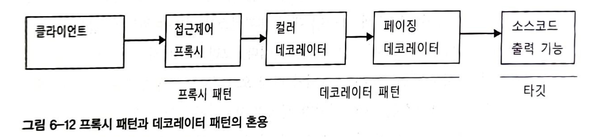

## 다이내믹 프록시

**프록시는 기존 코드에 영향을 주지 않으면서 타깃의 기능을 확장하거나 접근 방법을 제어할 수 있는 유용한 방법**이다.

그러나 매번 새로운 프록시 클래스를 정의하고 인터페이스를 구현하는 작업은 번거로움이 많다. 일례로 테스트를 위해 목 오브젝트를 만들었던 것과 비슷한 상황이다.

이러한 불편함은 자바에서 java.lang.reflect 패키지안의 클래스들을 활용하면 **프록시 생성 뿐아니라 모든 인터페이스를 구현하거나 클래스를 정의하는 부분을 편리하게 만들어 사용**할 수 있다.

### 프록시의 구성과 프록시 작성의 문제점

프록시는 **타깃 오브젝트로 요청 위임**, **요청에 대한 부가기능 수행** 두 가지 기능을 수행한다.

다음은 UserServiceTx에서 핵심기능과 부가기능을 구분한 것이다.

```java
public class UserServiceTx implements UserService {
    private final UserService userService; // 타깃 객체
    private final PlatformTransactionManager transactionManager;

    public UserServiceTx(UserService userService, PlatformTransactionManager transactionManager) {
        this.userService = userService;
        this.transactionManager = transactionManager;
    }

    @Override
    public void add(User user) {
        userService.add(user);
    }

    @Override
    public void upgradeLevels() {
				// 부가기능
        TransactionStatus status = transactionManager.getTransaction(new DefaultTransactionDefinition());
        try {
            userService.upgradeLevels(); //핵심기능
            transactionManager.commit(status);
        } catch (Exception e) {
            transactionManager.rollback(status);
            throw e;
        }
    }
}
```

- 위 코드에서 **프록시 생성이 번거로운 이유**를 찾아 볼 수 있다.
- 타깃의 인터페이스를 구현하고 위임하는 코드를 작성하기가 번거롭다.
    - 부가기능이 필요하지 않는 메소드도 구현해서 타깃으로 위임하는 코드를 만들어야한다.
    - 타깃의 인터페이스에 변경이 생기면 프록시 객체에도 영향을 받게된다.
- 부가기능 코드가 중복될 가능성이 많다.
    - 트랜잭션의 경우 DB를 사용하는 대부분의 로직에 적용될 필요가 있다. 만약 UserDao 이외에 새로운 DAO가 생긴다면 해당 클래스의 프록시 클래스를 생성해야한다.

이러한 번거로운 부분을 **`JDK의 다이내믹 프록시`**로 유연하게 처리할 수 있다.

### 리플렉션

다이내믹 프록시는 리플렉션 기능을 이용해서 프록시를 만들어준다. 리플렉션은 자바의 코드 자체를 추상화해서 접근하도록 만든 것이다.

```java
String name = "Hello";
```

일반적으로 String 객체의 길이를 알기 위해 name.length() 를 호출하면 된다. 자바의 모든 클래스는 그 클래스 자체의 구성정보를 담은 Class 타입의 객체를 하나씩 갖고 있다.

클래스 오브젝트를 이용하면 클래스 코드에 대한 메타정보를 가져오거나 오브젝트를 조작할 수 있다.

리플렉션 API 중에서 메소드에 대한 정의를 담은 Method라는 인터페이스중 메소드 호출하는 부분을 살펴보면 다음과 같다.

```java
Method lengthMethod = String.class.getMethod("length");
```

java.lang.reflect.Method 인터페이스는 메소드에 대한 자세한 정보를 담고 있을 뿐만 아니라, 이를 이용해 특정 오브젝트의 메소드를 실행시킬 수도 있다.

메소드 실행은 invoke() 메소드를 사용하면 된다.

```java
// 학습 테스트
public class ReflectionTest {

    @Test
    void invokeMethod() throws NoSuchMethodException, InvocationTargetException, IllegalAccessException {
        String name = "Hello";
        int nameLength = name.length();
        int firstIndex = 0;
        char firstChar = name.charAt(firstIndex);

        // length()
        assertThat(name.length()).isEqualTo(nameLength);
        Method lengthMethod = String.class.getMethod("length");
        assertThat(lengthMethod.invoke(name)).isEqualTo(nameLength);

        // charAt()
        assertThat(name.charAt(firstIndex)).isEqualTo(firstChar);
        Method charAtMethod = String.class.getMethod("charAt", int.class);
        assertThat(charAtMethod.invoke(name, 0)).isEqualTo(firstChar);
    }
}
```

### 프록시 클래스

다이내믹 프록시를 이용한 프록시 생성

```java
// 인터페이스
public interface Hello {
    String sayHello(String name);
    String sayHi(String name);
    String sayThankYou(String name);
}

// 타깃
public class HelloTarget implements Hello {
    @Override
    public String sayHello(String name) {
        return "Hello " + name;
    }

    @Override
    public String sayHi(String name) {
        return "Hi " + name;
    }

    @Override
    public String sayThankYou(String name) {
        return "Thank You " + name;
    }
}

// 데코레이터 프록시
public class HelloUppercase implements Hello {
    private final Hello hello;

    public HelloUppercase(Hello hello) {
        this.hello = hello;
    }

    @Override
    public String sayHello(String name) {
        return hello.sayHello(name).toUpperCase();
    }

    @Override
    public String sayHi(String name) {
        return hello.sayHi(name).toUpperCase();
    }

    @Override
    public String sayThankYou(String name) {
        return hello.sayThankYou(name).toUpperCase();
    }
}

// 테스트
public class DynamicProxyTest {

    @Test
    void simpleProxy() {
        Hello hello = new HelloTarget();
        String name = "Spring";
        assertThat(hello.sayHello(name)).isEqualTo("Hello " + name);
        assertThat(hello.sayHi(name)).isEqualTo("Hi " + name);
        assertThat(hello.sayThankYou(name)).isEqualTo("Thank You " + name);
    }

    @Test
    void decorator() {
        Hello hello = new HelloUppercase(new HelloTarget());
        String name = "Spring";
        assertThat(hello.sayHello(name)).isEqualTo("HELLO " + name.toUpperCase());
        assertThat(hello.sayHi(name)).isEqualTo("HI " + name.toUpperCase());
        assertThat(hello.sayThankYou(name)).isEqualTo("THANK YOU " + name.toUpperCase());
    }
}
```

**문제인식**

- 인터페이스의 모든 메소드를 구현해 위임하도록 하는 문제점 존재
- 부가기능의 리턴 값을 대문자로 바꾸는 기능이 모든 메소드에 중복돼는 문제점 존재

### 다이내믹 프록시 적용

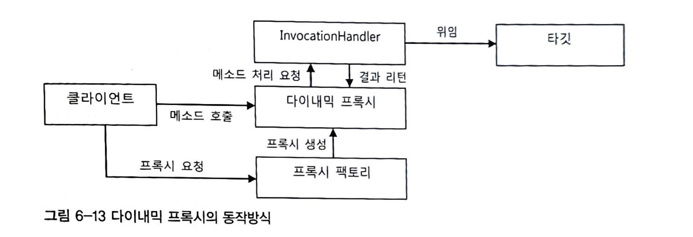

- **다이내믹 프록시**는 **프록시 팩토리**에 의해 런타임 시 동적으로 만들어지는 객체
- 다이내믹 프록시 객체는 타깃의 인터페이스와 같은 타입으로 생성
- 클라이언트는 다이내믹 프록시 객체를 타깃 인터페이스를 통해 사용할 수 있다.
- 프록시를 만들 때 인터페이스를 모두 구현해가면서 클래스를 정의하지 않아도 된다.
    - 프록시 팩토리에게 인터페이스 정보를 제공해주면 해당 인터페이스를 구현한 클래스를 만들어주기 때문
- 타깃 인터페이스를 구현해주지만 프록시로서 필요한 부가기능 제공 코드는 직접 작성 필요
- 부가기능은 프록시 객체와 독립적으로 **`InvocationHandler`** 인터페이스를 구현한 객체에 담는다.

```java
// InvocationHandler.class
public Object invoke(Object proxy, Method method, Object[] args)
```

- 다이내믹 프록시 객체는 클라이언트의 모든 요청을 리플렉션 정보로 변환해서 InvocationHandler 구현 객체의 invoke() 메소드로 넘긴다.
    - 타깃 인터페이스의 모든 메소드 요청이 하나의 메소드로 집중되어 중복되는 기능을 효과적으로 제공할 수 있다.

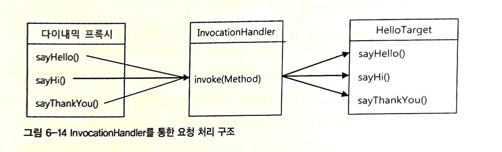

- InvocationHandler 인터페이스를 구현한 객체를 제공하면 다이내믹 프록시가 받는 모든 요청을 InvocationHandler의 invoke() 메소드로 보내준다.

```java
public class UppercaseHandler implements InvocationHandler {
    private Hello target;

    public UppercaseHandler(Hello target) {
        this.target = target;
    }

    @Override
    public Object invoke(Object proxy, Method method, Object[] args) throws Throwable {
        String result = (String) method.invoke(target, args);
        return result.toUpperCase();
    }
}
```

- 다이내믹 프록시로부터 요청을 전달받으려면 위와 같이 InvocationHandler를 구현해야한다.
- 다이내믹 프록시가 클라이언트로부터 받는 모든 요청은 invoke() 메소드로 전달된다.
- 다이내믹 프록시를 통해 요청이 전달되면 **리플렉션 API를 이용해 타깃 객체의 메소드를 호출**한다.

```java
// 다이내믹 프록시 생성
@Test
void createDynamicProxy() {
    // 다이내믹 프록시 객체가 타깃 인터페이스를 구현하고 있어서 캐스팅에 안전
    Hello helloProxy = (Hello) Proxy.newProxyInstance(
            //동적으로 생성되는 다이내믹 프록시 클래스의 로딩에 사용할 클래스 로더
            getClass().getClassLoader(),
            //구현할 인터페이스
            new Class[]{Hello.class},
            //부가기능과 위임 코드를 담은 invocationHandler
            new UppercaseHandler(new HelloTarget())
    );
}
```

- 다이내믹 프록시가 정의되는 클래스 로더 지정 필요
- 다이내믹 프록시가 구현할 인터페이스 지정
    - 하나 이상의 인터페이스를 구현할 수 있다.
- 부가기능과 위임 관련해서 InvocationHandler를 구현한 객체 지정

### 다이내믹 프록시의 확장

**일반 프록시보다 다이내믹 프록시가 더 나은점?**

- 타깃 인터페이스에 정의된 메소드가 수십개라면? 직접 구현한 프록시는 매번 코드를 추가해야 하는 번거로움이 존재한다.
- 다이내믹 프록시 방식은 자동으로 타깃 인터페이스를 구현해주기 때문에 신경쓰지 않아도 된다. 또한, 부가기능은 InvocationHandler의 invoke() 에서 처리한다.
- 현재 구현한 Hello 인터페이스 메소드의 반환 타입이 String이 아니라면 캐스팅 오류가 발생할 가능성이 있다. 때문에 리플렉션을 사용할 땐 주의가 필요하다.
- InvocationHandler 방식은 타깃의 종류에 상관없이 적용 가능하다.
    - 리플렉션의 Method 인터페이스를 이용해 타깃의 메소드를 호출하기 때문에 타깃의 타입을 제한할 필요가 없다.

```java
// 타입 캐스팅 문제 개선
public class UppercaseHandler implements InvocationHandler {
    private Hello target;

    public UppercaseHandler(Hello target) {
        this.target = target;
    }

    @Override
    public Object invoke(Object proxy, Method method, Object[] args) throws Throwable {
        Object result = method.invoke(target, args);
        if (result instanceof String) {
            return ((String) result).toUpperCase();
        }
        return result;
    }
}
```

- InvocationHandler는 단일 메소드에서 모든 요청을 처리하기 때문에 어떤 메소드에 어떤 기능을 적용할지를 선택하는 과정이 필요할 수 있다.
    - 호출하는 메소드 이름, 파라미터 개수, 타입 등의 정보로 부가기능을 적용할 메소드를 선정

```java
// 메소드 선정(이름) 기능 추가
@Override
public Object invoke(Object proxy, Method method, Object[] args) throws Throwable {
    Object result = method.invoke(target, args);
    if (result instanceof String && method.getName().startsWith("say")) {
        return ((String) result).toUpperCase();
    }
    return result;
}
```

## 다이내믹 프록시를 이용한 트랜잭션 부가기능

UserServiceTx에 다이내믹 프록시 적용하기

UserServiceTx의 **문제점**은 다음과 같다.

- 서비스 인터페이스의 메소드를 모두 구현해야한다.
- 트랜잭션이 필요한 메소드마다 트랜잭션 처리코드가 중복돼서 비효율적인 방법으로 만들어져있다.

트랜잭션 부가기능을 제공하는 **다이내믹 프록시를 만들어 적용하는 것이 위 문제점들을 효율적으로 처리**할 수 있다. InvocationHandler는 한 개만 정의하면 되기 때문이다.

```java
// 트랜잭션 부가기능 InvocationHandler
public class TransactionHandler implements InvocationHandler {
    // 부가기능을 제공할 타깃 객체 타입이 Object이기 때문에 어떤 타입의 객체도 적용 가능
    private Object target;
    // 트랜잭션 기능을 제공하는데 필요한 트랜잭션 매니저
    private PlatformTransactionManager transactionManager;
    // 부가기능을 적용할 메소드 이름 패턴
    private String pattern;
    
    public TransactionHandler(Object target, PlatformTransactionManager transactionManager) {
        this.target = target;
        this.transactionManager = transactionManager;
    }

    public TransactionHandler(Object target, PlatformTransactionManager transactionManager, String pattern) {
        this.target = target;
        this.transactionManager = transactionManager;
        this.pattern = pattern;
    }

    @Override
    public Object invoke(Object proxy, Method method, Object[] args) throws Throwable {
        if (method.getName().startsWith(pattern)) {
            return invokeTransaction(method, args);
        }
        return method.invoke(target, args);
    }
    
    private Object invokeTransaction(Method method, Object[] args) throws Throwable {
        TransactionStatus status = transactionManager.getTransaction(new DefaultTransactionDefinition());
        try {
            Object obj = method.invoke(target, args);
            transactionManager.commit(status);
            return obj;
        } catch (InvocationTargetException e) {
            transactionManager.rollback(status);
            throw e;
        }
    }
}
```

- 프록시로 들어온 클라이언트의 요청을 타깃 객체로 위임하기 위해 DI를 수행
- DI 받은 타깃의 메소드의 이름이 패턴과 일치하는지 검증한다.
- 패턴이 일치하는 메소드라면 트랜잭션 부가기능 메소드를 호출한다.
- UserServiceTx와 다른점은 트랜잭션 롤백시 처리되는 예외는 RuntimeException 대신 InvocationTargetException을 잡는다는 것이다.
    - 리플렉션 메소드인 Method.invoke()를 이용해 타깃 객체의 메소드를 호출할 때 타깃 객체에서 발생하는 예외가 InvocationTargetException으로 한 번 포장돼서 전달된다.

### TransactionHandler와 다이내믹 프록시를 이용하는 테스트

```java
@Test
void upgradeAllOrNothing() {
    ...
    TransactionHandler handler = new TransactionHandler(
            new TestUserService(userDao, dataSource, mailSender),
            transactionManager,
            "upgradeLevels"
    );
    UserService userService = (UserService) Proxy.newProxyInstance(
            getClass().getClassLoader(),
            new Class[]{UserService.class},
            handler
    );
    userService.upgradeLevels();

		...
}
```

**[참고] 상황 테스트**

- 회원의 등급 업그레이드 중에 exception이 발생하면 전부 롤백 처리 한다.

```java
@Test
void upgradeAllOrNothing_proxy() {
    userDao.deleteAll();
    for (User user : userList) {
        userDao.add(user);
    }
    TransactionHandler handler = new TransactionHandler(
            new TestUserService(userDao, dataSource, mailSender, userList.get(3).getId()),
            transactionManager,
            "upgradeLevels");
    UserService userService = (UserService) Proxy.newProxyInstance(
            getClass().getClassLoader(),
            new Class[]{UserService.class},
            handler);
    try {
        userService.upgradeLevels();
    } catch (Exception e) {
        checkLevelUpgraded(userList.get(0), false);
        checkLevelUpgraded(userList.get(1), false);
        checkLevelUpgraded(userList.get(2), false);
        checkLevelUpgraded(userList.get(3), false);

        // 메일 발송 이력은 롤백이 안됨... 
        List<String> targets = mailSender.getTargets();
        assertThat(targets.size()).isEqualTo(1);
    }
}
```

- userList 3번 회원의 등급 업그레이드를 수행할 때 exception 발생
- userList의 회원들은 전부 등급 업그레이드 내역 롤백
- mailSender target 리스트는 exception 이전에 등급 업그레이드된 회원은 리스트에 저장돼 있다.

메일 발송 로직이 모아서 처리하는 것이 아니라 실시간성으로 처리되기 때문에 이러한 문제가 발생한 것으로 파악

## 다이내믹 프록시를 위한 팩토리 빈

TransactionHandler를 생성하고 다이내믹 프록시를 UserService에 적용했다. 그러나 **다이내믹 프록시를 스프링 빈으로 등록하지 못하는 문제**가 있다.

**스프링 빈의 생성 방식의 특징**은 다음과 같다.

- 스프링 빈은 클래스 이름과 프로퍼티로 정의
- 스프링은 지정된 클래스 이름을 가지고 리플렉션을 이용해서 해당 클래스 객체를 생성

```java
Date now = (Date) Class.forName("java.util.Date").newInstance();
```

- 스프링은 내부적으로 리플렉션 API를 이용해 빈 정의에 나오는 클래스 이름을 가지고 빈 객체를 생성한다.

**다이내믹 프록시를 스프링 빈으로 등록하지 못하는 문제**

- 내부적으로 동적으로 새롭게 정의해서 사용하기 때문에 다이내믹 프록시 객체가 무엇인지 알 수가 없다.
- 다이내믹 프록시 객체는 다음과 같이 만들 수 있다.

```java
UserService userService = (UserService) Proxy.newProxyInstance(
                getClass().getClassLoader(), 
                new Class[]{UserService.class},
                handler);
```

### 팩토리 빈

스프링은 클래스 정보를 가지고 **기본 생성자를 통해 오브젝트를 만드는 방법 외에 빈을 만들 수 있는 여러 방법을 제공**하는데, 대표적으로 **`팩토리 빈`** 생성 방법이 있다. ****

**팩토리 빈**이란 스프링을 대신해서 객체의 생성로직을 담당하도록 만들어진 특별한 빈을 말한다.

팩토리 빈을 만드는 여러 방법 중 간단한 방법은 스프링의 **FactoryBean 인터페이스를 구현**하는 것이다.

```java
public interface FactoryBean<T> {
		/**
		 * The name of an attribute that can be
		 * {@link org.springframework.core.AttributeAccessor#setAttribute set} on a
		 * {@link org.springframework.beans.factory.config.BeanDefinition} so that
		 * factory beans can signal their object type when it can't be deduced from
		 * the factory bean class.
		 * @since 5.2
		 */
		String OBJECT_TYPE_ATTRIBUTE = "factoryBeanObjectType";
	
		// 빈 객체를 생성해서 반환
		@Nullable
		T getObject() throws Exception;
	
		// 생성되는 객체의 타입을 알려준다
		@Nullable
		Class<?> getObjectType();
	
		// getObject()가 돌려주는 객체가 항상 같은 싱글톤 객체인지 여부
		default boolean isSingleton() {
			return true;
		}
}
```

FactoryBean 인터페이스를 구현한 클래스를 스프링의 빈으로 등록하면 팩토리 빈으로 동작한다. 

그럼 이제 **팩토리 빈의 동작원리**를 알아보자

```java
public class Message {
    private String text;

    private Message(String text) {
        this.text = text;
    }

    public static Message newMessage(String text) {
        return new Message(text);
    }

    public String getText() {
        return text;
    }
}
```

Message 클래스는 private 생성자만을 가지고 있기 때문에 static 메소드인 newMessage()로만 객체를 생성할 수 있다.

물론 **스프링은 private 생성자를 가진 클래스도 빈으로 등록하고자 하면 리플렉션을 이용해 객체를 생성**해준다. 리플렉션은 private으로 선언된 접근 규약을 위반할 수 있는 강력한 기능이 있기 때문이다.

그러나 static 으로 생성한 개발자의 의도가 있을 것이기 때문에 이를 무시하고 강제로 생성하는 것은 위험하다.

Message 클래스를 생성하는 팩토리 빈 클래스를 만들어보자

```java
@Component("message")
public class MessageFactoryBean implements FactoryBean<Message> {
    // 객체를 생성할 때 필요한 정보를 팩토리 빈의 필드 값으로 설정해서 
		// 대신 DI 받을 수 있게 한다.
		private final String text;

    public MessageFactoryBean() {
        this.text = "Factory Bean";
    }

		// 실제 빈으로 사용된 객체를 직접 생성한다.
		// 코드를 이용하기 때문에 복잡한 방식의 생성, 초기화 작업이 가능하다.
    @Override
    public Message getObject() throws Exception {
        return Message.newMessage(text);
    }

    @Override
    public Class<? extends Message> getObjectType() {
        return Message.class;
    }

		// getObject()로 반환되는 객체가 싱글톤인지 알려준다.
		// 해당 팩토리 빈은 매번 새로운 객체를 생성하고 있기 때문에 false로 지정
		// 참고로 스프링이 관리하는 빈은 싱글톤으로 관리해준다.
    @Override
    public boolean isSingleton() {
        return false;
    }
}
```

### 팩토리 빈의 설정 방법

```java
@Component("message")
public class MessageFactoryBean implements FactoryBean<Message> {
    private final String text;

    public MessageFactoryBean() {
        this.text = "Factory Bean";
    }
		...
}
```

책에서는 xml을 사용했지만 애너테이션을 이용해 스프링 빈으로 등록했다.

```java
@SpringBootTest
public class FactoryBeanTest {

    @Autowired
    private ApplicationContext context;

    @Test
    void getMessageFromFactoryBean() {
        Object message = context.getBean("message");
        assertThat(message).isInstanceOf(Message.class);
        assertThat(((Message) message).getText()).isEqualTo("Factory Bean");
    }
}
```

위 테스트를 수행해 보면 팩토리 빈 클래스 타입이 아닌 Message 타입의 빈을 가져오는 것을 확인할 수 있다.

그렇다면 팩토리 빈 클래스 타입은 어떻게 가져올 수 있을까?

```java
@Test
void getMessageFactoryBean() {
    Object message = context.getBean("&message");
    assertThat(message).isInstanceOf(MessageFactoryBean.class);
}
```

getBean() 호출할 때 파라미터 값에 **`&`** 를 넣어주면 된다.

### 다이내믹 프록시를 만들어주는 팩토리 빈

Proxy의 newProxyInstance() 메소드를 통해서만 생성할 수 있는 다이내믹 프록시 객체는 **팩토리 빈을 사용하면 스프링 빈으로 등록**할 수 있다.

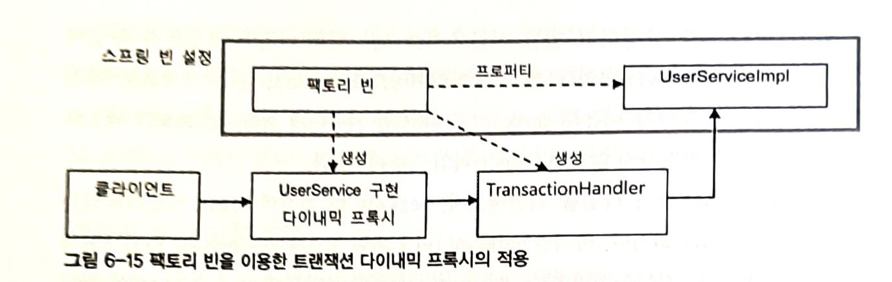

### 트랜잭션 프록시 팩토리 빈

다이내믹 프록시를 생성하는 팩토리 빈 클래스를 생성해보자

```java
@Component
public class TxProxyFactoryBean implements FactoryBean<Object> {
    private final Object target;
    private final PlatformTransactionManager transactionManager;
    private final String pattern;
    // 다이내믹 프록시 생성 시 필요
    private final Class<?> serviceInterface;

    public TxProxyFactoryBean(@Qualifier("userServiceImpl") Object target, 
                              @Autowired PlatformTransactionManager transactionManager) {
        this.target = target;
        this.transactionManager = transactionManager;
        this.pattern = "upgradeLevels";
        this.serviceInterface = UserService.class;
    }

    @Override
    public Object getObject() throws Exception {
        TransactionHandler handler = new TransactionHandler(target, transactionManager, pattern);
        return Proxy.newProxyInstance(
                getClass().getClassLoader(),
                new Class[]{serviceInterface},
                handler);
    }

    @Override
    public Class<?> getObjectType() {
        return null;
    }

    @Override
    public boolean isSingleton() {
        return false;
    }
}
```

### 트랜잭션 프록시 팩토리 빈 테스트

빈 팩토리 방식은 기존에 수동 DI 방식과 달리 DI 객체를 바꾸기가 쉽지 않다. 스프링 빈에서 생성되는 객체에 대한 테스트를 해야하기 때문이다.

이 문제를 어떻게 해결하기 위한 방법은 **테스트용 설정**을 별도로 만드는 방법 혹은 **프록시 팩토리 빈 코드를 확장**하는 방법이 있을 듯하다.

그러나 TxProxyFactoryBean의 트랜잭션을 지원하는 프록시를 바르게 만들어주는지를 확인하는 것이 목적이기 때문에 TxProxyFactoryBean를 가져와서 타깃 프로퍼티를 재구성한 뒤 다시 프록시 객체를 생성하도록 요청해보자.

```java
@DirtiesContext
@Test
void upgradeAllOrNothing_factoryBean() throws Exception {
    userDao.deleteAll();
    for (User user : userList) {
        userDao.add(user);
    }
    TxProxyFactoryBean factoryBean = context.getBean("&userService", TxProxyFactoryBean.class);
    assertThat(factoryBean).isInstanceOf(TxProxyFactoryBean.class);
    
		// 타깃 재구성
		factoryBean.setTarget(new TestUserService(userDao, dataSource, mailSender, userList.get(3).getId()));
    UserService userService = (UserService) factoryBean.getObject();
    try {
        userService.upgradeLevels();
    } catch (Exception e) {
        System.out.println("exception!");
    }
    // exception이 발생했는데 upgrade 되면 안됨
    List<String> targets = mailSender.getTargets();
    assertThat(targets.size()).isEqualTo(1);
    checkLevelUpgraded(userList.get(1), false);
}
```

타깃을 재구성하는 부분이 조금 불편함이 있다.

## 프록시 팩토리 빈 방식의 장점과 한계

- **팩토리 빈의 장점**
    - 한번 부가기능을 가진 프록시를 생성하는 팩토리 빈을 만들어두면 타깃의 타입에 상관없이 재사용할 수 있다.

### 프록시 팩토리 빈의 재사용

- TransactionHandler를 이용하는 다이내믹 프록시를 생성해주는 TxProxyFactoryBean은 코드의 수정 없이도 다양한 클래스에 적용할 수 있다.
    - 타깃 오브젝트에 맞는 프로퍼티를 설정해서 빈으로 등록하면된다.

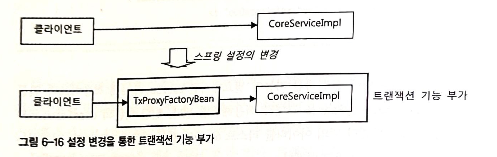

다이내믹 프록시가 타깃 인터페이스를 구현해줄 뿐 아니라 팩토리 빈으로 프록시를 생성함으로써 부가기능 또한 타깃의 타입과 관계 없이 적용할 수 있다.

### 프록시 팩토리 빈 방식의 장점

**데코레이터 패턴이 적용된 프록시의 문제점**

- 프록시를 적용할 대상의 인터페이스를 구현할 프록시 클래스를 일일이 만들어야하는 번거로움
- 부가적인 기능이 여러 메소드에 반복적으로 나타나게 돼서 코드 중복의 문제가 발생

**프록시 팩토리 빈은 위 두 가지 문제를 해결**해준다.

- 다이내믹 프록시는 타깃의 인터페이스를 구현하는 클래스를 일일이 만드는 문제점을 해결
- 핸들러 메소드를 구현하는 것으로 여러 메소드에 부가기능을 적용하는 문제점을 해결
- 다이내믹 프록시에 팩토리 빈을 이용한 DI를 적용하면 번거로운 다이내믹 프록시 생성 코드도 제거할 수 있다.

### 프록시 팩토리 빈의 한계

- 프록시를 통해 타깃에 부가기능을 제공하는 것은 메소드 단위로 수행되는 일
    - 하나의 클래스 안에 존재하는 여러 메소드에 부가기능을 적용하는 것은 앞에서 구현해봤다.
    - 한 번에 여러 개의 클래스에 공통적인 부가기능을 제공하는 일은 이어서 알아보자.
- 하나의 타깃에 여러 개의 부가기능 적용
- TransactionHandler 객체가 프록시 팩토리 빈 개수만큼 생성
    - 핸들러는 타깃 객체를 프로퍼티로 가지고 있기 때문이다. 타깃의 타입이 달라지면 해당 타깃 전용 핸들러를 만들어야한다.
    - TransactionHandler 는 다이내믹 프록시처럼 굳이 팩토리 빈에서 만들지 않아도 된다.

팩토리 빈의 한계의 결론은 T**ransactionHandler의 중복을 없애고 모든 타깃에 적용 가능한 싱글톤 빈을 만드는 방법**을 찾는 것이다.

# 6.4 스프링 프록시 팩토리 빈

트랜잭션 부가기능을 적용하면서 직면한 여러 어려움을 스프링은 어떻게 해결하고 있을까?

## ProxyFactoryBean

- 스프링은 트랜잭션 기술과 메일 발송 기술에 적용했던 **서비스 추상화를 프록시 기술에 동일하게 적용**하고있다.
- 스프링은 일관된 방법으로 프록시를 만들 수 있게 도와주는 추상 레이어를 제공한다.
- **생성된 프록시는 스프링 빈으로 등록**돼야한다.
- 스프링은 **프록시 객체를 생성해주는 기술을 추상화한 팩토리 빈을 제공**한다.
- **`org.springframework.aop.framework.ProxyFactoryBean`**은 스프링에서 프록시를 생성해서 빈 객체를 등록하게 해주는 팩토리 빈이다.
- ProxyFactoryBean은 순수하게 프록시를 생성하는 작업만 담당한다.
- 프록시를 통해 제공할 부가기능은 별도의 빈으로 구성할 수 있다.
    - 별도 클래스로 분리한다는 의미
- ProxyFactoryBean이 생성하는 프록시에서 사용할 부가기능은 `**MethodInterceptor`** 인터페이스를 구현해서 만든다.
    - **MethodInterceptor, InvocationHandler와 차이점**
        - **InvocationHandler의 invoke()**는 **타깃 객체에 대한 정보를 제공하지 않는다.** 따라서 **타깃은 InvocationHandler를 구현한 클래스가 직접 알고**있어야한다.
        - **MethodInterceptor의 invoke()** 는 **ProxyFactoryBean으로부터 타깃 객체에 대한 정보까지 함께 제공**받는다.
    - **MethodInterceptor**는 타깃 객체에 상관없이 독립적으로 생성될 수 있다.
        - 타깃이 다른 여러 프록시에서 함께 사용할 수 있다.
        - 싱글톤 빈으로 등록 가능하다.

```java
// proxyFactoryBean 테스트
@Test
void proxyFactoryBean() {
    ProxyFactoryBean factoryBean = new ProxyFactoryBean();
    // 타깃 설정
    factoryBean.setTarget(new HelloTarget());
    // 부가기능을 담은 어드바이스 추가, 여러 개를 추가할 수 있다.
    factoryBean.addAdvice(new UppercaseAdvice());

    String name = "Spring";
    Hello target = (Hello) factoryBean.getObject();
    System.out.println(target.getClass());

    assertThat(target.sayHello(name)).isEqualTo("HELLO " + name.toUpperCase());
    assertThat(target.sayHi(name)).isEqualTo("HI " + name.toUpperCase());
    assertThat(target.sayThankYou(name)).isEqualTo("THANK YOU " + name.toUpperCase());
}

//어드바이스
public class UppercaseAdvice implements MethodInterceptor {
    @Override
    public Object invoke(MethodInvocation invocation) throws Throwable {
        Object result = invocation.proceed();
        if (result instanceof String) {
            return ((String) result).toUpperCase();
        }
        return result;
    }
}
```

### 어드바이스: 타깃이 필요 없는 순수한 부가기능

**JDK 다이내믹 프록시와 ProxyFactoryBean의 차이점**

- **MethodInterceptor**를 구현한 UppercaseAdvice에는 타깃 객체가 등장하지 않는다.
- **MethodInterceptor** 로는 메소드 정보와 함께 타깃 객체가 담긴 **MethodInvocation** 객체가 전달되는데 이는 메소드를 실행할 수 있는 기능이 있기 때문에 **MethodInterceptor**는 부가기능을 제공하는 데만 집중할 수 있다.
- **MethodInvocation**는 일종의 콜백 객체로, proceed() 메소드를 실행하면 타깃 객체의 메소드를 내부적으로 실행해주는 기능을 수행한다.
    - **MethodInvocation** 구현 클래스는 일종의 구현 가능한 템플릿처럼 동작한다고 할 수 있다.
- ProxyFactoryBean은 작은 단위의 템플릿/콜백 구조를 응용해서 적용했기 때문에 **템플릿 역할을 하는 MethodInvocation을 싱글톤으로 두고 공유**할 수 있다.

---

Q. MethodInvocation가 일종의 콜백 객체라고 했는데 위 내용으로는 MethodInvocation가 템플릿 역할을 한다고 말하고 있음

---

- ProxyFactoryBean에 MethodInterceptor를 설정할 때 일반적은 DI의 경우 **수정자 메소드를 사용하는 대신 addAdvice() 메소드를 사용**한다.
    - ProxyFactoryBean에는 **여러 개의 MethodInterceptor를 추가**할 수 있다. 다시말해 **여러 개의 부가 기능을 제공해주는 프록시를 만들 수 있다**는 의미이다.
    - 이전에 **팩토리 빈으로 생성한 프록시 방식의 단점은 새로운 부가기능을 추가할 때마다 프록시와 프록시 팩토리 빈도 추가해줘야하는 문제점**이 있었는데 이를 해결하는 방법이다.
- MethodInterceptor는 Advice 인터페이스를 상속하고 있는 서브인터페이스 이다. 그래서 addAdvice() 라는 메소드 이름으로 사용되고 있는 것이다.
- 타깃 오브젝트에 적용하는 부가기능을 담은 객체를 스프링에서 `**어드바이스(advice)**`라고 부른다.
    - 어드바이스는 타깃 객체에 종속되지 않은 순수한 부가기능을 담은 객체
- ProxyFactoryBean에는 다이내믹 프록시에서 프록시 생성 시 타깃을 구현할 인터페이스 정보를 제공해 주는 부분이 없어졌다.
    - 어떻게 타깃의 인터페이스 타입을 제공받지 않고 타깃의 프록시를 구현할 수 있을까?
    - ProxyFactoryBean에 setInterfaces() 메소드를 통해 구현할 인터페이스를 지정할 수 있지만 ProxyFactoryBean에는 인터페이스 자동검출 기능을 사용해 타깃 객체가 구현하고 있는 인터페이스 정보를 알아내고 프록시를 생성한다.
    - 타깃 객체가 구현하는 인터페이스 중에 일부만 프록시에 적용하기를 원한다면 인터페이스 정보를 직접 제공해주면 된다.

### 포인트컷: 부가기능 적용 대상 메소드 선정 방법

다이내믹 프록시 적용 시 메소드 이름을 가지고 부가기능을 제공할 메소드를 선정하는 기능도 구현했었다. 

방금 살펴본 스프링의 ProxyFactoryBean과 MethodInterceptor를 사용하는 방식에서는 메소드 선정 기능을 적용하지 못한다.

이유는 **MethodInterceptor 객체는 여러 프록시가 공유해서 사용**할 수 있기 때문이다. MethodInterceptor가 타깃의 정보를 갖고 있지 않도록 만들었기 때문에 스프링의 싱글톤 빈으로 등록할 수 있었다.

그런데 여기에 부가기능 적용 대상 기능을 넣는 것은 어려움이 있다. 적용 패턴의 경우 프록시마다 차이가 있을 수도 있어서 문제가 있다.

이 문제를 어떻게 해결할 수 있을까?

1장에서부터 적용해온 코드 개선 전략을 적용하자. 함께 두기 곤란한 성격이 다르고 변경 이유와 시점이 다르고, 생성 방식과 의존관계가 다른 코드가 함께 있다면 분리하면된다.

- MethodInterceptor는 InvocationHandler와 다르게 프록시가 클라이언트로부터 받는 요청을 일일이 전달받을 필요는 없다.
- MethodInterceptor는 재사용 가능한 순수한 부가기능을 제공하는 역할만 수행한다.
- 프록시에 부가기능 적용 메소드를 선택하는 기능을 추가
    - **프록시의 핵심 가치는 타깃을 대신해서 클라이언트의 요청을 받아 처리하는 객체**로서의 존재 자체이므로, 메소드 선별 기능은 프록시로부터 다시 분리하는 편이 좋겠다. **메소드 선정하는 일도 일종의 교환 가능한 알고리즘이므로 전략 패턴**을 적용할 수 있기 때문이다.

**스프링의 ProxyFactoryBean과 JDK 다이내믹 프록시 구조 비교**

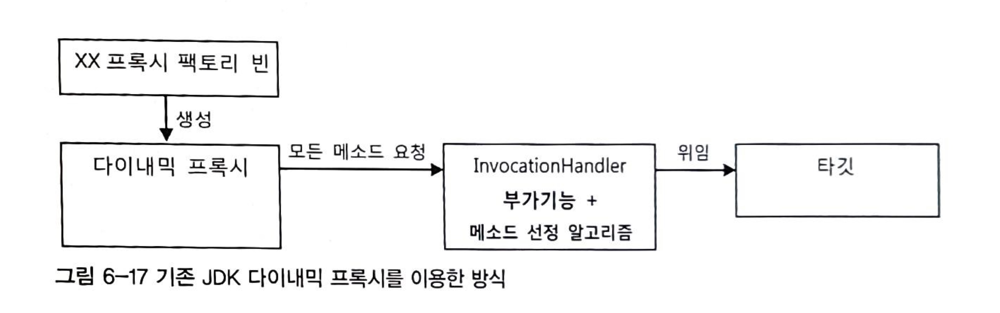

- **JDK 다이내믹 프록시** 구조를 보면 부가기능을 분리할 수 있고 부가기능 적용 대상 메소드를 선정할 수 있다.
- 부가기능을 가진 InvocationHandler가 타깃과 메소드 선정 알고리즘 코드에 의존하고 있는 문제점이 있다.
    - 만약 **타깃과 메소드 선정 방식이 다르면 InvocationHandler 객체를 여러 프록시가 공유할 수 없다**.
    - 타깃과 메소드 선정 패턴을 **DI를 통해 분리**할 수 있지만, 한번 빈으로 구성된 Handler 객체는 **특정 타깃을 위한 프록시로 제한**된다는 뜻이다.
    - 이러한 한계로 인해 팩토리 빈에서 생성한 이유이다.
- 타깃 변경과 메소드 선정 알고리즘 변경은 확장이 필요하다면 팩토리 빈 내의 프록시 생성코드를 직접 변경해야 한다.
- 결국 확장에는 유연하지 못하고 관련 없는 코드의 변경이 생기는 OCP 원칙을 지키지 못했다고 할 수 있다.

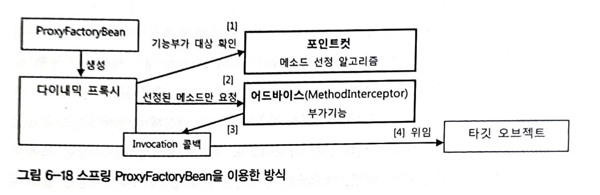

- 스프링의 **ProxyFactoryBean**은 두 가지 확장 기능인 **부가기능(advice)**과 **메소드 선정 알고리즘(pointcut)**을 활용할 수 있다.
- 부가기능을 제공하는 객체를 **`어드바이스`**라고 부르고 메소드 선정 알고리즘을 담은 객체를 **`포인트컷`**이라고 부른다.
- 어드바이스와 포인트컷은 모두 프록시에 DI로 주입돼서 사용된다.
    - 여러 프록시에서 공유가 가능하도록 만들어지기 때문에 스프링의 싱글톤 빈으로 등록이 가능하다.
- 프록시는 클라이언트로부터 요청을 받으면 포인트컷에게 부가기능을 적용할 메소드인지 확인한 후, 대상자라면 MethodInterceptor 타입의 어드바이스를 호출한다.
    - 포인트컷은 Pointcut 인터페이스를 구현해서 만들 수 있다.
- **어드바이스는 여러 프록시에 공유**되기 때문에 **타깃 정보라는 상태를 가질 수 없고 직접 타깃을 호출하지 않는다.**
    - 어드바이스는 **템플릿 구조**로 설계되어있다.
    - 어드바이스가 부가기능을 부여하는 중에 **타깃 메소드의 호출이 필요**하면 **프록시로부터 전달받은 MethodInvocation 타입의 콜백 객체를 proceed() 메소드를 호출**하면 된다.
    - 실제 위임 대상인 타깃 객체의 레퍼런스를 가지고 타깃 메소드를 호출하는 것은 프록시가 메소드 호출에 따라 만드는 Invocation 콜백의 역할이다.
- 어드바이스가 일종의 템플릿이 되고 타깃을 호출하는 기능을 갖고 있는 MethodInvocation 객체가 콜백이 되는 것이다.
    - 템플릿은 한 번 만들면 재사용이 가능하고 여러 빈이 공유할 수 있다
    - 어드바이스도 싱글톤 빈으로 등록하고 DI를 주입해 여러 프록시가 사용하도록 할 수 있다.
- 프록시로부터 어드바이스와 포인트컷을 독립시키고 DI를 사용하게 한 것은 전형적인 전략 패턴 구조이다.
    - 여러 프록시가 공유해서 사용할 수 있고 부가기능이나 메서드 선정 패턴이 달라지면 구현 클래스만 바꾸면 된다.
    - 프록시와 ProxyFactoryBean 등의 변경 없이도 기능을 자유롭게 확장할 수 있는 OCP를 충실히 지키는 구조라고 할 수 있다.
    

**어드바이스와 포인트컷(이름 패턴을 이용해 메소드 선정 )을 적용하는 테스트**

```java
/**
 * 어드바이스 + 포인트컷 학습 테스트
 */
@Test
void pointcutAdvisor() {
    ProxyFactoryBean factoryBean = new ProxyFactoryBean();
    factoryBean.setTarget(new HelloTarget());

    NameMatchMethodPointcut pointcut = new NameMatchMethodPointcut();
    pointcut.setMappedName("sayH*");
    
    factoryBean.addAdvisor(new DefaultPointcutAdvisor(pointcut, new UppercaseAdvice()));
    
    String name = "Spring";
    Hello target = (Hello) factoryBean.getObject();
    System.out.println(target.getClass());

    assertThat(target.sayHello(name)).isEqualTo("HELLO " + name.toUpperCase());
    assertThat(target.sayHi(name)).isEqualTo("HI " + name.toUpperCase());
 		// 포인트컷 기준에 맞지 않음
		assertThat(target.sayThankYou(name)).isEqualTo("Thank You " + name);
}
```

포인트컷이 없을땐 addAdvice() 메소드를 호출해서 어드바이스만 등록했다. 그러나 포인트컷을 적용할땐 addAdvisor() 메소드를 호출했다 왜일까?

이유는 ProxyFactoryBean에는 여러 개의 어드바이스와 포인트컷이 추가될 수 있기 때문이다. **포인트컷과 어드바이스를 따로 등록하면 어떤 어드바이스에 대해 어떤 포인트컷을 적용할지 애매해지기 때문**이다. 그래서 이 둘을 **Advisor 타입의 객체에 담아서 등록**하는 것이다.

여러 어드바이스가 등록되더라도 다른 포인트컷과 조합될 수 있다.

`어드바이저 = 포인트컷(메소드 선정 알고리즘) + 어드바이스(부가기능)`

## ProxyFactoryBean 적용

### TransactionAdvice

```java
@Component
public class TransactionAdvice implements MethodInterceptor {
    private PlatformTransactionManager transactionManager;

    public TransactionAdvice(PlatformTransactionManager transactionManager) {
        this.transactionManager = transactionManager;
    }

    /**
     * 타깃을 호출하는 기능을 가진 콜백 객체를 프록시로부터 받는다
     * 어드바이스는 특정 타깃에 의존하지 않고 재사용 가능하다.
     */
    @Override
    public Object invoke(MethodInvocation invocation) throws Throwable {
        TransactionStatus status = transactionManager.getTransaction(new DefaultTransactionDefinition());
        try {
            /* 콜백을 호출해서 타깃의 메소드를 실행한다 타깃 메소드 호출 전후로 필요한 부가기능을 넣을 수 있다.
             * 경우에 따라 타깃이 아예 호출되지 않게 하거나 재시도를 위한 반복 호출도 가능하다.
             */
            Object obj = invocation.proceed();
            transactionManager.commit(status);
            return obj;
        } catch (RuntimeException e) {
            transactionManager.rollback(status);
            throw e;
        }
    }
}
```

- catch 구문에서 JDK 다이내믹 프록시가 제공하는 Method와는 달리 스프링의 MethodInvocation을 통한 타깃 호출은 예외가 포장되지않고 타깃에서 보낸 그대로 전달된다.
    - `MethodInvocationException` → `RuntimeException`

### 스프링 XML 설정파일

xml 설정 방식 말고 테스트 코드에서 주입하는 방식으로 대체

### 테스트

```java
@DirtiesContext
@Test
void upgradeAllOrNothing_springProxyFactoryBean() throws Exception {
    userDao.deleteAll();
    for (User user : userList) {
        userDao.add(user);
    }
    //pointcut
    NameMatchMethodPointcut pointcut = new NameMatchMethodPointcut();
    pointcut.setMappedName("upgrade*");

    //proxyFactoryBean
    ProxyFactoryBean factoryBean = new ProxyFactoryBean();
    factoryBean.addAdvisor(new DefaultPointcutAdvisor(pointcut, new TransactionAdvice(transactionManager)));
    factoryBean.setTarget(new UserServiceImpl(userDao, dataSource, mailSender));
    UserService userService = (UserService) factoryBean.getObject();
    try {
        userService.upgradeLevels();
    } catch (Exception e) {
        System.out.println("exception!");
    }
    List<String> targets = mailSender.getTargets();
    assertThat(targets.size()).isEqualTo(2);
}
```

### 어드바이스와 포인트컷의 재사용

- ProxyFactoryBean은 스프링의 DI와 템플릿/콜백 패턴, 서비스 추상화 등의 기법이 적용
    - 독립적이며 여러 프록시가 공유할 수 있는 어드바이스와 포인트컷으로 확장 기능을 분리할 수 있었다.

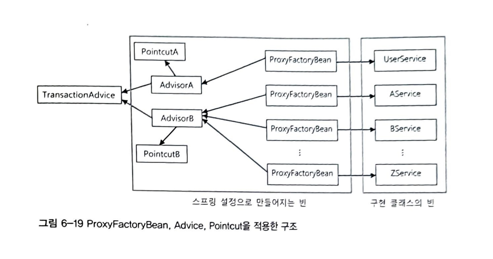

# References

- [https://robin00q.tistory.com/60](https://robin00q.tistory.com/60)
- [https://gurumee92.tistory.com/217](https://gurumee92.tistory.com/217)
- [https://velog.io/@sungjin0757/SPRING-AOP](https://velog.io/@sungjin0757/SPRING-AOP)
- [https://catsbi.oopy.io/747cd6f5-ae0f-40ac-9cc8-0d4c4c31ddfa#3d83ccaa-d3e8-4ca1-a3fe-19a5ee562c04](https://catsbi.oopy.io/747cd6f5-ae0f-40ac-9cc8-0d4c4c31ddfa#3d83ccaa-d3e8-4ca1-a3fe-19a5ee562c04)