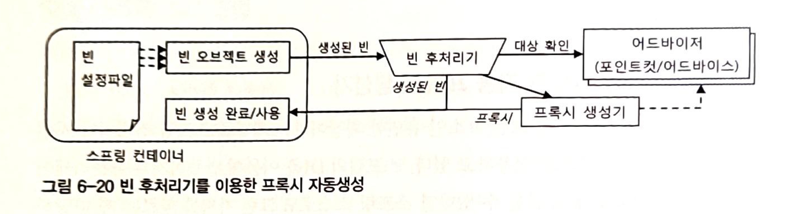
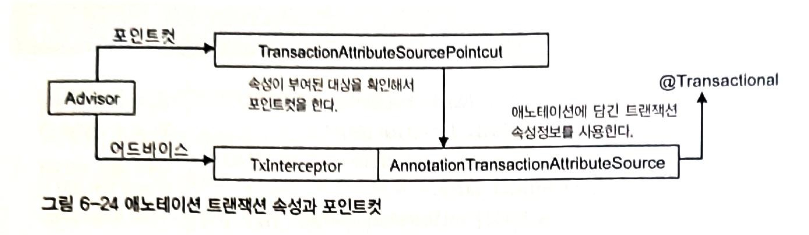

# 6. AOP(2)

# 6.5 스프링 AOP

앞에서 해온 작업의 목표는 비즈니스 로직에 반복적으로 등장했던 트랜잭션 코드를 깔끔하고 효과적으로 분리하는 것이다.

## 자동 프록시 생성

프록시 팩토리 빈 방식의 접근 방법의 한계

- 부가기능이 타깃 객체마다 새로 만들어지는 문제는 스프링 ProxyFactoryBean의 어드바이스를 통해 해결했지만, 부가기능 적용이 필요한 타깃 객체마다 거의 비슷한 내용의 ProxyFactoryBean 빈 설정 정보를 추가해야 하는 문제
- 새로운 타깃이 등장했다고 해서 코드를 손댈 필요는 없지만, 설정은 매번 복사해서 붙이고 타깃 프로퍼티의 내용을 수정해야한다.

### 중복 문제의 접근 방법

지금까지 반복적이고 기계적인 코드를 어떻게 해결했는가?

1. JDBC API를 사용하는 DAO 코드에서 메소드마다 JDBC try/catch/finally 블록이 반복되는 문제를 바뀌지 않는 부분과 바뀌는 부분을 분리해서 템플릿과 콜백, 클라이언트로 나누는 방법을 적용
2. 반복적인 위임 코드가 필요한 프록시 클래스 코드는 다른 방법으로 적용해봤다. 타깃 객체로의 위임 코드와 부가기능 적용을 위한 코드가 프록시가 구현해야 하는 모든 인터페이스 메소드마다 반복적으로 필요한 문제를 다이내믹 프록시라는 런타임 코드 자동생성 기법을 이용하였다.
    1. JDK의 다이내믹 프록시는 특정 인터페이스를 구현한 객체에 대해서 프록시 역할을 해주는 클래스를 런타임 시 내부적으로 만들어준다.
    2. 변하지 않는 타깃으로의 위임과 부가기능 적용 여부 판단이라는 부분은 코드 생성 기법을 이용하는 다이내믹 프록시 기술에 맡기고, 변하는 부가기능 코드는 별도로 만들어서 다이내믹 프록시 생성 팩토리에 DI로 제공하는 방법을 사용했다.

반복적인 프록시의 메소드 구현을 코드 자동생성 기법을 이용해 해결했다. 그럼 여기서 궁금한 점은

- 반복적인 ProxtFactoryBean 설정 문제는 설정 자동등록 기법으로 해결할 수없는가?
- 실제 빈 객체가 되는 것은 ProxtFactoryBean을 통해 생성되는 프록시 그 자체이므로 프록시가 자동으로 빈으로 생성되게 할 수 없는가?

### 빈 후처리기를 이용한 자동 프록시 생성기

스프링은 컨테이너로서 제공하는 기능 중에서 변하지 않는 핵심적인 부분외에는 대부분 확장할 수 있도로 확장 포인트를 제공해준다.

그 중에서 주요한 것은 BeanPostProcessor 인터페이스를 구현해서 만드는 `**빈 후처리기**`다.

**빈 후처리기**는 이름 그대로 스프링 빈 객체로 만들어지고 난 후에, 빈 객체를 다시 가공할 수 있게 해준다.

스프링이 제공하는 빈 후처리기 중 DefaultAdvisorAuthProxyCreator를 알아보면, DefaultAdvisorAuthProxyCreator는 어드바이저를 이용한 자동 프록시 생성기다. 빈 후처리기를 스프링에 적용하는 방법은 빈 후처리기 자체를 빈으로 등록하는 것이다.

스프링은 **빈 후처리기가 빈으로 등록되어 있으면 빈 객체가 생성될 때마다 빈 후처리기에 보내서 후처리 작업을 요청**한다. 

빈 후처리기는 빈 객체의 프로퍼티를 강제로 수정할 수도 있고 변도의 초기화 작업을 수행할 수도 있다. 심지어는 만들어진 빈 객체 자체를 바꿀 수도 있다.

이를 활용해 스프링이 생성하는 빈 객체의 일부를 프록시로 포장하고, 프록시를 빈으로 대신 등록할 수 있다.



- DefaultAdvisorAuthProxyCreator 빈 후처리기가 등록되어 있으면 스프링은 빈 객체를 만들 때마다 후처리기에게 빈을 보낸다.
- DefaultAdvisorAuthProxyCreator는 빈으로 등록된 모든 어드바이저 내의 포인트컷을 이용해 전달받은 빈이 프록시 적용 대상인지 확인한다.
- 프록시 적용 대상이면 내장된 프록시 생성기에게 현재 빈에 대한 프록시를만들게 하고, 만들어진 프록시에 어드바이저를 연결해준다.
- 빈 후처리기는 프록시가 생성되면 원래 컨테이너가 전달해준 빈 객체 대신 프록시 객체를 컨테이너에게 돌려준다.
- 컨테이너는 최종적으로 빈 후처리기가 돌려준 객체를 빈으로 등록하고 사용한다.

빈을 선정할 로직이 추가된 포인트컷이 담긴 어드바이저를 등록하고 빈 후처리기를 사용하면 일일이 ProxyFactoryBean 빈을 등록하지 않아도 타깃 객체에 자동으로 프록시가 적용되기 할 수 있다.

### 확장된 포인트컷

- 포인트컷은 객체내의 메소드 뿐 아니라 클래스까지도 선별할 수 있는 기능을 가지고 있다.
    - 클래스 필터, 메소드 매처

```java
public interface Pointcut {

	/**
	 * Return the ClassFilter for this pointcut.
	 * @return the ClassFilter (never {@code null})
	 */
	ClassFilter getClassFilter();

	/**
	 * Return the MethodMatcher for this pointcut.
	 * @return the MethodMatcher (never {@code null})
	 */
	MethodMatcher getMethodMatcher();

	/**
	 * Canonical Pointcut instance that always matches.
	 */
	Pointcut TRUE = TruePointcut.INSTANCE;

}
```

- 앞에 메소드 이름 선정 기능은 메소드 매처를 사용한 것이고 클래스 필터는 모든 클래스를 허용하도록 만들어진 것이다.
- 만약 포인트컷 선정 기능(클래스, 메소드)을 모두 적용한다면 프록시를 적용할 클래스인지 판단한 후, 적용 대상 클래스인 경우 어드바이스를 적용할 메소드인지 확인하는 식으로 동작한다.

### 포인트컷 테스트

```java
@Test
void classNamePointcutAdvisor() {
    NameMatchMethodPointcut classMethodPointcut = new NameMatchMethodPointcut() {
        @Override
        public ClassFilter getClassFilter() {
            return clazz -> clazz.getSimpleName().startsWith("HelloT");
        }
    };
    classMethodPointcut.setMappedName("sayH*");

    // 테스트
    // 적용o
    checkAdviced(new HelloTarget(), classMethodPointcut, true);

    // 적용x
    class HelloWorld extends HelloTarget {};
    checkAdviced(new HelloWorld(), classMethodPointcut, false);

    // 적용o
    class HelloTSpring extends HelloTarget {};
    checkAdviced(new HelloTSpring(), classMethodPointcut, true);
}

private void checkAdviced(Object target, Pointcut pointcut, boolean adviced) {
    ProxyFactoryBean factoryBean = new ProxyFactoryBean();
    factoryBean.setTarget(target);
    factoryBean.addAdvisor(new DefaultPointcutAdvisor(pointcut, new UppercaseAdvice()));
    Hello hello = (Hello) factoryBean.getObject();

    String name = "Spring";
    if (adviced) {
        assertThat(hello.sayHello(name)).isEqualTo("HELLO " + name.toUpperCase());
        assertThat(hello.sayHi(name)).isEqualTo("HI " + name.toUpperCase());
        assertThat(hello.sayThankYou(name)).isEqualTo("Thank You " + name);
    } else {
        assertThat(hello.sayHello(name)).isEqualTo("Hello " + name);
        assertThat(hello.sayHi(name)).isEqualTo("Hi " + name);
        assertThat(hello.sayThankYou(name)).isEqualTo("Thank You " + name);
    }
}
```

- 포인트컷은 NameMatchMethodPointcut을 내부 익명 클래스 방식으로 확장해서 만들었다.

## DefaultAdvisorAuthProxyCreator의 적용

### 클래스 필터를 적용한 포인트컷 작성

메소드 이름만 비교하던 포인트컷인 NameMatchMethodPointcut을 상속해서 프로퍼티로 주어진 이름 패턴을 가지고 클래스 이름을 비교하는 ClassFilter를 추가해보자

```java
// 클래스 필터가 포함된 포인트컷
public class NameMatchClassMethodPointcut extends NameMatchMethodPointcut {

    public void setMappedClassName(String mappedClassName) {
        setClassFilter(new SimpleClassFilter(mappedClassName));
    }

    static class SimpleClassFilter implements ClassFilter {
        private final String mappedName;

        private SimpleClassFilter(String mappedName) {
            this.mappedName = mappedName;
        }

        public boolean matches(Class<?> clazz) {
            return PatternMatchUtils.simpleMatch(mappedName, clazz.getSimpleName());
        }
    }
}
```

### 어드바이저를 이용하는 자동 프록시 생성기 등록

자동 프록시 생성기인 DefaultAdvisorAuthProxyCreator는 등록된 빈 중에서 Advisor 인터페이스를 구현한 것을 모두 찾는다.

그리고 생성되는 모든 빈에 대해 어드바이저의 포인트컷을 적용해보면서 프록시 적용 대상을 선정한다. 빈 클래스가 프록시 선정 대상이라면 프록시를 만들어 원래 빈 객체와 바꿔치기한다. 원래 빈 객체는 프록시 뒤에 연결돼서 프록시를 통해서만 접근 가능하게 바뀌는 것이다.

빈 후처리기 등록은 xml 방식을 적용하지 않음

### 포인트컷 등록

포인트컷 빈 등록 및 패턴 지정은 xml 방식을 적용하지 않음

### 어드바이스와 어드바이저

어드바이스를 등록하는 방식에서 어드바이저로서 사용되는 방법으로 변경되었다. ProxyFactoryBean으로 등록한 빈에서처럼 transactionAdvisor를 명시적으로 DI하는 빈은 존재하지 않는다.

대신 **어드바이저를 이용하는 자동 프록시 생성기인 DefaultAdvisorAutoProxyCreator에 의해 자동수집되고, 프록시 대상 선정 과정에 참여하며, 자동생성된 프록시에 다이내믹하게 DI 돼서 동작하는 어드바이저가 된다.**

### ProxyFactoryBean 제거와 서비스 빈의 원상복구

ProxyFactoryBean 방식 때 사용한 빈 설정 부분을 원복

### 자동 프록시 생성기를 사용하는 테스트

ProxyFactoryBean이 빈으로 등록되어 있으므로 이를 가져와 타깃을 테스트용 클래스로 바꿔치기하는 방법을 사용했지만 자동 프록시 생성기를 적용한 후에는 더 이상 가져올 ProxyFactoryBean 같은 팩토리 빈이 존재하지 않는다. **자동 프록시 생성기가 알아서 프록시를 만들어줬기 때문에 프록시 객체만 남아 있을 뿐이다.**

자동 프록시 생성기라는 스프링 컨테이너에 종속적인 기법을 사용했기 때문에 예외상황을 위한 테스트 대상도 빈으로 등록해 줄 필요가 있다. 이제 타깃을 코드에서 바꿔치기할 방법도 없고, 자동 프록시 생성기의 적용이 되는지도 빈을 통해 확인할 필요가 있기 때문이다.

테스트 용으로 사용한 **TestUserService를 빈 등록 문제점**

- 클래스 내부에 정의된 스태틱 클래스
- 포인트컷이 트랜잭션 어드바이스를 적용 패턴에 맞지 않아 적용 대상으로 선정되지 않는다.

스태틱 클래스 자체를 스프링의 빈으로 등록하는 방법(xml 방식)

```java
// static 클래스 스프링 빈으로 등록하기
<bean id="testUserService" 
			class="a.b.c.UserServiceTest$TestUserService" 
			parent="userService" />
```

- $ 기호는 스태틱 멤버 클래스를 지정할 때 사용한다.
- parent 애트리뷰트는 <bean> 태그에 parent 애트리뷰트를 사용하면 다른 빈 설정의 내용을 상속받을 수 있다.
    - TestUserService는 parent 속성을 지정한 것으로 UserServiceImpl(빈 이름이 userService) 클래스의 빈 설정 값을 가져와 사용할 수 있다.

### 자동생성 프록시 확인

자동 프록시 생성기 테스트를 위해 xml 설정이 아닌 자바 설정 방식으로 설정

```java
@TestConfiguration
@RequiredArgsConstructor
public class TestAppConfig {
    private final UserDao userDao;
    private final DataSource dataSource;
    private final MailSender mockMailSender;
    private final PlatformTransactionManager transactionManager;

    @Bean
    public UserService testUserServiceImpl() {
        return new TestUserServiceImpl(userDao, dataSource,mockMailSender);
    }

    @Bean
    public DefaultPointcutAdvisor transactionAdvisor() {
        return new DefaultPointcutAdvisor(transactionPointcut(), transactionAdvice());
    }

    @Bean
    public NameMatchClassMethodPointcut transactionPointcut(){
        NameMatchClassMethodPointcut pointcut = new NameMatchClassMethodPointcut();
        pointcut.setMappedClassName("*ServiceImpl");
        pointcut.setMappedNames("upgrade*");
        return pointcut;
    }

    @Bean
    public TransactionAdvice transactionAdvice() {
        return new TransactionAdvice(transactionManager);
    }

    @Bean
    public DefaultAdvisorAutoProxyCreator defaultAdvisorAutoProxyCreator() {
        return new DefaultAdvisorAutoProxyCreator();
    }
}
```

**빈 후처리기 테스트**

```java
@Autowired
private UserService testUserServiceImpl;

@Test
void upgradeAllOrNothing_빈후처리기() {
    userDao.deleteAll();
    for (User user : userList) {
        userDao.add(user);
    }
    try {
        this.testUserServiceImpl.upgradeLevels();
        fail("exception test fail");
    } catch (TestUserServiceImpl.TestUserServiceException e) {
        System.out.println("exception occur!");
    }
    checkLevelUpgraded(userList.get(1), false);
}
```

위 테스트를 통해 확인해야하는 부분은 다음과 같다.

- 트랜잭션이 필요한 빈에 트랜잭션 부가기능이 적용됐는가
- 아무 빈에나 트랜잭션이 부가기능이 적용된 것은 아닌지 확인
    - 클래스 필터가 제대로 동작해서 프록시 생성 대상을 선별하고 있는지 여부

## 포인트컷 표현식을 이용한 포인트컷

지금까지 사용한 포인트컷은 메소드의 이름과 클래스의 이름 패턴을 각각 클래스 필터와 메소드 매처 객체로 비교해 선정하는 방식이었다.

스프링은 이보다 더 간단하고 효과적인 방법으로 포인트컷의 클래스와 메소드를 선정하는 알고리즘을 작성할 수 있는 방법을 제공한다. 이것을 **`포인트컷 표현식(pointcut expression)`**

### 포인트컷 표현식

- 포인트컷 표현식을 지원하는 포인트컷을 적용하려면 **AspectJExpressionPointcut 클래스를 사용**하면 된다.
- **AspectJExpressionPointcut 클래스**는 클래스와 메소드의 선정 알고리즘을 포인트컷 표현식을 이용해 한 번에 지정할 수 있게 해준다.
    - NameMatchClassMethodPointcut은 클래스와 메소드의 이름의 패턴을 독립적으로 비교하도록 만들어져 있다.
- 포인트컷 표현식은 자바의 RegEx 클래스가 지원하는 정규식처럼 간단한 문자열로 복잡한 선정조건을 쉽게 만들어낼 수 있는 강력한 표현식을 지원한다.
- 스프링이 사용하는 포인트컷 표현식은 AspectJ 라는 프레임워크에서 제공하는 것을 가져와 일부 문법을 확장해 사용하는 것이다.
    - AspectJ 포인트컷 표현식이라고도 한다.

**포인트컷 표현식 학습 테스트**

```java
// 인터페이스
public interface Target {
    void hello();
    void hello(String name);
    int minus(int a, int b) throws RuntimeException;
    int plus(int a, int b);
    void method();
}

// 포인트컷 선정 테스트 클래스
public class TargetImpl implements Target {
    @Override
    public void hello() {
    }

    @Override
    public void hello(String name) {
    }

    @Override
    public int minus(int a, int b) throws RuntimeException {
        return 0;
    }

    @Override
    public int plus(int a, int b) {
        return 0;
    }

    @Override
    public void method() {
    }
}

// 포인트컷 선정 테스트 클래스
public class Bean {
    public void method() throws RuntimeException {
        
    }
}
```

위 클래스는 포인트컷의 선정 후보가 될 여러 개의 메소드를 가진 클래스이다. 포인트컷 표현식을 활용해 클래스, 메소드 선정 방법을 알아보자. 

### 포인트컷 표현식 문법

```java
execution([접근제한자 패턴] 타입패턴 [타입패턴.]이름패턴 (타입패턴 | "..", ...) [throws 예외 패턴]))
```

- `execution()`: 해당 지시자를 이용한 포인트컷 표현식을 주로 사용
    - execution() 은 메소드를 실행에 대한 포인트컷이라는 의미
- `[]`: 옵션항목이기 때문에 생략 가능
- `|`: OR 조건
- `[접근제한자 패턴]`: public, private 등의 접근제한자, 생략 가능
- `타입패턴`: 리턴 값의 타입 패턴
- `[타입패턴.]`: 패키지와 클래스 이름에 대한 패턴, 생략 가능 사용 시 `.`를 두어 연결해야한다.
- `이름패턴`: 메소드 이름 패턴
- `(타입패턴 | "..", ...)`: 파라미터의 타입 패턴을 순서대로 넣을 수 있다. 와일드카드를 이용해 파라미터 개수에 상관없는 패턴을 만들 수 있다.
- `[throws 예외 패턴]`: 예외 이름 패턴

메소드의 풀 시그니처를 문자열로 비교하는 개념이라고 보면 된다.

리플렉션으로 메소드의 풀 시그니처를 가져와 비교해보면 이해하기 쉽다.

```java
@Test
void methodPullSignature() throws NoSuchMethodException {
    Method method = Target.class.getMethod("minus", int.class, int.class);
    System.out.println(method);
}

// 출력 값
public abstract int toby.spring.learningtest.pointcut.Target.minus(int,int) throws java.lang.RuntimeException
```

메소드 선정 포인트컷 표현식을 만들고 이를 검증해보자

```java
@Test
void methodSignaturePointcut() throws NoSuchMethodException {
    AspectJExpressionPointcut pointcut = new AspectJExpressionPointcut();
    pointcut.setExpression("execution(public int " +
            "toby.spring.learningtest.pointcut.Target.minus(int,int) " +
            "throws java.lang.RuntimeException)");

    //Target.minus()
    assertThat(pointcut.getClassFilter().matches(Target.class)
            && pointcut.getMethodMatcher().matches(Target.class.getMethod("minus", int.class, int.class), Target.class)).isTrue();

    //Target.plus()
    assertThat(pointcut.getClassFilter().matches(Target.class)
            && pointcut.getMethodMatcher().matches(Target.class.getMethod("plus", int.class, int.class), Target.class)).isFalse();

    //Bean.method()
    assertThat(pointcut.getClassFilter().matches(Bean.class)
            && pointcut.getMethodMatcher().matches(Target.class.getMethod("method"), Bean.class)).isFalse();
}
```

### 포인트컷 표현식 테스트

```java
@Test
void pointcut() throws Exception {
    targetClassPointcutMatches("execution(* *(..))", true, true, true, true, true, true);
}

public void targetClassPointcutMatches(String expression, boolean... expected) throws Exception {
    pointcutMatches(expression, expected[0], Target.class, "hello");
    pointcutMatches(expression, expected[1], Target.class, "hello", String.class);
    pointcutMatches(expression, expected[2], Target.class, "plus", int.class, int.class);
    pointcutMatches(expression, expected[3], Target.class, "minus", int.class, int.class);
    pointcutMatches(expression, expected[4], Target.class, "method");
    pointcutMatches(expression, expected[5], Bean.class, "method");
}

public void pointcutMatches(String expression, boolean expected, Class<?> clazz, String methodName, Class<?>... args) throws Exception {
    AspectJExpressionPointcut pointcut = new AspectJExpressionPointcut();
    pointcut.setExpression(expression);

    assertThat(pointcut.getClassFilter().matches(clazz)
            && pointcut.getMethodMatcher().matches(clazz.getMethod(methodName, args), clazz)).isEqualTo(expected);
}
```


### 포인트컷 표현식을 이용하는 포인트컷 적용

- AspectJ 포인트컷 표현식은 메소드를 선정하는 데 편리하게 쓸 수 있는 강력한 표현식 언어
- execution() 외에도 몇 가지 표현식 스타일이 있다. 대표적으로 스프링에서 사용될 때 빈의 이름으로 비교하는 bean()이 있다. bean(*Service)라고 쓰면 아이디가 Service로 끝나는 모든 빈을 선택한다.
- 특정 애노테이션 타입, 메소드 파라미터에 적용되어 있는 것을 보고 메소드를 선정하게 하는 포인트컷도 만들 수 있다.

```java
@Bean
public AspectJExpressionPointcut aspectJExpressionPointcut() {
    AspectJExpressionPointcut pointcut = new AspectJExpressionPointcut();
    pointcut.setExpression("executioin(* *...*ServiceImpl.upgrade*(..))");
    return pointcut;
}
```

- 이전에 등록한 NameMatchClassMethodPointcut 클래스 빈을 주석 처리 하고 포인트컷 표현식을 빈으로 등록해서 테스트 수행하면 정상적으로 동작하는 것을 볼 수 있다.
- 포인트컷 표현식을 사용하면 로직이 짧은 문자열에 담기기 때문에 클래스나 코드를 추가할 필요가 없어서 코드가 단순해진다.
- 반면 문자열로 된 표현식이므로 런타임 시점까지 문법의 검증이나 기능 확인이 되지 않는다는 단점도 있다.

### 타입 패턴과 클래스 이름 패턴

```java
// 포인트컷 표현식 테스트
표현식: *..*ServiceImpl

1) TestUserServiceImpl.class: 성공
2) TestUserService.class: 성공
```

- 포인트컷 표현식의 **클래스 이름에 적용되는 패턴은 클래스 이름 패턴이 아니라 타입 패턴**이다.
- **TestUserService의 클래스 이름은 TestUserService일 뿐이지만 타입을 따져보면 TestUserService 클래스, UserServiceImpl 클래스, UserService 세 가지가 모두 적용된다.**

## AOP란 무엇인가?

### 트랜잭션 서비스 추상화

- 트랜잭션 경계설정 코드를 비즈니스 로직을 담은 코드에 넣으면서 직면한 **첫 번째 문제는 특정 트랜잭션 기술에 종속되는 코드가 돼버린다는 것**이다.
    - 기술이 바뀌면 트랜잭션 코드도 기술에 맞게 코드를 변경해줘야 하는 문제점이 있다.
    - **트랜잭션 적용이라는 추상적인 작업 내용은 유지한 채로 구체적인 구현 방법을 자유롭게 바꿀 수 있는 서비스 추상화 기법을 적용**
- 트랜잭션 추상화란 인터페이스와 DI를 통해 무엇을 하는지 남기고, 그것을 어떻게 하는지를 분리한 것
    - 비즈니스 로직 코드에는 영향을 주지 않고 독립적으로 변경할 수 있다.

### 프록시와 데코레이터 패턴

**문제인식**

- 여전히 비즈니스 로직 코드에는 트랜잭션을 적용하는 코드가 남아있다.
- 트랜잭션이라는 부가기능을 어디에 적용할 것 인가는 메소드에 남아있고 부가기능을 적용할 메소드가 많아지면서 부가기능 적용 코드가 중복으로 발생한다.

**해결방안**

- **DI를 이용해 데코레이터 패턴을 적용**하는 방법으로 위 문제를 해결
- 클라이언트가 인터페이스와 DI를 통해 접근하도록 설계하고, 데코레이터 패턴을 적용해서, 비즈니스 로직을 담은 클래스의 코드에는 전혀 영향을 주지 않으면서 트랜잭션이라는 부가기능을 적용할 수 있는 구조로 만들었다.
- 트랜잭션을 처리하는 코드는 일종의 데코레이터에 담겨서, 클라이언트와 비즈니스 로직을 담은 타깃 클래스 사이에 존재하도록 만들었다.
    - 일종의 대리자인 프록시 역할을 하는 트랜잭션 데코레이터를 거쳐서 타깃에 접근
    - 이 덕분에 독립적으로 로직을 검증하는 고립된 단위 테스트를 만들 수 있다.

### 다이내믹 프록시와 프록시 팩토리 빈

- 프록시를 활용해 비즈니스 코드에 트랜잭션 적용 코드를 제거했지만, 인터페이스 구현 메소드마다 트랜잭션 기능을 부여하는 코드를 넣어서 프록시 클래스를 만드는 비효율적인 문제 발생
    - 부가기능 적용이 필요하지 않는 메소드도 구현해줘야한다.
- **프록시 클래스 없이도 프록시 객체를 런타임 시에 만들어주는 JDK 다이내믹 프록시 기술을 적용**
    - 동일 기능의 프록시를 여러 객체에 적용할 경우 객체 단위로는 중복이 일어나는 문제 발생
- 객체 단위로 중복이 발생하는 문제는 JDK 다이내믹 프록시와 같은 프록시 기술을 추상화한 스프링의 프록시 팩토리 빈을 이용해서 다이내믹 프록시 생성 방법에 DI를 도입
    - 내부적으로 템플릿/콜백 패턴을 활용하는 스프링의 프록시 팩토리 빈 덕분에 부가기능을 담은 어드바이스와 부가기능 선정 알고리즘을 담은 포인트컷은 프록시에서 분리할 수 있고 여러 프록시에서 공유해서 사용 가능해졌다.

### 자동 프록시 생성 방법과 포인트컷

- 트랜잭션 적용 대상이 되는 빈마다 일일이 프록시 팩토리 빈을 설정해줘야 한다는 부담이 남아 있었다.
- 이를 해결하기 위해 **빈 생성 후처리 기법**을 활용해 컨테이너 초기화시점에 자동으로 프록시를 만들어주는 방법을 도입했다.
- 프록시 적용할 대상을 일일이 지정하지 않고 패턴을 이용해 자동으로 선정할 수 있도록, **클래스 선정하는 기능을 담은 확장된 포인트컷**을 사용
    - 포인트컷 표현식으로 더 편리하고 깔끔한 방법으로 개선

### 부가기능의 모듈화

- 관심사가 같은 코드를 분리해 한데 모으는 것은 소프트웨어 개발의 가장 기본이 되는 원칙
- 관심사가 같은 코드를 객체지향 설계 원칙에 따라 분리하고, 서로 낮은 결합도를 가진 채로 독립적으로 유연하게 확장할 수 있는 모듈로 만드는 것이 지금 까지 해온 것이다.
- 코드 분리, 관심사가 같은 것은 모으고, 인터페이스 도입, DI로 런타임 시에 의존관계를 만들어주는 것으로 대부분의 문제를 해결할 수 있었다.
- 그러나 트랜잭션 적용 코드는 기존에 사용한 방법으로 간단하게 분리해서 독립된 모듈로 만들기 어려움이 있었다.
    - 트랜잭션 경계설정 기능은 다른 모듈의 코드에 부가적으로 부여되는 기능이라는 특징이 있기 때문
- 트랜잭션 경계설정 기능을 독립된 모듈로 만들기 위해 **클래스를 만들지 않고도 새로운 구현 기능을 가진 객체를 다이내믹하게 만들어내는 다이내믹 프록시, IoC/DI 컨테이너의 빈 생성 작업을 가로채서 빈 객체를 프록시로 대체하는 빈 후처리 기술과 같은 복잡한 기술 적용**

### AOP: 애스펙트 지향 프로그래밍

전통적인 객체지향 기술의 설계 방법으로는 독립적은 모듈화가 불가능한 트랜잭션 경계설정과 같은 부가기능 모듈을 `**애스펙트(aspect)**`라고 부른다.

**애스펙트**는 부가될 기능을 정의한 코드인 **어드바이스**와 어드바이스를 어디에 적용할지를 결정하는 **포인트컷**을 함께 갖고 있다.


- 핵심적인 기능에서 부가적인 기능을 분리해서 애스펙트라는 모듈로 만들어서 설계하고 개발하는 방법을 **`애스펙트(관점) 지향 프로그래밍(Aspect Oriented Programming, AOP)`** 라고 부른다.
- AOP는 OOP를 돕는 보조적인 기술이다.
- AOP는 애스펙트를 분리함으로써 핵심기능을 설게하고 구현할 때 객체지향적인 가치를 지킬 수 있도록 도와주는 것이라고 보면 된다.
- AOP는 애플리케이션을 다양한 측면에서 독립적으로 모델링하고, 설계, 개발할 수 있도록 만들어준다.

## AOP 적용기술

### 프록시를 이용한 AOP

- 스프링은 IoC/DI 컨테이너와 다이내믹 프록시, 데코레이터 패턴, 프록시 패턴, 자동 프록시 생성 기법, 빈 객체의 후처리 조작 기법 등의 다양한 기술을 조합해 AOP를 지원한다.
- 스프링 AOP의 핵심은 **프록시를 이용**했다는 것이다.
    - 프록시로 만들어서 DI로 연결된 빈 사이에 적용해 타깃의 메소드 호출 과정에 참여해 부가기능을 제공해주도록 만들었다.
- 스프링 AOP는 자바의 기본 JDK와 스프링 컨테이너 외에는 특별한 기술이나 환경을 요구하지 않는다.
- 독립적으로 개발한 부가기능 모듈을 다양한 타깃 객체의 메소드에 다이내믹하게 적용해주기 위해 가장 중요한 역할을 맡고 있는게 프록시다.

### 바이트코드 생성과 조작을 통한 AOP

- AOP는 프록시 방식이 아닌 바이트코드를 조작하는 방식의 AOP도 존재한다.
- AspectJ는 스프링처럼 다이내믹 프록시 방식을 사용하지 않는다.
- AspectJ는 프록시처럼 간접적인 방법이 아니라, 타깃 객체를 뜯어고쳐서 부가기능을 직접 넣어주는 직접적인 방법을 사용한다.
- AspectJ는 컴파일된 타깃의 클래스 파일 자체를 수정하거나 클래스가 JVM에 로딩되는 시점을 가로채서 바이트코드를 조작하는 복잡한 방법을 사용한다.

AspectJ는 프록시 방법이 있음에도 왜 컴파일된 클래스 파일 수정이나 바이트코드 조작과 같은 복잡한 방법을 사용할까?

- 바이트코드를 조작해서 타깃 객체를 직접 수정해버리면 스프링과 같은 DI 컨테이너의 도움을 받아서 자동 프록시 생성 방식을 사용하지 않아도 AOP를 적용할 수 있기 때문이다.
    - **스프링과 같은 컨테이너가 사용되지 않는 환경에서도 손쉽게 AOP의 적용**이 가능해진다.
    - 프록시 방식보다 훨씬 강력하고 유연한 AOP가 가능하기 때문이다.
        - 프록시를 AOP의 핵심 매커니즘으로 사용하면 부가기능을 부여할 대상은 클라이언트가 호출할 때 사용하는 메소드로 제한된다.
        - 바이트코드를 직접 조작해서 AOP를 적용하면 객체의 생성, 필드 값의 조회와 조작, 스태틱 초기화 등의 다양한 작업에 부가 기능을 부여해줄 수 있다.
            - 타깃 객체가 생성되는 순간 부가기능 부여 가능, 프록시 방식은 불가능(타깃 객체 생성은 프록시 패턴을 적용할 수 있는 대상이 아니기 때문)
        - 프록시 적용이 불가능한 private 메소드의 호출, 스태틱 메소드 호출이나 초기화, 필드 입출력 등에 부가기능을 부여할 수 있다.
    - 대부분의 부가기능은 프록시 방식을 사용해 메소드의 호출 시점에 부여하는 것으로도 충분하다.
        - AspectJ는 JVM의 실행 옵션을 변경하거나, 별도의 바이트코드 컴파일러를 사용, 특별한 클래스 로더를 사용하게 하는 등의 번거로운 작업이 필요하다.
        - 프록시 AOP 수준을 넘어서는 기능의 AOP 요구사항이 생기면 AspectJ를 사용하면 된다.

## AOP의 용어

- **타깃**
    - 부가기능을 부여할 대상. 핵심기능을 담은 클래스일 수도 있지만 경우에 따라서 다른 부가기능을 제공하는 프록시 객체일 수 있다.
- **어드바이스**
    - 타깃에게 제공한 부가기능을 담은 모듈. 어드바이스는 객체로 정의하기도 하지만 메소드 레벨에서 정의할 수동 ㅣㅆ다.
    - MethodInterceptor와 같이 메소드 호출 과정에 전반적으로 참여하는 것도 있지만, 예외가 발생했을 때만 동작하는 어드바이스와 같은 메소드 호출 과정의 일부에서만 동작하는 어드바이스도 있다.
- **조인 포인트**
    - 어드바이스가 적용될 수 있는 위치를 말한다.
    - 스프링의 프록시 AOP에서 조인 포인트는 메소드의 실행 단계 뿐이다.
    - 타깃 객체가 구현한 인터페이스의 모든 메소드는 조인 포인트가 된다.
- **포인트컷**
    - 어드바이스를 적용할 조인 포인트를 선별하는 작업 또는 그 기능을 정의한 모듈을 마란다.
    - 스프링 AOP의 조인 포인트는 메소드의 실행이므로 스프링의 포인트컷은 메소드를 선정하는 기능을 갖고 있다.
- **프록시**
    - 클라이언트와 타깃 사이에서 투명하게 존재하면서 부가기능을 제공하는 객체
    - DI를 통해 타깃 대신 클라이언트에게 주입, 클라이언트의 메소드 호출을 대신 받아서 타깃에 위임해주면서 부가기능을 부여한다.
- **어드바이저**
    - 포인트컷과 어드바이스를 하나씩 갖고 있는 객체.
    - 어드바이저는 어떤 부가기능(어드바이저)을 어디에(포인트컷) 전달할 것인가를 알고 있는 AOP의 가장 기본이 되는 모듈이다.
    - 스프링은 자동 프록시 생성기가 어드바이저를 AOP 작업의 정보로 활용한다.
    - 어드바이저는 스프링 AOP에서만 사용되는 용어
- **애스펙트**
    - AOP의 기본 모듈
    - 한 개 또는 그 이상의 포인트컷과 어드바이스의 조합으로 만들어진다.
        - 싱글톤 형태의 객체로 존재한다.

## AOP 네임스페이스

스프링의 프록시 방식 AOP를 적용하려면 다음 빈들을 등록해야한다.

- **자동 프록시 생성기**
    - 스프링의 DefaultAdvisorAuthProxyCreator 클래스를 빈으로 등록
    - 애플리케이션 컨텍스트가 빈 객체를 생성하는 과정에서 빈 후처리기로 참여한다.
    - 빈으로 등록된 어드바이저를 이용해 프록시를 자동으로 생성하는 기능을 담당한다.
- **어드바이스**
    - 부가기능을 구현한 클래스를 빈으로 등록
- **포인트컷**
    - 스프링의 AspectJExpressionPointcut을 빈으로 등록하고 expression 프로퍼티에 포인트컷 표현식을 넣어주면 된다.
- **어드바이저**
    - 스프링의 DefaultPointcutAdvisor 클래스를 빈으로 등록해 사용
    - 자동 프록시 생성기에 의해 자동 검색되어 사용된다.

### AOP 네임스페이스

aop 관련 xml 설정 태그가 존재한다는 내용(생략)

### 어드바이저 내장 포인트컷

aop 관련 xml 설정 태그가 존재한다는 내용(생략)

# 6.6 트랜잭션 속성

트랜잭션 매니저에서 트랜잭션을 가져올 때 사용한 DefaultTransactionDefinition에 대해서 알아보자

```java
public class TransactionAdvice implements MethodInterceptor {
    private final PlatformTransactionManager transactionManager;

    @Override
    public Object invoke(MethodInvocation invocation) throws Throwable {
        TransactionStatus status = transactionManager.getTransaction(new DefaultTransactionDefinition());
        try {
            /* 콜백을 호출해서 타깃의 메소드를 실행한다 타깃 메소드 호출 전후로 필요한 부가기능을 넣을 수 있다.
             * 경우에 따라 타깃이 아예 호출되지 않게 하거나 재시도를 위한 반복 호출도 가능하다.
             */
            Object obj = invocation.proceed();
            transactionManager.commit(status);
            return obj;
        } catch (RuntimeException e) {
            transactionManager.rollback(status);
            throw e;
        }
    }
}
```

## 트랜잭션 정의

- 트랜잭션은 더 이상 쪼갤 수 없는 최소 단위의 작업
- TransactionDefinition 인터페이스는 트랜잭션 동작방식에 영향을 줄 수 있는 네 가지 속성을 정의하고 있다.

### 트랜잭션 전파

- `**트랜잭션 전파(transaction propagation)**`란 트랜잭션의 경계에서 이미 진행 중인 트랜잭션이 있을 때 또는 없을 때 어떻게 동작할 것인가를 결정하는 방식

트랜잭션 A가 수행되고 종료되지 않은 상태에서 트랜잭션 B를 호출했다면 B 코드는 어떤 트랜잭션 안에서 동작해야 할까?


1. A에서 트랜잭션이 시작돼서 진행 중, B는 새로운 트랜잭션을 만들지 않고 A 트랜잭션에 참여
    1. 만약 B에서 예외가 발생하면 A 작업도 전부 취소
    2. A, B가 하나의 트랜잭션으로 묶여 있기 때문
2. B는 A 트랜잭션에 참여하지 않고 독립적인 트랜잭션으로 수행되면 A, B는 각각 커밋, 롤백될 것이다.
    1. A는 B의 예외에 영향을 받지 않는다.
- 이렇게 이미 진행 중인 트랜잭션이 어떻게 영향을 미칠 수 있는 가를 정의하는 것이 **트랜잭션 전파 속성**이다.

 

**트랜잭션 전파 속성**

- `**PROPAGATION_REQUIRED**`
    - 가장 많이 사용되는 전파 속성
    - 진행 중인 트랜잭션이 없으면 새로 시작, 이미 시작된 트랜잭션이 있으면 참여
    - DefaultTansactionDefinition의 트랜잭션 전파 속성
- `**PROPAGATION_REQUIRES_NEW**`
    - 항상 새로운 트랜잭션 시작
- **`PROPAGATION_NOT_SUPPORTED`**
    - 트랜잭션 없이 동작 가능하게 만든다.
    - 진행 중인 트랜잭션이 있어도 무시한다.
    - 트랜잭션을 무시하는 속성을 두는 이유?
        - 트랜잭션 경계설정은 보통 AOP를 이용해 한 번에 많은 메소드에 동시에 적용하는 방법 사용하는데, 특정한 메소드만 트랜잭션 적용에서 제외하는 경우, 포인트컷으로 설정하는 것은 복잡도가 높을 수 있다. 그래서 포인트컷 대상에 포함하고 해당 옵션을 설정해서 제외 한다.

트랜잭션 매니저를 통해 트랜잭션을 시작하려고 할 때 getTransaction() 메소드를 호출하는 이유는 트랜잭션 전파 속성 때문이다. 트랜잭션 매니저의 getTransaction() 메소드는 항상 트랜잭션을 새로 시작하는 것이 아니다. 전파 속성과 진행 중인 트랜잭션 여부에 따라 새로운 트랜잭션 생성 혹은 참여할 수 있기 때문이다.

만약 트랜잭션 참여하는 경우 최초의 트랜잭션이 끝나는 시점에 커밋된다.

### 격리수준

- DB 트랜잭션은 `**격리수준(isolation level)**`을 갖고 있다.
- 서버환경에서는 여러 트랜잭션이 동시에 진행될 수 있는데, **모든 트랜잭션이 순차적으로 진행돼서 다른 트랜잭션 작업에 독립적인 것이 좋겠지만, 성능이 크게 떨어질 수 밖에 없다.**
- **격리수준을 적절히 조정**하면 가능한 한 많은 **트랜잭션을 동시에 진행시키면서 문제가 발생하지 않게 제어**할 수 있다.
- 격리수준은 DB에 설정되어 있고 JDBC 드라이버나 DataSource 등에서 재설정할 수 있다.
    - 필요에 따라 트랜잭션 단위로 격리수준을 조정할 수 있다.
    - DefaultTransactioinDefinition에 설정된 격리수준은 ISOLATION_DEFAULT 이다.
        - DataSource에 설정된 기본 값을 따른다는 의미

### 제한 시간

- 트랜잭션은 수행 제한 시간을 설정할 수 있다.
- DefaultTransactioinDefinition는 제항 시간이 없다.
- 제한 시간은 트랜잭션을 직접 시작할 수 있는 PROPAGATION_REQUIRED나 PROPAGATION_REQUIRES_NEW와 함께 사용해야 의미가 있다.

### 읽기전용

- 읽기전용(read only)으로 설정해두면 트랜잭션 내에서 데이터를 조작하는 시도를 막아줄 수 있다.
- 데이터 액세스 기술에 따라 성능이 향상될 수 있다.

## 트랜잭션 인터셉터와 트랜잭션 속성

TransactionAdvice에 적용된 트랜잭션 정의가 아닌 다른 트랜잭션으로 변경하면 해당 어드바이스를 사용하는 모든 메소드에 적용된다. 

원하는 메소드만 선택해서 독자적인 트랜잭션 정의하려면 어드바이스의 기능을 확장해야 한다. TransactionHandler에서 메소드 이름을 이용해 트랜잭션 적용 여부를 판단했던 것과 비슷한 방식으로 사용하면 된다.

### TransactionInterceptor

- TransactionInterceptor 어드바이스의 동작방식은 TransactionAdvice와 다르지 않다. 다만 트랜잭션 정의를 메소드 이름 패턴을 이용해서 다르게 지정할 수 있는 방법을 추가로 제공한다.
- TransactionInterceptor은 두 가지 종류의 예외 처리 방식이 있다.
    - 런타임예외가 발생하면 트랜잭션 롤백
    - 타깃 메소드가 런타임 예외가 아닌 체크 예외를 던지는 경우 예외상황으로 해석하지 않고 일종의 비즈니스 로직에 따른, 의미 있는 리턴 방식의 한 가지로 인식해서 커밋을 수행한다.
    - 스프링은 기본적인 예외처리 원칙에 따라 비즈니스적인 의미가 있는 예외상황에만 체크 예외를 사용하고 그 외의 모든 복구 불가능한 순수한 예외의 경우는 런타임 예외로 포장돼서 전달하는 방식을 따른다.
    - 다만 TransactionAttribute는 rollbackOn() 속성을 둬서 기본 원칙과 다른 예외처리가 가능하게 해준다.
- TransactionAttribute를 Properties라는 일종의 맵 타입 객체로 전달받는다.
    - 컬렉션을 사용하는 이유는 메소드 패턴에 따라서 각기 다른 트랜잭션 속성을 부여할 수 있게 하기 위해서이다.

### 메소드 이름 패턴을 이용한 트랜잭션 속성 지정

- Properties 타입의 transactionAttributes 프로퍼티는 메소드 패턴과 트랜잭션 속성을 키, 값으로 갖는 컬렉션이다.
- 트랜잭션 속성은 다음과 같은 문자열로 정의할 수 있다.

```
PROPAGATION_NAME: 트랜잭션 전파 방식(필수항목) PROPAGATION_으로 시작
ISOLATION_NAME: 격리수준, ISOLATION_으로 시작, 생략 가능, 생략되면 디폴트 격리 수준으로 지정
readOnly: 읽기전용 항목, 생략 가능, 디폴트는 읽기전용이 아님
timeout_NNNN: 제한시간, timeout_으로 시작하고 초 단위 시간을 뒤에 붙인다. 생략 가능
-Exception1: 체크 예외 중에서 롤백 대상으로 추가할 것을 넣는다. 한 개 이상을 등록할 수 있다.
+Exception2: 런타임 예외지만 롤백시키지 않을 예외들을 넣는다. 한 개 이상 등록할 수 있다.
```

- 기본 원칙을 따르지 않는 예외를 정의
    - `+` 는 런타임 예외라도 커밋하게 만들 수 있다.
    - `-` 는 체크 예외는 모두 커밋하는 것이 기본이지만 해당 문자를 붙이면 롤백 대상이 된다.
- 속성을 하나의 문자열로 표현하게 만든 이유
    - 트랜잭션 속성을 메소드 패턴에 따라 여러 개를 지정해줘야 하는데, 일일이 중첩된 태그와 프로퍼티로 설정하게 만들면 번거롭기 때문.
    - 대부분 디폴트를 사용해도 충분하기 때문에 생략 가능하다는 점도 이유이다.
- readOnly, timeout 등은 트랜잭션 처음 시작될 때가 아니면 적용되지 않는다.

### tx 네임스페이스를 이용한 설정 방법

xml 설정 내용은 생략

## 포인트컷과 트랜잭션 속성의 적용 전략

- 트랜잭션 부가기능을 적용할 후보 메소드를 선정하는 작업은 포인트컷에 의해 진행
- 어드바이스의 트랜잭션 전파 속성에 따라서 메소드별로 트랜잭션의 적용 방식 결정

### 트랜잭션 포인트컷 표현식은 타입 패턴이나 빈 이름을 이용한다

- 쓰기 작업이 없는 단순한 조회 작업만 하는 메소드에도 트랜잭션을 적용하는 것이 좋다
    - 조회의 경우 읽기전용으로 트랜잭션 속성을 설정해두면 그만큼 성능의 향상을 가져올 수 있다.
    - 복잡한 조회의 경우 제한시간을 지정할 수 있다.
    - **격리수준에 따라 조회도 반드시 트랜잭션 안에서 진행해야 할 필요가 발생**하기도 한다.
- 트랜잭션용 포인트컷 표현식에는 메소드나 파라미터, 예외에 대한 패턴을 정의하지 않는 것이 바람직하다.
- 포인트컷은 가능하면 클래보다는 인터페이스 타입을 기준으로 타입 패턴을 적용하는 것이 좋다.
    - 인터페이스는 클래스에 비해 변경 빈도가 적고 일정한 패턴을 유지하기 쉽기 때문이다.
- bean() 표현식은 빈 이름을 기준으로 선정하기 때문에 클래스나 인터페이스 이름에 일정한 규칙을 만들기가 어려운 경우에 유용하다.

### 공통된 메소드 이름 규칙을 통해 최소한의 트랜잭션 어드바이스와 속성을 정의한다

- 애플리케이션에서 사용할 트랜잭션 속성의 종류는 다양하지 않다.
- 트랜잭션 속성을 다양하게 부여하면 관리만 힘들어질 뿐이다.
- 기준이 되는 몇 가지 트랜잭션 속성을 정의하고 그에 따라 적절한 메소드 명명 규칙을 만들어 두면 하나의 어드바이스만으로 애플리케이션의 모든 서비스 빈에 트랜잭션 속성을 지정할 수 있다.
- 예외적인 경우는 트랜잭션 어드바이스와 포인트컷을 새롭게 추가하면 된다.

### 프록시 방식 AOP는 같은 타깃 객체 내의 메소드를 호출할 때는 적용되지 않는다

- 프록시 방식 AOP는 클라이언트가 프록시를 통해 호출하는 경우 부가기능이 적용된다.
    - 클라이언트가 타깃을 직접적으로 호출하거나 아래와 같이 프록시를 통하지 않는 경우 부가기능이 적용되지 않는다는 것이다.


- [2]에서 update() 의 전파 속성이 REQUIRES_NEW라고 해도 같은 타깃 객체에 있는 메소드를 통해 호출되면 전파 속성이 적용되지 않으며 무시되고 delete()의 트랜잭션에 참여하게 된다.
- 이렇게 프록시가 적용되지 않는 문제를 해결할 수 있는 방법은 두 가지가 있다.
    - 스프링 API를 이용해 프록시 객체에 대한 레퍼런스를 가져온 뒤에 같은 객체의 메소드 호출도 프록시를 이용하도록 강제하는 방법(권장하지 않음)
    - AspectJ와 같은 타깃의 바이트코드를 직접 조작하는 방식의 AOP 기술을 적용하는 것
        - 스프링은 프록시 가반의 AOP를 사용하지만 필요에 따라 언제든 AspectJ 방식으로 변경할 수 있다.

## 트랜잭션 속성 적용

### 트랜잭션 경계설정의 일원화

- 특정 계층의 경계를 트랜잭션 경계와 일치시크는 것이 바람직하다
    - 비즈니스 로직을 담고 있는 서비스 계층 객체의 메소드가 트랜잭션 경계를 부여하기에 가장 적절하다.
- 경계 설정을 했다면 해당 경계를 통하게 하는 것이 좋다. 또한 해당 경계를 통하지 않고 호출하는 것은 차단해주는 것이 좋다.

**비즈니스 로직을 트랜잭션 경계로 설정**

```java
public interface UserService {
    void add(User user);
    void upgradeLevels();
    User get(String id);
    List<User> getAll();
    void deleteAll();
    void update(User user);
}

// 구현 클래스
@Component
public class UserServiceImpl implements UserService {
		...

		@Override
    public User get(String id) {
        return userDao.get(id);
    }

    @Override
    public List<User> getAll() {
        return userDao.getAll();
    }

    @Override
    public void deleteAll() {
        userDao.deleteAll();
    }

    @Override
    public void update(User user) {
        userDao.update(user);
    }
}
```

### 서비스 빈에 적용되는 포인트컷 표현식 등록

포인트컷 표현식 빈을 서비스 계층에만 적용되도록 변경

```java
@Bean
public AspectJExpressionPointcut aspectJExpressionPointcut() {
    AspectJExpressionPointcut pointcut = new AspectJExpressionPointcut();
    pointcut.setExpression("bean(*Service)");
    return pointcut;
}
```

### 트랜잭션 속성을 가진 트랜잭션 어드바이스 등록

```java
@Bean
public TransactionInterceptor transactionAdvice() {
    return new TransactionInterceptor(transactionManager, transactionAttributeSource());
}

private NameMatchTransactionAttributeSource transactionAttributeSource() {
    NameMatchTransactionAttributeSource attributeSource = new NameMatchTransactionAttributeSource();

    Map<String, TransactionAttribute> matches = new HashMap<>();
    RuleBasedTransactionAttribute rule1 = new RuleBasedTransactionAttribute();
    rule1.setPropagationBehavior(TransactionDefinition.PROPAGATION_REQUIRED);
    rule1.setReadOnly(true);
    matches.put("get*", rule1);

    RuleBasedTransactionAttribute rule2 = new RuleBasedTransactionAttribute();
    rule2.setPropagationBehavior(TransactionDefinition.PROPAGATION_REQUIRED);
    matches.put("*", rule2);

    attributeSource.setNameMap(matches);
    return attributeSource;
}
```

### 트랜잭션 속성 테스트

readOnly 테스트(설정이 잘못된건지 테스트 실패)

```java
public class TestUserServiceImpl extends UserServiceImpl implements UserService {

    @Override
    public List<User> getAll() {
        for (User user : super.getAll()) {
            super.update(user);
        }
        return null;
    }
}

// 테스트
@Test
void readOnlyTransactionAttribute() {
    userDao.deleteAll();
    for (User user : userList) {
        userDao.add(user);
    }
    
    testUserServiceImpl.getAll();
}
```

# 6.7 애노테이션 트랜잭션 속성과 포인트컷

- 클래스나 메소드에 따라 **각각 속성이 다른, 세밀하게 튜닝된 트랜잭션 속성을 적용이 필요한 경우**, 메소드 이름 패턴을 이용해 일괄적으로 트랜잭션 속성을 부여하는 방식은 적합하지 않음
    - 기본 속성과 다른 경우 포인트컷과 어드바이스를 새로 추가해야하기 때문
    - 포인트컷 자체가 지저분해지고 설정파일도 복잡해지기 쉽다.
- 스프링은 직접 타깃에 트랜잭션 속성 정보를 가진 애노테이션을 지정하는 방법을 제공한다.

## 트랜잭션 애노테이션

### @Transactional

```java

package org.springframework.transaction.annotation;

@Target({ElementType.TYPE, ElementType.METHOD})
@Retention(RetentionPolicy.RUNTIME)
@Inherited
@Documented
public @interface Transactional {
	@AliasFor("transactionManager")
	String value() default "";
	@AliasFor("value")
	String transactionManager() default "";
	String[] label() default {};
	Propagation propagation() default Propagation.REQUIRED;
	Isolation isolation() default Isolation.DEFAULT;
	int timeout() default TransactionDefinition.TIMEOUT_DEFAULT;
	String timeoutString() default "";
	boolean readOnly() default false;
	Class<? extends Throwable>[] rollbackFor() default {};
	String[] rollbackForClassName() default {};
	Class<? extends Throwable>[] noRollbackFor() default {};
	String[] noRollbackForClassName() default {};
}
```

- `**@Target**`: 애노테이션을 사용할 대상을 지정, 여기에 사용된 메소드와 타입(클래스, 인터페이스)처럼 한 개 이상의 대상을 지정할 수 있다.
- `**@Retention**`: 애노테이션 정보가 언제까지 유지되는지를 지정.
    - **RetentionPolicy.RUNTIME**로 설정하면 런타임 때도 애노테이션 정보를 리플렉션을 통해 얻을 수 있다.
- `**@Inherited**`: 상속을 통해서도 애노테이션 정보를 얻을 수 있게 한다.

@Transactional 애노테이션의 스펙을 살펴보면 타깃은 **메소드**와 **타입**인걸 알 수 있다. 따라서 **메소드, 클래스, 인터페이스**에 사용할 수 있다는 의미이다.

해당 애노테이션을 트랜잭션 속성정보로 사용하도록 지정하면 스프링은 해당 애노테이션이 부여된 모든 객체를 자동으로 타깃 객체로 인식한다. 이때 **사용되는 포인트컷**은 **`TransactionAttributeSourcePointcut`**이다.

TransactionAttributeSourcePointcut은 표현식과 같은 선정기준을 갖고 있지는 않다. 대신 **@Transactional이 부여된 빈 객체를 모두 찾아서 포인트컷의 선정 결과로 돌려준다.**

다시말해 @Transactional은 **트랜잭션 속성 정의 뿐 아니라 포인트컷의 자동등록에도 사용**되는 것이다.

### 트랜잭션 속성을 이용하는 포인트컷



- **TransactionInterceptor**는 메소드 이름 패턴을 통해 부여되는 일괄적인 트랜잭션 속성정보 대신 **@Transactional 애노테이션의 엘리먼트에서 속성을 가져오는 AnnotationTransactionAttributeSource를 사용**한다.
- **@Transactional** 은 메소드마다 다르게 설정할 수 있어 매우 유연한 트랜잭션 속성 설정이 가능하다.

### 대체 정책

- 스프링은 **@Transactional**을 적용할 때 4단계의 대체(fallback) 정책을 제공한다.
- **타깃 메소드 > 타깃 클래스 > 선언 메소드 > 선언 타입(클래스, 인터페이스)** 순으로 **@Transactional** 선언 여부를 확인한다.
- 메소드 레벨에는 없지만 클래스 레벨에 존재하면 이를 메소드의 트랜잭션 속성으로 사용한다.

```java
// @Transactional 대체 정책의 예시
[1]
public interface Service {
		[2]
		void method1();
		[3]
		void method2();
}

// 타깃 클래스
[4]
public class ServiceImpl implements Service {
		[5]
		public void method1() {}
		[6]
		public void method2() {}
}

```

- 스프링의 트랜잭션 확인 순서: [5], [6] > [4] > [2], [3] > [1]
- 애노테이션이 발견되면 바로 애노테이션의 속성을 가져다 메소드의 트랜잭션 속성으로 사용한다.
- 클래스 레벨에 애노테이션이 적용되면 해당 클래스의 메소드에 공통으로 트랜잭션 속성이 적용된다.

### 트랜잭션 애노테이션 사용을 위한 설정

xml 기준 설정

```java
<tx:annotation-driven />
```

springboot 환경에서는 `@SpringBootApplication > @EnableAutoConfiguration` 에서 자동으로 TransactionAutoConfiguration를 처리하도록 되어있음.

다만, 트랜잭션 활성화 조건이 선택적이라는 얘기가 있음 예를들면 h2나 spring-data* 가 classpath에 존재하면 트랜잭션 설정을 활성화 한다고 함

## 트랜잭션 애노테이션 적용

- 트랜잭션 애노테이션 적용 방식은 적용 대상을 손쉽게 파악할 수 없다.
- 사용 정책을 잘 만들어두지 않으면 무분별하게 사용되거나 자칫 빼먹을 위험도 있다.
    - 트랜잭션 적용되지 않은 사실을 파악하기 쉽지 않다.

**UserService에 적용하기**

```java
@Transactional
public interface UserService {
    void add(User user);
    void upgradeLevels();
    @Transactional(readOnly = true)
    User get(String id);
    @Transactional(readOnly = true)
    List<User> getAll();
    void deleteAll();
    void update(User user);
}
```

- 주의할점은 트랜잭션 확인 순서에 따라 먼저 트랜잭션 옵션이 확인되면 후 순위의 설정은 무시된다.
    - **타깃 메소드**에 트랜잭션 선언되어 있으면 **선언 타입**에 설정된 내용은 무시된다는 의미

# 6.8 트랜잭션 지원 테스트

## 선언적 트랜잭션과 트랜잭션 전파 속성

두 가지의 비즈니스 기능이 하나의 트랜잭션 안에서 처리될 필요가 있는 경우, 여러 문제가 발생할 수 있다. 

- 두 기능이 각각 독립적인 트랜잭션 수행의 문제
- 하나의 트랜잭션으로 처리하기 위해 중복 코드 생성의 문제

이는 **전파 속성**으로 문제를 해결할 수 있고 스프링은 트랜잭션 전파 속성을 선언적으로 적용할 수 있는 기능을 제공한다.

- AOP를 이용해 코드 외부에서 트랜잭션의 기능을 부여해주고 속성을 지정할 수 있게 하는 방법을 **`선언적 트랜잭션(declarative transaction)`**이라고 한다.
- TransactionTemplate이나 개별 데이터 기술의 트랜잭션 API를 사용해 직접 코드 안에서 사용하는 방법을 **`프로그램에 의한 트랜잭션(programmatic transaction)`**이라고 한다.

## 트랜잭션 동기화와 테스트

- AOP 덕분에 프록시를 이용한 트랜잭션 부가기능을 간단하게 애플리케이션 전반에 적용하였다.
- 스프링의 트랜잭션 추상화는 데이터 액세스 기술, 트랜잭션 기술에 상관없이 DAO에 일어나는 작업들을 하나의 트랜잭션으로 묶어 추상 레벨에서 관리하게 해줬다.

### 트랜잭션 매니저와 트랜잭션 동기화

- 트랜잭션 추상화 기술의 핵심은 틀내잭션 매니저와 트랜잭션 동기화다.
- PlatformTransactionManager 인터페이스를 구현한 트랜잭션 매니저를 통해 구체적인 트랜잭션 기술의 종류에 상관없이 일관된 트랜잭션 제어가 가능했다.
- 트랜잭션 동기화 기술이 있어 시작된 트랜잭션 정보를 저장소에 보관해뒀다가 DAO에서 공유할 수 있었다.
- 트랜잭션 동기화 기술은 트랜잭션 전파에도 중요한 역할을 한다.
    - 진행 중인 트랜잭션이 있는지 확인하고, 전파 속성에 따라 이에 참여할 수 있도록 만들어준다.
- 지금은 모든 트랜잭션을 선언적으로 AOP로 적용하고 있지만, 필요에 따라 프로그램에 의한 트랜잭션 방식을 함께 사용할 수 있다.

**트랜잭션 동기화 테스트**

```java
@SpringBootTest
public class TransactionTest {

    @Autowired
    private UserService userServiceImpl;

    private List<User> userList;

    @BeforeEach
    void setUp() {
        userList = Arrays.asList(NON_USER1, UP_USER1, NON_USER2, UP_USER2);
    }

    @Autowired
    private PlatformTransactionManager transactionManager;
    
    @Test
    void transactionSync() {
        userServiceImpl.deleteAll();
        userServiceImpl.add(userList.get(0));
        userServiceImpl.add(userList.get(1));
    }
}
```

### 트랜잭션 매니저를 이용한 테스트용 트랜잭션 제어

**3개의 기능이 하나의 트랜잭션 안에서 처리하기 위한 테스트**

```java
@Test
void transactionSync_declarative() {
    DefaultTransactionDefinition txDefinition = new DefaultTransactionDefinition();
    TransactionStatus txStatus = transactionManager.getTransaction(txDefinition);

    userServiceImpl.deleteAll();
    userServiceImpl.add(userList.get(0));
    userServiceImpl.add(userList.get(1));

    transactionManager.commit(txStatus);
}
```

테스트 메소드에서 트랜잭션을 수행하도록 하면 3개의 기능을 하나의 트랜잭션으로 묶을 수 있다.

### 트랜잭션 동기화 검증

위 테스트가 하나의 트랜잭션안에서 동작하는지 알 수 없다. 트랜잭션 설정을 변경해 확인해보자

```java
@Test
void transactionSync_declarative() {
    DefaultTransactionDefinition txDefinition = new DefaultTransactionDefinition();
    txDefinition.setReadOnly(true);

    TransactionStatus txStatus = transactionManager.getTransaction(txDefinition);

    userServiceImpl.deleteAll();
    userServiceImpl.add(userList.get(0));
    userServiceImpl.add(userList.get(1));

    transactionManager.commit(txStatus);
}
```

트랜잭션 readOnly 속성을 true로 했기 때문에 deleteAll() 메소드 호출 시 예외가 발생할 것이다. 테스트를 통해 스프링의 트랜잭션 추상화가 제공하는 트랜잭션 동기화 기술과 전파 속성 덕분에 테스트도 트랜잭션으로 묶을 수 있다.

### 롤백 테스트

```java
@Test
void transactionSync_declarative_rollback() {
    DefaultTransactionDefinition txDefinition = new DefaultTransactionDefinition();
    txDefinition.setReadOnly(true);

    TransactionStatus txStatus = transactionManager.getTransaction(txDefinition);
    try {
        userServiceImpl.deleteAll();
        userServiceImpl.add(userList.get(0));
        userServiceImpl.add(userList.get(1));
    } catch (Exception e) {
    } finally {
        transactionManager.rollback(txStatus);
    }
}
```

- 롤백 테스트는 DB 작업이 포함된 테스트가 수행돼도 DB에 영향을 주지 않는다.

## 테스트를 위한 트랜잭션 애노테이션

- 스프링의 컨텍스트 테스트 프레임워크는 애노테이션을 이용해 테스트를 편리하게 만들 수 있는 여러 가지 기능을 추가하게 해준다.
- @ContextConfiguration은 클래스에 부여하면 테스트를 실행하기 전에 스프링 컨테이너를 초기화해준다.
- SpringBoot에서는 @SpringBootTest 를 사용하면된다.
    - 해당 애너테이션에서 @ContextConfiguration를 호출한다.

### @Transactional

- 테스트에서 서비스에서 사용한 것 처럼 @Transactional를 사용할 수 있다.
- 테스트에서 사용하는 @Transactional는 AOP를 위한 것은 아니고 컨텍스트 테스트 프레임워크에 의해 트랜잭션을 부여해주는 용도로 사용된다.

```java
@Transactional(readOnly = true)
@Test
void transactionSync_annotation() {
    userServiceImpl.deleteAll();
    userServiceImpl.add(userList.get(0));
    userServiceImpl.add(userList.get(1));
}
```

테스트 환경이 이상한건지 트랜잭션 속성 적용이 안됨

### @Rollback

```java
@Transactional
@Rollback(false)
@Test
void transactionSync() {
    ...
}
```

- Rollback 애너테이션은 메소드 레벨에서 확인할 수 있다.
- 롤백 속성의 기본값은 true이다.

### @TransactionConfiguration

- 트랜잭션에 대한 기본 설정 애너테이션이다.
- 클래스 레벨에 선언할 수 있다.

### NotTransactional과 Propagation.NEVER

- 트랜잭션이 필요하지 않는 메소드에는 @NotTransactional을 선언하면 해당 메소드는 트랜잭션을 적용하지 않는다.
- 해당 애노테이션은 Spring 3.0에서 제거 대상이 돼서 사용하지 않는 것이 좋겠다.
- 대체 방법으로는 @Transactional(propagation=Propagation.NEVER)을 선언하면 트랜잭션이 시작되지 않는다.

### 효과적인 DB 테스트

- DB가 사용되는 통합 테스트는 가능한 한 롤백 테스트로 만드는 것이 좋다.
- 테스트가 기본적으로 롤백 테스트로 되어 있다면 테스트 사이에 서로 영향을 주지 않아 독립적이고 자동화된 테스트로 만들기가 편하다.
- 테스트는 어떤 경우에도 서로 의존하면 안된다.
- 테스트 진행 순서나 앞의 테스트 성공 여부에 따라 다음 테스트 결과가 달라지면 안된다.
- Junit 테스트는 기본적으로 테스트 메소드 실행 순서를 보장하지 않기 때문에 각 테스트가 독립적으로 수행할 수 있게 해야한다.

# References

- springBoot autoConfiguration: [https://donghyeon.dev/spring/2020/08/01/스프링부트의-AutoConfiguration의-원리-및-만들어-보기/](https://donghyeon.dev/spring/2020/08/01/%EC%8A%A4%ED%94%84%EB%A7%81%EB%B6%80%ED%8A%B8%EC%9D%98-AutoConfiguration%EC%9D%98-%EC%9B%90%EB%A6%AC-%EB%B0%8F-%EB%A7%8C%EB%93%A4%EC%96%B4-%EB%B3%B4%EA%B8%B0/)
- [https://github.com/spring-projects/spring-boot/blob/main/spring-boot-project/spring-boot-autoconfigure/src/main/resources/META-INF/spring/org.springframework.boot.autoconfigure.AutoConfiguration.imports](https://github.com/spring-projects/spring-boot/blob/main/spring-boot-project/spring-boot-autoconfigure/src/main/resources/META-INF/spring/org.springframework.boot.autoconfigure.AutoConfiguration.imports)
- 스프링 부트 auto-configuration: [https://github.com/spring-projects/spring-boot/blob/main/spring-boot-project/spring-boot-autoconfigure/src/main/resources/META-INF/spring.factories](https://github.com/spring-projects/spring-boot/blob/main/spring-boot-project/spring-boot-autoconfigure/src/main/resources/META-INF/spring.factories)
    - [https://stackoverflow.com/questions/40724100/enabletransactionmanagement-in-spring-boot](https://stackoverflow.com/questions/40724100/enabletransactionmanagement-in-spring-boot)