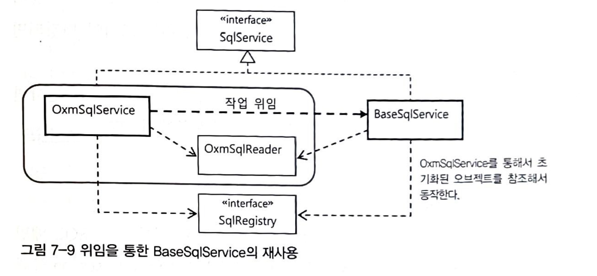

# 7. 스프링 핵심기술의 응용(1)

- 스프링의 모든 기술은 객체지향적인 언어의 장점을 적극적으로 활용해서 코드를 작성하도록 도와주는 것

# 7.1 SQL과 DAO의 분리

- 목표: SQL을 DAO에서 분리하기
- 문제인식
    - SQL 변경이 필요한 상황이 발생하면 SQL을 담고 있는 DAO 코드가 수정된다.

## XML 설정을 이용한 분리

- SQL을 분리하는 가장 직관적인 생각은 XML 설정 파일로 분리하는 것

### 개별 SQL 프로퍼티 방식

```java
public class UserJdbcDao {
		private String sqlAdd;
		
		public void setSqlAdd(String sqlAdd) {
				this.sqlAdd = sqlAdd;
		}

		public void add(User user) {
				jdbcTemplate.update(
                    sqlAdd,
                    user.getId(),
                    user.getName(),
                    ...);
		}
}

// XML로 SQL 관리하기
<bean id="userDao" ...>
		<property name="sqlAdd" value="insert into users(...) values(...)" />
		...
```

- SQL 부분을 클래스 프로퍼티로 외부에서 주입받을 수 있는 구조
- 매번 새로운 SQL이 필요할 때 XML 프로퍼티를 추가하고 DI를 위한 변수, 수정자를 정의해야하는 불편함 존재

### SQL 맵 프로퍼티 방식

- SQL을 하나의 컬렉션에 담아서 사용하는 방식
- 클래스 변수를 하나만 만들면 되서 DAO 코드가 간결해진다.

```java
public class UserJdbcDao {
		private Map<String, String> sqlMap;
		
		public void setSqlMap(Map<String, String> sqlMap) {
				this.sqlMap= sqlMap;
		}

		public void add(User user) {
				jdbcTemplate.update(
                    sqlMap.get("add"),
                    user.getId(),
                    user.getName(),
                    ...);
		}
}
```

- sqlMap에 들어갈 SQL 정보는 XML로 주입해도 되고 자바 코드로 주입해도 된다.
    - XML의 경우 <map>, <entry> 태그를 <property> 태그 내부에 넣어주면된다.
- SQL을 가져오는 키 값이 문자열이라 오타와 같은 휴먼 폴트가 발생할 수 있다.
- 런타임 시점에 오류를 발견할 수 있는 단점이 존재한다.

## SQL 제공 서비스

- 설정파일 안에서 SQL을 관리하고 DI 설정정보가 섞여있는 것이 관리 측면에서 좋지 않다.
- 스프링의 설정파일로 SQL을 관리한다면 생성된 객체 정보는 애플리케이션이 재시작하기 전에는 변경이 매우 어렵다는 문제가 있다.
- DAO는 싱글톤으로 관리되고 있기 때문에 sqlMap에 여러 스레드가 접근한다면 동시성 문제가 발생할 수 있다.
- 이러한 문제로 하여금 DAO가 사용할 SQL을 제공해주는 기능을 독립시킬 필요가 있다.

### SQL 서비스 인터페이스

- 첫 번째는 SQL 서비스가 제공하는 행위를 정의한 인터페이스를 설계
- DAO가 사용할 SQL을 제공하는 역할을 수행한다.
- DAO가 SQL 키 값을 전달하면 SQL 서비스는 이에 해당하는 SQL를 반환한다.

```java
public interface SqlService {
    String getSql(String key) throws SqlRetrievalFailureException;
}

// exception 정의
public class SqlRetrievalFailureException extends RuntimeException {
    public SqlRetrievalFailureException(String message) {
        super(message);
    }

    public SqlRetrievalFailureException(Throwable cause) {
        super(cause);
    }

    public SqlRetrievalFailureException(String message, Throwable cause) {
        super(message, cause);
    }
}
```

```java
@Component
public class UserSqlServiceDao implements UserDao {
    @Autowired
    private JdbcTemplate jdbcTemplate;
    @Autowired
    private SqlService sqlService;// 구현 클래스가 존재하지 않아서 주입 불가능

    private RowMapper<User> userRowMapper = (rs, rowNum) -> {
        User user = new User();
        user.setId(rs.getString("id"));
        user.setName(rs.getString("name"));
        user.setPassword(rs.getString("password"));
        user.setLevel(Level.valueOf(rs.getInt("level")));
        user.setLogin(rs.getInt("login"));
        user.setRecommend(rs.getInt("recommend"));
        user.setEmail(rs.getString("email"));
        return user;
    };

    public void add(final User user) {
        try {
            jdbcTemplate.update(
                    sqlService.getSql("userAdd"),
                    user.getId(),
                    user.getName(),
                    user.getPassword(),
                    user.getLevel().intValue(),
                    user.getLogin(),
                    user.getRecommend(),
                    user.getEmail());
        } catch (DuplicateKeyException e) {
            throw new DuplicateUserIdException(e); // 예외 전환
        }
    }

    public void add_exception(final User user) throws DuplicateKeyException {
        jdbcTemplate.update(
                sqlService.getSql("userAddEx"),
                user.getId(),
                user.getName(),
                user.getPassword(),
                user.getLevel().intValue(),
                user.getLogin(),
                user.getRecommend());
    }

    public User get(String id) {
        return jdbcTemplate.queryForObject(
                sqlService.getSql("userGet"),
                userRowMapper,
                id);
    }

    public int getCount() {
        return jdbcTemplate.query(sqlService.getSql("userGetCount"), rs -> {
            rs.next();
            return rs.getInt(1);
        });
    }

    public void deleteAll() {
        jdbcTemplate.update(sqlService.getSql("userDeleteAll"));
    }

    public List<User> getAll() {
        return jdbcTemplate.query(sqlService.getSql("userGetAll"), userRowMapper);
    }

    public void update(User user) {
        int result = jdbcTemplate.update(
                sqlService.getSql("userUpdate"),
                user.getName(),
                user.getPassword(),
                user.getLevel().intValue(),
                user.getLogin(),
                user.getRecommend(),
                user.getEmail(),
                user.getId());
        if (result != 1) {
            throw new RuntimeException("수정 실패");
        }
    }

    public void setDataSource(DataSource dataSource) {
        this.jdbcTemplate = new JdbcTemplate(dataSource);
    }
}
```

### 스프링 설정을 사용하는 단순 SQL 서비스

```java
public class SimpleSqlService implements SqlService {
    private final Map<String, String> sqlMap;

    public SimpleSqlService() {
        sqlMap = Map.of(
                "userAdd", "insert into users (id, name, password, level, login, recommend, email) values (?, ?, ?, ?, ?, ?, ?)", 
                "userGet", "select * from users where id = ?", 
                "userGetAll", "select * from users order by id", 
                "userDeleteAll", "delete from users", 
                "userGetCount", "select count(*) from users", 
                "userUpdate", "update users set name = ?, password = ?, level = ?, login = ?, recommend = ?, email = ? where id = ?"
        );
    }

    @Override
    public String getSql(String key) throws SqlRetrievalFailureException {
        String sql = sqlMap.get(key);
        if (Objects.isNull(sql)) {
            throw new SqlRetrievalFailureException(key + "에 대한 SQL을 찾을 수 없습니다");
        }
        return sql;
    }
}
```

- SQL 맵 프로퍼티 방식과 동일하게 sqlMap에 들어갈 SQL 정보는 XML로 주입해도 되고 자바 코드로 주입해도 된다.
    - 책에서는 xml 방식을 사용하고 있는데 나는 프로퍼티를 초기화하는 방식으로 변경하겠다.

# 7.2 인터페이스의 분리와 자기참조 빈

인터페이스로 대표되는 기능을 구현 방법과 확장 가능성에 따라 유연한 방법으로 재구성할 수 있도록 설계가 필요하다.

## XML 파일 매핑

- 스프링 XML 파일에 <bean> 태그안에 SQL을 관리하는 것은 좋은 방법이 아니다.
    - SQL을 저장해두는 전용 포맷을 가진 독립적인 파일을 이용하는 것을 권장한다.

### JAXB

- JAXB(Java Architecture for XML Binding)
- JDK 6, java.xml.bind 패키지에서 JAXB 구현 클래스를 찾을 수 있다.
- XML 문서정보를 거의 동일한 구조의 객체로 직접 매핑해준다.
- XML의 정보를 그대로 담고 있는 객체 트리 구조로 만들어줘서 XML 정보를 객체처럼 다룰 수 있어 편리하다.
    - DAO에서 User 리스트를 조회했을때 List 컬렉션에 담아주는 것과 비슷
- XML 문서의 구조를 정의한 스키마를 이용해 매핑할 객체를 자동으로 만들어주는 컴파일러를 제공


### SQL 맵을 위한 스키마 작성과 컴파일

SQL 정보는 키와 SQL의 목록으로 구성된 맵 구조로 만들어두면 편리하다.

```xml
<sqlmap>
	<sql key="userAdd">insert into users(...)</sql>
	...
</sqlmap>
```

JAXB 컴파일러로 컴파일

```xml
<?xml version="1.0" encoding="UTF-8"?>
<schema xmlns="http://www.w3.org/2001/XMLSchema"
        targetNamespace="http://www.tobyspring.com/sqlmap"
        xmlns:tns="http://www.tobyspring.com/sqlmap"
        elementFormDefault="qualified">

    <element name="sqlmap">
        <complexType>
            <sequence>
                <element name="sql" maxOccurs="unbounded" type="tns:sqlType" />
            </sequence>
        </complexType>
    </element>

    <complexType name="sqlType">
        <simpleContent>
            <extension base="string">
                <attribute name="key" use="required" type="string" />
            </extension>
        </simpleContent>
    </complexType>
</schema>

//명령어
xjc -p toby.spring.user.sqlservice.jaxb sqlmap.xsd -d src/main/java
```

- Sqlmap.class: <sqlmap>이 바인딩될 SqlmapType 클래스
- SqlType.class: <sql> 태그의 정보를 담은 SqlType 클래스

### 언마샬링

- **언마샬링(unmarshalling)**: XML 문서를 읽어서 자바의 객체로 변환하는 것
- **마샬링(marshalling)**: 바인딩 객체를 XML 문서로 변환하는 것

JAXB API를 이용해 XML 문서의 내용이 자바 객체로 변환되는지 테스트

```xml
// test/resources/sqlmap.xml

<?xml version="1.0" encoding="UTF-8"?>
<sqlmap xmlns="http://www.tobyspring.com/sqlmap"
        xmlns:xsi="http://www.w3.org/2001/XMLSchema-instance"
        xsi:schemaLocation="http://www.tobyspring.com/sqlmap ../../../sqlmap.xsd">
    <sql key="add">insert</sql>
    <sql key="get">select</sql>
    <sql key="delete">delete</sql>
</sqlmap>
```

```java
public class JaxbTest {

    @Test
    void readSqlmap() throws JAXBException, IOException {
        String contextPath = Sqlmap.class.getPackage().getName();
        JAXBContext context = JAXBContext.newInstance(contextPath);
        Unmarshaller unmarshaller = context.createUnmarshaller();
        ClassPathResource resource = new ClassPathResource("sqlmap.xml");
        Sqlmap sqlmap = (Sqlmap) unmarshaller.unmarshal(resource.getInputStream());

        List<SqlType> sqlList = sqlmap.getSql();
        assertThat(sqlList.size()).isEqualTo(3);
        assertThat(sqlList.get(0).getKey()).isEqualTo("add");
        assertThat(sqlList.get(0).getValue()).isEqualTo("insert");

        assertThat(sqlList.get(1).getKey()).isEqualTo("get");
        assertThat(sqlList.get(1).getValue()).isEqualTo("select");

        assertThat(sqlList.get(2).getKey()).isEqualTo("delete");
        assertThat(sqlList.get(2).getValue()).isEqualTo("delete");
    }
}
```

## XML 파일을 이용하는 SQL 서비스

JAXB를 SqlService에 적용하기

### SQL 맵 XML 파일

resource 경로에 sqlmap.xml 파일 생성(책에는 UserDao와 동일한 경로에 넣으라고 했지만 xml 파일을 못읽는 문제가 있었다.)

```xml
<?xml version="1.0" encoding="UTF-8"?>
<sqlmap xmlns="http://www.tobyspring.com/sqlmap"
        xmlns:xsi="http://www.w3.org/2001/XMLSchema-instance"
        xsi:schemaLocation="http://www.tobyspring.com/sqlmap http://www.tobyspring.com/sqlmap.xsd">
    <sql key="userAdd">insert into users (id, name, password, level, login, recommend, email) values (?, ?, ?, ?, ?, ?, ?)</sql>
    <sql key="userAddEx">insert into users (id, name, password, level, login, recommend, email) values (?, ?, ?, ?, ?, ?, ?)</sql>
    <sql key="userGet">select * from users where id = ?</sql>
    <sql key="userGetAll">select * from users order by id</sql>
    <sql key="userDeleteAll">delete from users</sql>
    <sql key="userGetCount">select count(*) from users</sql>
    <sql key="userUpdate">update users set name = ?, password = ?, level = ?, login = ?, recommend = ?, email = ? where id = ?</sql>
</sqlmap>
```

### XML SQL 서비스

- sqlmap.xml에 있는 SQL을 가져오는 SqlService 구현체 생성
- DAO에서 메소드를 호출할 때 마다 sqlmap.xml 파일을 읽는 것은 비효율적이다.
- sqlmap.xml 파일을 애플리케이션 실행 시점에 한번만 읽도록한다.

```java
public class XmlSqlService implements SqlService {
    private final Map<String, String> sqlMap = new HashMap<>();

    public XmlSqlService() {
        String contextPath = Sqlmap.class.getPackage().getName();
        try {
            JAXBContext context = JAXBContext.newInstance(contextPath);
            Unmarshaller unmarshaller = context.createUnmarshaller();
            InputStream is = UserDao.class.getResourceAsStream("/sqlmap.xml");
            Sqlmap sqlmap = (Sqlmap) unmarshaller.unmarshal(is);
            for (SqlType sqlType : sqlmap.getSql()) {
                System.out.printf("key = %s, value = %s\n", sqlType.getKey(), sqlType.getValue());
                sqlMap.put(sqlType.getKey(), sqlType.getValue());
            }
        } catch (Exception e) {
            throw new RuntimeException(e);
        }
    }

    @Override
    public String getSql(String key) throws SqlRetrievalFailureException {
        String sql = sqlMap.get(key);
        if (Objects.isNull(sql)) {
            throw new SqlRetrievalFailureException(key + "에 대한 SQL을 찾을 수 없습니다");
        }
        return sql;
    }
}
```

```java
// 테스트
@SpringBootTest
class UserSqlServiceDaoTest {

    @Autowired
    DataSource dataSource;

    private UserDao userDao;

    @BeforeEach
    void setUp() {
				// DI 설정
        userDao = new UserSqlServiceDao(dataSource, new XmlSqlService());
				...
    }
		...(생략)
}
```

## 빈의 초기화 작업

- XmlSqlService의 생성자에서 초기화 작업을 다루는 것은 다소 권장하지 않는다.
    - 객체 생성 중에 발생하는 예외를 처리하기 어려움이 있다.
    - 상속하기 어렵다.
    - 보안상 문제가 발생할 수 있다.
- 생성자 보단 객체를 생성해두고 별도 초기화를 수행하는 것이 좋다.
- 파일의 위치와 이름이 코드에 고정되어 있는 것은 확장성이 좋아 보이지 않는다.

파일 이름을 외부에서 설정할 수 있도록 변경해보자.

```java
@Component
public class XmlSqlService implements SqlService {
    private final Map<String, String> sqlMap;
		private String sqlmapFile;

    public void setSqlmapFile(String sqlmapFile) {
        this.sqlmapFile = sqlmapFile;
    }

    public XmlSqlService() {
        sqlMap = new HashMap<>();
        init();
    }

    private void init() {
				String contextPath = Sqlmap.class.getPackage().getName();
        try {
            JAXBContext context = JAXBContext.newInstance(contextPath);
            Unmarshaller unmarshaller = context.createUnmarshaller();
            InputStream is = UserDao.class.getResourceAsStream(sqlmapFile);
            Sqlmap sqlmap = (Sqlmap) unmarshaller.unmarshal(is);
            for (SqlType sqlType : sqlmap.getSql()) {
                System.out.printf("key = %s, value = %s\n", sqlType.getKey(), sqlType.getValue());
                sqlMap.put(sqlType.getKey(), sqlType.getValue());
            }
        } catch (Exception e) {
            throw new RuntimeException(e);
        }
    }
}
```

- XmlSqlService는 빈이므로 생성, 초기화등의 제어권이 스프링에 있다.
    - 스프링은 빈 객체를 생성하고 DI 작업을 수행해서 프로퍼티를 모두 주입해준 뒤 미리 지정한 초기화 메소드를 호출해주는 기능을 갖고 있다.
- AOP를 학습하면서 빈 후처리기 관련해서 이야기했는데 위 상황에서 스프링이 빈 생성 이후에 빈 후처리기를 통해 프로퍼티를 주입할 수 있을 듯 하다.
    - 빈 후처리기는 스프링 컨테이너가 빈을 생성한 뒤에 부가적인 작업을 수행할 수 있게 해준다.
    - AOP를 위한 프록시 자동생성기가 대표적인 빈 후처리기다.
    - 프록시 자동생성기 외에 스프링이 제공하는 여러 빈 후처리기가 존재
- @PostConstruct는 빈 설정에 사용되는 애노테이션이다.
    - <context:annotation-config /> 태그에 의해 등록되는 **빈 후처리기가 제공하는 애노테이션**
    - java.lang.annotation 패키지에 포함된 공통 애노테이션
    - JavaEE 5나 JDK 6에 포함된 표준 애노테이션
    - 스프링은 빈 객체의 초기화 메소드를 지정하는 데 사용

```java
@Component
public class XmlSqlService implements SqlService {
	
		@PostConstruct
		private void init() {
		}
}
```

- XmlSqlService 클래스로 등록된 빈의 객체를 생성하고 DI 작업을 마친 뒤에 @PostConstruct가 붙은 메소드를 자동으로 실행
    - 생성자와 달리 프로퍼티까지 모두 준비된 후에 실행된다는 면에서 유용하다.
- @PostConstruct 애노테이션은 빈 객체가 생성되고 의존 객체와 설정 값을 넣어주는 DI 작업까지 마친 후에 호출된다.


## 변화를 위한 준비: 인터페이스 분리

- XmlSqlService는 두 가지 기능이 있다.
    - XML 파일에서 SQL을 읽어오는 기술
    - 읽어오 SQL을 HashMap에 담는 기술
- 위 두 가지 기능을 특정 방법에 종속되지 않고 확장가능한 구조로 변경하기

### 책임에 따른 인터페이스 정의

1. SQL 정보를 외부의 리소스로부터 읽어오는 것(SqlReader)
2. 읽어온 SQL을 보관해두고 있다가 필요할 때 제공하는 것(SqlRegistry)
3. 가져온 SQL을 필요에 따라 수정 가능하게 하는 것(SqlUpdater)


- SqlService의 구현 클래스는 SqlReader, SqlRegistry 두 타입의 인터페이스에 의존한다.
- 부가적으로 SqlRegistry 인터페이스는 SqlUpdater에 의존하여 런타임 시점에 SQL을 변경이 가능하도록 설계하였다.
- SqlReader가 읽어온 SQL 정보를 SqlRegistry에 전달해서 등록해야한다. 이때 두 객체 간의 협력을 어떻게 구성(메소드 반환 타입, 파라미터 타입 등)할지 고민이 필요하다.

```java
sqlReader.readSql(sqlRegistry);
```

SqlService는 SqlReader를 의존하고 있고 해당 객체의 메소드를 호출해 특정 파일에서 SQL 정보를 읽어오지만 SQL 정보는 SqlService가 아닌 SqlRegistry가 필요로 한다.

그래서 SqlService가 SqlReader에게 데이터를 달라고 요청하고, 다시 SqlRegistry에게 이 데이터를 사용하라고 하는 것보다는 **SqlReader에게 SqlRegistry 전략을 제공해주면서 이를 이용해 SQl 정보를 저장하라고 요청**하는 것이 좋겠다.

> 자바의 객체는 상태(필드)를 가질 수 있다. 자신이 가진 데이터를 이용해 어떻게 작업해야 할지도 가장 잘 알고 있다. 
**객체 스스로 자신의 데이터로 충실히 작업하게 만들면 되지, 불필요하게 객체 내부의 데이터를 외부로 노출 시킬 필요는 없다.**
> 


SqlService는 SqlReader가 사용할 SqlRegistry 객체를 제공하는 역할을 수행한다. SqlRegistry는 일종의 콜백 객체로 사용된다.

### SqlRegistry 인터페이스

```java
public interface SqlRegistry {
    void registerSql(String key, String sql);

    String findSql(String key) throws SqlNotFoundException;
}
```

### SqlReader 인터페이스

```java
public interface SqlReader {
    /* 
     * SQL을 외부에서 가져와 SqlRegistry에 등록한다. 
     * 다양한 예외가 발생할 수 있지만 대부분 복구 불가한 예외
     */
    void read(SqlRegistry sqlRegistry);
}
```

## 자기참조 빈으로 시작하기

### 다중 인터페이스 구현과 간접 참조


- SqlService의 구현 클래스는 SqlReader, SqlRegistry 두 개의 프로퍼티를 DI 받을 수 있는 구조로 변경
- SqlService의 구현 클래스는 인터페이스에 의존하고 있음을 알 수 있다. 만약 SqlReader, SqlRegistry 인터페이스를 SqlService 구현 클래스가 구현하는 것은 어떨까?
    - 클래스 상속은 한번만 할 수 있지만, 인터페이스는 다중 상속이 가능하다.
    - 하나의 클래스에서 여러 타입(인터페이스)를 상속(구현)할 수 있다.


### 인터페이스를 이용한 분리

```java
@Component
public class XmlSqlV2Service implements SqlService, SqlReader, SqlRegistry {
		// 생성자 주입 방식을 사용하면 빈 생성시 순환 참조 오류가 발생    
		@Autowired
    private SqlReader sqlReader;
    @Autowired
    private SqlRegistry sqlRegistry;
    private final Map<String, String> sqlMap;
    private final String sqlmapFile;

    public XmlSqlV2Service() {
        this.sqlMap = new HashMap<>();
        this.sqlmapFile = "/sqlmap.xml";
    }

		@PostConstruct
    private void init() {
        sqlReader.read(sqlRegistry);
    }

    @Override
    public String getSql(String key) throws SqlRetrievalFailureException {
        try {
            return findSql(key);
        } catch (SqlNotFoundException e) {
            throw new SqlRetrievalFailureException(e);
        }
    }

    @Override
    public void read(SqlRegistry sqlRegistry) {
        System.out.println("load sqlmapFile = " + sqlmapFile);
        String contextPath = Sqlmap.class.getPackage().getName();
        try {
            JAXBContext context = JAXBContext.newInstance(contextPath);
            Unmarshaller unmarshaller = context.createUnmarshaller();
            InputStream is = UserDao.class.getResourceAsStream(sqlmapFile);
            Sqlmap sqlmap = (Sqlmap) unmarshaller.unmarshal(is);
            for (SqlType sqlType : sqlmap.getSql()) {
                System.out.printf("key = %s, value = %s\n", sqlType.getKey(), sqlType.getValue());
                sqlRegistry.registerSql(sqlType.getKey(), sqlType.getValue());
            }
        } catch (Exception e) {
            throw new RuntimeException(e);
        }
    }

    @Override
    public void registerSql(String key, String sql) {
        sqlMap.put(key, sql);
    }

    @Override
    public String findSql(String key) throws SqlNotFoundException {
        String sql = sqlMap.get(key);
        System.out.println("call sql = " + sql);
        if (Objects.isNull(sql)) {
            throw new SqlRetrievalFailureException(key + "에 대한 SQL을 찾을 수 없습니다");
        }
        return sql;
    }
}
```

### 자기참조 빈 설정

```java
@Component
public class XmlSqlV2Service implements SqlService, SqlReader, SqlRegistry {
    // 생성자 주입 방식을 사용하면 빈 생성시 순환 참조 오류가 발생
    @Qualifier("xmlSqlV2Service")
    @Autowired
    private SqlReader sqlReader;
    @Qualifier("xmlSqlV2Service")
    @Autowired
    private SqlRegistry sqlRegistry;
    private final Map<String, String> sqlMap;
    private final String sqlmapFile;

    public XmlSqlV2Service() {
        this.sqlMap = new HashMap<>();
        this.sqlmapFile = "/sqlmap.xml";
    }
		...
}
```

- 책에서 빈 주입 시 xml 방식을 이용했는데 나는 단순하게 애너테이션으로 주입하도록 했다.
    - 생성자 주입 시 순환 참조 오류가 발생하는 문제가 있었는데, 해결 방법을 찾지 못했다.
- 자기 자신을 참조하는 빈은 흔히 사용하는 방법은 아니다.
    - 책임이 다르면 클래스를 구분하고 각기 다른 객체로 만들어지는 것이 자연스럽다.
    - 자기참조 빈을 만들어보는 것은, 책임과 관심사가 복잡하게 얽혀 있어서 확장이 힘들고 변경에 취약한 구조의 클래스를 유연한 구조로 만들려고 할 때 처음 시도해볼 수 있는 방법이다.
- 당장 확장 구조를 이용해 구현할 필요는 없지만 확장 구조를 만들어두는 것이 좋다고 생각될 때 접근할 수 있는 방법

## 디폴트 의존관계

### 확장 가능한 기반 클래스

별도 구현 클래스가 존재하지 않을 때 기본으로 의존성이 주입되는 클래스 생성

```java
// SqlService 디폴트 구현 클래스
@Component
public class BaseSqlService implements SqlService {
    protected SqlReader sqlReader;
    protected SqlRegistry sqlRegistry;

    public BaseSqlService(@Qualifier("jaxbXmlSqlReader") SqlReader sqlReader,
                          @Qualifier("hashMapSqlRegistry") SqlRegistry sqlRegistry) {
        this.sqlReader = sqlReader;
        this.sqlRegistry = sqlRegistry;
    }

    @PostConstruct
    private void init() {
        sqlReader.read(sqlRegistry);
    }

    @Override
    public String getSql(String key) throws SqlRetrievalFailureException {
        String sql = sqlRegistry.findSql(key);
        System.out.println("call sql = " + sql);
        if (Objects.isNull(sql)) {
            throw new SqlRetrievalFailureException(key + "에 대한 SQL을 찾을 수 없습니다");
        }
        return sql;
    }
}
```

```java
// SqlRegistry 디폴트 구현 클래스
@Component
public class HashMapSqlRegistry implements SqlRegistry {
    private Map<String, String> sqlMap = new HashMap<>();

    @Override
    public void registerSql(String key, String sql) {
        sqlMap.put(key, sql);
    }

    @Override
    public String findSql(String key) throws SqlNotFoundException {
        String sql = sqlMap.get(key);
        System.out.println("call sql = " + sql);
        if (Objects.isNull(sql)) {
            throw new SqlRetrievalFailureException(key + "에 대한 SQL을 찾을 수 없습니다");
        }
        return sql;
    }
}
```

```java
// SqlReader 디폴트 구현 클래스
@Component
public class JaxbXmlSqlReader implements SqlReader {
    private final String sqlmapFile;

    public JaxbXmlSqlReader() {
        this.sqlmapFile = "/sqlmap.xml";
    }

    @Override
    public void read(SqlRegistry sqlRegistry) {
        System.out.println("load sqlmapFile = " + sqlmapFile);
        String contextPath = Sqlmap.class.getPackage().getName();
        try {
            JAXBContext context = JAXBContext.newInstance(contextPath);
            Unmarshaller unmarshaller = context.createUnmarshaller();
            InputStream is = UserDao.class.getResourceAsStream(sqlmapFile);
            Sqlmap sqlmap = (Sqlmap) unmarshaller.unmarshal(is);
            for (SqlType sqlType : sqlmap.getSql()) {
                System.out.printf("key = %s, value = %s\n", sqlType.getKey(), sqlType.getValue());
                sqlRegistry.registerSql(sqlType.getKey(), sqlType.getValue());
            }
        } catch (Exception e) {
            throw new RuntimeException(e);
        }
    }
}
```

### 디폴트 의존관계를 갖는 빈 만들기

- 디폴트 의존관계란 외부에서 DI 받지 않는 경우 기본적으로 자동 적용되는 의존관계를 말한다.

```java
@Component
public class DefaultSqlService extends BaseSqlService {
    public DefaultSqlService() {
        super(new JaxbXmlSqlReader(), new HashMapSqlRegistry());
    }
}
```

- DI 설정이 없을 경우 디폴드로 적용하고 싶은 의존 객체를 생성자에서 넣어준다.
- DI란 클라이언트 외부에서 의존 객체를 주입해주는 방법도 있지만 위와 같이 자신이 사용할 디폴트 의존 객체를 스스로 DI 하는 방법도 있다.
- 디폴트 의존관계의 단점은 위 코드와 같이 생성자에서 다른 의존 객체를 생성한다는 점이다.
    - 만약 다른 객체로 변경하고자 할 때, 이미 생성자에서 디폴드 객체를 생성하고 이후에 변경할 객체가 주입 된다.
    - 불필요한 디폴트 객체가 생성되는 것은 개선이 필요해 보인다.
        - @PostConstruct 초기화 메소드를 이용해 프로퍼티가 설정됐는지 확인하고 없는 경우 디폴트 객체를 만드는 방법을 사용하면 해결할 수 있다.

# 7.3 서비스 추상화 적용

**JaxbXmlSqlReader 개선 포인트 정리**

- JAXB 외에 다양한 XML과 자바 객체 매핑 기술이 존재, 필요에 따라 다른 기술로 손쉽게 바꿀 수 있어야한다.
- XML 파일을 여러 DAO에서 가져올 수 있어야 한다. 지금은 UserDao에서 같은 클래스패스 안에서만 XML을 읽어올 수 있다.
    - 임의의 클래스패스나 파일 시스템상의 절대위치 또는 HTTP 프로토콜을 통해 원격에서 가져오도록 확장할 수 있게 만들어보자

## OXM(Object-XML Mapping) 서비스 추상화

XML과 자바 객체 매핑 기술

- **Castor XML**: 설정파일이 필요 없는 인트로슾펙션 모드를 지원, 매우 간결하고 가벼운 바인딩 프레임워크
- **JiBX**: 뛰어난 성능
- **XmlBean**: 아파치 XML 프로젝트, XML의 정보셋을 효과적으로 제공
- **Xstream**: 관계를 이용해 설정이 없는 바인딩을 지원하는 기술

XML과 자바 객체를 매핑해서 상호 변환해주는 기술을 **OXM(Object-XML Mapping)** 이라고 한다.

위 기술들의 사용 목적은 동일하고 유사한 기능의 API를 제공한다. 트랜잭션, 메일 전송 학습할 때, 비슷한 기능을 제공하는 여러 기술들을 **서비스 추상화**를 통해 특정 기술에 종속되지 않도록 추상화된 레이어를 구성한 적이 있다. XML을 읽는 기능도 서비스 추상화를 적용해보자.

### OXM 서비스 인터페이스

스프링이 제공하는 OXM 추상화 서비스 인터페이스는 다음과 같다.

- 자바 객체를 XML로 변환하는 Marshaller
- XML을 자바 객체로 매핑해주는 Unmarshaller

SqlReader는 Unmarshaller를 이용하면 된다.

```java
package org.springframework.oxm; // javax.xml.bind 와 차이점?이 뭘지

public interface Unmarshaller {
		boolean supports(Class<?> clazz);

		Object unmarshal(Source source) throws IOException, XmlMappingException;
}
```

- XML 파일에 대한 정보를 담은 Source 타입의 객체를 주면, 설정에서 지정한 OXM 기술을 이용해 자바 객체 트리로 변환해 루트 객체(Object 타입)로 돌려준다.

### JAXB 구현 테스트

스프링의 OXM 서비스 추상화 인터페이스를 이용한 테스트

```java
@SpringBootTest
public class OxmTest {

    @Autowired
    private Unmarshaller unmarshaller;

    @Test
    void unmarshallSqlMap() throws Exception {
        StreamSource xmlSource = new StreamSource(OxmTest.class.getResourceAsStream("/sqlmapTest.xml"));
        Sqlmap sqlmap = (Sqlmap) unmarshaller.unmarshal(xmlSource);

        List<SqlType> sqlList = sqlmap.getSql();
        assertThat(sqlList.size()).isEqualTo(3);
        assertThat(sqlList.get(0).getKey()).isEqualTo("add");
        assertThat(sqlList.get(0).getValue()).isEqualTo("insert");

        assertThat(sqlList.get(1).getKey()).isEqualTo("get");
        assertThat(sqlList.get(1).getValue()).isEqualTo("select");

        assertThat(sqlList.get(2).getKey()).isEqualTo("delete");
        assertThat(sqlList.get(2).getValue()).isEqualTo("delete");
    }

    @TestConfiguration
    static class OxmTestConfig {
        @Bean
        public Unmarshaller unmarshaller() {
            Jaxb2Marshaller jaxb2Marshaller = new Jaxb2Marshaller();
            jaxb2Marshaller.setContextPath("toby.spring.user.sqlservice.jaxb");
            return jaxb2Marshaller;
        }
    }
}
```

### Castor 구현 테스트

**Deprecated.** as of Spring Framework 4.3.13, due to the lack of activity on the Castor project

## OXM 서비스 추상화 적용

- OXM 추상화 기능을 이용하는 SqlService 구현
- SqlService를 구현하는 OxmSqlService 구현하고 SqlRegistry는 DI 받을 수 있게 하지만 SqlReader는 스프링의 OXM 언마샬러를 이용해 OXMSqlService 내에 고정시킨다.
    - SQL을 읽는 방법을 OXM으로 제한해서 사용성을 극대화하는 것이 목적

### 멤버 클래스를 참조하는 통합 클래스


```java
@Component
public class OxmSqlService implements SqlService {
    private OxmSqlReader oxmSqlReader;
    private SqlRegistry sqlRegistry;

    public OxmSqlService(@Qualifier("hashMapSqlRegistry") SqlRegistry sqlRegistry) {
        Jaxb2Marshaller unmarshaller = new Jaxb2Marshaller();
        unmarshaller.setContextPath("toby.spring.user.sqlservice.jaxb");
        this.oxmSqlReader = new OxmSqlReader(unmarshaller);
        this.sqlRegistry = sqlRegistry;
    }

    @PostConstruct
    private void init() {
        oxmSqlReader.read(sqlRegistry);
    }

    @Override
    public String getSql(String key) throws SqlRetrievalFailureException {
        String sql = sqlRegistry.findSql(key);
        System.out.println("call sql = " + sql);
        if (Objects.isNull(sql)) {
            throw new SqlRetrievalFailureException(key + "에 대한 SQL을 찾을 수 없습니다");
        }
        return sql;
    }

    public void setUnmarshaller(Unmarshaller unmarshaller) {
        this.oxmSqlReader.setUnmarshaller(unmarshaller);;
    }

    public void setSqlmapFile(String sqlmapFile) {
        this.oxmSqlReader.setSqlmapFile(sqlmapFile);
    }

    private final class OxmSqlReader implements SqlReader {
        private Unmarshaller unmarshaller;
        private String sqlmapFile;

        public OxmSqlReader(Unmarshaller unmarshaller) {
            this.unmarshaller = unmarshaller;
            this.sqlmapFile = "/sqlmap.xml";
        }

        @Override
        public void read(SqlRegistry sqlRegistry) {
            System.out.println("load sqlmapFile = " + sqlmapFile);
            try {
                StreamSource source = new StreamSource(UserDao.class.getResourceAsStream(sqlmapFile));
                Sqlmap sqlmap = (Sqlmap) unmarshaller.unmarshal(source);
                for (SqlType sqlType : sqlmap.getSql()) {
                    System.out.printf("key = %s, value = %s\n", sqlType.getKey(), sqlType.getValue());
                    sqlRegistry.registerSql(sqlType.getKey(), sqlType.getValue());
                }
            } catch (Exception e) {
                throw new IllegalArgumentException(sqlmapFile + "을 가져올 수 없습니다.");
            }
        }

        public void setUnmarshaller(Unmarshaller unmarshaller) {
            this.unmarshaller = unmarshaller;
        }

        public void setSqlmapFile(String sqlmapFile) {
            this.sqlmapFile = sqlmapFile;
        }
    }
}
```

- OxmSqlReader는 OxmSqlService에서만 사용할 수 있게 강제하고 있다. 두 개의 클래스를 강하게 결합하고 더 이상 확장이나 변경을 제한해두는 이유는 무엇일까?
    - OXM을 이용하는 서비스 구조로 최적화하기 위함
    - 하나의 클래로 만들어두기 때문에 빈의 등록과 설정은 단순해지고 쉽게 사용할 수 있다.

클래스를 분리하고 빈을 따로 등록해 DI 할 수 있도록 기본 구조를 가져간 것은 좋지만, **자꾸 늘어나는 빈의 개수와 반복되는 비슷한 DI 구조가 불편**할 수 있다.

빈의 개수를 줄이고 설정을 단순하게 하기 위해 디폴트 의존 객체를 만들어줬고 이를 활용할 순 있지만, **디폴트로 내부에서 만드는 객체의 프로퍼티를 외부에서 지정해주기가 힘들다는 한계**가 있다. 

그래서 SqlService 구현이 SqlReader의 구체적인 구현 클래가 무엇인지도 알고, 자신의 프로퍼티를 통해 필요한 설정정보도 넘겨주고, 멤버 클래스로 소유하고 있는 강한 결합 구조를 만드는 방법을 사용한 것이다.


- OxmSqlService는 빈 등록시 내부에 있는 OxmSqlReader 프로퍼티를 설정해주기 위한 창구 역할을 한다.
- OxmSqlReader는 외부에 노출되지 않고 OxmSqlService에 의해서만 만들어지고 스스로 빈으로 등록될 수 없다.

### 위임을 이용한 BaseSqlService의 재사용

OxmSqlService의 문제점

- OxmSqlService는 SqlReader를 정적 멤버 클래스로 고정시켜 OXM에 특화된 형태로 재구성했기 때문에 설정은 간결해지고 의도되지 않은 방식으로 확장된 위험이 있다.
- sql 파일 정보를 읽는 init() 메소드와 쿼리를 가져오는 getSql() 메소드가 디폴트 의존관계 설정 클래스인 BaseSqlService와 중복된다는 점이다.
- 공통 메소드를 슈퍼클래스로 분리하는 방법도 있지만 간단한 코드라서 복잡한 계층구조로 만들기엔 부담스럽다.
    - 이러한 경우 **위임 구조를 이용해 코드의 중복을 제거**할 수 있다.
    - 중복되는 코드는 한 곳(BaseSqlService)에 위치하게 하고 다른 한쪽(OxmSqlService)에서는 일종의 설정과 기본 구성을 변경해주기 위한 어댑터 같은 개념으로 BaseSqlService의 앞에 두는 설계가 가능하다.
    - 위임구조라면 프록시를 만들 때와 비슷하다.



```java
@Component
public class OxmSqlV2Service implements SqlService {
    private final BaseSqlService baseSqlService;

    public OxmSqlV2Service(@Qualifier("hashMapSqlRegistry") SqlRegistry sqlRegistry) {
        Jaxb2Marshaller unmarshaller = new Jaxb2Marshaller();
        unmarshaller.setContextPath("toby.spring.user.sqlservice.jaxb");
        baseSqlService = new BaseSqlService(new OxmSqlReader(unmarshaller), sqlRegistry);
    }

    @PostConstruct
    private void init() {
        baseSqlService.init();
    }

    @Override
    public String getSql(String key) throws SqlRetrievalFailureException {
        return baseSqlService.getSql(key);
    }

    private final class OxmSqlReader implements SqlReader {
				...
		}
}
```

## 리소스 추상화

- XML 파일을 특정 위치에 있어야만 하는 문제점 존재
    - http, ftp, 프로토콜 등 리소스 접근에 제한없이 가져올 수 있도록 유연하게 만들기
- 자바에서는 다양한 위치에 존재하는 리소스에 대해 단일화된 접근 인터페이스를 제공해주는 클래스가 없다.
- URL을 이용해 웹상의 리소스에 접근하는 java.net.URL 클래스 존재한다.
    - URL 클래스는 http, ftp, file과 같은 접두어(prefix)를 지정할 수 있어 다양한 원격 리소스에 접근 가능하다.
    - 자바 클래스패스 안에 존재하는 리소스나 서블릿 컨텍스트의 리소스 또는 임의의 스트림으로 가져올 수 있는 리소스를 지정하는 방법이 없다.
    - 리소스 파일의 존재 여부를 미리 확인할 수 있는 기능이 없다.
- 기존 XML 파일을 가져오기 위해 사용한 방법은 ClassLoader 클래스의 getResourceAsStream() 메소드를 이용
- 서블릿 컨텍스트 내의 리소스를 가져오려면 ServletContext의 getResourceAsStream()을 사용해야한다.

리소스 접근이라는 목적은 동일하지만 사용법이 각기 다른 여러 다른 기술을 **서비스 추상화**를 적용해보자.

### 리소스

스프링은 **자바에 존재하는 일관성 없는 리소스 접근 API를 추상화해서 Resource라는 추상화 인터페이스를 정의**했다.

```java
package org.springframework.core.io;

public interface Resource extends InputStreamSource {

	boolean exists();

	default boolean isReadable() {
		return exists();
	}

	default boolean isOpen() {
		return false;
	}

	default boolean isFile() {
		return false;
	}

	URL getURL() throws IOException;

	URI getURI() throws IOException;

	File getFile() throws IOException;

	default ReadableByteChannel readableChannel() throws IOException {
		return Channels.newChannel(getInputStream());
	}

	long contentLength() throws IOException;

	long lastModified() throws IOException;

	Resource createRelative(String relativePath) throws IOException;

	@Nullable
	String getFilename();

	String getDescription();
}
```

- 애플리케이션 컨텍스트가 사용할 설정정보 파일 지정, 스프링의 거의 모든 API는 외부 리소스 정보가 필요할 때 항상 이 Resource 추상화를 이용한다.
- 스프링은 어떻게 임의의 리소스를 Resource 인터페이스 타입의 객체로 가져올 수 있을까?
    - 다른 서비스 추상화의 객체와 달리, Resource는 스프링에서 빈이 아니라 값으로 취급한다.
    - 리소스는 OXM, 트랜잭션처럼 서비스를 제공해주는 것이 아니라 단순한 정보를 가진 값으로 지정된다.

### 리소스 로더

- 스프링에는 URL 클래스와 유사하게 접두어를 이용해 Resource 객체를 선언하는 방법이 있다.
    - 문자열 안에 리소스의 종류와 리소스의 위치를 함께 표현하게 하는 것이다. 그리고 해당 문자열을 기반으로 Resource로 변환해주는 ResourceLoader를 제공한다.

```java
package org.springframework.core.io;

public interface ResourceLoader {
	String CLASSPATH_URL_PREFIX = ResourceUtils.CLASSPATH_URL_PREFIX;
	
	Resource getResource(String location);

	@Nullable
	ClassLoader getClassLoader();
}
```

| 접두어 | 예 | 설명 |
| --- | --- | --- |
| file: | file:/C:/temp/file.txt | 파일 시스템의 C:/temp 폴더에 있는 file.txt를 리소스로 만들어준다. |
| classpath: | classpath:file.txt | 클래스패스의 루트에 존재하는 file.txt 리소스에 접근하게 해준다. |
| 없음 | WEB-INF/test.dat | 접두어가 없는 경우에는 ResourceLoader 구현에 따라 리소스의 위치가 결정된다. ServletResourceLoader라면 서블릿 컨텍스트의 루트를 기준으로 해석한다. |
| http: | http://www.mayserver.com/test.dat | HTTP 프로토콜을 사용해 접근할 수 있는 웹상의 리소스를 지정한다. ftp: 도 사용할 수 있다. |
- ResourceLoader의 대표적인 예는 **스프링의 애플리케이션 컨텍스트**이다.
- 애플리케이션 컨텍스트가 구현해야 하는 인터페이스인 ApplicationContext는 ResourceLoader 인터페이스를 상속하고 있다.
    - 모든 애플리케이션 컨텍스트는 리소스 로더이기도 하다.
- 스프링 컨테이너는 **리소스 로더**를 다양한 목적으로 사용하고 있다.
    - 빈 설정 파일인 XML 파일 읽기
    - 애플리케이션 컨텍스트가 외부에서 읽어오는 정보 읽기

### Resource를 이용해 XML 파일 가져오기

```java
@Component
public class OxmSqlV3Service implements SqlService {
    private final BaseSqlService baseSqlService;

    public OxmSqlV3Service(@Qualifier("hashMapSqlRegistry") SqlRegistry sqlRegistry) {
        Jaxb2Marshaller unmarshaller = new Jaxb2Marshaller();
        unmarshaller.setContextPath("toby.spring.user.sqlservice.jaxb");
        baseSqlService = new BaseSqlService(new OxmSqlReader(unmarshaller), sqlRegistry);
    }

    @PostConstruct
    private void init() {
        baseSqlService.init();
    }

    @Override
    public String getSql(String key) throws SqlRetrievalFailureException {
        return baseSqlService.getSql(key);
    }

    private final class OxmSqlReader implements SqlReader {
        private Unmarshaller unmarshaller;
        private Resource sqlmapResource = new ClassPathResource("sqlmap.xml", UserDao.class);

        public OxmSqlReader(Unmarshaller unmarshaller) {
            this.unmarshaller = unmarshaller;
        }

        @Override
        public void read(SqlRegistry sqlRegistry) {
            String filename = sqlmapResource.getFilename();
            System.out.println("load sqlmapFile = " + filename);
            try {
                StreamSource source = new StreamSource(sqlmapResource.getInputStream());
                Sqlmap sqlmap = (Sqlmap) unmarshaller.unmarshal(source);
                for (SqlType sqlType : sqlmap.getSql()) {
                    System.out.printf("key = %s, value = %s\n", sqlType.getKey(), sqlType.getValue());
                    sqlRegistry.registerSql(sqlType.getKey(), sqlType.getValue());
                }
            } catch (Exception e) {
                throw new IllegalArgumentException(filename + "을 가져올 수 없습니다.");
            }
        }

        public void setUnmarshaller(Unmarshaller unmarshaller) {
            this.unmarshaller = unmarshaller;
        }

				public void setSqlmapResource(Resource sqlmapResource) {
            this.sqlmapResource = sqlmapResource;
        }
    }
}
```

- Resource 객체는 실제 리소스는 아니라는 점을 유의해야한다.
    - Resource는 리소스에 접근할 수 있는 추상화된 핸들러이다.
    - Resource 객체가 생성됐다고 해도 실제 리소스가 존재하지 않을 수 있다.

# 7.4 인터페이스 상속을 통한 안전한 기능확장

서버가 운영 중인 상태에서 서버를 재시작하지 않고 긴급하게 애플리케이션이 사용 중인 SQL을 변경해야 할 수 있다. 특정 SQL의 내용을 변경하는 기능을 확장해보자

## DI와 기능의 확장

지금까지 적용한 DI는 일종의 **디자인 패턴** 또는 **프로그래밍 모델**이라는 관점에서 보는 것이 자연스럽다.

DI 프레임워크를 적용해 빈 설정으로 애플리케이션을 구현한 것이 DI를 바르게 적용했다고 할 수 없다. **DI의 가치를 제대로 얻기 위해서 먼저 DI에 적합한 객체 설계가 필요**하다.

### DI를 의식하는 설계

- DI에 필요한 유연하고 확장성이 뛰어난 객체 설계를 하려면 많은 고민과 학습, 훈련, 경험이 필요하다.
- 객체지향 설계를 잘하는 방법 중 하나는 DI를 의식하면서 설게하는 방식이다.
- DI를 적용하려면 두 개 이상의, 객채들이 의관관계를 가지고 서로 협력하고 각 객체는 적절한 책임에 따라 분리되는 것이 기본이다.
- DI는 런타임 시에 의존 객체를 동적으로 연결해서 유연한 확장을 가져오는 것이 목적이기 때문에 항상 확장을 염두에 두고 객체 사이의 관계를 생각해야한다.

### DI와 인터페이스 프로그래밍

- DI를 DI답게 만들려면 두 개의 객체가 인터페이스를 통해 느슨하게 연결돼야 한다.
- 인터페이스를 사용하는 이유 첫 번째는 다형성을 얻기 위해서다.
    - 여러 개의 구현을 바꿔가면서 사용할 수 있게 하는 것이 DI가 추구하는 목적 중 하나이다.
    - 프록시, 데코레이터, 어댑터, 테스트 대역 등의 다양한 목적을 위해 인터페이스를 통한 다형성이 활용된다.
- 인터페이스를 사용해야하는 이유 두 번째는 인터페이스 분리 원칙을 통해 클라이언트와 의존 객체 사이의 관계를 명확하게 하기 위해서다.
- 객체가 그 자체로 충분히 응집도가 높은 작은 단위로 설계됐더라도, **목적과 관심이 각기 다른 클라이언트가 있다면 인터페이스를 통해 적적히 분리**해줄 필요가 있다.
    - 이를 객체지향 설계 원칙에서는 **인터페이스 분리 원칙(Interface Segrgation Principle)** 이라고 한다.
- 인터페이스를 사용하지 않고 클래스를 직접 참조하는 방식으로 DI를 했다면, 인터페이스 분리 원칙과 같은 클라이언트에 특화된 의존관계를 만들어낼 방법 자체가 없는 것이다.
- **굳이 인터페이스를 써야 하냐고 주장하는 의견이 있다면 DI는 원래 인터페이스를 쓰게 돼 있다고 말해도 좋다…**

## 인터페이스 상속

- **인터페이스 분리 원칙**이 주는 장점은 모든 클라이언트가 자신의 관심에 따른 접근 방식을 불필요한 간섭 없이 유지할 수 있다는 점이다.
    - 기존 클라이언트에 영향을 주지 않은 채로 객체의 기능을 확장, 수정할 수 있다.


- 인터페이스를 사용해 DI 관계를 만들었기 때문에 SqlRegistry의 구현 클래스는 또 다른 제3의 클라리언트를 위한 인터페이스를 가질 수 있는 장점이 있다.
    - 제3의 클라이언트를 위해 SqlRegistry 인터페이스를 수정하라는 것이 아니다. 해당 인터페이스를 변경하면 기존 구현 코드들에 영향이 갈 수 있기 때문이다. 때문에 새로운 클라이언트를 위해 SqlRegistry 인터페이스를 상속받는 인터페이스를 새롭게 정의하는 것이 좋겠다.(기존 인터페이스를 확장)

```java
// SQL 수정 기능을 가진 확장 인터페이스
public interface UpdatableSqlRegistry extends SqlRegistry {
    void updateSql(String key, String sql) throws SqlUpdateFailureException;
    
    void updateSql(Map<String, String> sqlmap) throws SqlUpdateFailureException;
}
```


- 인터페이스를 추가하거나 상속을 통해 확장하는 방식을 잘 활용하면 이미 기존의 인터페이스를 사용하는 클라이언트가 있는 경우에도 유연한 확장이 가능해진다.
- 클라이언트가 정말 필요한 기능을 가진 인터페이스를 통해 객체에 접근하도록 만드는 것이 중요하다.
    - 위의 예시에서 SQL 수정 기능만 처리하는 클라이언트가 필요로 했다면 SqlRegistry 인터페이스를 상속할 필요가 없을 것이다.
- **잘 적용된 DI는 잘 설계된 객체 의존관계**에 달려있다.
- 인터페이스를 적절하게 분리하고 **확장하는 방법을 통해 객체 사이의 의존관계를 명확**하게 해주고, **기존 의존관계에 영향을 주지 않으면서 유연한 확장성을 얻는 방법**이 무엇인지 항상 고민해야한다.

# References