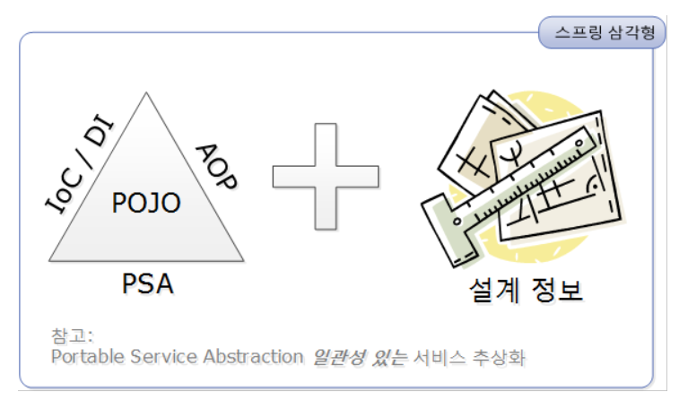

# 8. 스프링이란 무엇인가

# 8.1 스프링의 정의

스프링을 그때그때 필요한 API 사용 방법 위조로만 공부하면 스프링을 오해하거나 그 가치를 충분히 누리지 못할 수 있다. 스프링의 정의를 통해 스프링이 어떤 것인지 큰 그림으로 이해해보려고 노력할 필요가 있다.

스프링에 대해 가장 잘 알려진 정의는 다음과 같다.

> **자바 엔터프라이즈 개발을 편하게 해주는 오픈소스 경량급 애플리케이션 프레임워크**
> 

지금 부터 위 정의에 담긴 스프링의 중요한 특징을 알아보자.

- **애플리케이션 프레임워크**
    - 특정 계층이나, 기술, 업무 분야에 국한되지 않고 애플리케이션의 전 영역을 포괄하는 범용적인 프레임워크
    - 애플리케이션 개발의 전 과정을 빠르고 편리하며 효율적으로 진행하는데 일차적인 목표를 두는 프레임워크
    - 단지 여러 계층의 다양한 기술을 한데 모아뒀기 때문에 애플리케이션 프레임워크라고 불리는 것은 아니다.
        - 애플리케이션 전 영역을 관통하는 일관된 프로그래밍 모델과 핵심 기술을 바탕으로 해서 각 분야의 특성에 맞는 필요를 채워주고 있기 때문에, 애플리케이션을 빠르고 효과적으로 개발할 수 있다.
    - 스프링의 일차적인 존재 목적은 **핵심 기술에 담긴 프로그래밍 모델을 일관되게 적용해서 엔터프라이즈 애플리케이션 전 계층과 전 영역에 전략과 기능을 제공해줌으로써 애플리케이션을 편리하게 개발하게 해주는 애플리케이션 프레임워크로 사용**되는 것이다.
- **경량급**
    - 스프링 자체가 아주 가볍고 작은 규모의 코드라는 의미가 아닌 불필요하게 무겁지 않다는 의미이다.
    - EJB와 같이 복잡하고 고급 WAS를 사용해야하는 무거운 개발 환경과 대비해서 스프링의 서블릿 컨테이너만으로 충분히 EJB를 대체할 수 있다는 것을 말한다.
    - 스프링이 가벼운 이유는 코드에 불필요하게 등장하던, 프레임워크와 서버환경에 의존적인 부분을 제거해주기 때문이다.
- **자바 엔터프라이즈 개발을 편하게**
    - 스프링은 근본적인 부분에서 엔터프라이즈 개발의 복잡함을 제거해내고 진정으로 개발을 편하게 해주는 해결책을 제시
        - 엔터프라이즈 개발의 근본적인 문제점을 도전해서 해결책을 제시한다는 것이 기존 기술의 접근 방법과 스프링의 접근 방법의 차이점이다.
    - 개발자가 복잡하고 실수하기 쉬운 로우레벨 기술(트랜잭션이나 상태 관리, 멀티스레딩, 리소스 풀링 등)에 많은 신경을 쓰지 않으면서도 애플리케이션의 핵심인 사용자 요구사항, 즉 비즈니스 로직을 빠르고 효과적으로 구현하는 것을 말한다.
- **오픈소스**
    - 스프링은 오픈소스 프로젝트 방식으로 개발돼왔다.
    - 오픈소스 개발 방식의 가장 큰 취약점은 지속적이고 안정적인 개발이 계속될지가 불활실하다는 것이다.
    - 스프링 개발자는 이런 오픈소스의 문제점과 한계를 잘 알고 있어 프레임워크 사용자에게 지속적인 신뢰를 줄 수 있도록 개발을 책임지고 진행할 수 있는 전문 기업을 만들어서 운영하고 있다.
    - 스프링소스는 2009년 VMWare에 합병됐다.

# 8.2 스프링의 목적

스프링의 개발 철학과 궁극적인 목표를 알아보자.

- 스프링은 그 기능과 API 사용 방법을 잘 안다고 해서 잘 쓸 수 있는 게 아니다.
- 스프링의 궁극적인 목표는 **“자바 엔터프라이즈 개발을 편하게 해주는 오픈소스 경량급 애플리케이션 프레임워크”** 이다.

Q. 왜 굳이 스프링을 사용해서 엔터프라이즈 애플리케이션 개발을 편하게 하려는 이유가 무엇인가?

A. 엔터프라이즈 개발은 편하지 않기 때문…

## 엔터프라이즈 개발의 복잡합

### 복잡함의 근본적인 이유

- **기술적인 제약조건과 요구사항이 늘어나기 때문이다.**
    - 엔터프라이즈 시스템이란 서버에서 동작하며 기업과 조직의 업무를 처리해주는 시스템을 말한다.
    - 많은 사용자의 요청을 동시에 처리해야 하기 때문에 **서버의 자원을 효율적으로 공유하고 분배해서 사용**할 수 있어야 한다.
    - 중요한 기업의 핵심 정보를 처리하거나 미션 크리티컬한 금융, 국방 등의 시스템을 다루기도 하기 때문에 보안과 안정성, 확장성 면에서도 뛰어나야 한다.
    - 외부 시스템과 연계 다중 데이터베이스를 하나의 트랜잭션을 묶는 분산 트랜잭션의 지원도 필요할 수 있다.
    - 엔터프라이즈 시스템을 개발하는 데는 순수한 비즈니스 로직을 구현하는 것 외에 기술적으로 고려할 사항이 많다.
- **엔터프라이즈 애플리케이션이 구현해야 할 핵심기능인 비즈니스 로직의 복잡함이 증가하기 때문이다.**
    - 다양하고 복잡한 업무 처리로 인해 엔터프라이즈 시스템의 의존도가 증가
    - 경제 흐름과 사회의 변화 업계의 추이에 따라 변경되는 요구사항으로 인해 시스템 개발과 유지보수, 추가 개발 등의 작업에 대한 부담이 커지고 개발 난이도도 높아졌다.

### 복잡함을 가중시키는 원인

- 엔터프라이즈 시스템 개발이 어려운 이유는 근본적인 비즈니스 로직과 엔터프라이즈 기술이라는 두 가지 복잡함이 한데 얽혀 있기 때문이다.

## 복잡함을 해결하려는 도전

### 제거될 수 없는 근본적인 복잡함

- 엔터프라이즈 개발의 근본적인 복합함의 원인은 제거할 대상은 아니다.
    - 요구사항을 줄이고 기술적인 요구사항을 줄이면 실패 가능성을 줄일 순 있지만 근본적으로 제거할 수 없다.
- 복잡함을 효과적으로 상대할 수 있는 전략과 기법이 필요하다.
    - 문제는 비즈니스 로직의 복잡함과 기술적인 복잡함을 처리하는 방법이 서로 다르다는 점이다.

### 실패한 해결책: EJB

EJB는 개발자가 로우레벨의 기술적인 복잡함에 신경 쓰지 않고 비즈니스 로직을 효과적으로 개발하는 데 더 집중할 수 있게 하자는 목표가 있었다. 하지만 결과적으로 목표 달성하는 데 실패했다.

애플리케이션 로직을 담은 핵심 코드에서 일부 기술적인 코드가 제거된 건 사실이지만, 오히려 EJB라는 환경과 스펙에 종속되는 코드로 만들어져야 하는 더 큰 부담을 안게 됐다.

또한, EJB라는 틀 안에서 자바 코드를 만들게 강제함으로써 자바 언어가 갖고 있던 장점마저 잃어버렸다. 결국 EJB는 객체지향적인 특성은 잃어버린 밋밋한 서비스 스크립트성 코드로 변질됐다.

### 비침투적인 방식을 통한 효과적인 해결책: 스프링

스프링은 EJB의 실패를 교훈삼아 출발했고 기술적인 복잡함을 애플리케이션 핵심 로직의 복잡함에서 제거하는 데 목표를 뒀다.

EJB처럼 어떤 기술을 적용했을 때 그 기술과 관련된 코드나 규약 등이 코드에 등장하는 경우를 침투적인(invasive) 기술이라고 한다. 다만 꼭 필요한 기능이라 특정 기술의 API를 사용하게 되는 건 어쩔 수 없지만 특정 클래스, 인터페이스, API 등의 코드에 마구 등장한다면 그것은 침투적인 기술이 되며 복잡함을 가중시키는 원인이 된다.

반면 비침투적인(non-invasive) 기술은 기술의 적용 사실이 코드에 직접 반영되지 않는다는 특징이 있다. 어딘가에는 기술의 적용에 따라 필요한 작업을 해줘야하지만, 애플리케이션 코드 여기저기에 불쑥 등장하거나 설계, 구현 방식을 제한하지 않는 것이 비침투적인 기술의 특징이다.

스프링은 이 비침투적인 기술을 전략으로 택했다.

## 복잡함을 상대하는 스프링의 전략

스프링의 기본 전략은 비즈니스 로직을 담은 애플리케이션 코드와 엔터프라이즈 기술을 처리하는 코드를 분리시키는 것이다.

### 기술적 복잡함을 상대하는 전략

스프링은 엔터프라이즈 기술을 적용했을 때 발생하는 복잡함의 문제를 두 가지로 분류하고 각각에 대한 적절한 대응 방법을 제공한다.

- **기술에 대한 접근 방식이 일관성이 없고, 특정 환경에 종속적이다.**
    - 일관성 없는 기술과 서버환경의 변화에 대한 스프링의 공략 방법은 서비스 추상화다.
    - 기술적인 복잡함은 일단 추상화를 통해 로우레벨의 기술 구현 부분과 기술을 사용하는 인터페이스를 분리하고, 환경과 세부기술에 독립적인 접근 인터페이스를 제공하는 것이 가장 좋은 해결책이다.
    - 스프링이 제공하는 템플릿/콜백 패턴은 판에 박힌 반복적인 작업 흐름과 API 사용 코드를 제거해준다. 이를 통해 기술을 사용하는 코드도 최적화된 핵심 로직에만 집중하도록 도와준다.
- **기술적인 처리를 담당하는 코드가 성격이 다른 코드에 섞여서 등장한다.**
    - 앞서 살펴본 비즈니스 로직 전후로 경계가 설정돼야 하는 트랜잭션, 비즈니스 로직에 대한 보안 적용, 로깅, 감사(audit) 기능 등이 예이다.
    - 책임에 따라 계층을 구분하고 그 사이에 서로의 기술과 특성에 의존적인 인터페이스나 예외처리 등을 최대한 제거한다고 할지라도 근본적으로 인터프라이즈 서비스를 적용하는 한 문제를 쉽게 해결할 수 없다.
    - 기술과 비즈니스 로직의 혼재로 발생하는 복잡함을 스프링은 AOP로 해결했다.

### 비즈니스와 애플리케이션 로직의 복잡함을 상대하는 전략

- 시스템의 성능이 느려지거나 하는 문제는 서버를 증설하든 대응하면 되지만 비즈니스 로직에 오류가 발생하면 엄청난 사고로 이어질 수 있다. 그래서 비즈니스 로직은 가장 중요하게 다뤄져야 한다.
- 과거 비즈니스 로직의 상당 부분을 DB에 두는 것이 유행이었다.
    - SQL을 통해 비즈니스 로직을 표현하고, DB에서 동작하는 저장 프로시저를 통해 핵심 로직을 처리하는 경우도 많았다.
    - 하지만 엔터프라이즈 시스템의 규모가 커지고, 복잡함이 증가하면서 DB에 비즈니스 로직을 두는 건 매우 불편할 뿐더러 위험한 일이라고 여겨지기 시작했다.
        - 확장하기 힘들고 확장하더라고 많은 비용이 들기 때문이다. 그리고 무엇보다 테스트가 어렵다.
- 비즈니스 영역은 스프링 조차 관여하지 않는다.
    - 비침투적인 기술인 스프링은 핵심 로직을 다루는 코드에는 관여하지 않는다.
- 비즈니스 로직의 복잡함을 상대하는 전략은 자바라는 객체지향 기술 그 자체다.

### 핵심 도구: 객체지향과 DI

- 기술과 비즈니스 로직의 복잡함을 해결하는 데 스프링이 공통적을 사용하는 도구가 바로 객체지향(Object Orient) 이다.
- 스프링 개발자는 자바 엔터프라이즈 기술의 가장 큰 장점은 바로 객체지향 설계와 프로그래밍을 가능하게 해주는 자바 언어라고 생각했다.
- 스프링의 모토는 “기본으로 돌아가자”이다.
    - 자바의 기본인 객체지향에 충실한 설계가 가능하도록 단순한 오브객트로 개발할 수 있고, 객체지향의 설계 기법을 잘 적용할 수 있는 구조를 만들기 위해 DI 같은 유용한 기술을 편하게 적용하도록 도와주는 것이 스프링의 기본 전략이다.
- 객체지향 언어를 쓴다고 해서 자연스럽게 객체지향 설계가 되고 객체지향 프로그래밍을 할 수 있는 것은 아니다. DI는 자연스럽게 객체지향적인 설계와 개발로 이끌어주는 좋은 동반자다.
- DI는 좋은 객체 설계의 결과물이지만, 반대로 DI를 연심히 적용하다 보면 객체지향 설계의 원칙을 잘 따르고 그 장점을 살린 설계가 나올 수 있다.
- 기술적인 복잡함을 해결하는 문제나 기술적인 복잡함이 비즈니스 로직에 침범하지 못하도록 분리하는 경우에도 DI가 바탕이 된 여러 기법이 활용된다.
    - 반면에 비즈니스 로직 자체의 복잡함을 해결하려면 DI보다는 객체지향 설계 기법이 더 중요하다.
    - 스프링은 이처럼 비즈니스 로직 자체에 기술적인 코드와 특정 기술의 침범을 하지 않도록 힘썼다.
- 특정 기술이 침투하지 않았다면, 순수한 비즈니스 로직만을 담고 있는 코드에는 객체지향 분석과 설계에서 나온 도메인 모델을 쉽게 적용할 수 있다. 그리고 잘된 설계는 자주 변하는 업무를 지원하는 시스템을 만들 때도 손쉽게 대응이 가능하다.

# 8.3 POJO 프로그래밍

기술적으로 스프링이 지향하는 목적이 무엇일까?

‘트랜잭션과 보안과 같은 엔터프라이즈 서비스를 POJO 방식으로 개발된 애플리케이션 핵심 로직을 담은 코드에 제공한다’는 것이 스프링의 가장 강력한 특징과 목표다.

## 스프링의 핵심: POJO

- 스프링의 주요 기술인 IoC/DI, AOP, PSA는 애플리케이션을 POJO로 개발할 수 있게 해주는 가능기술(enabling technology)라고 불린다.

## POJO란 무엇인가?

- POJO는 Plain Old Java Object의 첫 글자를 따서 만든 약자이다.
- 해당 용어는 마틴 파울러가 만들었는데 평범한 자바오브젝트에는 EJB와 같은 그럴싸한 이름이 없기 때문에 만들었다고 한다.

## POJO의 조건

POJO는 다음 세 가지 조건을 충족해야 POJO라고 불릴 수 있다.

- **특정 규약(contract)에 종속되지 않는다**
    - POJO는 자바 언어와 꼭 필요한 API 외에는 종속되지 않아야 한다.
    - 규약에서 제시하는 특정 클래스 상속은 규약이 적용된 환경에 종속적이 되기 때문에 다른 환경으로 이전이 힘들다는 문제점이 있다.
- 특정 환경에 종속되지 않는다
    - 특정 환경에 종속적이어야만 동작하는 객체도 POJO라고 할 수 없다.
    - POJO는 환경에 독립적이어야한다.
    - POJO 클래스는 웹이라는 환경정보나 웹 기술을 담고 있는 클래스나 인터페이스를 사용해서는 안된다.
    - 예시로 비즈니스 로직을 담은 코드에 HttpServletrRequest나 HttpSession, 캐시와 관련된 API가 등장하거나 웹 프레임워크의 클래스를 직접 이용하는 부분이 있다면 그것은 진정한 POJO라고 볼 수 없다.
    - 메타정보를 담은 애노테이션을 사용하는 것은 POJO가 아니라고 할 순 없다.
        - 특정 환경에 종속되지만 않는다면 여전히 POJO라고 할 수 있다.
        - 중요한 점은 특정 환경에 종속되지만 않는다고 무조건 POJO라고는 할 수 없다.
            - 자바를 썻다고 객체지향 프로그래밍을 하고 있다고 생각하는 것과 동일하다.
    - 진정한 POJO란 객체지향적인 원리에 충신하면서, 환경과 기술에 종속되지 않고 필요에 따라 재활용될 수 있는 방식으로 설계된 객체를 말한다.

## POJO의 장점

POJO가 될 수 있는 조건이 그대로 POJO의 장점이다.

- 특정한 기술과 환경에 종속되지 않는 객체는 그만큼 깔끔한 코드가 될 수 있다.
- 로우레벨의 기술과 환경에 종속된 코드가 비즈니스 로직과 함께 섞여 나오면 개발하기 힘들고 오류, 디버깅이 어렵다.
- POJO로 개발된 코드는 자동화된 테스트에 매우 유리하다. 환경의 제약은 코드의 자동화된 테스트를 어렵게 한다.
- 객체지향적인 설계를 자유롭게 적용할 수 있다.
- 로드 존슨은 특정 기술과 규약, 환경보다 자바 언어와 객체지향 기술이 더 중요하다는 사실을 강조했다.

## POJO 프레임워크

- POJO 프로그래밍이 가능하도록 기술적인 기반을 제공하는 프레임워크를 POJO 프레임워크라고 한다.
    - 스프링과 하이버네이트를 대표적인 POJO 프레임워크로 꼽을 수 있다.
- DB 이용 기술에 POJO를 적용하는 것을 목적으로 하는 하이버네이트와 달리 스프링은 엔터프라이즈 애플리케이션 개발의 모든 영역과 계층에서 POJO 방식의 구현이 가능하게 하려는 목적으로 만들어졌다.

객체지향적 POJO 프로그래밍을 효과적으로 누리기 위해서 객체지향 분석과 설계에 대한 지식을 습득하고 훈련해야한다. 당연히 자바, JVM, JDK API의 사용법도 익혀야하고 객체지향 기술의 선구자들이 잘정리해놓은 디자인 패턴과 구현 패턴, 좀 더 나은 코드 구조를 만들기 위한 리팩토링 기술 또한 필요하다.

스프링은 개발자들이 복잡한 엔터프라이즈 기술보다는 이러한 객체지향적인 설계와 개발의 원리에 좀 더 집중할 수 있도록 기회를 준다.

# 8.4 스프링의 기술

기술과 비즈니스 로직을 분리하고 POJO 방식의 애플리케이션 개발을 가능하게 하려면 스프링과 같은 POJO 프레임워크가 필요하고 스프링은 POJO 프로그래밍을 손쉽게 도와주는 가능기술 IoC/DI, AOP, PSA을 제공한다.

객체지향의 설계와 개발원리를 잘 적용하다 보면 자연스럽게 만들어지지만 스프링은 그것을 통일성 있게, 더 세련된 방법으로 자바 엔터프라이즈 개발의 전 영역에 걸쳐 효과적으로 적용될 수 있게 프레임워크 형태로 제공한다.

스프링의 기술들은 스프링 프레임워크가 만들어진 진정한 목표인 POJO 기반의 엔터프라이즈 개발을 편리하게 해주는 도구일 뿐이다.

## 제어의 역전(IoC) / 의존관계 주입(DI)

IoC/DI는 스프링의 가장 기본이 되는 기술이자 스프링의 핵심 개발 원칙이다. 다머지 두 기술인 AOP와 PSA도 IoC/DI에 바탕을 두고 있다. 템플릿/콜백 패턴이 적용된 부분도 IoC/DI가 핵심 원리다.

두 개의 객체를 분리해서 만들고, 인터페이스를 두고 느슨하게 연결한 뒤, 실제 사용할 대상은 DI를 통해 외부에서 지정하는 것이 DI 방식을 사용하지 않고 직접 자신이 사용할 객체를 new 키워드로 생성해서 사용하는 강한 결합을 쓰는 방법보다 나은점이 뭘까? 

그것은 **‘유연한 확장이 가능하게 하기 위해서’** 이다. DI는 개발 폐쇄 원칙(OCP)라는 객체지향 설계 원칙으로 잘 설명될 수 있다.

### DI의 활용 방법

- **핵심기능의 변경**
    - 의존 대상의 구현을 변경하는 것이다. 이는 디자인 패턴의 전략 패턴이 대표적인 예시이다.
- **핵심기능의 동적인 변경**
    - 첫 번째와 비슷하게 의존 객체의 핵심기능 자체를 변경하는 것이다. 하지만 다른 점은 동적으로 매번 다르게 변경할 수 있다는 점이다.
    - DI도 기본적으로 런타임 시에 동적으로 의존 객체를 연결해주지만, 한번 DI되고 나면 그 후로는 바뀌지 않는다. 즉 동적인 방식으로 연결되지만 한번 DI되면 바뀌지 않는 정적인 관계를 맺어주는 것이다.
    - 동적인 방식으로 핵심기능을 변경하는 건, 기술적으로 보면 다이내믹 라우팅 프록시나 프록시 객체 기법을 활용한 것이다.
        - 이러한 기술도 DI가 있기 때문에 가능한 것이다.
- **부가기능의 추가**
    - 핵심기능은 그대로 둔 채로 부가기능을 추가하는 것
        - 예시로 데코레이터 패턴, 트랜잭션 기능을 생각하면 된다.
- **인터페이스의 변경**
    - 사용하려는 객체가 가진 인터페이스가 클라이언트와 호환되지 않는 경우 또는 여러 종류의 인터페이스를 가졌지만 비슷한 기능을 담당하는 객체를 바꿔가면서 사용하고 싶을 수 있다. 이렇게 클라이언트가 사용하는 인터페이스와 실제 객체 사이에 인터페이스가 일치하지 않는 경우에 DI가 유용하다.
    - 예를 들면 A가 C를 사용하고자하는데 스펙상 A는 B에 의존해야하는 상황이다. 이러한 상황에서 B 구현클래스가 C를 호출하도록 해서 A가 B를 통해 C를 사용할 수 있는 어뎁터 객체를 만드는 것을 말한다.
- **프록시**
    - 필요한 시점에 실제 사용할 객체를 초기화하고 리소스를 준비하게 해주는 지연된 로딩(lazy loading)을 적용하려면 프록시가 필요하다.
- **템플릿과 콜백**
    - 반복적으로 등장하지만 항상 고정적인 작업 흐름과 그 사이에서 자주 바뀌는 부분을 분리해서 템플릿과 콜백으로 만들고 이를 DI 원리를 응용해 적용하면 지저분하게 매번 만들어야 하는 코드를 간결하게 만들 수 있다.
- **싱글톤과 오브젝트 스코프**
    - DI가 필요한 중요한 이유 중 한 가지는 DI 할 객체의 생명주기를 제어할 수 있다는 것이다. DI를 프레임워크로 이용한다는 건 DI 대상 객체를 컨테이너가 관리한다는 의미다.
        - 객체의 생성, 관계설정, 이용, 소멸
    - 기본이 되는 스코프는 싱글톤이다. 하나 또는 소수의 객체가 수많은 클라이언트를 상대로 고성능 서비스를 제공하는 방식은 엔터프라이즈 개발에서 매우 중요하다.
- **테스트**
    - DI의 중요한 용도는 테스트에서도 들어난다. 객체와 협력해서 동작하는 객체를 효과적으로 테스트하는 방법은 가능한 고립시키는 것이다.
        - 다른 객체와의 사이에서 일어나는 일을 테스트를 위해 조작할 수 있도록 만든다. 그래야만 테스트 대상인 객체의 기능에 충실하게 테스트가 가능하다.

> 중요한 점은 스프링이 제공해주는 DI 기술을 가져다 사용만 하는 것이 아니라 상황에 따라 직접 응용이 가능해야한다.
> 

## 애스펙트 지향 프로그래밍(AOP)

객체지향 기술은 매우 성공적인 프로그래밍 방식임에 분명하다. 하지만 한편으로는 점점 복잡해져 가는 애플리케이션의 요구조건과 기술적인 난해함을 모두 해결하는데 한계가 있다. AOP는 이러한 객체지향 기술의 한계와 단점을 극복하도록 도와주는 보조적인 프로그래밍 기술이다.

AOP를 사용하면 OOP를 더욱 OOP답게 만들 수 있다.

### AOP의 적용 기법

- **스프링과 같이 다이내믹 프록시를 사용하는 방법**
    - 기존 코드에 영향을 주지 않고 부가기능을 적용하게 해주는 데코레이터 패턴을 응용한 것
- **자바 언어의 한계를 넘어서는 언어의 확장을 이용하는 방법**
    - AspectJ는 프록시 방식의 AOP에서는 불가능한 다양한 조인 포인트를 제공한다.
        - 메소드 호출뿐 아니라 인스턴스 생성, 필드 액세스, 특정 호출 경로를 가진 메소드 호출 등에도 부가기능을 제공할 수 있다.

### AOP의 적용 단계

AOP를 적용하기에는 자바의 일반적인 개발 방법과 상당히 다르기 때문에 제대로 적용하려면 충분한 시간과 노력이 필요하다.

- **1단계: 미리 준비된 AOP 이용**
    - 스프링이 미리 만들어서 제공하는 AOP 기능을 그대로 가져다 적용한다.
    - 스프링이 직접 제공하는 대표적인 AOP는 트랜잭션이다.
    - 그외에 @Configurable 애노테이션이 있다.
        - 도메인 객체에 DI를 적용해주는 AOP 기능이다. 도메인 객체를 전용 계층에 두고 접근하는 아키텍처 방식을 따를 때 반드시 필요하다.
        - AspectJ를 이용한 AOP가 반드시 필요하다.
- **2단계: 전담팀을 통한 정책 AOP 적용**
    - 개발자 개개인이 AOP 기능을 직접 이용하는 것이 아니라 관리자에 한해서 비즈니스 로직을 가진 객체에 대한 보안, 특정 계층의 객체 이용 전후의 작업 기록을 남기는 로깅, 데이터 추적을 위한 트레이싱, 성능 모니터링 등의 AOP를 적용하는 것이다.
- **3단계: AOP의 자유로운 이용**
    - AOP에 익숙해지고 장단점과 응용 전략, 위험성을 이해하고 개발자 스스로 AOP를 활용할 수 있는 단계로 넘어간다.

## 포터블 서비스 추상화(PSA)

세부 기술의 변화에 관계없이 인관된 방식으로 기술에 접근할 수 있게 해주는 PSA(Portable Service Abstraction)이다. POJO로 개발된 코드는 특정 환경이나 구현 방식에 종속적이지 않아야 한다.

이를 위해 스프링이 제공하는 대표적인 기술이 바로 일관성 있는 서비스 추상화 기술이다.

# References